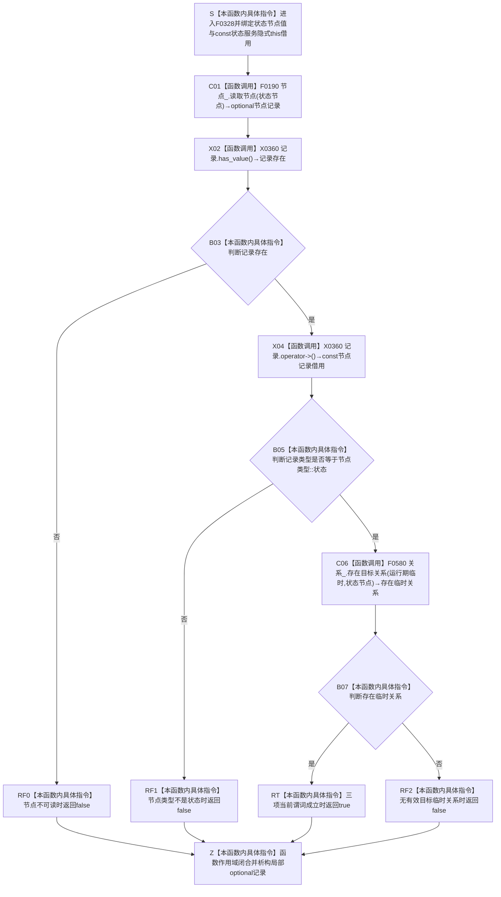

# CF-L6-0008 `状态服务::状态是否实例状态` 现状流程图

图类型：现状流程图
代码版本：`a48a70b2d678dea64dd8228adb4f26f0badd9506`
覆盖文件：`海中鱼巣/领域/状态服务.h:205-209`
唯一根函数：F0328
完整签名：`bool 海中鱼巣::状态服务::状态是否实例状态(海中鱼巣::节点句柄 状态节点) const`
参数：`状态节点` 按值复制完整句柄；隐式 `this` 是调用方拥有、调用期有效的 const 状态服务借用，服务内部只借用节点仓库和关系仓库
返回结果：按值返回 `bool`；当前 `true` 只表示节点可读且类型为状态，并存在至少一条以该完整句柄为目标、源节点有效的有效 `运行期临时` 关系
非法值 / 拒绝：零句柄、错仓库、旧版本、已删除节点、错误节点类型或无有效目标临时关系统一返回 `false`
已登记调用方：F0160 的 E0627 / E0628、F0165 的 E0644、F0176 的 E0712、F0181 的 E0746，以及本批补闭合 F0357 的 E1664
直接项目函数：F0190 `节点仓库::读取节点`；F0580 `关系仓库::存在目标关系`
调用图：`流程图/代码流程图/00_调用知识图谱.md`
逐行映射表：`流程图/代码流程图/L6/CF-L6-0008_状态服务状态是否实例状态_逐行代码映射表.md`
输入契约 / 调用语境表：本文“调用语境与非成功分账”
非成功返回二分审查表：本文“调用语境与非成功分账”
偏差清单：`流程图/代码流程图/00_规范偏差审计.md` 的 F0328 切片
依据提交 / 结构化消息：冻结源码提交 `a48a70b2d678dea64dd8228adb4f26f0badd9506`；当前 HEAD 的目标源码 blob 相同；MSVC 模块依赖、Clang 头文件候选与主智能体逐行复核
入口前置：不同调用方分别用于普通只读分类和成功初始化后的抽象状态复核；本函数自身接受任意节点句柄
结构读取与写入：先从节点仓读取节点记录，再独立从关系仓读取旧 `运行期临时` 目标关系；零写入
逻辑内返回：任意普通查询材料不满足三项当前谓词时返回 `false`
内部错误：F0160、F0165、F0176、F0181、F0357 在成功创建 / 登记的抽象状态上得到 `true` 时表示结构不一致或登记拒绝
生命周期与资源释放：局部 optional 节点记录按值拥有并在退出时析构；不保存服务或句柄借用
异常：未声明 `noexcept`；F0190 / F0580 的许可、锁或容器读取异常向上传播；optional 访问受 `has_value()` 短路前置保护
并发 / 幂等：仓库不变时结果确定；节点与关系分两次读取且没有同一许可 / 版本快照，并发失效可形成混合时点
验证入口：源码 blob `5b6bb9defda124496de99899621a9e4ab2dac179`、205—209 行、六条入边、E1662 / E1663 和 X0360 双向闭合
验证输出：MSVC 全工程依赖 `157 modules / 0 failed / 0 cycles / 0 unresolved requirements`；Clang 头文件候选 `状态服务.h: 28 functions / 432 calls / 3 unresolved / 0 diagnostics`；F0328 自身项目调用 `2`、聚合外部操作 `3`、未解析 `0`；本批不运行构建或程序
依据：`规范/0050_项目通用机器逻辑与禁止性规则总纲_20260721.md`、`规范/0600_代码函数流程图应用与维护规范.md`、`规范/1160_根规范_状态节点_20260720.md`、`规范/4010_子规范_统一仓库稳定句柄与通用关系索引边界.md`、`规范/4210_子规范_动态信息分层获取与聚合_20260720.md`
不得作为施工许可：是
不得宣称：完整实例状态事实成立、关系 19 五角色和类型化状态记录已读回、旧关系 5 是状态本体或新旧状态迁移已经完成

## 流程图

## 项目源码调用合同

| 节点 | 被调函数 | 实参 | 结果绑定 | 条件 | 被调图 |
| --- | --- | --- | --- | --- | --- |
| C01 | F0190 `optional<节点记录> 节点仓库::读取节点(节点句柄) const` | `this=&节点_`，`状态节点` | `记录` | 总是 | [F0190](../L5/CF-L5-0070_节点仓库读取节点_现状流程图.md) |
| C06 | F0580 `bool 关系仓库::存在目标关系(关系类型, 节点句柄) const` | `this=&关系_`，`运行期临时, 状态节点` | `bool 存在临时关系` | 记录存在且类型为状态 | 待生成 |

## 调用语境与非成功分账

| 语境 | 上游保证 | 当前结果 | 二分口径 | 后继 |
| --- | --- | --- | --- | --- |
| 任意只读分类 | 不保证句柄、节点类型或关系 | `false` | 允许的逻辑内返回 | 调用方不得解释为旧实例状态 |
| F0160 / F0165 / F0176 / F0181 / F0357 抽象状态复核 | 已创建或登记预期抽象状态 | `true` | 内部结构不一致 / 登记拒绝 | 调用方拒绝继续并追查旧临时关系 |
| 旧默认域实例状态 | 当前旧实现仍写场景到状态的运行期临时关系 | `true` | 旧实现分类事实 | 只证明旧关系 5 分类，不证明正式实例状态完整 |

## 当前偏差与边界

- 正式 1160 / 4210 要求完整实例状态由状态域类型化记录、非零时间以及关系 19 的主体、场景、特征、值、来源存在五个角色共同承载。
- F0328 只检查旧关系 5 `运行期临时`，不读取关系 19、状态域记录、特征、值、时间、来源、版本或当前性。
- 任意有效源节点用关系 5 指向一个状态节点即可形成假阳性；按关系 19 和类型化记录形成、但不再写旧关系 5 的新事实会形成假阴性。
- F0190 与 F0580 分两次独立读取，结果不是同一仓库许可或同代次快照。
- F0357 已由 F0181 的 E0742 根可达；本批补登记其 `概念图服务.h:945` 到 F0328 的漏边。`初始化两个根需求` 的调用将在其调用方 F0349 展开时建立独立函数身份并闭合，不在本函数图伪造尚未登记的调用方。
- 当前偏差归属既有状态动态类型化迁移 / 切换设计，本目标只记录，不自动形成代码计划。
