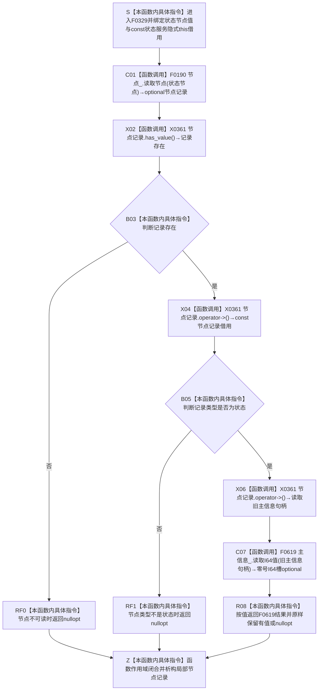

# CF-L6-0009 `状态服务::读取状态值` 现状流程图

图类型：现状流程图
代码版本：`a48a70b2d678dea64dd8228adb4f26f0badd9506`
覆盖文件：`海中鱼巣/领域/状态服务.h:185-191`
唯一根函数：F0329
完整签名：`std::optional<std::int64_t> 海中鱼巣::状态服务::读取状态值(海中鱼巣::节点句柄 状态节点) const`
参数：`状态节点` 按值复制完整句柄；隐式 `this` 是调用方拥有、调用期有效的 const 状态服务借用，服务内部借用节点仓库和旧主信息仓库
返回结果：按值返回 `optional<I64>`；当前有值只表示节点可读、节点类型为状态，且其旧 `主信息` 句柄的零号通用 I64 槽可读
非法值 / 拒绝：节点句柄无效、错仓库、旧版本、已删除、节点类型不是状态、旧主信息不可读或零号 I64 槽无值时返回 `nullopt`
已登记调用方：F0160 的 E0629 / E0630、F0165 的 E0643、F0176 的 E0711、F0181 的 E0745、F0551 的 E1254、F0327 的 E1660，以及 F0357 在 E1707 节点记录读取完成后、进入 if 短路判断前无条件执行的 E1667
直接项目函数：F0190 `节点仓库::读取节点`；F0619 `主信息仓库::读取I64值(主信息句柄) const`
调用图：`流程图/代码流程图/00_调用知识图谱.md`
逐行映射表：`流程图/代码流程图/L6/CF-L6-0009_状态服务读取状态值_逐行代码映射表.md`
输入契约 / 调用语境表：本文“调用语境与非成功分账”
非成功返回二分审查表：本文“调用语境与非成功分账”
偏差清单：`流程图/代码流程图/00_规范偏差审计.md` 的 F0329 切片
依据提交 / 结构化消息：冻结源码提交 `a48a70b2d678dea64dd8228adb4f26f0badd9506`；当前 HEAD 的目标源码 blob 相同；Clang AST 候选与主智能体逐行复核
入口前置：普通读取允许任意句柄；成功创建、初始化或登记后的读回语境预期状态节点和值已经成立
结构读取与写入：先从节点仓读取旧节点记录，再以其中旧 `主信息` 句柄从主信息仓读取零号通用 I64 槽；零写入
逻辑内返回：普通候选查询中，任一读取或类型前置不成立时返回 `nullopt`
内部错误：调用方已保证状态和值发布完成时仍返回 `nullopt`，属于节点、旧主信息或值槽结构不一致
生命周期与资源释放：两个 optional 按值形成和返回；不保存句柄或服务借用；局部节点记录在退出时析构
异常：未声明 `noexcept`；F0190 / F0619 的许可、锁或容器读取异常向上传播；optional 成员访问受 `has_value()` 前置保护
并发 / 幂等：仓库不变时重复调用结果确定；节点和主信息分两次独立仓库读取且无同一许可 / 同代次快照，并发失效可能形成混合时点
验证入口：源码 blob `5b6bb9defda124496de99899621a9e4ab2dac179`、185—191 行、八条入边、E1665 / E1666、E1667 与 X0361 双向闭合；E1667 的前序节点读取由 E1707 具名承载
验证输出：Clang 头文件候选唯一命中 185—191 行；F0329 自身项目调用 `2`、聚合外部操作 `4`、未解析 `0`；本批不运行构建或程序
依据：`规范/0050_项目通用机器逻辑与禁止性规则总纲_20260721.md`、`规范/0600_代码函数流程图应用与维护规范.md`、`规范/1160_根规范_状态节点_20260720.md`、`规范/4010_子规范_统一仓库稳定句柄与通用关系索引边界.md`、`规范/4020_子规范_领域类型化数据记录与组合读取投影边界.md`、`规范/4210_子规范_动态信息分层获取与聚合_20260720.md`
不得作为施工许可：是
不得宣称：状态类型化记录、关系 19 五角色、发生时间、来源、版本或完整状态事实已经读回

## 流程图

## 项目源码调用合同

| 节点 | 被调函数 | 实参 | 结果绑定 | 条件 | 被调图 |
| --- | --- | --- | --- | --- | --- |
| C01 | F0190 `optional<节点记录> 节点仓库::读取节点(节点句柄) const` | `this=&节点_`，`状态节点` | `记录` | 总是 | [F0190](../L5/CF-L5-0070_节点仓库读取节点_现状流程图.md) |
| C07 | F0619 `optional<I64> 主信息仓库::读取I64值(主信息句柄) const` | `this=&主信息_`，`记录->主信息` | 零号 I64 槽 optional | 记录存在且类型为状态 | 待生成 |

## 调用语境与非成功分账

| 语境 | 上游保证 | 当前结果 | 二分口径 | 后继 |
| --- | --- | --- | --- | --- |
| 普通只读候选 | 不保证节点或旧值槽存在 | `nullopt` | 允许的逻辑内返回 | 调用方不得把空值解释成合法状态事实 |
| F0160 / F0165 / F0176 / F0181 / F0357 成功初始化后复核 | 预期状态节点和旧值已经形成 | `nullopt` | 内部结构错误 | 追查节点、旧主信息、值槽写入或读回 |
| F0327 方法角色读取 | 预期模板角色状态已存在 | `nullopt` | 内部结构错误或旧迁移缺项 | F0327 拒绝角色读取 |
| F0551 自检候选 | 固定自检夹具预期目标状态值存在 | `nullopt` | 自检失败证据 | 不把自检失败改写为普通空候选 |

## 当前偏差与边界

- F0329 读取的是已经退出正式结构的 `节点记录::主信息` 和通用主信息零号 I64 槽。
- 0050 / 4020 要求关系无法表达的状态原始材料进入状态领域类型化记录；完整状态事实还必须组合关系 19 的主体、场景、特征、值和来源存在角色。
- 节点类型为状态与零号 I64 可读都不能证明该 I64 的领域含义、记录版本、发生时间、来源或当前性。
- F0190 与 F0619 分两次独立读取，不形成同一许可或同代次组合投影。
- F0357 `概念图服务::登记生命周期状态` 在 `概念图服务.h:938` 先经 E1707 读取节点记录，在 939 行经 E1667 无条件调用 F0329，随后才于 940—945 行检查阶段、节点记录、节点类型、状态值和实例状态；E1667 不以前述判断结果为前置。
- 当前偏差归属既有状态动态类型化迁移 / 最终切换设计；本目标只记录，不自动形成代码计划。
