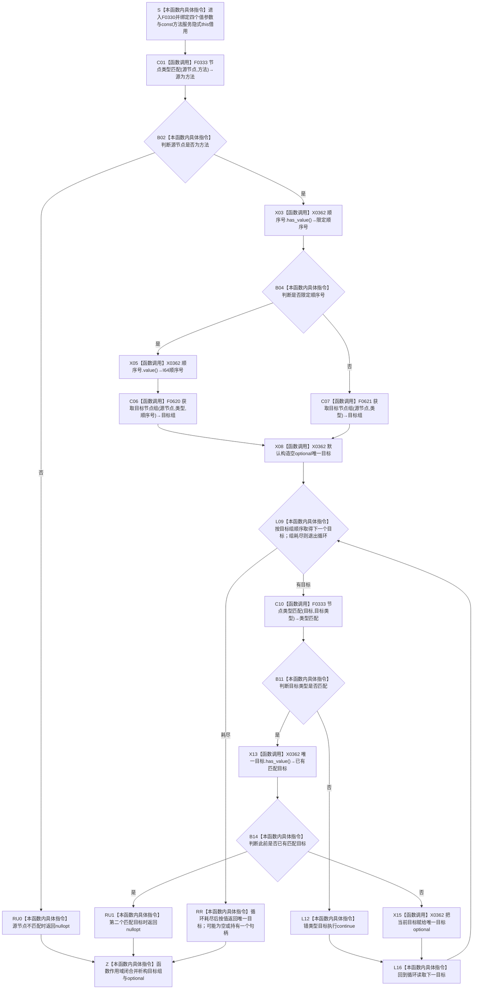

# CF-L6-0010 `方法服务::读取唯一目标` 四参数重载现状流程图

图类型：现状流程图
代码版本：`a48a70b2d678dea64dd8228adb4f26f0badd9506`
覆盖文件：`海中鱼巣/领域/方法服务.h:1711-1730`
唯一根函数：F0330
完整签名：`std::optional<海中鱼巣::节点句柄> 海中鱼巣::方法服务::读取唯一目标(海中鱼巣::节点句柄 源节点, 海中鱼巣::关系类型 类型, 海中鱼巣::节点类型 目标类型, std::optional<std::int64_t> 顺序号) const`
参数：`源节点`、`类型`、`目标类型`、`顺序号` 均按值复制；隐式 `this` 是调用方拥有、调用期有效的 const 方法服务借用
返回结果：按值返回 `optional<节点句柄>`；有值只表示源节点当前被 F0333 判断为方法，关系仓返回的目标组中恰有一个目标被 F0333 判断为指定节点类型
非法值 / 拒绝：源节点不是方法、没有匹配类型目标或出现第二个匹配类型目标时返回 `nullopt`；错类型目标被跳过
重载边界：三参数重载位于 1707—1709，是独立函数并显式传入 `std::nullopt`；它可由控制面板根模式经 F0388 后尚待展开的“读取并替换当前树→生成当前分类真实树只读材料→生成方法树→生成方法节点→读取方法条件场景”链到达，但该链上的直接调用方尚无稳定 F 身份。当前批不并入 F0330、不预占后继编号；待按队列展开到直接调用方时登记独立身份和到 F0330 的调用边
已登记调用方：F0160 的 E0631 / E0632，F0327 的 E1659
直接项目函数：F0333 `方法服务::节点类型匹配` 两个调用点；F0620 `关系仓库::获取目标节点组(源,类型,顺序号)`；F0621 `关系仓库::获取目标节点组(源,类型)`
调用图：`流程图/代码流程图/00_调用知识图谱.md`
逐行映射表：`流程图/代码流程图/L6/CF-L6-0010_方法服务读取唯一目标四参数_逐行代码映射表.md`
输入契约 / 调用语境表：本文“调用语境与非成功分账”
非成功返回二分审查表：本文“调用语境与非成功分账”
偏差清单：`流程图/代码流程图/00_规范偏差审计.md` 的 F0330 切片
依据提交 / 结构化消息：冻结源码提交 `a48a70b2d678dea64dd8228adb4f26f0badd9506`；当前 HEAD 的目标源码 blob 相同；Clang AST 候选与主智能体逐行复核
入口前置：普通候选读取允许任意输入；F0160 / F0327 语境预期登记根或方法角色结构已发布
结构读取与写入：读取源节点类型、关系目标组及每个目标节点类型；零写入、零事务、零半结构发布
逻辑内返回：普通候选查询中，源节点无效、没有匹配目标或不唯一时返回 `nullopt`
内部错误：成功登记或角色结构读回语境出现空值，属于节点、关系、角色、基数或迁移结构不一致
生命周期与资源释放：关系目标组和唯一目标 optional 由本函数按值拥有；循环目标为容器元素 const 借用；退出时释放局部值
异常：未声明 `noexcept`；仓库读取、vector 或 optional 操作异常向上传播
并发 / 幂等：仓库不变时结果确定；关系组读取与逐目标节点类型读取不在同一许可 / 同代次快照
验证入口：源码 blob `839dd462c70e8d54b6f22f1126d751ac9425398a`、1711—1730 行、当前已登记三条入边、E1668—E1671 与 X0362 双向闭合；三参数包装器按 F0388 后继稳定展开另行登记
验证输出：Clang AST 确认四参数重载与三参数重载身份独立；F0330 项目调用 `4`、聚合外部操作 `9`、未解析 `0`；本批不运行构建或程序
依据：`规范/0050_项目通用机器逻辑与禁止性规则总纲_20260721.md`、`规范/0600_代码函数流程图应用与维护规范.md`、`规范/3300_根规范_方法_20260720.md`、`规范/4010_子规范_统一仓库稳定句柄与通用关系索引边界.md`、`规范/5300_子规范_方法登记选择与执行规则_20260720.md`
不得作为施工许可：是
不得宣称：目标关系业务角色、顺序号值域、方法登记角色、方法生命周期关系 23 或完整状态事实已经成立

## 流程图

## 项目源码调用合同

| 节点 | 被调函数 | 实参 | 结果绑定 | 条件 | 被调图 |
| --- | --- | --- | --- | --- | --- |
| C01 | F0333 `bool 方法服务::节点类型匹配(节点句柄,节点类型) const` | `源节点, 方法` | `源为方法` | 总是 | [F0333](CF-L6-0013_方法服务节点类型匹配_现状流程图.md) |
| C06 | F0620 `vector<节点句柄> 关系仓库::获取目标节点组(节点句柄,关系类型,I64) const` | `源节点, 类型, 顺序号.value()` | `目标组` | 顺序号有值 | 待生成 |
| C07 | F0621 `vector<节点句柄> 关系仓库::获取目标节点组(节点句柄,关系类型) const` | `源节点, 类型` | `目标组` | 顺序号为空 | 待生成 |
| C10 | F0333 | `目标, 目标类型` | `类型匹配` | 每个目标 | [F0333](CF-L6-0013_方法服务节点类型匹配_现状流程图.md) |

## 调用语境与非成功分账

| 语境 | 上游保证 | 当前结果 | 二分口径 | 后继 |
| --- | --- | --- | --- | --- |
| 普通候选读取 | 不保证源、关系或基数 | `nullopt` | 允许的逻辑内返回 | 调用方自行判断候选不存在或不唯一 |
| F0160 登记根完整读回 | 已发布登记根及两个角色状态目标 | `nullopt` | 内部结构错误 | 追查登记根、模板关系、角色顺序号或目标状态 |
| F0327 方法角色读取 | 已成立方法节点和角色状态目标 | `nullopt` | 内部结构错误或旧迁移缺项 | 拒绝角色读取并追查模板关系 |
| 目标组含错类型与一个正确类型 | 只保证物理关系组 | 返回正确目标 | 当前实现窄筛选事实 | 错类型污染被静默忽略，不能证明业务关系纯净 |

## 当前偏差与边界

- F0330 只验证源节点的通用节点类型为方法，没有验证登记根、方法首、条件、结果、动作入口等具体方法角色。
- 任意关系类型和 I64 顺序号均可传入；函数自身不校验业务关系合同、顺序号值域或端点基数。
- 零匹配与多匹配都折叠为 `nullopt`，错类型目标被静默跳过；强前置语境可能因此掩盖关系污染。
- 关系目标组读取与每个目标的节点类型读取分仓、分时完成，不是同一许可或同代次快照。
- F0160 / F0327 当前仍通过普通模板关系和共享抽象状态承载方法角色 / 生命周期；不能据此证明正式关系 17、关系 23 或类型化状态事实。
- 当前偏差归属既有方法结构迁移 / 最终切换设计；本目标只记录，不自动形成代码计划。
