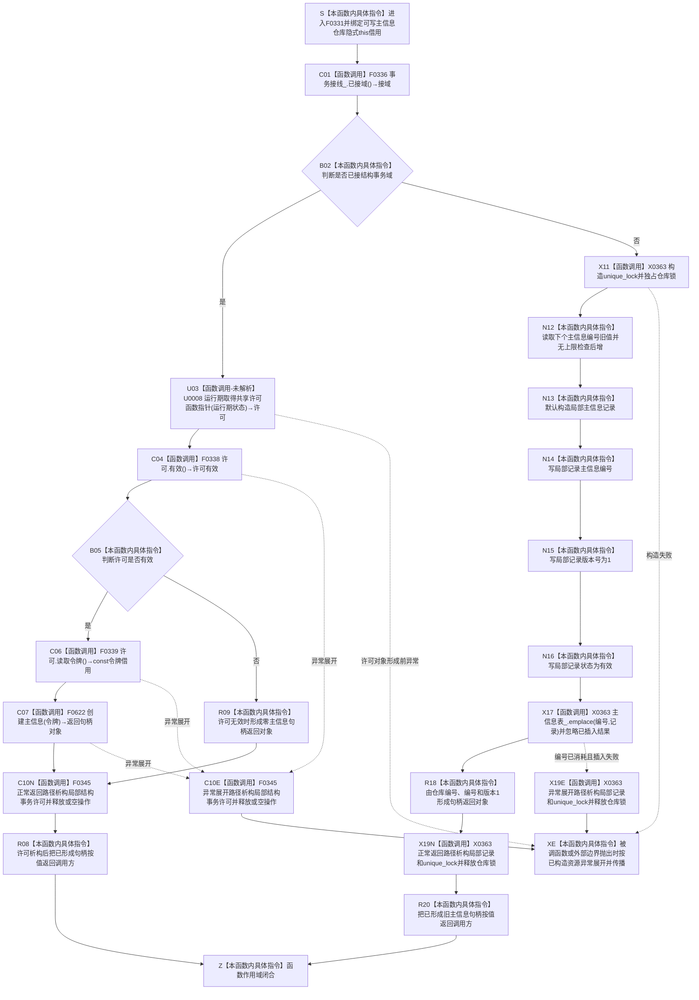

# CF-L6-0011 `主信息仓库::创建主信息` 现状流程图

图类型：现状流程图
代码版本：`a48a70b2d678dea64dd8228adb4f26f0badd9506`
覆盖文件：`海中鱼巣/核心/主信息仓库.cpp:38-51`
唯一根函数：F0331
完整签名：`海中鱼巣::主信息句柄 海中鱼巣::主信息仓库::创建主信息()`
参数：无显式参数；隐式 `this` 是调用方拥有、调用期有效的主信息仓库可写借用
返回结果：按值返回旧 `主信息句柄`；接域时返回令牌重载结果或零句柄，未接域时返回由仓库编号、新编号和版本 1 组成的句柄
非法值 / 拒绝：接域但无法取得有效共享许可时返回零句柄；未接域路径没有编号上限、重复插入或发布后读回拒绝
已登记调用方：F0162 的 E0634；F0273 的 E1303；F0335 的 E1686
直接项目函数：F0336 `结构事务接线::已接域`；F0338 `结构事务许可::有效`；F0339 `结构事务许可::读取令牌`；F0622 `主信息仓库::创建主信息(const 结构事务令牌&)`；F0345 `结构事务许可::~结构事务许可`
未解析项目调用：U0008 `事务接线_.取得共享许可(事务接线_.运行期状态)`；运行期函数指针目标不可由静态调用点唯一裁决
调用图：`流程图/代码流程图/00_调用知识图谱.md`
逐行映射表：`流程图/代码流程图/L6/CF-L6-0011_主信息仓库创建主信息_逐行代码映射表.md`
输入契约 / 调用语境表：本文“调用语境与非成功分账”
非成功返回二分审查表：本文“调用语境与非成功分账”
偏差清单：`流程图/代码流程图/00_规范偏差审计.md` 的 F0331 切片
依据提交 / 结构化消息：冻结源码提交 `a48a70b2d678dea64dd8228adb4f26f0badd9506`；当前 HEAD 的目标源码 blob 相同；Clang AST C++ 候选、函数指针边界与主智能体逐行复核
入口前置：仓库构造函数已接受完全未接域或完整接域形态；本函数自身不接受业务对象身份、稳定主键或领域记录类型
结构读取与写入：接域路径委托令牌重载；未接域路径直接在旧主信息表插入可读有效记录并推进编号
逻辑内返回：接域但许可无效时返回零句柄且本函数零写入
内部错误：有效许可下令牌重载返回零、编号回绕、重复键插入被忽略或返回句柄无法读回均属于结构不一致；源码未具名区分
生命周期与资源释放：接域局部许可在返回对象形成后由 F0345 析构；未接域局部记录和独占锁退出时析构，返回句柄不拥有仓库记录
异常：动态许可取得、F0622、锁构造或容器插入异常向上传播；许可已形成时异常展开调用 F0345；`emplace` 异常会烧掉编号但不插入记录
并发 / 幂等：接域路径只取得域级共享许可，实际写入靠本仓独占锁串行；未接域路径只用本仓锁；每次调用意图分配新编号，不幂等
验证入口：源码 blob `11f8fa53ff961a8cbaac34cf75b69a22533ca907`、38—51 行、三条入边、E1672—E1676、X0363 与 U0008 双向闭合
验证输出：Clang C++ 候选 `主信息仓库.cpp: 31 functions / 309 calls / 11 file-level unresolved / 0 diagnostics`；F0331 自身直接项目调用 `5`、聚合外部操作 `5`、未解析 `1`；本批不运行构建或程序
依据：`规范/0050_项目通用机器逻辑与禁止性规则总纲_20260721.md`、`规范/0600_代码函数流程图应用与维护规范.md`、`规范/4010_子规范_统一仓库稳定句柄与通用关系索引边界.md`、`规范/4020_子规范_领域类型化数据记录与组合读取投影边界.md`、`规范/4040_子规范_不透明结构事务候选确认撤销与最后发布.md`
不得作为施工许可：是
不得宣称：节点直接身份、稳定主键、领域类型化记录、跨仓事务、完整节点创建、方法登记或最终主信息退役已经成立

## 流程图

## 项目源码调用合同

| 节点 | 被调函数 | 实参 | 结果绑定 | 条件 | 被调图 |
| --- | --- | --- | --- | --- | --- |
| C01 | F0336 `bool 结构事务接线::已接域() const` | `this=&事务接线_` | `接域` | 总是 | [F0336](CF-L6-0016_结构事务接线已接域_现状流程图.md) |
| U03 | U0008 `结构事务许可(const shared_ptr<void>&)` | `事务接线_.运行期状态` | `许可` | 已接域；运行期函数指针目标未静态唯一解析 | 不生成伪目标图 |
| C04 | F0338 `bool 结构事务许可::有效() const` | `this=&许可` | `许可有效` | 许可对象已形成 | [F0338](CF-L6-0018_结构事务许可有效_现状流程图.md) |
| C06 | F0339 `const 结构事务令牌& 结构事务许可::读取令牌() const` | `this=&许可` | const 令牌借用 | 许可有效 | [F0339](CF-L6-0019_结构事务许可读取令牌_现状流程图.md) |
| C07 | F0622 `主信息句柄 主信息仓库::创建主信息(const 结构事务令牌&)` | `this`，`令牌` | 返回句柄对象 | 许可有效 | 待生成 |
| C10N / C10E | F0345 `结构事务许可::~结构事务许可()` | `this=&许可` | void | 接域分支正常返回或许可形成后的异常展开 | 待生成 |

## 调用语境与非成功分账

| 语境 | 上游保证 | 当前结果 | 二分口径 | 后继 |
| --- | --- | --- | --- | --- |
| 接域但许可无效 | 接线形态完整，不保证当前许可可取得 | 零句柄、零本函数写入 | 旧兼容逻辑内返回 | F0162 随后节点创建失败；不得宣称方法登记 |
| 有效许可且 F0622 返回零 | 已持有正式共享许可 | 零句柄 | 内部结构错误 | 追查令牌、接线或仓库代次 |
| F0273 私有未接域夹具 | 私有旧仓库未接域且编号空间正常 | 新句柄 | 当前夹具实现事实 | 只证明旧仓库即时创建 |
| F0162 方法登记 | 预期主信息和方法节点连续创建 | 新句柄后节点创建失败 | 调用链半完成风险 | 已创建主信息没有补偿撤销 |

## 当前偏差与边界

本批已完成被调图双向引用：[F0345 结构事务许可析构](CF-L6-0024_结构事务许可析构_现状流程图.md)。

- 0050 / 4010 / 4020 已删除通用主信息仓库、句柄、拓扑锚点和无类型值容器；F0331 是旧兼容结构的即时创建路径。
- 接域路径在域级共享许可下执行写入；真实写排他只由本仓锁提供，不能证明跨仓原子性。
- 未接域路径直接把记录插入普通可读表，没有未发布候选、确认、撤销、最后发布或发布后读回。
- `下个主信息编号_++` 不检查上限；回绕到零违反 4010 的非零、单调、不回绕合同。
- `emplace` 的已插入标志被忽略；重复键仍会返回看似有效句柄。插入异常会烧掉编号，但不会留下可读记录。
- F0162 后续节点创建失败时不会撤销已创建主信息，可能留下孤立旧结构。
- 当前偏差归属既有 NODE-TYPED 最终切换 / 物理退役设计；本目标只记录，不自动形成代码计划。
