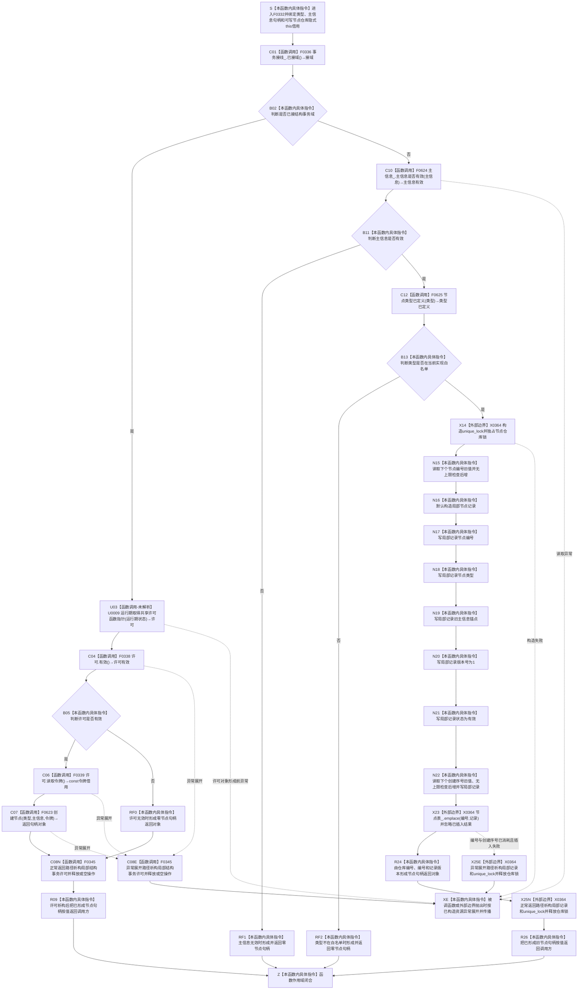

# CF-L6-0012 `节点仓库::创建节点` 现状流程图

图类型：现状流程图
代码版本：`a48a70b2d678dea64dd8228adb4f26f0badd9506`
覆盖文件：`海中鱼巣/核心/节点仓库.cpp:53-72`
唯一根函数：F0332
完整签名：`海中鱼巣::节点句柄 海中鱼巣::节点仓库::创建节点(海中鱼巣::节点类型 类型, 海中鱼巣::主信息句柄 主信息)`
参数：`类型` 按值传入；`主信息` 按值传入且不转移旧主信息记录所有权；隐式 `this` 是调用方拥有、调用期有效的节点仓库可写借用
返回结果：按值返回旧 `节点句柄`；接域时返回令牌重载结果或零句柄，未接域时返回由仓库编号、新编号和版本 1 组成的句柄
非法值 / 拒绝：接域但许可无效、未接域且主信息无效或类型不在当前实现白名单时返回零句柄；F0273 已在调用前验证共用主信息非零并传入基础信息类型，F0162 则把 F0331 的返回值直接作为实参且不先验证，类型固定为方法
已登记调用方：F0162 的 E0635；F0273 的 E1305；F0335 的 E1691
直接项目函数：F0336 `结构事务接线::已接域`；F0338 `结构事务许可::有效`；F0339 `结构事务许可::读取令牌`；F0623 `节点仓库::创建节点(节点类型, 主信息句柄, const 结构事务令牌&)`；F0345 `结构事务许可::~结构事务许可`；F0624 `主信息仓库::主信息是否有效(主信息句柄) const`；F0625 `{匿名命名空间@节点仓库.cpp}::节点类型已定义`
未解析项目调用：U0009 `事务接线_.取得共享许可(事务接线_.运行期状态)`；运行期函数指针目标不可由静态调用点唯一裁决
调用图：`流程图/代码流程图/00_调用知识图谱.md`
逐行映射表：`流程图/代码流程图/L6/CF-L6-0012_节点仓库创建节点_逐行代码映射表.md`
输入契约 / 调用语境表：本文“调用语境与非成功分账”
非成功返回二分审查表：本文“调用语境与非成功分账”
偏差清单：`流程图/代码流程图/00_规范偏差审计.md` 的 F0332 切片
依据提交 / 结构化消息：冻结源码提交 `a48a70b2d678dea64dd8228adb4f26f0badd9506`；当前 HEAD 的目标源码 blob 相同；Clang AST C++ 候选、函数指针边界与主智能体逐行复核
入口前置：仓库构造函数已接受完全未接域或完整接域形态；本函数接受旧主信息句柄和旧节点类型枚举，不接受稳定主键或领域类型化记录
结构读取与写入：接域路径委托令牌重载；未接域路径先读取旧主信息有效性和类型白名单，再直接向旧节点表插入可读有效记录并推进节点编号与创建序号
逻辑内返回：通用入口收到无效主信息、未定义类型或接域但许可无效时返回零句柄且本函数零写入
内部错误：F0273 的强前置成立，或 F0162 的 F0331 已返回非零主信息时仍返回零，以及编号 / 创建序号回绕、重复键插入被忽略、返回句柄无法读回或类型白名单与正式 ABI 不一致，均属于结构不一致；源码未具名区分
生命周期与资源释放：接域局部许可在返回对象形成后由 F0345 析构；未接域局部记录和独占锁退出时析构，返回句柄不拥有仓库记录或旧主信息记录
异常：动态许可取得、F0623、F0624、锁构造或容器插入异常向上传播；许可已形成时异常展开调用 F0345；`emplace` 异常会烧掉节点编号和创建序号但不插入记录
并发 / 幂等：接域路径只取得域级共享许可，实际写入靠本仓独占锁串行；未接域的主信息有效性读取和后继节点插入不在同一锁或同一代次；每次调用意图分配新编号，不幂等
验证入口：源码 blob `f38b979a3f7cefd182a50e0b687c5a6fffebc91c`、53—72 行、三条入边、E1677—E1683、X0364 与 U0009 双向闭合
验证输出：Clang C++ 候选 `节点仓库.cpp: 32 functions / 278 calls / 8 file-level unresolved / 0 diagnostics`；F0332 自身直接项目调用 `7`、聚合外部操作 `5`、未解析 `1`；本批不运行构建或程序
依据：`规范/0050_项目通用机器逻辑与禁止性规则总纲_20260721.md`、`规范/0600_代码函数流程图应用与维护规范.md`、`规范/4010_子规范_统一仓库稳定句柄与通用关系索引边界.md`、`规范/4020_子规范_领域类型化数据记录与组合读取投影边界.md`、`规范/4040_子规范_不透明结构事务候选确认撤销与最后发布.md`
不得作为施工许可：是
不得宣称：节点直接身份、稳定主键、领域类型化记录、跨仓事务、完整节点创建、方法登记或最终主信息退役已经成立

## 流程图

## 项目源码调用合同

| 节点 | 被调函数 | 实参 | 结果绑定 | 条件 | 被调图 |
| --- | --- | --- | --- | --- | --- |
| C01 | F0336 `bool 结构事务接线::已接域() const` | `this=&事务接线_` | `接域` | 总是 | [F0336](CF-L6-0016_结构事务接线已接域_现状流程图.md) |
| U03 | U0009 `结构事务许可(const shared_ptr<void>&)` | `事务接线_.运行期状态` | `许可` | 已接域；运行期函数指针目标未静态唯一解析 | 不生成伪目标图 |
| C04 | F0338 `bool 结构事务许可::有效() const` | `this=&许可` | `许可有效` | 许可对象已形成 | [F0338](CF-L6-0018_结构事务许可有效_现状流程图.md) |
| C06 | F0339 `const 结构事务令牌& 结构事务许可::读取令牌() const` | `this=&许可` | const 令牌借用 | 许可有效 | [F0339](CF-L6-0019_结构事务许可读取令牌_现状流程图.md) |
| C07 | F0623 `节点句柄 节点仓库::创建节点(节点类型, 主信息句柄, const 结构事务令牌&)` | `this`，`类型`，`主信息`，`令牌` | 返回句柄对象 | 许可有效 | 待生成 |
| C08N / C08E | F0345 `结构事务许可::~结构事务许可()` | `this=&许可` | void | 接域分支正常返回或许可形成后的异常展开 | 待生成 |
| C10 | F0624 `bool 主信息仓库::主信息是否有效(主信息句柄) const` | `this=&主信息_`，`主信息` | `主信息有效` | 未接域 | 待生成 |
| C12 | F0625 `bool {匿名命名空间@节点仓库.cpp}::节点类型已定义(节点类型)` | `类型` | `类型已定义` | 主信息有效 | 待生成 |

## 调用语境与非成功分账

| 语境 | 上游保证 | 当前结果 | 二分口径 | 后继 |
| --- | --- | --- | --- | --- |
| 通用调用者传入无效主信息或当前实现未定义类型 | 不保证入口材料有效 | 零句柄、零节点表写入 | 旧兼容逻辑内返回 | 调用方自行处理拒绝 |
| 接域但许可无效 | 接线形态完整，不保证当前许可可取得 | 零句柄、零本函数写入 | 旧兼容逻辑内返回 | 不得宣称节点已经创建 |
| 有效许可且 F0623 返回零 | 已持有共享许可，入口材料仍由 F0623 复核；F0273 的私有未接域夹具不进入此分支 | 零句柄 | 普通入口或 F0162 传入零主信息时是旧裸句柄协议折叠的拒绝；仅 F0162 已取得非零主信息且同代次前置成立后仍返回零时属于内部结构错误 | 拒绝时不得宣称创建；内部错误时追查令牌、接线、主信息或节点仓库代次 |
| F0162 方法登记且 F0331 返回零 | F0162 不先验证嵌套调用结果；类型固定为方法 | 零节点句柄 | 当前裸句柄协议把上游许可拒绝继续折叠为零返回 | 零节点写入；调用方只收到零方法节点 |
| F0162 方法登记且 F0331 返回非零 | 已创建旧主信息，类型固定为方法 | 零节点句柄 | 内部结构错误 | 已创建旧主信息没有补偿撤销 |
| F0273 私有未接域夹具 | 共用主信息已验证非零，类型固定为基础信息 | 循环任一零节点句柄 | 自检失败 / 内部结构错误 | 夹具保留此前即时写入直到整体析构 |
| `emplace` 未插入或返回后读回失败 | 主信息、类型和锁前置均已通过 | 仍形成看似有效句柄 | 内部结构错误 | 禁止把句柄返回解释为结构发布成功 |

## 当前偏差与边界

本批已完成被调图双向引用：[F0345 结构事务许可析构](CF-L6-0024_结构事务许可析构_现状流程图.md)。

- 0050 / 4010 要求节点记录直接承载节点编号、稳定主键、节点类型、版本、记录状态和创建序号；F0332 没有稳定主键，反而写入已退出的 `主信息句柄` 锚点。
- F0625 当前接受 `未分类(0)`，但 4010 禁止把它发布为正常业务节点；同时只接受到 `用途观察记录(15)`，错误拒绝正式 ABI 已登记的 `文章(16)`、`段落(17)`、`自然句(18)`和`子句(19)`。
- 接域路径以共享许可执行节点写入；4040 要求跨结构写入具有唯一写入权、未发布候选、确认 / 撤销和最后发布，本函数只暴露旧兼容 ABI。
- 未接域路径先独立读取主信息仓，再锁节点仓；主信息可能在检查后、节点插入前失效，两次访问不形成同一代次。
- 节点记录直接插入普通可读表，没有稳定主键、关系、领域类型化记录、候选撤销、最后发布或发布后读回。
- 节点编号和创建序号都没有上限检查；回绕会产生零身份、复用身份或破坏稳定顺序。
- `emplace` 的已插入标志被忽略；重复键仍返回看似有效句柄，插入异常则同时烧掉节点编号和创建序号。
- F0162 在 F0331 创建旧主信息后调用本函数；本函数失败不会撤销已创建记录，形成孤立旧主信息风险。
- 当前偏差归属既有 NODE-TYPED 最终切换 / 物理退役设计；本目标只记录，不自动形成代码计划。
