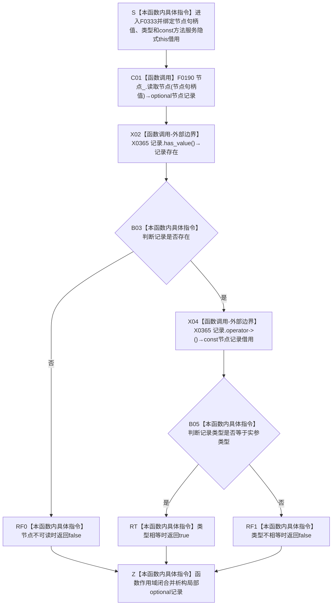

# CF-L6-0013 `方法服务::节点类型匹配` 现状流程图

图类型：现状流程图
代码版本：`a48a70b2d678dea64dd8228adb4f26f0badd9506`
覆盖文件：`海中鱼巣/领域/方法服务.h:1834-1837`
唯一根函数：F0333
完整签名：`bool 海中鱼巣::方法服务::节点类型匹配(海中鱼巣::节点句柄 节点句柄值, 海中鱼巣::节点类型 类型) const`
参数：`节点句柄值` 与 `类型` 均按值传入；隐式 `const this` 是调用方拥有、调用期有效的方法服务借用，本函数只借用其中的节点仓库
返回结果：按值返回 `bool`；`true` 只表示 F0190 在该次读取中返回一个当前旧域节点记录副本，且记录中的节点类型数值与实参类型数值相等；句柄不可读或类型不等时返回 `false`
非法值 / 拒绝：任意无效、异仓、旧版本或已删除节点句柄会经 F0190 形成 `false`；本函数不独立拒绝未知节点类型实参，也不验证方法角色、稳定主键或完整方法结构
已登记调用方：F0164 的 E0636；F0327 的 E1658；F0330 的 E1668 / E1671
直接项目函数：F0190 `节点仓库::读取节点`
调用图：`流程图/代码流程图/00_调用知识图谱.md`
逐行映射表：`流程图/代码流程图/L6/CF-L6-0013_方法服务节点类型匹配_逐行代码映射表.md`
输入契约 / 调用语境表：本文“调用语境与非成功分账”
非成功返回二分审查表：本文“调用语境与非成功分账”
偏差清单：`流程图/代码流程图/00_规范偏差审计.md` 的 F0333 切片
依据提交 / 结构化消息：冻结源码提交 `a48a70b2d678dea64dd8228adb4f26f0badd9506`；当前 HEAD 的目标源码 blob 相同；Clang 头文件候选与主智能体逐行复核
入口前置：四条已登记入边都传入具名节点类型常量；F0164 是写前角色绑定准入，F0327 / F0330 是普通只读筛选
结构读取与写入：只调用 F0190 读取一个旧域节点记录副本并比较其类型；零写入
逻辑内返回：普通查询的句柄不可读或类型不匹配时返回 `false`
内部错误：已登记创建 / 初始化路径明确保证目标节点存在且类型固定时返回 `false`，属于节点身份、版本、状态或类型读回不一致；不得降级成普通空候选
生命周期与资源释放：局部 `optional<节点记录>` 按值拥有；函数退出时析构；不保存句柄、记录或服务借用
异常：未声明 `noexcept`；F0190 的许可、锁或容器读取异常向上传播；`optional` 访问受 `has_value()` 短路保护
并发 / 幂等：节点仓库不变时结果确定；F0190 返回值式副本后不保留读取许可，调用方后续关系或领域记录读取可能处于另一时点
验证入口：源码 blob `839dd462c70e8d54b6f22f1126d751ac9425398a`、1834—1837 行、四条入边、E1684 与 X0365 双向闭合
验证输出：Clang 候选在 1834—1837 行唯一命中目标定义，抽取 `8` 个候选节点与 `4` 个直接调用候选，其中项目调用 `1`、编译器 / 标准库边界 `3`、未解析 `0`；翻译单元另有 `1` 个与本函数无关的枚举覆盖警告；本批不运行构建或程序
依据：`规范/0050_项目通用机器逻辑与禁止性规则总纲_20260721.md`、`规范/0600_代码函数流程图应用与维护规范.md`、`规范/3300_根规范_方法_20260720.md`、`规范/4010_子规范_统一仓库稳定句柄与通用关系索引边界.md`、`规范/4050_子规范_入口拒绝逻辑内结果与内部逻辑错误.md`、`规范/5300_子规范_方法登记选择与执行规则_20260720.md`
不得作为施工许可：是
不得宣称：方法稳定身份、方法角色、治理虚拟存在、生命周期、规格、动作入口或可执行能力已经成立

## 流程图

## 项目源码调用合同

| 节点 | 被调函数 | 实参 | 结果绑定 | 条件 | 被调图 |
| --- | --- | --- | --- | --- | --- |
| C01 | F0190 `std::optional<节点记录> 节点仓库::读取节点(节点句柄) const` | `this=&节点_`，`节点句柄值` | `记录` | 总是 | [F0190](../L5/CF-L5-0070_节点仓库读取节点_现状流程图.md) |

## 调用语境与非成功分账

| 语境 | 上游保证 | 当前结果 | 二分口径 | 后继 |
| --- | --- | --- | --- | --- |
| F0327 / F0330 普通只读分类 | 不保证句柄当前、可读或类型匹配 | `false` | 允许的窄查询逻辑内返回 | 调用方形成 `未定义`、`nullopt` 或跳过候选 |
| F0164 绑定方法角色状态 | 调用方传入预期方法节点，但本函数仍执行写前准入 | `false`，零写入 | 入口拒绝；若上游已证明是刚创建的完整方法节点则追根因 | 不进入状态创建和关系写入 |
| 已完成初始化后的内部读回 | 节点身份、版本和方法类型应保持当前 | `false` | 内部结构错误 | 追查节点仓库、版本推进、删除或类型承载 |
| 任意节点记录类型恰与未知实参值相等 | 本函数未验证实参属于 4010 节点类型 ABI | 可能返回 `true` | 证据边界不足 | 调用方不得把结果扩大为合法业务类型 |

## 当前偏差与边界

- F0333 只完成“当前旧域节点记录可读且类型数值相等”的窄分类。4010 明确规定节点类型不证明对象完整业务结构；对方法而言，3300 / 5300 仍要求方法稳定身份、角色、治理虚拟存在、规格、动作入口、生命周期和版本完整读回。
- F0190 当前返回的旧 `节点记录` 仍持有已退出的 `主信息句柄`，且没有节点直接稳定主键；本函数不能据此证明节点直接身份迁移已经完成。
- 本函数不检查实参 `类型` 是否属于现行 ABI 0—19，也不检查类型 0 不得正常发布。当前四条已登记入边传入具名常量，不能把该调用方前置扩大为通用函数保证。
- F0190 的单次读取内部受许可或共享锁保护；返回后许可已经释放。调用方继续读取关系、状态值或方法结构时可能面对版本推进，组合结果不是同代次快照。
- 当前尚未展开的其它源码调用点只保留为未来调用方证据；待调用方按稳定队列取得 F 身份时再登记调用边，不在 F0333 批次提前分配身份。
