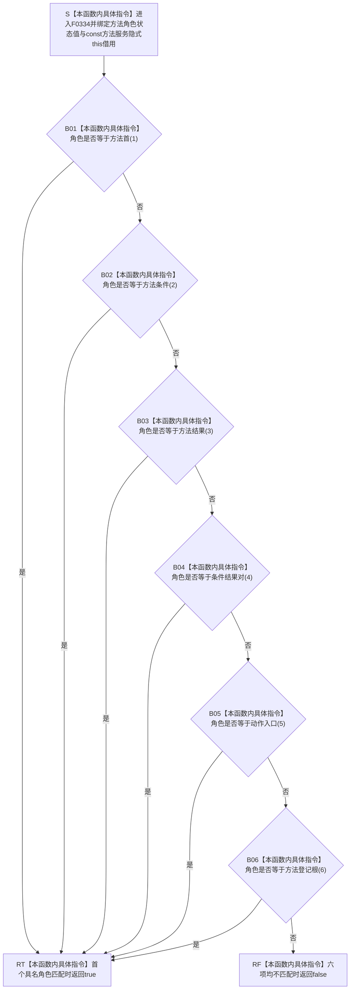

# CF-L6-0014 `方法服务::方法角色状态有效` 现状流程图

图类型：现状流程图
代码版本：`a48a70b2d678dea64dd8228adb4f26f0badd9506`
覆盖文件：`海中鱼巣/领域/方法服务.h:1763-1770`
唯一根函数：F0334
完整签名：`bool 海中鱼巣::方法服务::方法角色状态有效(海中鱼巣::方法角色状态 角色) const`
参数：`角色` 按值传入；隐式 `const this` 是调用方拥有、调用期有效的方法服务借用，但函数体不读取任何成员
返回结果：按值返回 `bool`；实参依次等于 `方法首(1)`、`方法条件(2)`、`方法结果(3)`、`条件结果对(4)`、`动作入口(5)` 或 `方法登记根(6)` 中任一值时返回 `true`，其它底层 I64 值返回 `false`
非法值 / 拒绝：`未定义(0)`、负数、`7..I64_MAX` 以及其它未命名底层值返回 `false`；本函数不检查角色与具体方法节点、关系、状态来源或生命周期是否一致
已登记调用方：F0164 的 E0637；F0327 的 E1661
直接项目函数：无
调用图：`流程图/代码流程图/00_调用知识图谱.md`
逐行映射表：`流程图/代码流程图/L6/CF-L6-0014_方法服务方法角色状态有效_逐行代码映射表.md`
输入契约 / 调用语境表：本文“输入契约与非成功语境”
非成功返回二分审查表：本文“输入契约与非成功语境”
偏差清单：`流程图/代码流程图/00_规范偏差审计.md` 的 F0334 切片
依据提交 / 结构化消息：冻结源码提交 `a48a70b2d678dea64dd8228adb4f26f0badd9506`；当前 HEAD 的目标源码 blob 相同；Clang 头文件候选与主智能体逐行复核
入口前置：F0164 把调用结果作为角色状态写入前准入；F0327 在旧 I64 状态值转换为枚举后把调用结果作为窄值域复核
结构读取与写入：只读取按值参数并执行六次枚举相等比较；零项目机器事实读写
逻辑内返回：通用写前入口收到未命名角色时返回 `false`；普通只读路径将其映射为 `未定义`
内部错误：成功初始化、已发布方法结构或强前置读回得到未命名角色时属于方法角色承载不一致，不能只解释为普通无候选
生命周期与资源释放：无局部拥有资源，不保存 `this` 或角色值
异常：未声明 `noexcept`；合法对象和值参数语境下函数体没有分配、锁或显式抛出点
并发 / 幂等：纯值、零写、可重入；相同底层 I64 值重复调用结果确定
验证入口：源码 blob `839dd462c70e8d54b6f22f1126d751ac9425398a`、1763—1770 行、两条入边、零项目出边、零外部边界和零未解析调用
验证输出：Clang 候选在 1763—1770 行唯一命中目标定义，抽取 `1` 个返回、`5` 个 `||` 和 `6` 个 `==` 候选节点，直接调用 `0`、未解析 `0`；翻译单元另有 `1` 个与本函数无关的枚举覆盖警告；主智能体逐行复核六个具名值和左到右短路；本批不运行构建或程序
依据：`规范/0050_项目通用机器逻辑与禁止性规则总纲_20260721.md`、`规范/0600_代码函数流程图应用与维护规范.md`、`规范/3300_根规范_方法_20260720.md`、`规范/4050_子规范_入口拒绝逻辑内结果与内部逻辑错误.md`、`规范/5300_子规范_方法登记选择与执行规则_20260720.md`
不得作为施工许可：是
不得宣称：角色已经绑定到合法方法节点、方法结构完整、生命周期当前、方法可召回或可执行

## 流程图

## 节点合同

| 节点 | 类型 | 参数 / 输入绑定 | 结果 / 输出绑定 | 事实读写 | 后继条件 | 验证 |
| --- | --- | --- | --- | --- | --- | --- |
| S | 本函数内具体指令 | `角色` 按值；隐式 `const this` 不读成员 | 当前枚举值 | 无 | 函数进入 | 1763 行 |
| B01—B06 | 本函数内具体指令 | `角色` 与六个具名枚举常量 | 当前比较 `bool` | 无 | `true` 立即进入 RT；`false` 才比较下一项 | 1764—1769 行 |
| RT | 本函数内具体指令 | 首个相等比较 | `true` | 无 | 返回调用方 | `||` 短路 |
| RF | 本函数内具体指令 | 六项比较均不相等 | `false` | 无 | 返回调用方 | 1769 行末 |

## 输入契约与非成功语境

| 入口 / 节点 | 输入来源 | 上游是否保证有效 | 非成功结果 | 二分口径 | 结构变化与后续归属 |
| --- | --- | --- | --- | --- | --- |
| F0164 写前绑定 | 外部或方法领域调用方提供的角色值 | 否 | `false` | 写前入口拒绝 | 零写入；调用方不得创建角色状态 |
| F0327 普通读取 | 旧 I64 状态值经 `static_cast` 形成枚举 | 否 | `false` 后返回 `未定义` | 普通查询逻辑内返回 | 零写入；不把未知 I64 伪称具名角色 |
| 成功初始化后的完整读回 | 正式方法结构应只产生具名角色 | 是 | `false` | 内部逻辑错误 | 追查旧状态值、角色关系、来源和版本 |
| B01—B06 | 按值枚举 | 部分 | 首个 `true` 后后续比较不执行 | 正常短路 | 零结构变化 |

## 当前偏差与边界

- 六个白名单值与 5300 当前方法结构角色集合一致；本函数仅证明枚举值属于白名单，不证明该角色已经合法绑定到具体方法节点。
- 3300 / 5300 要求方法身份、角色、治理虚拟存在、规格、动作入口、生命周期和版本共同成立。F0334 不读取节点、关系、状态事实、来源、发生时间或当前性。
- F0327 的上游旧实现从通用主信息 I64 槽读取角色数值；本函数拒绝未知值不能修复该领域类型化承载偏差。
- 其它尚未展开源码调用点待其调用方按稳定队列取得 F 身份时登记；本批不为未展开调用方提前创建调用边。
- 六次枚举比较和五次 `||` 短路均为本函数内具体指令，不新增项目函数、外部边界或未解析调用身份。
