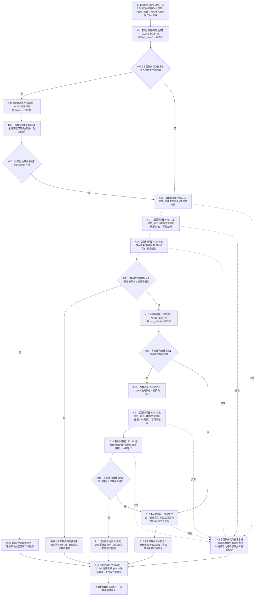

# CF-L6-0015 `状态服务::创建状态节点` 现状流程图

图类型：现状流程图
代码版本：`a48a70b2d678dea64dd8228adb4f26f0badd9506`
覆盖文件：`海中鱼巣/领域/状态服务.h:296-310`
唯一根函数：F0335
完整签名：`海中鱼巣::节点句柄 海中鱼巣::状态服务::创建状态节点(std::int64_t 状态值, std::optional<std::uint64_t> 发生时间戳 = std::nullopt)`
参数：`状态值` 按值传入；`发生时间戳` 是按值拥有其可选 `uint64_t` 的局部参数，省略实参时由调用点形成 `std::nullopt`；隐式 `this` 是调用方拥有、调用期有效的可写状态服务借用
返回结果：时间戳写前校验不通过、任一 I64 写入检查不通过或最终节点创建返回零时按值返回零节点句柄；否则原样返回 F0332 形成的旧状态节点句柄
非法值 / 拒绝：有时间戳但值为 `0` 或大于 `I64_MAX` 时在第一笔结构写入前返回空；状态值本身没有本函数级值域门禁
已登记调用方：F0165 的 E0642；源码另有 `创建实例状态` 在 137 行调用，但该调用方不在当前根闭包且没有稳定 F 身份，不预占调用边
直接项目函数：F0626 `状态服务::发生时间戳可用`；F0331 `主信息仓库::创建主信息()`；F0627 / F0628 两个 `主信息仓库::写入I64值` 重载；F0184 `追根因检查` 两个调用点；F0332 `节点仓库::创建节点`
外部边界：X0366 `optional<uint64_t>` 访问、旧句柄隐式复制、空 / 返回句柄物化、I64 转换与局部值生命周期
未解析项目调用：无
调用图：`流程图/代码流程图/00_调用知识图谱.md`
逐行映射表：`流程图/代码流程图/L6/CF-L6-0015_状态服务创建状态节点_逐行代码映射表.md`
输入契约 / 调用语境表：本文“调用语境与非成功分账”
非成功返回二分审查表：本文“调用语境与非成功分账”
偏差清单：`流程图/代码流程图/00_规范偏差审计.md` 的 F0335 切片
依据提交 / 结构化消息：冻结源码提交 `a48a70b2d678dea64dd8228adb4f26f0badd9506`；当前 HEAD 的目标源码 blob 相同；Clang AST 含项目依赖候选与主智能体逐行复核
入口前置：本函数是 `状态服务` 私有辅助函数；当前根闭包只由 F0165 以 `std::nullopt` 调用
结构读取与写入：顺序创建旧主信息、写零号状态值槽、可选写一号时间槽，再创建引用该旧主信息的类型 12 节点；各步立即可见且不在同一候选事务
逻辑内返回：仅把写前非法时间戳视为防御性空返回；当前强前置调用语境若命中仍须追查调用链一致性
内部错误：主信息创建后的任一写入失败、诊断检查失败、异常或最终节点创建失败都可能留下可读旧主信息及部分值槽，属于内部结构错误和半结构风险
生命周期与资源释放：局部 `optional`、句柄和转换值在函数退出时销毁；返回句柄不拥有仓库记录；已写仓库事实不因局部对象析构回滚
异常：函数未声明 `noexcept` 且无捕获；仓库锁、容器分配或 F0184 诊断路径异常向上传播，主信息创建后的异常不撤销旧事实
并发 / 幂等：三个跨仓步骤与两次值写入分别取得自身许可或锁，不形成同代次快照、唯一写入权或聚合原子性；每次调用意图新建身份，不幂等
验证入口：源码 blob `5b6bb9defda124496de99899621a9e4ab2dac179`、296—310 行、E0642、E1685—E1691 与 X0366 双向闭合
验证输出：Clang 含项目依赖候选 `918 functions / 12099 calls / 180 file-level unresolved / 1 unrelated warning`；F0335 唯一命中、直接项目调用 `7`、本函数外部操作聚合 `7`、未解析 `0`；本批不运行构建或程序
依据：`规范/0050_项目通用机器逻辑与禁止性规则总纲_20260721.md`、`规范/0600_代码函数流程图应用与维护规范.md`、`规范/1160_根规范_状态节点_20260720.md`、`规范/4010_子规范_统一仓库稳定句柄与通用关系索引边界.md`、`规范/4020_子规范_领域类型化数据记录与组合读取投影边界.md`、`规范/4040_子规范_不透明结构事务候选确认撤销与最后发布.md`、`规范/4050_子规范_入口拒绝逻辑内结果与内部逻辑错误.md`、`规范/4210_子规范_动态信息分层获取与聚合_20260720.md`
不得作为施工许可：是
不得宣称：完整状态事实、状态类型化记录、关系 19 五角色、节点直接身份、跨仓事务、失败撤销或状态创建后完整读回已经成立

## 流程图

## 项目源码调用合同

| 节点 | 被调函数 | 实参 | 结果绑定 | 条件 | 被调图 |
| --- | --- | --- | --- | --- | --- |
| C04 | F0626 `bool 状态服务::发生时间戳可用(uint64_t) const` | `this`、`发生时间戳.value()` | `时间可用` | 已提供时间戳 | 待生成 |
| C06 | F0331 `主信息句柄 主信息仓库::创建主信息()` | `this=&主信息_` | `主信息句柄` | 时间门禁通过或未提供时间 | [F0331](CF-L6-0011_主信息仓库创建主信息_现状流程图.md) |
| C07 | F0627 `bool 主信息仓库::写入I64值(主信息句柄,I64)` | `主信息句柄,状态值` | `写值结果` | F0331 返回后 | 待生成 |
| C08 | F0184 `bool 追根因检查(bool,const wchar_t*)` | `写值结果,固定说明` | `检查通过` | C07 返回后；真假均调用 | [F0184](../L5/CF-L5-0064_追根因检查_现状流程图.md) |
| C13 | F0628 `bool 主信息仓库::写入I64值(主信息句柄,uint64_t,I64)` | `主信息句柄,1,I64时间` | `写时间结果` | 已提供且已验证时间戳 | 待生成 |
| C14 | F0184 `bool 追根因检查(bool,const wchar_t*)` | `写时间结果,固定说明` | `检查通过` | C13 返回后；真假均调用 | [F0184](../L5/CF-L5-0064_追根因检查_现状流程图.md) |
| C16 | F0332 `节点句柄 节点仓库::创建节点(节点类型,主信息句柄)` | `节点类型::状态,主信息句柄` | `状态节点句柄` | 状态值及可选时间槽检查通过 | [F0332](CF-L6-0012_节点仓库创建节点_现状流程图.md) |

## 调用语境与非成功分账

| 语境 / 节点 | 上游保证 | 当前结果 | 二分口径 | 结构变化与后继 |
| --- | --- | --- | --- | --- |
| F0165 / E0642 | 抽象状态路径省略时间参数 | 不进入时间非法分支 | 正常调用语境 | 继续创建旧抽象状态节点 |
| 未登记 `创建实例状态` 调用点 | 133—134 行已用同一 F0626 预验时间戳 | F0335 再验失败时返回零 | 强前置后内部一致性错误 | 追查调用间数据或实现漂移 |
| RU0 | 仅由有值但为零或超过 `I64_MAX` 触发 | 零句柄 | 写前防御返回；当前两种源码语境命中时需追根因 | 零结构写入 |
| RU1 | 主信息已经创建，零号槽写入检查失败 | 零句柄 | 内部逻辑错误 | 可能留下孤立旧主信息 |
| RU2 | 主信息及零号槽已写，一号槽写入检查失败 | 零句柄 | 内部逻辑错误 | 留下旧主信息和部分值槽 |
| C16 / R17 | 前序检查通过但节点创建返回零 | 零句柄 | 内部逻辑错误 | 留下已写旧主信息和一至两项值槽 |
| 异常路径 | 第一笔旧结构写入前或后 | 原异常传播 | 写入前为零结构；写入后为内部错误 | 局部值析构，不撤销仓库事实 |

## 当前偏差与边界

- 1160、4020 和 4210 要求实例状态具有状态域类型化记录，以及主体、场景、特征、值和来源存在的关系 19 五角色。F0335 只写旧主信息通用槽 0 / 1 和一个类型 12 旧节点。
- 0050 / 4010 已删除通用主信息作为正式机器结构；F0335 仍把状态值和发生时间写入旧主信息，并让旧节点持有主信息锚点。
- F0335 不签发状态稳定主键，不写状态记录版本，不建立任何关系 19、索引或发布后完整读回。
- 主信息创建、两次值写入和节点创建分别取得许可或仓库锁；普通读取可以在节点成立前观察旧主信息，违反 4040 的候选不可见、确认可逆和最后发布合同。
- RU1、RU2、C16 零结果及写入后的异常均不撤销既有写集；空句柄同时折叠多种内部错误，不满足 4050 的强类型结果边界。
- F0165 的抽象状态路径只按裸 I64 创建孤立状态节点，没有绑定抽象特征和值域。该偏差只作现状记录，不在本目标自动形成代码计划。
