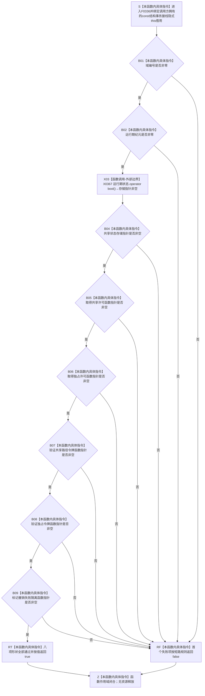

# CF-L6-0016 `结构事务接线::已接域` 现状流程图

图类型：现状流程图
代码版本：`a48a70b2d678dea64dd8228adb4f26f0badd9506`
覆盖文件：`海中鱼巣/核心/结构事务接线.数据.h:77-80`
唯一根函数：F0336
完整签名：`bool 海中鱼巣::结构事务接线::已接域() const`
参数：无显式参数；隐式 `this` 是调用方拥有、调用期有效并应保持不变的 `const 结构事务接线*` 借用
返回结果：域编号、运行期纪元、共享状态存储指针及五个函数指针依次全部呈非零 / 非空形状时返回 `true`；任一项不满足时按 `&&` 左到右短路返回 `false`
非法值 / 拒绝：悬空、已结束生命周期或被并发写入的 `this` 违反 C++ 前置，不结构化返回 `false`；本函数不区分完全未接域和部分接线
已登记调用方：F0167、F0190、F0197—F0199、F0217、F0239、F0321—F0324、F0331、F0332，共 13 个函数、22 条调用边
直接项目函数：无；五个函数指针只检查非空，不调用
外部边界：X0367 `std::shared_ptr<void>::operator bool() const noexcept`
未解析项目调用：无
调用图：`流程图/代码流程图/00_调用知识图谱.md`
逐行映射表：`流程图/代码流程图/L6/CF-L6-0016_结构事务接线已接域_逐行代码映射表.md`
输入契约 / 调用语境表：本文“调用语境与非成功分账”
非成功返回二分审查表：本文“调用语境与非成功分账”
偏差清单：`流程图/代码流程图/00_规范偏差审计.md` 的 F0336 切片
依据提交 / 结构化消息：冻结源码提交 `a48a70b2d678dea64dd8228adb4f26f0badd9506`；当前 HEAD 的目标源码 blob 相同；四个仓库 Clang 候选用于核对调用点，内联函数本体由主智能体逐行复核
入口前置：仓库构造路径已经用 F0321 排除部分接线；其它直接调用路径依赖接线对象构造后保持不变
结构读取与写入：顺序读取八项公开字段的值 / 指针形状；不取得许可、不验证令牌、不调用回调、不写任何机器结构
逻辑内返回：F0321 中的 `false` 表示部分 / 混合形态并触发写前拒绝；仓库直接路径在构造器不变量成立时可把 `false` 精确解释为完全未接域
内部错误：已经安全发布的完整接线后来返回 `false`、同一调用链相邻结果变化或强前置调用中字段漂移，属于接线并发 / 生命周期不一致
生命周期与资源释放：不复制 `shared_ptr`，不延长共享状态、接线或回调生命周期；返回 `bool` 不携带许可、令牌或所有权
异常：函数未声明 `noexcept`；当前整数 / 函数指针比较及 X0367 均不分配、不抛出
并发 / 幂等：对象不变时重复调用确定、零写且可重入；`const` 不提供同步，八项读取不是原子快照，并发写字段构成数据竞争
验证入口：源码 blob `9d89cee25f00ba0f721d0b6c1bea517524e40663`、77—80 行、22 条已登记入边与 X0367 双向闭合
验证输出：四个仓库 Clang 候选 `4 files / 169 functions / 2373 calls / 52 file-level unresolved / 0 diagnostics`；F0336 自身项目调用 `0`、外部边界 `1`、未解析 `0`；本批不运行构建或程序
依据：`规范/0050_项目通用机器逻辑与禁止性规则总纲_20260721.md`、`规范/0600_代码函数流程图应用与维护规范.md`、`规范/4040_子规范_不透明结构事务候选确认撤销与最后发布.md`、`规范/4050_子规范_入口拒绝逻辑内结果与内部逻辑错误.md`、`规范/详细设计/不透明结构写入会话许可内探测计量与全参与者原子收口详细设计.md`
不得作为施工许可：是
不得宣称：事务域身份新鲜、运行期状态动态类型正确、五个回调同源或行为正确、许可可取得、令牌有效、接线可写或结构事务能力已经验收

## 流程图

## 已登记调用方

| 调用方 | 调用边 | 调用语境 | 调用方图 |
| --- | --- | --- | --- |
| F0167 | E0646 | 关系创建许可宏进入 | [F0167](../L5/CF-L5-0047_创建关系_现状流程图.md) |
| F0190 | E0771 | 节点普通读取选择接域 / 未接域路径 | [F0190](../L5/CF-L5-0070_节点仓库读取节点_现状流程图.md) |
| F0197 | E0786 | 节点有效计数选择接域 / 未接域路径 | [F0197](../L5/CF-L5-0077_节点仓库有效节点数量_现状流程图.md) |
| F0198 | E0791 | 关系有效计数许可宏进入 | [F0198](../L5/CF-L5-0078_关系仓库有效关系数量_现状流程图.md) |
| F0199 | E0802 | 索引有效计数选择接域 / 未接域路径 | [F0199](../L5/CF-L5-0079_索引仓库有效主键数量_现状流程图.md) |
| F0217 | E0839 | 主信息 I64 读取选择接域 / 未接域路径 | [F0217](../L5/CF-L5-0097_主信息仓库读取I64值索引重载_现状流程图.md) |
| F0239 | E0915 | 运行期上下文结构核心完整复核 | [F0239](../L5/CF-L5-0115_运行期上下文结构核心完整_现状流程图.md) |
| F0321 | E1639 | `完全未接域` 为假后判断完整接域 | [F0321](CF-L6-0001_结构事务接线接线形态有效_现状流程图.md) |
| F0322 | E1640—E1643 | 节点仓库接线一致四次短路读取 | [F0322](CF-L6-0002_节点仓库接线一致_现状流程图.md) |
| F0323 | E1644—E1647 | 关系仓库接线一致四次短路读取 | [F0323](CF-L6-0003_关系仓库接线一致_现状流程图.md) |
| F0324 | E1648—E1651 | 索引仓库接线一致四次短路读取 | [F0324](CF-L6-0004_索引仓库接线一致_现状流程图.md) |
| F0331 | E1672 | 主信息创建选择接域 / 未接域路径 | [F0331](CF-L6-0011_主信息仓库创建主信息_现状流程图.md) |
| F0332 | E1677 | 节点创建选择接域 / 未接域路径 | [F0332](CF-L6-0012_节点仓库创建节点_现状流程图.md) |

## 调用语境与非成功分账

| 调用语境 | 上游保证 | `true` 精确含义 | `false` 处理 | 二分口径 |
| --- | --- | --- | --- | --- |
| F0321 接线形态分类 | 只保证接线对象已完成构造 | 八项字段呈非零 / 非空形状 | 与 F0618 一并把部分 / 混合形态分类为假 | 写前入口拒绝 |
| 仓库直接读写入口 | 构造器已经用 F0321 排除部分形态 | 当前八项读取仍呈完整形状 | 在不变前置下表示完全未接域；若原已完整则追查漂移 | 兼容路径选择 / 强前置内部错误 |
| F0322—F0324 一致性比较 | 两份接线都已独立通过 F0321 | 当前一侧完整接域 | 多次读取结果不一致不是合法业务分支 | 内部并发 / 生命周期错误 |
| F0239 结构核心完整 | 上下文仓库编号非零 | 只证明接线字段形状 | 返回 `false`，不能据此具名事务域失效原因 | 只读完整性失败 |
| 无效或并发写入的 `this` | 无合法保证 | 无结构化结果 | C++ 前置破坏 | 不得解释为普通 `false` |

## 当前偏差与边界

- F0336 的八项检查与 4040 详细设计的最低接域形状门禁一致，但只检查零 / 非零和指针存储形状。
- `shared_ptr::operator bool()` 检查存储指针，不证明控制块、动态类型、域归属或运行期状态内容有效；alias 存储指针为空会被视为未接域。
- 五个函数指针只检查非空，不证明来自同一协调器，也不调用它们复核许可、令牌或撤销失败隔离行为。
- 域编号和纪元非零不证明新鲜、同域或与运行期状态一致。`true` 不等于取得了事务许可，更不等于可以写入。
- 公开非原子字段的八次顺序读取不构成原子快照。相邻调用依赖对象构造后安全发布并保持不可变；当前函数自身不建立该并发合同。
