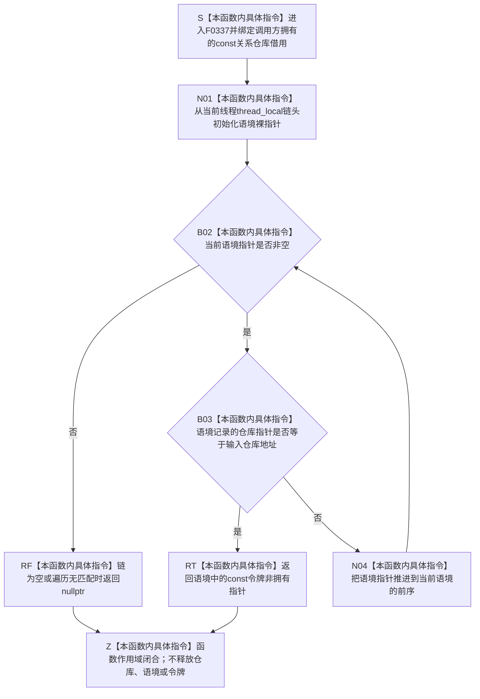

# CF-L6-0017 `读取当前关系令牌` 现状流程图

图类型：现状流程图
代码版本：`a48a70b2d678dea64dd8228adb4f26f0badd9506`
覆盖文件：`海中鱼巣/核心/关系仓库.cpp:74-79`
唯一根函数：F0337
完整签名：`const 海中鱼巣::结构事务令牌* 海中鱼巣::{匿名命名空间@关系仓库.cpp}::读取当前关系令牌(const 海中鱼巣::关系仓库& 仓库)`
参数：`仓库` 是调用方拥有、调用期有效的 `const 关系仓库&` 非拥有借用；函数只取地址比较，不延长仓库生命周期
返回结果：当前线程的关系令牌语境链中命中最内层、仓库地址相同的语境时，返回其中 `const 结构事务令牌*` 非拥有借用；链为空或遍历无匹配时返回 `nullptr`
非法值 / 拒绝：悬空仓库引用、悬空语境链或已结束原令牌生命周期违反 C++ 前置，不结构化返回 `nullptr`；跨线程不得使用返回指针
已登记调用方：F0167、F0198 及 F0343、F0387、F0575、F0578—F0582、F0586—F0587、F0589—F0591、F0620—F0621，共 17 个函数、20 条调用边
直接项目函数：无
外部边界：无；`thread_local` 变量读取、裸指针比较 / 推进和成员读取均为本函数内具体指令
未解析项目调用：无
调用图：`流程图/代码流程图/00_调用知识图谱.md`
逐行映射表：`流程图/代码流程图/L6/CF-L6-0017_读取当前关系令牌_逐行代码映射表.md`
输入契约 / 调用语境表：本文“调用语境与非成功分账”
非成功返回二分审查表：本文“调用语境与非成功分账”
偏差清单：`流程图/代码流程图/00_规范偏差审计.md` 的 F0337 切片
依据提交 / 结构化消息：冻结源码提交 `a48a70b2d678dea64dd8228adb4f26f0badd9506`；当前 HEAD 的目标源码 blob 相同；关系仓库 Clang 候选与主智能体逐行复核
入口前置：调用线程上的每个 F0340 关系令牌范围按栈式嵌套维护 `当前关系令牌语境`；语境及其原令牌在查询期间存活
结构读取与写入：只读取当前线程的语境链头、仓库地址、令牌指针和前序指针；不写线程局部链，不验证令牌，不写仓库
逻辑内返回：初次许可宏查询或 F0343 查询得到 `nullptr` 时表示当前线程没有该仓库令牌，可按调用协议取得自动许可或改走无令牌读取
内部错误：F0167 已经建立关系令牌范围后的 205 / 212 / 220 行仍返回空时，表示线程局部语境或生命周期不一致；当前调用方静默退回无令牌读取，形成审计风险
生命周期与资源释放：返回指针不拥有令牌；只在匹配的 F0340 范围及其原令牌仍存活、当前线程不变时有效，范围析构、嵌套退出、原令牌销毁或跨线程后不得继续使用
异常：函数未声明 `noexcept`；当前裸指针读取、比较、赋值和返回不分配、不抛；悬空链属于未定义行为而非结构化异常
并发 / 幂等：每线程链彼此隔离；同一线程链和仓库地址不变时重复查询确定、零写；TLS 不同步仓库或令牌本体
验证入口：源码 blob `f7a9ea9a09d3065468208c16f9ea34f806b6e183`、74—79 行、20 条已登记入边、零项目出边 / 外部边界 / 未解析调用
验证输出：Clang C++ 候选 `79 functions / 1332 calls / 26 file-level unresolved / 0 diagnostics`；F0337 唯一命中、9 个候选节点、直接调用 `0`、未解析 `0`；本批不运行构建或程序
依据：`规范/0050_项目通用机器逻辑与禁止性规则总纲_20260721.md`、`规范/0600_代码函数流程图应用与维护规范.md`、`规范/4040_子规范_不透明结构事务候选确认撤销与最后发布.md`、`规范/4050_子规范_入口拒绝逻辑内结果与内部逻辑错误.md`、`规范/详细设计/不透明结构写入会话许可内探测计量与全参与者原子收口详细设计.md`
不得作为施工许可：是
不得宣称：返回的令牌已通过域 / 纪元 / 类型 / 当前性验证、当前线程取得了许可、事务域可写、线程局部语境能够替代正式事务身份或关系写入已经安全

## 流程图

## 已登记调用方

| 调用方 | 调用边 | 位置 / 语境 | 调用方图 |
| --- | --- | --- | --- |
| F0167 | E0647、E0659—E0661 | 185 行许可宏初查；205 / 212 / 220 行专用关系复核 | [F0167](../L5/CF-L5-0047_创建关系_现状流程图.md) |
| F0198 | E0792 | 1013 行关系有效计数许可宏初查 | [F0198](../L5/CF-L5-0078_关系仓库有效关系数量_现状流程图.md) |
| F0343 | E1692 | 180 行节点有效读取路径 | 待生成 |
| F0587 | E1693 | 278 行许可宏初查 | 待生成 |
| F0589 | E1694 | 296 行许可宏初查 | 待生成 |
| F0582 | E1695 | 317 行许可宏初查 | 待生成 |
| F0591 | E1696 | 340 行许可宏初查 | 待生成 |
| F0590 | E1697 | 410 行许可宏初查 | 待生成 |
| F0586 | E1698 | 435 行许可宏初查 | 待生成 |
| F0387 | E1699 | 734 行许可宏初查 | 待生成 |
| F0621 | E1700 | 791 行许可宏初查 | 待生成 |
| F0620 | E1701 | 824 行许可宏初查 | 待生成 |
| F0575 | E1702 | 844 行许可宏初查 | 待生成 |
| F0578 | E1703 | 920 行许可宏初查 | 待生成 |
| F0581 | E1704 | 950 行许可宏初查 | 待生成 |
| F0579 | E1705 | 981 行许可宏初查 | 待生成 |
| F0580 | E1706 | 997 行许可宏初查 | 待生成 |

## 调用语境与非成功分账

| 调用语境 | 上游保证 | `nullptr` 精确含义 | 二分口径 | 后继 |
| --- | --- | --- | --- | --- |
| 许可宏初次查询 | 当前仓库可能已接域，但线程未必已有同仓库范围 | 当前线程链中没有匹配仓库语境 | 合法查询结果 | 调用方取得自动许可并建立 F0340 范围 |
| F0343 节点有效读取 | 当前线程可能有也可能没有关系令牌 | 无匹配令牌 | 合法路径选择 | 改走无令牌节点读取 |
| F0167 的 205 / 212 / 220 行 | 前序宏已在当前线程建立并保持关系令牌范围 | 理应命中却返回空 | 内部语境 / 生命周期错误 | 当前代码静默退回无令牌读取；应具名审计 |
| RT 非空返回 | 只证明仓库地址命中线程局部最内层语境 | 非拥有令牌指针 | 窄查询成功 | 调用方仍须按自身入口验证令牌合同 |
| 悬空链或跨线程复用 | 不具备合法前置 | 无定义结果 | C++ 前置破坏 | 不得解释为普通空查询 |

## 当前偏差与边界

- F0337 只按仓库对象地址选择线程局部最内层语境，不验证令牌域编号、运行期纪元、许可类型、当前性或与仓库接线的一致性。
- `thread_local` 只隔离线程，不提供仓库同步、令牌所有权或事务发布保证。返回非空不能扩大为结构写入已经授权。
- 返回的是借用裸指针。F0340 范围析构会恢复链头；原令牌或范围结束后继续保存 / 使用指针会悬空。
- 当前根闭包中另有 8 个源码调用函数尚无稳定 F 身份，不提前创建函数或调用边：`重挂关系`、`重挂节点`、`挂载或重挂节点`、`节点在父链中`、`获取父节点`、`获取目标节点`、`获取来源节点组` 两个重载。
- F0167 在已建立范围后的三次空结果会静默走无令牌读取；这是现状审计风险，不在本目标自动升级为规范冲突或代码计划。
