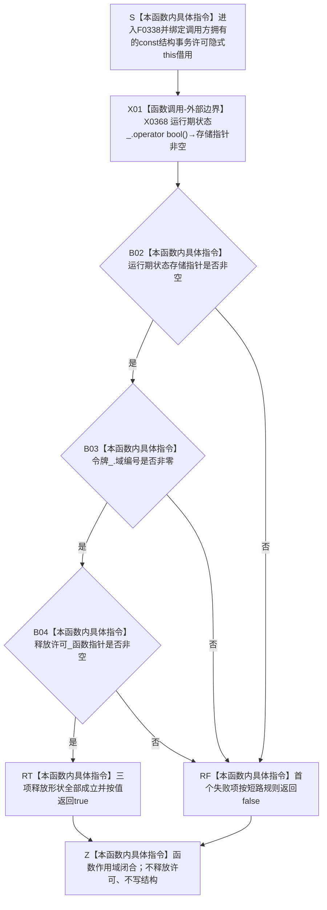

# CF-L6-0018 `结构事务许可::有效` 现状流程图

图类型：现状流程图
代码版本：`a48a70b2d678dea64dd8228adb4f26f0badd9506`
覆盖文件：`海中鱼巣/核心/结构事务接线.数据.h:41`
唯一根函数：F0338
完整签名：`bool 海中鱼巣::结构事务许可::有效() const`
参数：无显式参数；隐式 `this` 是调用方拥有、调用期有效并应保持不变的 `const 结构事务许可*` 非拥有借用
返回结果：运行期状态存储指针非空、令牌域编号非零且释放许可函数指针非空时返回 `true`；首个失败项按 `&&` 左到右短路返回 `false`
非法值 / 拒绝：默认构造、正常移动后的源对象、空存储指针、零域编号或空释放回调返回 `false`；悬空、已析构或被并发修改的 `this` 属 C++ 前置破坏
已登记调用方：F0167、F0190、F0197—F0199、F0217、F0239、F0331、F0332、F0387、F0575、F0578—F0582、F0586—F0587、F0589—F0591、F0620—F0621，共 23 个函数、23 条调用边
直接项目函数：无；释放回调只检查非空，不调用
外部边界：X0368 `std::shared_ptr<void>::operator bool() const noexcept`
未解析项目调用：无
调用图：`流程图/代码流程图/00_调用知识图谱.md`
逐行映射表：`流程图/代码流程图/L6/CF-L6-0018_结构事务许可有效_逐行代码映射表.md`
输入契约 / 调用语境表：本文“调用语境与非成功分账”
非成功返回二分审查表：本文“调用语境与非成功分账”
偏差清单：`流程图/代码流程图/00_规范偏差审计.md` 的 F0338 切片
依据提交 / 结构化消息：冻结源码提交 `a48a70b2d678dea64dd8228adb4f26f0badd9506`；当前 HEAD 的目标源码 blob 相同；Clang C++ 候选与主智能体逐行复核
入口前置：许可对象已完成构造；调用方不得与移动赋值、析构或其它字段修改并发访问
结构读取与写入：顺序读取运行期状态存储指针、令牌域编号和释放回调指针形状；不验证令牌，不调用回调，不写机器结构
逻辑内返回：协调器合法返回默认许可或未取得许可时，`false` 是写前零变化结果
内部错误：强前置要求完整许可却返回 `false`、完整对象无同步漂移或静态创建形成畸形三元组，属于结构 / 生命周期不一致
生命周期与资源释放：不复制 `shared_ptr`，不延长运行期状态或许可生命周期；返回 `bool` 不携带令牌、锁或所有权
异常：未声明 `noexcept`；当前 X0368、整数比较和函数指针比较均不分配、不抛出
并发 / 幂等：对象不变时重复调用确定、零写、幂等；`const` 不提供同步，三项读取不是原子快照
验证入口：源码 blob `9d89cee25f00ba0f721d0b6c1bea517524e40663`、41 行、23 条入边与 X0368 双向闭合
验证输出：Clang C++ 候选 `关系仓库.cpp: 79 functions / 1332 calls / 0 diagnostics`；F0338 自身项目调用 `0`、外部边界 `1`、未解析 `0`；本批不运行构建或程序
依据：`规范/0050_项目通用机器逻辑与禁止性规则总纲_20260721.md`、`规范/0600_代码函数流程图应用与维护规范.md`、`规范/4040_子规范_不透明结构事务候选确认撤销与最后发布.md`、`规范/4050_子规范_入口拒绝逻辑内结果与内部逻辑错误.md`、`规范/详细设计/不透明结构写入会话许可内探测计量与全参与者原子收口详细设计.md`
不得作为施工许可：是
不得宣称：令牌域 / 纪元 / 许可序号 / 许可类型 / 活动线程 / 当前性已经验证，或调用方已取得真实事务授权

## 流程图

## 已登记调用方

| 调用方 | 调用边 | 调用语境 | 调用方图 |
| --- | --- | --- | --- |
| F0167 | E0648 | 关系创建取得自动许可后 | [F0167](../L5/CF-L5-0047_创建关系_现状流程图.md) |
| F0190 | E0772 | 节点普通读取取得许可后 | [F0190](../L5/CF-L5-0070_节点仓库读取节点_现状流程图.md) |
| F0197 | E0787 | 节点计数取得许可后 | [F0197](../L5/CF-L5-0077_节点仓库有效节点数量_现状流程图.md) |
| F0198 | E0795 | 关系计数的 optional 已承载自动许可 | [F0198](../L5/CF-L5-0078_关系仓库有效关系数量_现状流程图.md) |
| F0199 | E0803 | 索引计数取得许可后 | [F0199](../L5/CF-L5-0079_索引仓库有效主键数量_现状流程图.md) |
| F0217 | E0840 | 主信息 I64 读取取得许可后 | [F0217](../L5/CF-L5-0097_主信息仓库读取I64值索引重载_现状流程图.md) |
| F0239 | E0919 | 运行期上下文完整性复核 | [F0239](../L5/CF-L5-0115_运行期上下文结构核心完整_现状流程图.md) |
| F0331 | E1673 | 主信息创建动态取得许可后 | [F0331](CF-L6-0011_主信息仓库创建主信息_现状流程图.md) |
| F0332 | E1678 | 节点创建动态取得许可后 | [F0332](CF-L6-0012_节点仓库创建节点_现状流程图.md) |
| F0587 | E1709 | `关系仓库.cpp:278（宏展开121）` 自动许可已承载 | 待生成 |
| F0589 | E1710 | `关系仓库.cpp:296（宏展开121）` 自动许可已承载 | 待生成 |
| F0582 | E1711 | `关系仓库.cpp:317（宏展开121）` 自动许可已承载 | 待生成 |
| F0591 | E1712 | `关系仓库.cpp:340（宏展开121）` 自动许可已承载 | 待生成 |
| F0590 | E1713 | `关系仓库.cpp:410（宏展开121）` 自动许可已承载 | 待生成 |
| F0586 | E1714 | `关系仓库.cpp:435（宏展开121）` 自动许可已承载 | 待生成 |
| F0387 | E1715 | `关系仓库.cpp:734（宏展开121）` 自动许可已承载 | 待生成 |
| F0621 | E1716 | `关系仓库.cpp:791（宏展开121）` 自动许可已承载 | 待生成 |
| F0620 | E1717 | `关系仓库.cpp:824（宏展开121）` 自动许可已承载 | 待生成 |
| F0575 | E1718 | `关系仓库.cpp:844（宏展开121）` 自动许可已承载 | 待生成 |
| F0578 | E1719 | `关系仓库.cpp:920（宏展开121）` 自动许可已承载 | 待生成 |
| F0581 | E1720 | `关系仓库.cpp:950（宏展开121）` 自动许可已承载 | 待生成 |
| F0579 | E1721 | `关系仓库.cpp:981（宏展开121）` 自动许可已承载 | 待生成 |
| F0580 | E1722 | `关系仓库.cpp:997（宏展开121）` 自动许可已承载 | 待生成 |

## 调用语境与非成功分账

| 调用语境 | 上游保证 | `false` 精确含义 | 二分口径 | 后继 |
| --- | --- | --- | --- | --- |
| 协调器许可竞争 / 隔离 | 允许无法取得许可并返回默认对象 | 三项释放形状至少一项不成立 | 写前逻辑内结果 | 调用方零写返回拒绝 / 空值 |
| F0239 完整性复核 | 正式运行期接线已形成 | 许可形状不完整 | 结构核心不完整证据 | 不能据此具名具体失效字段 |
| 静态 `创建` 传入畸形组合 | 不具备完整同源保证 | 可能真也可能假 | 构造前置 / 结构错误 | 追查状态、令牌和释放回调来源 |
| 并发移动 / 析构 | 无合法同步 | 无定义结果 | C++ 前置破坏 | 不得解释为普通许可拒绝 |

## 当前偏差与边界

- `true` 只证明运行期状态存储指针、令牌域编号和释放回调三项形状成立。
- 本函数不检查运行期纪元、许可序号、许可类型、活动线程、隔离状态、同源性或协调器活动表。
- aliasing `shared_ptr` 控制块存在但存储指针为空时仍返回 `false`；非空也不证明动态类型正确。
- 真正令牌验证仍由具名验证回调和令牌消费入口承担。本函数不构成 4040 的完整事务许可证明。
