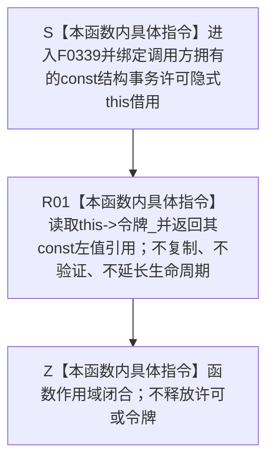

# CF-L6-0019 `结构事务许可::读取令牌` 现状流程图

图类型：现状流程图
代码版本：`a48a70b2d678dea64dd8228adb4f26f0badd9506`
覆盖文件：`海中鱼巣/核心/结构事务接线.数据.h:42`
唯一根函数：F0339
完整签名：`const 海中鱼巣::结构事务令牌& 海中鱼巣::结构事务许可::读取令牌() const`
参数：无显式参数；隐式 `this` 是调用方拥有、调用期有效的 `const 结构事务许可*` 非拥有借用
返回结果：无条件返回 `this->令牌_` 成员的 `const` 左值引用；不复制令牌、不延长许可或令牌生命周期
非法值 / 拒绝：无结构化拒绝；默认、已移动、已释放或其它无效许可仍返回其成员引用，内容可为全零或其它无效组合
已登记调用方：F0167、F0190、F0197—F0199、F0217、F0239、F0331—F0332、F0387、F0575、F0578—F0582、F0586—F0587、F0589—F0591、F0620—F0621，共 23 个函数、27 条调用边
直接项目函数：无
外部边界：无
未解析项目调用：无
调用图：`流程图/代码流程图/00_调用知识图谱.md`
逐行映射表：`流程图/代码流程图/L6/CF-L6-0019_结构事务许可读取令牌_逐行代码映射表.md`
输入契约 / 调用语境表：本文“调用语境与非成功分账”
非成功返回二分审查表：本文“调用语境与非成功分账”
偏差清单：`流程图/代码流程图/00_规范偏差审计.md` 的 F0339 切片
依据提交 / 结构化消息：冻结源码提交 `a48a70b2d678dea64dd8228adb4f26f0badd9506`；当前 HEAD 的目标源码 blob 相同；Clang C++ 候选与主智能体逐行复核
入口前置：`this` 指向仍存活的许可对象；调用期间不得并发移动、赋值或析构；返回引用只在成员未改写且许可对象仍存活时使用。当前已登记生产调用边先经过 F0338 只是调用语境事实，不是本函数自身门禁
结构读取与写入：只取得许可内部令牌成员的 const 引用；零写入、零验证
逻辑内返回：无
内部错误：在许可已析构后使用引用、无同步并发改写许可，或把原始令牌引用扩大为授权事实
生命周期与资源释放：返回引用不拥有令牌；许可移动赋值会改写同一成员，许可析构后引用悬空
异常：未声明 `noexcept`；当前成员引用读取不分配、不抛出
并发 / 幂等：对象不变时重复调用返回同一成员地址；不是值快照；与移动、赋值或析构并发构成数据竞争
验证入口：源码 blob `9d89cee25f00ba0f721d0b6c1bea517524e40663`、42 行、27 条入边、零项目出边 / 外部边界 / 未解析调用
验证输出：Clang C++ 候选 `关系仓库.cpp: 79 functions / 1332 calls / 0 diagnostics`；本批不运行构建或程序
依据：`规范/0050_项目通用机器逻辑与禁止性规则总纲_20260721.md`、`规范/0600_代码函数流程图应用与维护规范.md`、`规范/4040_子规范_不透明结构事务候选确认撤销与最后发布.md`、`规范/4050_子规范_入口拒绝逻辑内结果与内部逻辑错误.md`
不得作为施工许可：是
不得宣称：返回引用已经通过域 / 纪元 / 序号 / 类型 / 活动线程 / 当前性验证，或调用方已取得事务授权

## 流程图

## 已登记调用方

| 调用方 | 调用边 | 位置 / 语境 | 调用方图 |
| --- | --- | --- | --- |
| F0167 | E0649 | `关系仓库.cpp:185` 自动许可有效后 | [F0167](../L5/CF-L5-0047_创建关系_现状流程图.md) |
| F0190 | E0773 | `节点仓库.cpp:236` 许可有效后 | [F0190](../L5/CF-L5-0070_节点仓库读取节点_现状流程图.md) |
| F0197 | E0788 | `节点仓库.cpp:456` 许可有效后 | [F0197](../L5/CF-L5-0077_节点仓库有效节点数量_现状流程图.md) |
| F0198 | E0796 | `关系仓库.cpp:1013` 宏许可有效后 | [F0198](../L5/CF-L5-0078_关系仓库有效关系数量_现状流程图.md) |
| F0199 | E0804 | `索引仓库.cpp:405` 许可有效后 | [F0199](../L5/CF-L5-0079_索引仓库有效主键数量_现状流程图.md) |
| F0217 | E0841 | `主信息仓库.cpp:433` 许可有效后 | [F0217](../L5/CF-L5-0097_主信息仓库读取I64值索引重载_现状流程图.md) |
| F0239 | E0920 / E0922 / E0924 / E0926 / E0928 | `启动.运行期上下文.ixx:67—71` 五次短期借用 | [F0239](../L5/CF-L5-0115_运行期上下文结构核心完整_现状流程图.md) |
| F0331 | E1674 | `主信息仓库.cpp:41` 许可有效后 | [F0331](CF-L6-0011_主信息仓库创建主信息_现状流程图.md) |
| F0332 | E1679 | `节点仓库.cpp:56` 许可有效后 | [F0332](CF-L6-0012_节点仓库创建节点_现状流程图.md) |
| F0587 | E1723 | `关系仓库.cpp:278（宏展开122）` | 待生成 |
| F0589 | E1724 | `关系仓库.cpp:296（宏展开122）` | 待生成 |
| F0582 | E1725 | `关系仓库.cpp:317（宏展开122）` | 待生成 |
| F0591 | E1726 | `关系仓库.cpp:340（宏展开122）` | 待生成 |
| F0590 | E1727 | `关系仓库.cpp:410（宏展开122）` | 待生成 |
| F0586 | E1728 | `关系仓库.cpp:435（宏展开122）` | 待生成 |
| F0387 | E1729 | `关系仓库.cpp:734（宏展开122）` | 待生成 |
| F0621 | E1730 | `关系仓库.cpp:791（宏展开122）` | 待生成 |
| F0620 | E1731 | `关系仓库.cpp:824（宏展开122）` | 待生成 |
| F0575 | E1732 | `关系仓库.cpp:844（宏展开122）` | 待生成 |
| F0578 | E1733 | `关系仓库.cpp:920（宏展开122）` | 待生成 |
| F0581 | E1734 | `关系仓库.cpp:950（宏展开122）` | 待生成 |
| F0579 | E1735 | `关系仓库.cpp:981（宏展开122）` | 待生成 |
| F0580 | E1736 | `关系仓库.cpp:997（宏展开122）` | 待生成 |

## 调用语境与非成功分账

| 调用语境 | 上游保证 | 当前结果 | 二分口径 | 后继 |
| --- | --- | --- | --- | --- |
| 已登记仓库读写路径 | F0338 已返回真 | const 令牌借用 | 窄读取成功 | 消费入口继续验证或使用令牌 |
| F0239 完整性复核 | 每次调用受前序短路条件保护 | 同一许可成员引用 | 只读验证材料 | 任一后继失败返回结构不完整 |
| 存活的默认 / 已移动源许可 | 无有效性前置 | 合法返回当前成员引用，内容可为全零或其它无效组合 | C++ 层正常读取；上层协议按调用语境裁决 | 不得把零令牌解释为已验证授权 |
| 已析构许可 | 对象生命周期已结束 | 悬空访问 | C++ 前置破坏 | 禁止调用 |
| 许可析构后保存引用 | 生命周期已结束 | 悬空引用 | C++ 前置破坏 | 禁止跨许可生命周期保存 |

## 当前偏差与边界

- F0339 不调用 F0338，也不验证任何令牌字段；调用顺序门禁完全属于调用方。
- 返回 `const&` 不是冻结快照。许可移动赋值会改写同一成员，正常移动后的源令牌会被清零。
- 令牌引用只在许可对象存活、未被移动 / 改写且同步合法时可用；取得引用不等于真实授权。
