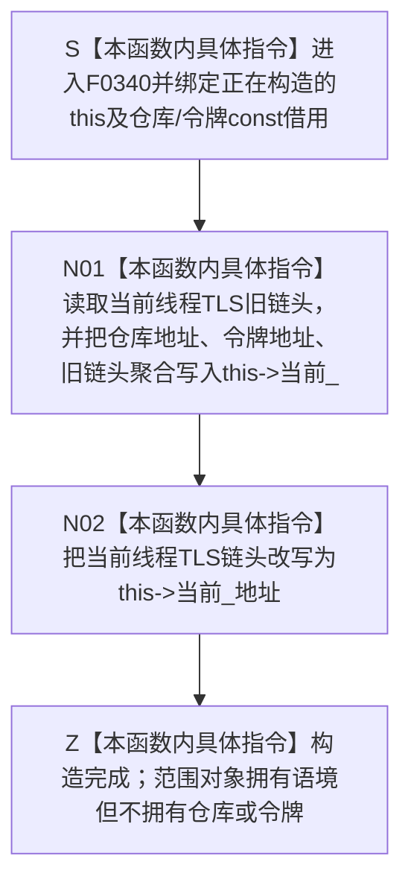

# CF-L6-0020 `关系令牌范围::关系令牌范围` 现状流程图

图类型：现状流程图
代码版本：`a48a70b2d678dea64dd8228adb4f26f0badd9506`
覆盖文件：`海中鱼巣/核心/关系仓库.cpp:64-67`
唯一根函数：F0340
完整签名：`海中鱼巣::{匿名命名空间@关系仓库.cpp}::关系令牌范围::关系令牌范围(const 海中鱼巣::关系仓库& 仓库, const 海中鱼巣::结构事务令牌& 令牌)`
参数：`仓库` 与 `令牌` 均为调用方拥有、至少存活到配对 F0344 析构完成的 const 非拥有借用；隐式 `this` 是正在构造的范围对象
返回结果：构造函数无返回值；完成时当前线程 TLS 链头指向本对象拥有的 `当前_` 语境
非法值 / 拒绝：无结构化拒绝；不验证仓库、令牌域 / 纪元 / 类型 / 当前性；悬空实参、跨线程析构或非 LIFO 生命周期属于 C++ 前置破坏
已登记调用方：F0167、F0198、F0387、F0440、F0575、F0578—F0582、F0586—F0587、F0589—F0591、F0620—F0621，共 17 个函数、17 条调用边
直接项目函数：无
外部边界：无；TLS 读取 / 写入、取地址和聚合初始化均为本函数内具体指令
未解析项目调用：无
调用图：`流程图/代码流程图/00_调用知识图谱.md`
逐行映射表：`流程图/代码流程图/L6/CF-L6-0020_关系令牌范围构造_逐行代码映射表.md`
输入契约 / 调用语境表：本文“调用语境与非成功分账”
非成功返回二分审查表：本文“调用语境与非成功分账”
偏差清单：`流程图/代码流程图/00_规范偏差审计.md` 的 F0340 切片
依据提交 / 结构化消息：冻结源码提交 `a48a70b2d678dea64dd8228adb4f26f0badd9506`；当前 HEAD 的目标源码 blob 相同；Clang C++ 候选与主智能体逐行复核
入口前置：调用方保证仓库、令牌与范围按同线程严格 LIFO 生命周期存在。自动许可宏路径只具备 F0338 三项形状门禁与 F0339 原始令牌借用；F0440 具名令牌路径才在上游执行共享令牌验证
结构读取与写入：读取当前线程旧 TLS 链头，写入本对象的三个借用指针，再把 TLS 链头写为本对象语境地址；不写仓库
逻辑内返回：无
内部错误：错序、跨线程或漏析构导致 TLS 链未恢复；令牌 / 仓库先结束导致语境悬空
生命周期与资源释放：本对象只拥有 `当前_` 语境，不拥有仓库或令牌；F0344 负责恢复前序 TLS；自动许可路径依赖逆序析构先恢复范围再释放许可
异常：未声明 `noexcept`；当前指针聚合初始化与 TLS 读写不分配、不抛出
并发 / 幂等：TLS 隔离线程；每次构造压栈一层，非幂等；同仓嵌套时 F0337 命中最内层
验证入口：源码 blob `f7a9ea9a09d3065468208c16f9ea34f806b6e183`、64—67 行、17 条入边、零项目出边 / 外部边界 / 未解析调用
验证输出：Clang C++ 候选 `79 functions / 1332 calls / 26 file-level unresolved / 0 diagnostics`；F0340 唯一命中、4 个候选节点；本批不运行构建或程序
依据：`规范/0050_项目通用机器逻辑与禁止性规则总纲_20260721.md`、`规范/0600_代码函数流程图应用与维护规范.md`、`规范/4040_子规范_不透明结构事务候选确认撤销与最后发布.md`、`规范/4050_子规范_入口拒绝逻辑内结果与内部逻辑错误.md`
不得作为施工许可：是
不得宣称：令牌已被本函数验证、TLS 语境等于正式事务身份、跨线程安全或关系仓库已取得写入授权

## 流程图

## 已登记调用方

| 调用方 | 调用边 | 位置 / 语境 | 调用方图 |
| --- | --- | --- | --- |
| F0167 | E0650 | `关系仓库.cpp:185` 关系创建自动许可范围 | [F0167](../L5/CF-L5-0047_创建关系_现状流程图.md) |
| F0198 | E0797 | `关系仓库.cpp:1013` 关系计数 optional 范围 | [F0198](../L5/CF-L5-0078_关系仓库有效关系数量_现状流程图.md) |
| F0587 | E1737 | `关系仓库.cpp:278（宏展开122）` | 待生成 |
| F0589 | E1738 | `关系仓库.cpp:296（宏展开122）` | 待生成 |
| F0582 | E1739 | `关系仓库.cpp:317（宏展开122）` | 待生成 |
| F0591 | E1740 | `关系仓库.cpp:340（宏展开122）` | 待生成 |
| F0590 | E1741 | `关系仓库.cpp:410（宏展开122）` | 待生成 |
| F0586 | E1742 | `关系仓库.cpp:435（宏展开122）` | 待生成 |
| F0387 | E1743 | `关系仓库.cpp:734（宏展开122）` | 待生成 |
| F0621 | E1744 | `关系仓库.cpp:791（宏展开122）` | 待生成 |
| F0620 | E1745 | `关系仓库.cpp:824（宏展开122）` | 待生成 |
| F0575 | E1746 | `关系仓库.cpp:844（宏展开122）` | 待生成 |
| F0578 | E1747 | `关系仓库.cpp:920（宏展开122）` | 待生成 |
| F0581 | E1748 | `关系仓库.cpp:950（宏展开122）` | 待生成 |
| F0579 | E1749 | `关系仓库.cpp:981（宏展开122）` | 待生成 |
| F0580 | E1750 | `关系仓库.cpp:997（宏展开122）` | 待生成 |
| F0440 | E1751 | `关系仓库.cpp:1431（宏展开1029）` 具名令牌读取范围 | 待生成 |

## 调用语境与非成功分账

| 调用语境 | 上游保证 | 构造后结果 | 二分口径 | 后继 |
| --- | --- | --- | --- | --- |
| 自动许可宏 | F0338 三项释放形状为真，F0339 已给出原始令牌借用；未执行共享令牌验证 | 当前线程压入同仓库最内层语境 | 正常范围建立 | F0337 后继查询命中本范围 |
| F0440 具名令牌读取 | 入口已验证共享令牌 | 当前线程压入令牌语境 | 正常范围建立 | 读取期间关系仓库复用令牌 |
| 嵌套同仓库范围 | 外层仍存活 | 新范围成为链头 | 合法嵌套 | F0344 后恢复外层 |
| 错序 / 跨线程析构 | 不具备合法生命周期 | TLS 链错误或悬空 | C++ 前置破坏 / 内部错误 | 不得解释为普通构造失败 |

## 当前偏差与边界

- F0340 不验证令牌，只把借用身份压入线程局部链；真实消费者仍须遵守令牌验证合同。
- 类有用户声明析构，但未显式删除复制；隐式复制不会重接 TLS，副本析构可能错误恢复链。当前 AST 未发现可达复制 / 移动调用，本批只记录风险。
- 范围对象、许可和令牌必须保持同线程严格 LIFO。TLS 只隔离线程，不同步仓库或令牌本体。
