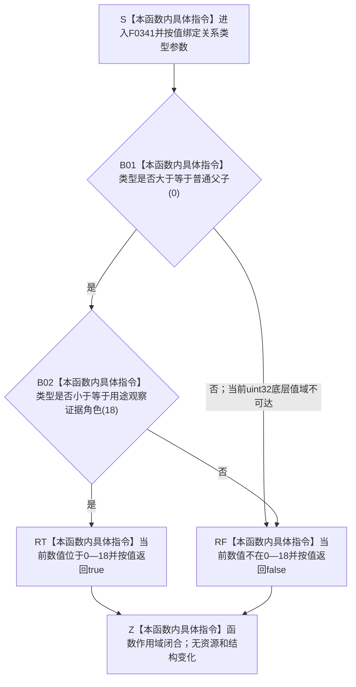

# CF-L6-0021 `关系类型已定义` 现状流程图

图类型：现状流程图
代码版本：`a48a70b2d678dea64dd8228adb4f26f0badd9506`
覆盖文件：`海中鱼巣/核心/关系仓库.cpp:13-15`
唯一根函数：F0341
完整签名：`bool 海中鱼巣::{匿名命名空间@关系仓库.cpp}::关系类型已定义(海中鱼巣::关系类型 类型)`
参数：`类型` 按值传入；底层类型为 `std::uint32_t`，无资源与所有权转移
返回结果：数值位于 `0—18` 时按值返回 `true`，否则返回 `false`
非法值 / 拒绝：当前实现把 `19—23` 与真正未知的 `24—UINT32_MAX` 一并拒绝；前者是实现上界滞后，后者是合法未知值拒绝
已登记调用方：F0167、F0575、F0578—F0580、F0582、F0620—F0621，共 8 个函数、8 条调用边
直接项目函数：无
外部边界：无
未解析项目调用：无
调用图：`流程图/代码流程图/00_调用知识图谱.md`
逐行映射表：`流程图/代码流程图/L6/CF-L6-0021_关系类型已定义_逐行代码映射表.md`
输入契约 / 调用语境表：本文“调用语境与非成功分账”
非成功返回二分审查表：本文“调用语境与非成功分账”
偏差清单：`流程图/代码流程图/00_规范偏差审计.md` 的 F0341 切片
依据提交 / 结构化消息：冻结源码提交 `a48a70b2d678dea64dd8228adb4f26f0badd9506`；当前 HEAD 的目标源码 blob 相同；Clang C++ 候选与逐行源码复核
入口前置：调用方传入一个 `关系类型` 数值；函数不要求仓库、许可或事务语境
结构读取与写入：只比较按值参数；不读取或写入节点、关系、索引或领域事实
逻辑内返回：真正未知的 `24+` 在写前入口被拒绝，或只读入口形成空结果
内部错误：正式 ABI 类型 `19—23` 被当前上界错误拒绝，不能归为合法入口拒绝
生命周期与资源释放：无借用、分配、资源释放或生命周期延长
异常：未声明 `noexcept`；当前只有内建枚举比较和布尔短路，不分配、不抛出
并发 / 幂等：纯值、确定、可重入；相同输入重复调用结果一致
验证入口：源码 blob `f7a9ea9a09d3065468208c16f9ea34f806b6e183`、13—15 行、8 条入边
验证输出：Clang C++ 候选 `关系仓库.cpp: 79 functions / 1332 calls / 0 diagnostics`；F0341 项目调用 `0`、外部边界 `0`、未解析 `0`；本批不运行构建或程序
依据：`规范/0050_项目通用机器逻辑与禁止性规则总纲_20260721.md`、`规范/0600_代码函数流程图应用与维护规范.md`、`规范/4010_子规范_统一仓库稳定句柄与通用关系索引边界.md`、`规范/4050_子规范_入口拒绝逻辑内结果与内部逻辑错误.md`
不得作为施工许可：是
不得宣称：关系类型 ABI 0—23 已由旧关系仓完整接受，或实现偏差已经修复

## 流程图

## 已登记调用方

| 调用方 | 调用边 | 位置 / 前置 | 调用方图 |
| --- | --- | --- | --- |
| F0167 | E0651 | `关系仓库.cpp:186`；许可语境建立完成 | [F0167](../L5/CF-L5-0047_创建关系_现状流程图.md) |
| F0582 | E1752 | `关系仓库.cpp:319`；源节点句柄有效 | 待生成 |
| F0621 | E1753 | `关系仓库.cpp:798`；源节点当前有效 | 待生成 |
| F0620 | E1754 | `关系仓库.cpp:826`；源节点当前有效 | 待生成 |
| F0575 | E1755 | `关系仓库.cpp:846`；源节点当前有效 | 待生成 |
| F0578 | E1756 | `关系仓库.cpp:922`；目标节点当前有效 | 待生成 |
| F0579 | E1757 | `关系仓库.cpp:982`；源、目标节点均当前有效 | 待生成 |
| F0580 | E1758 | `关系仓库.cpp:998`；目标节点当前有效 | 待生成 |

## 调用语境与非成功分账

| 调用语境 | 输入范围 | `false` 精确含义 | 二分口径 | 后继 |
| --- | --- | --- | --- | --- |
| 关系创建 / 查询入口 | 外部或候选关系类型 | `24+` 未定义 | 写前逻辑内拒绝 / 空结果 | 不写关系 |
| 正式关系 19—23 | 4010 已冻结的正式 ABI | 当前实现仍返回 `false` | 实现偏差 | 不得伪写成合法未知类型 |
| 已发布记录完整性或审计 | 既有关系记录 | `false` 同时覆盖真正未知值和正式 19—23 | 原因折叠 | 调用方不能仅凭布尔值区分根因 |

## 当前偏差与边界

- 4010 已冻结关系类型 ABI `0—23`，当前实现仍以类型 18 作为上界。
- 类型 19 状态事实角色、20 动态事实角色、21 自我结构角色、22 特征实例角色、23 方法生命周期均被错误拒绝。
- 新节点直接结构关系仓以 ABI 数量 24 接受 `0—23`；这不自动修复本函数所在旧关系仓。
- 本图只记录当前实现与正式规范差异，不形成代码计划，不授权代码修改。
