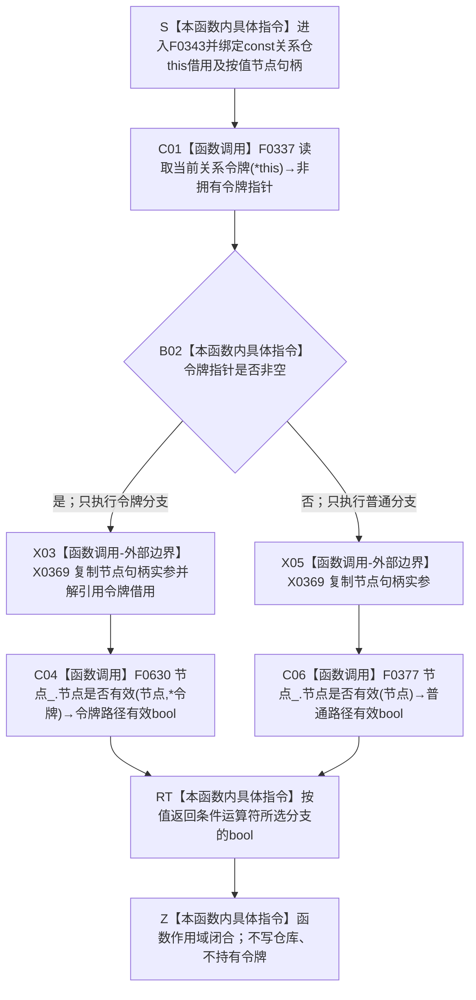

# CF-L6-0022 `关系仓库::节点有效_` 现状流程图

图类型：现状流程图
代码版本：`a48a70b2d678dea64dd8228adb4f26f0badd9506`
覆盖文件：`海中鱼巣/核心/关系仓库.cpp:179-182`
唯一根函数：F0343
完整签名：`bool 海中鱼巣::关系仓库::节点有效_(海中鱼巣::节点句柄 节点) const`
参数：`节点` 按值传入；隐式 `this` 是调用期有效的 const 关系仓库借用，成员 `节点_` 是生命周期长于关系仓库的非拥有 `const 节点仓库&`
返回结果：当前线程存在同一关系仓库的令牌语境时返回 F0630 的布尔结果，否则返回 F0377 的布尔结果；不携带失败原因
非法值 / 拒绝：无效、错仓、错版本、缺失或已删除节点可返回 `false`；已绑定有效关系端点读回为 `false` 时可能是内部结构不一致，不能统一解释为普通入口拒绝
已登记调用方：F0167、F0198、F0387、F0575、F0578—F0581、F0586—F0587、F0591、F0620—F0621，共 13 个函数、27 条调用边
直接项目函数：F0337 `读取当前关系令牌`、F0630 `节点仓库::节点是否有效(节点,令牌)`、F0377 `节点仓库::节点是否有效(节点)`
外部边界：X0369 `节点句柄` 隐式复制构造；源代码两个静态分支调用点，运行期只执行所选分支一次
未解析项目调用：无
调用图：`流程图/代码流程图/00_调用知识图谱.md`
逐行映射表：`流程图/代码流程图/L6/CF-L6-0022_关系仓库节点有效_逐行代码映射表.md`
输入契约 / 调用语境表：本文“调用语境与非成功分账”
非成功返回二分审查表：本文“调用语境与非成功分账”
偏差清单：`流程图/代码流程图/00_规范偏差审计.md` 的 F0343 切片
依据提交 / 结构化消息：冻结源码提交 `a48a70b2d678dea64dd8228adb4f26f0badd9506`；当前 HEAD 的目标源码 blob 相同；Clang C++ 候选、重载定义与逐行源码复核
入口前置：关系仓库与其节点仓库借用仍存活；构造器已要求两仓同时未接域或接入同一事务域
结构读取与写入：读取当前线程 TLS 令牌借用，随后只读查询节点仓库；不写节点、关系或索引
逻辑内返回：普通入口材料无效、错仓、错版本、缺失或已删除时，第一笔写前 `false` 属于拒绝 / 空结果
内部错误：正式有效关系记录端点在内部读回时返回 `false`，或令牌 / 接线前置成立后节点仓结果不一致
生命周期与资源释放：令牌指针、关系仓库和节点仓库均为非拥有借用；节点句柄按值复制；不延长任何仓库、令牌或节点生命周期
异常：未声明 `noexcept`；下游许可、锁和节点读取异常可传播
并发 / 幂等：只读但不是全局纯函数；仓库状态或当前线程 TLS 范围变化可改变结果；TLS 线程隔离，节点仓同步由下游承担
验证入口：关系仓源码 blob `f7a9ea9a09d3065468208c16f9ea34f806b6e183`、179—182 行、27 条入边、3 条出边与 X0369
验证输出：Clang C++ 候选 `关系仓库.cpp: 79 functions / 1332 calls / 0 diagnostics`；F0343 唯一命中、项目被调函数 3、外部复制调用 2、未解析 0；本批不运行构建或程序
依据：`规范/0050_项目通用机器逻辑与禁止性规则总纲_20260721.md`、`规范/0600_代码函数流程图应用与维护规范.md`、`规范/4040_子规范_不透明结构事务候选确认撤销与最后发布.md`、`规范/4050_子规范_入口拒绝逻辑内结果与内部逻辑错误.md`
不得作为施工许可：是
不得宣称：TLS 命中即正式授权、F0343 已验证令牌全部字段、裸 `false` 已具名区分所有失败原因，或节点 / 关系结构符合现行规范

## 流程图

## 直接被调函数

| 被调函数 | 调用边 | 条件 | 被调图 |
| --- | --- | --- | --- |
| F0337 | E1692 | 函数进入 | [F0337](CF-L6-0017_读取当前关系令牌_现状流程图.md) |
| F0630 | E1782 | `令牌 != nullptr` | 待生成 |
| F0377 | E1783 | `令牌 == nullptr` | 待生成 |

## 已登记调用方

| 调用方 | 调用边 | 位置 / 语境 | 调用方图 |
| --- | --- | --- | --- |
| F0167 | E0657、E0658 | `关系仓库.cpp:196`；源端点后目标端点短路读取 | [F0167](../L5/CF-L5-0047_创建关系_现状流程图.md) |
| F0198 | E0798、E0799 | `关系仓库.cpp:1019-1020`；有效关系计数 | [F0198](../L5/CF-L5-0078_关系仓库有效关系数量_现状流程图.md) |
| F0587 | E1759、E1760 | `关系仓库.cpp:289`；源后目标 | 待生成 |
| F0591 | E1761、E1762 | `关系仓库.cpp:366`；源后目标 | 待生成 |
| F0586 | E1763、E1764 | `关系仓库.cpp:441`；新源后新目标 | 待生成 |
| F0387 | E1765、E1766 | `关系仓库.cpp:736/753`；父节点及候选子节点 | 待生成 |
| F0621 | E1767、E1768 | `关系仓库.cpp:798/805`；源节点及匹配记录目标 | 待生成 |
| F0620 | E1769、E1770 | `关系仓库.cpp:826/833`；源节点及匹配记录目标 | 待生成 |
| F0575 | E1771、E1772 | `关系仓库.cpp:846/855`；源节点及匹配记录目标 | 待生成 |
| F0578 | E1773、E1774 | `关系仓库.cpp:922/939`；目标节点及候选源节点 | 待生成 |
| F0581 | E1775—E1777 | `关系仓库.cpp:952/970/971`；输入节点及 lambda 内源 / 目标 | 待生成 |
| F0579 | E1778、E1779 | `关系仓库.cpp:982`；源后目标 | 待生成 |
| F0580 | E1780、E1781 | `关系仓库.cpp:998/1005`；目标节点及匹配记录源节点 | 待生成 |

## 调用语境与非成功分账

| 调用语境 | 上游保证 | `false` 可能含义 | 二分口径 | 后继 |
| --- | --- | --- | --- | --- |
| F0167 新关系端点 | 只保证句柄形状通过 | 节点不存在、已删除、错仓或错版本 | 写前逻辑内拒绝 | 返回空关系句柄，零关系写入 |
| 查询入口实参 | 外部或候选节点 | 节点无效 | 空结果 | 不把空结果解释为仓库损坏 |
| 已绑定有效关系记录端点 | 关系记录已经进入内部遍历 | 节点生命周期或关系端点不一致 | 追根因 | F0591 显式内部不一致；部分只读路径仍静默过滤 / 少计 |
| TLS 命中 | 只证明同线程存在同关系仓语境 | F0630 可继续因令牌或节点读取失败返回 `false` | 依下游结果分账 | 不允许回退到 F0377 |
| TLS 未命中 | 无现成关系令牌 | F0377 自行按节点仓接线取得许可或普通读取 | 正常分支选择 | 不把 `nullptr` 自身视为错误 |

## 当前偏差与边界

- F0343 自身只按 TLS 指针是否为空选择精确重载，不验证令牌域、纪元、序号、类型或当前性。
- F0630 继续调用令牌重载节点读取；共享令牌真实性由其下游验证路径承担。
- 相同 `false` 折叠无效令牌、许可失败、节点缺失、删除、错仓和错版本；调用方必须结合语境分账。
- F0198 及部分查询路径会把有效关系端点不一致静默过滤为少计 / 空结果，属于现状审计风险。
