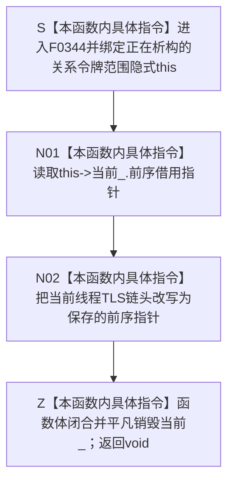

# CF-L6-0023 `关系令牌范围::~关系令牌范围` 现状流程图

图类型：现状流程图
代码版本：`a48a70b2d678dea64dd8228adb4f26f0badd9506`
覆盖文件：`海中鱼巣/核心/关系仓库.cpp:68`
唯一根函数：F0344
完整签名：`海中鱼巣::{匿名命名空间@关系仓库.cpp}::关系令牌范围::~关系令牌范围() noexcept`
参数：无显式参数；隐式 `this` 是正在析构的关系令牌范围对象
返回结果：析构函数返回 `void`；完成时当前线程 TLS 链头恢复为本对象构造时保存的前序
非法值 / 拒绝：无结构化拒绝；错序、重复、跨线程或复制副本析构属于 C++ 生命周期 / 内部结构错误
已登记调用方：F0167、F0198、F0387、F0440、F0575、F0578—F0582、F0586—F0587、F0589—F0591、F0620—F0621，共 17 个函数、17 条调用边
直接项目函数：无
外部边界：无；TLS 读取 / 写入、裸指针赋值和平凡成员析构均为本函数内具体指令
未解析项目调用：无
调用图：`流程图/代码流程图/00_调用知识图谱.md`
逐行映射表：`流程图/代码流程图/L6/CF-L6-0023_关系令牌范围析构_逐行代码映射表.md`
输入契约 / 调用语境表：本文“调用语境与非成功分账”
非成功返回二分审查表：本文“调用语境与非成功分账”
偏差清单：`流程图/代码流程图/00_规范偏差审计.md` 的 F0344 切片
依据提交 / 结构化消息：冻结源码提交 `a48a70b2d678dea64dd8228adb4f26f0badd9506`；当前 HEAD 的目标源码 blob 相同；Clang C++ 候选与逐行源码复核
入口前置：对象已由 F0340 在同一线程构造并处于严格 LIFO 链头位置；仓库、令牌和前序语境生命周期仍合法
结构读取与写入：读取 `当前_.前序`，把当前线程 `thread_local` 链头写为该指针；不写仓库、关系、节点或事务发布事实
逻辑内返回：无
内部错误：当前链头不是 `&当前_`、跨线程 / 错序 / 重复析构、复制副本析构或保存前序悬空
生命周期与资源释放：本函数只退出 TLS 路由语境；不释放许可、不解锁仓库、不销毁仓库或令牌；函数体后 `当前_` 平凡销毁
异常：实际异常规格为隐式 `noexcept(true)`；当前裸指针读取和 TLS 赋值不分配、不抛出，可参与异常栈展开
并发 / 幂等：TLS 只隔离线程；每个已构造对象只允许析构一次，非幂等；必须与 F0340 同线程严格 LIFO 配对
验证入口：源码 blob `f7a9ea9a09d3065468208c16f9ea34f806b6e183`、68 行、17 条入边
验证输出：Clang C++ 候选 `关系仓库.cpp: 79 functions / 1332 calls / 0 diagnostics`；F0344 唯一赋值表达式、项目出边 / 外部边界 / 未解析均为 0；本批不运行构建或程序
依据：`规范/0050_项目通用机器逻辑与禁止性规则总纲_20260721.md`、`规范/0600_代码函数流程图应用与维护规范.md`、`规范/4040_子规范_不透明结构事务候选确认撤销与最后发布.md`、`规范/4050_子规范_入口拒绝逻辑内结果与内部逻辑错误.md`
不得作为施工许可：是
不得宣称：析构完成等于事务提交、令牌已经验证、仓库已解锁或许可已释放

## 流程图

## 已登记调用方

| 调用方 | 调用边 | 生命周期位置 | 调用方图 |
| --- | --- | --- | --- |
| F0167 | E0662 | `关系仓库.cpp:185-275` | [F0167](../L5/CF-L5-0047_创建关系_现状流程图.md) |
| F0198 | E0800 | `关系仓库.cpp:1013-1025` | [F0198](../L5/CF-L5-0078_关系仓库有效关系数量_现状流程图.md) |
| F0587 | E1784 | `关系仓库.cpp:277-293` | 待生成 |
| F0589 | E1785 | `关系仓库.cpp:295-312` | 待生成 |
| F0582 | E1786 | `关系仓库.cpp:314-337` | 待生成 |
| F0591 | E1787 | `关系仓库.cpp:339-407` | 待生成 |
| F0590 | E1788 | `关系仓库.cpp:409-424` | 待生成 |
| F0586 | E1789 | `关系仓库.cpp:431-479` | 待生成 |
| F0387 | E1790 | `关系仓库.cpp:733-758` | 待生成 |
| F0621 | E1791 | `关系仓库.cpp:790-821` | 待生成 |
| F0620 | E1792 | `关系仓库.cpp:823-841` | 待生成 |
| F0575 | E1793 | `关系仓库.cpp:843-863` | 待生成 |
| F0578 | E1794 | `关系仓库.cpp:919-947` | 待生成 |
| F0581 | E1795 | `关系仓库.cpp:949-978` | 待生成 |
| F0579 | E1796 | `关系仓库.cpp:980-994` | 待生成 |
| F0580 | E1797 | `关系仓库.cpp:996-1010` | 待生成 |
| F0440 | E1798 | `关系仓库.cpp:1430-1433` | 待生成 |

## 调用语境与非成功分账

| 调用语境 | 前置 | 析构结果 | 二分口径 | 后继 |
| --- | --- | --- | --- | --- |
| 自动许可范围正常退出 | F0340 已压入当前对象语境 | 恢复构造前 TLS 链头 | 正常生命周期收口 | 随后 F0345 释放许可 |
| 自动许可范围异常展开 | 范围对象已构造 | 异常传播前恢复 TLS | 正常异常安全动作 | 保持原异常 |
| F0440 具名令牌范围 | 共享令牌验证已通过 | 退出只读复用语境 | 正常生命周期收口 | 不释放调用方令牌 |
| 错序 / 跨线程 / 复制副本析构 | 不具备合法前置 | 静默改写错误线程或丢弃内层链 | 内部结构 / C++ 生命周期错误 | 不得解释为普通析构成功 |

## 当前偏差与边界

- 本函数不检查当前 TLS 链头是否等于 `&当前_`；错序析构会静默丢弃更内层语境。
- 跨线程析构会写目标线程 TLS，并使源线程 TLS 保留指向已销毁 `当前_` 的悬空指针。
- 类有用户声明析构但未显式删除复制；复制副本不会压栈，其析构可能错误弹栈。当前根闭包尚无稳定可达复制证据。
- 自动许可路径的声明顺序保证正常逆序为 F0344 先退出 TLS、F0345 后释放许可；本函数自身不释放许可。
