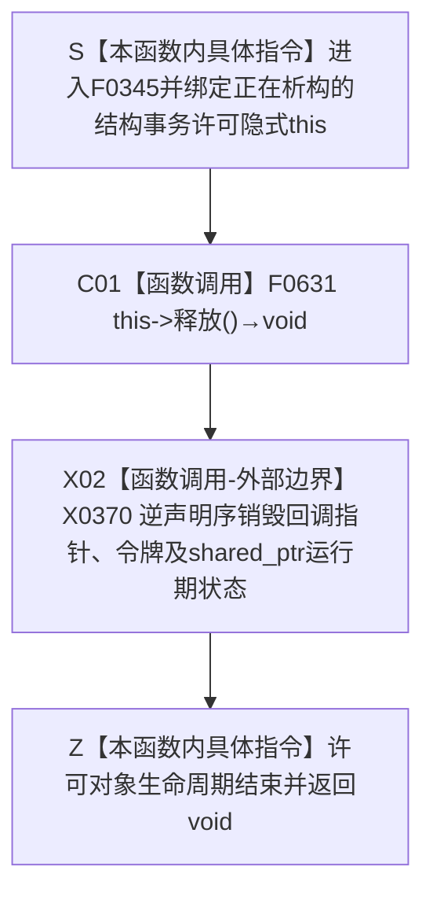

# CF-L6-0024 `结构事务许可::~结构事务许可` 现状流程图

图类型：现状流程图
代码版本：`a48a70b2d678dea64dd8228adb4f26f0badd9506`
覆盖文件：`海中鱼巣/核心/结构事务接线.数据.h:40`
唯一根函数：F0345
完整签名：`海中鱼巣::结构事务许可::~结构事务许可() noexcept`
参数：无显式参数；隐式 `this` 独占指向生命周期正在结束的许可对象
返回结果：析构函数返回 `void`；先调用 F0631 释放许可，再逆声明序销毁成员
非法值 / 拒绝：无结构化拒绝；默认对象和已移动源对象经 F0631 合法空操作
已登记调用方：F0167、F0190、F0197—F0199、F0217、F0239、F0331—F0332、F0387、F0575、F0578—F0582、F0586—F0587、F0589—F0591、F0620—F0621，共 23 个函数、39 条调用边
直接项目函数：F0631 `结构事务许可::释放() noexcept`
外部边界：X0370 成员回调指针 / 令牌平凡销毁和 `shared_ptr<void>` 析构
未解析项目调用：F0631 内的 U0002 释放回调，不是 F0345 的直接出边
调用图：`流程图/代码流程图/00_调用知识图谱.md`
逐行映射表：`流程图/代码流程图/L6/CF-L6-0024_结构事务许可析构_逐行代码映射表.md`
输入契约 / 调用语境表：本文“调用语境与非成功分账”
非成功返回二分审查表：本文“调用语境与非成功分账”
偏差清单：`流程图/代码流程图/00_规范偏差审计.md` 的 F0345 切片
依据提交 / 结构化消息：冻结源码提交 `a48a70b2d678dea64dd8228adb4f26f0badd9506`；当前 HEAD 的目标源码 blob 相同；头文件定义、调用点与生命周期逐项复核
入口前置：对象处于合法析构或异常展开；不得重复析构或与移动赋值并发
结构读取与写入：F0345 本体只编排 F0631 与成员析构；F0631 才读取许可形状、调用释放回调并清空对象
逻辑内返回：默认许可或已移动源许可由 F0631 合法空操作
内部错误：有效许可释放回调静默失败、跨线程释放、对象数据竞争或回调 / 状态生命周期不一致
生命周期与资源释放：F0631 应先释放运行期许可；随后 X0370 销毁对象成员和最后一份可能的共享状态所有权
异常：析构实际隐式 `noexcept(true)`；F0631 和释放回调合同均为 `noexcept`
并发 / 幂等：析构非幂等；移动源析构为空操作；跨线程移动后析构未校验原取得线程
验证入口：源码 blob `9d89cee25f00ba0f721d0b6c1bea517524e40663`、40 行、39 条入边、E1799 与 X0370
验证输出：头文件源码与根闭包调用点只读核对；本批不运行构建或程序
依据：`规范/0050_项目通用机器逻辑与禁止性规则总纲_20260721.md`、`规范/0600_代码函数流程图应用与维护规范.md`、`规范/4040_子规范_不透明结构事务候选确认撤销与最后发布.md`、`规范/4050_子规范_入口拒绝逻辑内结果与内部逻辑错误.md`
不得作为施工许可：是
不得宣称：析构返回即协调器已真实释放许可、跨线程安全或释放失败已经结构化上报

## 流程图

## 已登记调用方

| 调用方 | 调用边 | 生命周期位置 | 调用方图 |
| --- | --- | --- | --- |
| F0167 | E0663 | `关系仓库.cpp:185-275` optional 承载许可退出；F0344 之后 | [F0167](../L5/CF-L5-0047_创建关系_现状流程图.md) |
| F0167 | E1800 | `关系仓库.cpp:185（宏展开120完整表达式末）` 已移空临时许可 | 同上 |
| F0190 | E0775 | `节点仓库.cpp:235-237` | [F0190](../L5/CF-L5-0070_节点仓库读取节点_现状流程图.md) |
| F0197 | E0790 | `节点仓库.cpp:455-457` | [F0197](../L5/CF-L5-0077_节点仓库有效节点数量_现状流程图.md) |
| F0198 | E0794、E0801 | `关系仓库.cpp:1013-1025` 临时许可及 optional 承载许可 | [F0198](../L5/CF-L5-0078_关系仓库有效关系数量_现状流程图.md) |
| F0199 | E0806 | `索引仓库.cpp:404-406` | [F0199](../L5/CF-L5-0079_索引仓库有效主键数量_现状流程图.md) |
| F0217 | E0843 | `主信息仓库.cpp:432-434` | [F0217](../L5/CF-L5-0097_主信息仓库读取I64值索引重载_现状流程图.md) |
| F0239 | E0930 | `启动.运行期上下文.ixx:71-72` | [F0239](../L5/CF-L5-0115_运行期上下文结构核心完整_现状流程图.md) |
| F0331 | E1676 | `主信息仓库.cpp:41-42` | [F0331](CF-L6-0011_主信息仓库创建主信息_现状流程图.md) |
| F0332 | E1681 | `节点仓库.cpp:56-57` | [F0332](CF-L6-0012_节点仓库创建节点_现状流程图.md) |
| F0587 | E1805、E1806 | `关系仓库.cpp:278（宏展开120完整表达式末）` 临时许可；`277-293` optional 内许可 | 待生成 |
| F0589 | E1807、E1808 | `关系仓库.cpp:296（宏展开120完整表达式末）` 临时许可；`295-312` optional 内许可 | 待生成 |
| F0582 | E1809、E1810 | `关系仓库.cpp:317（宏展开120完整表达式末）` 临时许可；`314-337` optional 内许可 | 待生成 |
| F0591 | E1811、E1812 | `关系仓库.cpp:340（宏展开120完整表达式末）` 临时许可；`339-407` optional 内许可 | 待生成 |
| F0590 | E1813、E1814 | `关系仓库.cpp:410（宏展开120完整表达式末）` 临时许可；`409-424` optional 内许可 | 待生成 |
| F0586 | E1815、E1816 | `关系仓库.cpp:435（宏展开120完整表达式末）` 临时许可；`431-479` optional 内许可 | 待生成 |
| F0387 | E1817、E1818 | `关系仓库.cpp:734（宏展开120完整表达式末）` 临时许可；`733-758` optional 内许可 | 待生成 |
| F0621 | E1819、E1820 | `关系仓库.cpp:791（宏展开120完整表达式末）` 临时许可；`790-821` optional 内许可 | 待生成 |
| F0620 | E1821、E1822 | `关系仓库.cpp:824（宏展开120完整表达式末）` 临时许可；`823-841` optional 内许可 | 待生成 |
| F0575 | E1823、E1824 | `关系仓库.cpp:844（宏展开120完整表达式末）` 临时许可；`843-863` optional 内许可 | 待生成 |
| F0578 | E1825、E1826 | `关系仓库.cpp:920（宏展开120完整表达式末）` 临时许可；`919-947` optional 内许可 | 待生成 |
| F0581 | E1827、E1828 | `关系仓库.cpp:950（宏展开120完整表达式末）` 临时许可；`949-978` optional 内许可 | 待生成 |
| F0579 | E1829、E1830 | `关系仓库.cpp:981（宏展开120完整表达式末）` 临时许可；`980-994` optional 内许可 | 待生成 |
| F0580 | E1831、E1832 | `关系仓库.cpp:997（宏展开120完整表达式末）` 临时许可；`996-1010` optional 内许可 | 待生成 |

## 调用语境与非成功分账

| 调用语境 | 对象状态 | F0631 后结果 | 二分口径 | 后继 |
| --- | --- | --- | --- | --- |
| 有效许可正常退出 | 状态、令牌和回调形状有效 | 调用释放回调并清空对象 | 正常资源收口 | X0370 销毁空成员 |
| 有效许可异常展开 | 同上 | `noexcept` 释放后继续原异常传播 | 正常异常安全动作 | 不产生新异常 |
| 默认 / 已移动源许可 | F0338 形状为假 | F0631 空操作 | 合法生命周期结果 | 直接销毁空成员 |
| 释放回调内部拒绝或静默失败 | F0338 形状为真 | F0631 仍清空自身 | 内部错误风险 | 当前无法由 `void noexcept` 区分 |

## 当前偏差与边界

- U0002 是 F0631 内运行期函数指针调用，不应错误归属于某个 F0345 调用方。
- `关系共享许可范围` 的每个取得许可路径都分别析构已移空临时许可与 optional 内许可；后者在令牌范围析构 F0344 之后发生。
- 移动后的许可可在另一线程析构；当前没有原取得线程身份校验。
- 释放回调为 `void noexcept`，错域或活动项缺失可静默返回；F0631 仍会清空对象，析构返回不能证明协调器许可已真实释放。
