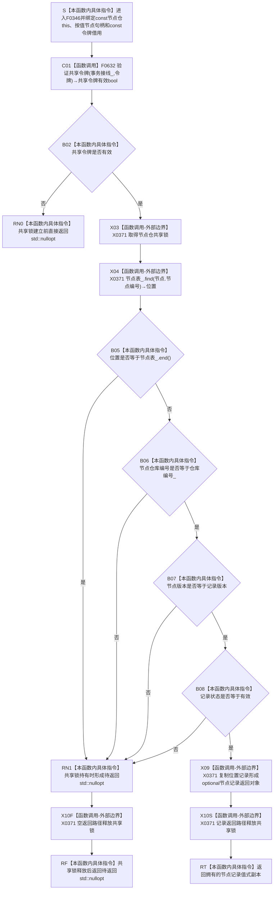

# CF-L6-0025 `节点仓库::读取节点` 令牌重载现状流程图

图类型：现状流程图
代码版本：`a48a70b2d678dea64dd8228adb4f26f0badd9506`
覆盖文件：`海中鱼巣/核心/节点仓库.cpp:250-256`
唯一根函数：F0346
完整签名：`std::optional<海中鱼巣::节点记录> 海中鱼巣::节点仓库::读取节点(海中鱼巣::节点句柄 节点, const 海中鱼巣::结构事务令牌& 令牌) const`
参数：`节点` 按值；`令牌` 是调用方拥有且调用期有效的 const 非拥有借用；隐式 `this` 是 const 节点仓库借用
返回结果：令牌、节点编号、仓库编号、版本和有效状态全部匹配时返回节点记录值式副本，否则返回 `std::nullopt`
非法值 / 拒绝：无效令牌、节点不存在、错仓、错版本或非有效状态均折叠为 `nullopt`
已登记调用方：F0167、F0190、F0239，共 3 个函数、8 条调用边
直接项目函数：F0632 `{匿名命名空间@节点仓库.cpp}::验证共享令牌`
外部边界：X0371 共享锁、节点表查找 / 比较 / 迭代器读取、optional 空值 / 值式复制与 RAII 析构
未解析项目调用：F0632 内的 U0010 共享令牌验证函数指针，不是 F0346 的直接出边
调用图：`流程图/代码流程图/00_调用知识图谱.md`
逐行映射表：`流程图/代码流程图/L6/CF-L6-0025_节点仓库读取节点令牌重载_逐行代码映射表.md`
输入契约 / 调用语境表：本文“调用语境与非成功分账”
非成功返回二分审查表：本文“调用语境与非成功分账”
偏差清单：`流程图/代码流程图/00_规范偏差审计.md` 的 F0346 切片
依据提交 / 结构化消息：冻结源码提交 `a48a70b2d678dea64dd8228adb4f26f0badd9506`；当前 HEAD 的目标源码 blob 相同；正式 Clang C++ 候选与逐行源码复核
入口前置：节点仓库和令牌借用存活；调用方根据自身语境决定 `nullopt` 是合法拒绝还是内部不一致
结构读取与写入：验证共享令牌后持有仓库共享锁读取节点表，并在锁内复制记录；零写入、零候选、零发布
逻辑内返回：普通外部 / 候选读取的令牌或句柄不匹配，在第一笔写入前返回 `nullopt`
内部错误：强前置已保证同代次有效节点或关系端点时仍返回 `nullopt`
生命周期与资源释放：返回值拥有节点记录副本；锁在返回对象物化后释放；不延长仓库或令牌生命周期
异常：未声明 `noexcept`；锁取得、表操作或记录复制异常可传播，RAII 释放已构造共享锁
并发 / 幂等：共享锁保证单次表读取一致；相同仓库状态和令牌下重复调用确定、零写；返回后副本不随仓库变化
验证入口：节点仓源码 blob `f38b979a3f7cefd182a50e0b687c5a6fffebc91c`、250—256 行、8 条入边、E1801 与 X0371
验证输出：Clang C++ 候选 `节点仓库.cpp: 32 functions / 278 calls / 8 file-level unresolved / 0 diagnostics`；本批不运行构建或程序
依据：`规范/0050_项目通用机器逻辑与禁止性规则总纲_20260721.md`、`规范/0600_代码函数流程图应用与维护规范.md`、`规范/4010_子规范_统一仓库稳定句柄与通用关系索引边界.md`、`规范/4040_子规范_不透明结构事务候选确认撤销与最后发布.md`、`规范/4050_子规范_入口拒绝逻辑内结果与内部逻辑错误.md`
不得作为施工许可：是
不得宣称：`nullopt` 已具名区分失败原因、旧节点记录符合节点直接身份规范，或读取得到跨调用冻结快照

## 流程图

## 直接被调函数

| 被调函数 | 调用边 | 条件 | 被调图 |
| --- | --- | --- | --- |
| F0632 | E1801 | 函数进入 | 待生成 |

## 已登记调用方

| 调用方 | 调用边 | 位置 / 语境 | 调用方图 |
| --- | --- | --- | --- |
| F0167 | E0664、E0666、E0668、E0670、E0672、E0674 | `关系仓库.cpp:206/207/213/214/221/222`；已有当前关系令牌 | [F0167](../L5/CF-L5-0047_创建关系_现状流程图.md) |
| F0190 | E0774 | `节点仓库.cpp:236`；普通读取取得共享许可 | [F0190](../L5/CF-L5-0070_节点仓库读取节点_现状流程图.md) |
| F0239 | E0925 | `启动.运行期上下文.ixx:69`；结构核心完整性探测 | [F0239](../L5/CF-L5-0115_运行期上下文结构核心完整_现状流程图.md) |

## 调用语境与非成功分账

| 调用语境 | 上游保证 | `nullopt` 口径 | 二分口径 | 后继 |
| --- | --- | --- | --- | --- |
| 普通节点读取 | 外部 / 候选句柄 | 令牌、编号、仓库、版本或状态不匹配 | 写前逻辑内结果 | 调用方返回空值 |
| F0167 类型准入读取 | 端点节点刚通过 F0343，但不持有跨调用快照 | 可能并发失效或语境不一致 | 依后继是否强前置分账 | 关系类型专用拒绝或追根因 |
| F0239 结构核心探测 | 传入空节点句柄 | 预期空结果 | 合法探测结果 | 只证明拒绝边界工作 |
| 内部完整记录读回 | 已有同代次强前置 | 任一空结果 | 内部结构错误 | 不得静默解释为候选为空 |

## 当前偏差与边界

- 当前 `节点记录` 仍含旧主信息锚点且缺少 4010 要求的稳定主键直接字段；值式复制忠实反映旧实现，不证明符合现行节点直接身份规范。
- `nullopt` 折叠令牌、节点编号、仓库、版本和状态五类原因；它是封闭仓库读取结果，不是公开强类型领域错误。
- 单次共享锁内读取一致，但调用前后仓库可变化；调用方不得组合多次读取为同一冻结快照。
