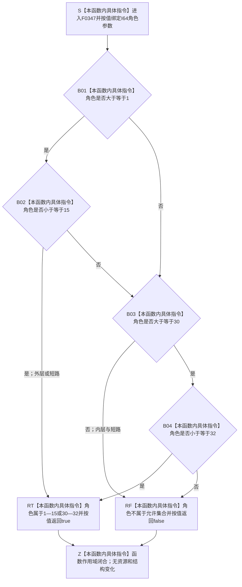

# CF-L6-0026 `用途观察角色有效` 现状流程图

图类型：现状流程图
代码版本：`a48a70b2d678dea64dd8228adb4f26f0badd9506`
覆盖文件：`海中鱼巣/核心/关系仓库.cpp:17-19`
唯一根函数：F0347
完整签名：`bool 海中鱼巣::{匿名命名空间@关系仓库.cpp}::用途观察角色有效(std::int64_t 角色)`
参数：`角色` 按值传入，为有符号 I64；无借用、所有权或资源转移
返回结果：`角色` 位于闭区间 `1—15` 或 `30—32` 时按值返回 `true`，其它 I64 值返回 `false`
非法值 / 拒绝：`INT64_MIN—0`、`16—29`、`33—INT64_MAX` 均返回 `false`
已登记调用方：F0167 的 E0676
直接项目函数：无
外部边界：无
未解析项目调用：无
调用图：`流程图/代码流程图/00_调用知识图谱.md`
逐行映射表：`流程图/代码流程图/L6/CF-L6-0026_用途观察角色有效_逐行代码映射表.md`
输入契约 / 调用语境表：本文“调用语境与非成功分账”
非成功返回二分审查表：本文“调用语境与非成功分账”
偏差清单：无本函数偏差；F0348 与 F0167 的后继端点 / 基数偏差另行登记
依据提交 / 结构化消息：冻结源码提交 `a48a70b2d678dea64dd8228adb4f26f0badd9506`；当前 HEAD 的目标源码 blob 相同；Clang C++ 候选与逐行源码复核
入口前置：F0167 仅在关系类型为用途观察证据角色时传入关系顺序号；本函数自身接受完整 I64 值域
结构读取与写入：只比较按值参数，不读取或写入节点、关系、索引、用途观察或领域事实
逻辑内返回：未知或保留角色值写前返回 `false`，调用方返回空关系句柄且零关系写入
内部错误：无；正式 4330 当前角色集合与实现集合一致
生命周期与资源释放：无借用、分配、锁、释放或生命周期延长
异常：未声明 `noexcept`；当前仅有内建整数比较和布尔短路，不分配、不抛出
并发 / 幂等：纯值、确定、可重入；相同输入重复调用结果一致
验证入口：源码 blob `f7a9ea9a09d3065468208c16f9ea34f806b6e183`、17—19 行、E0676
验证输出：Clang C++ 候选 `关系仓库.cpp: 79 functions / 1332 calls / 26 file-level unresolved / 0 diagnostics`；F0347 项目调用 `0`、外部边界 `0`、未解析 `0`；本批不运行构建或程序
依据：`规范/0050_项目通用机器逻辑与禁止性规则总纲_20260721.md`、`规范/0600_代码函数流程图应用与维护规范.md`、`规范/4010_子规范_统一仓库稳定句柄与通用关系索引边界.md`、`规范/4050_子规范_入口拒绝逻辑内结果与内部逻辑错误.md`、`规范/4330_子规范_因果用途观察证据账与阶段推进.md`
不得作为施工许可：是
不得宣称：返回 `true` 已证明端点、唯一性、阶段、用途观察账或关系结构完整

## 流程图

## 已登记调用方

| 调用方 | 调用边 | 位置 / 前置 | 调用方图 |
| --- | --- | --- | --- |
| F0167 | E0676 | `关系仓库.cpp:223`；关系类型为用途观察证据角色 | [F0167](../L5/CF-L5-0047_创建关系_现状流程图.md) |

## 调用语境与非成功分账

| 调用语境 | 输入范围 | `false` 精确含义 | 二分口径 | 后继 |
| --- | --- | --- | --- | --- |
| F0167 用途观察关系创建 | 外部或候选 I64 顺序号 | 不属于 `1—15、30—32` | 写前逻辑内拒绝 | 返回空关系句柄；F0348 不执行 |
| 已知角色 | `1—15、30—32` | 不可发生 | 不适用 | 继续读取源 / 目标记录并调用 F0348 |

## 当前边界

- 本函数只裁决角色数值集合，不裁决角色所需目标类型、源是否为用途观察记录、同源同角色唯一性或阶段转换。
- F0167 依赖 C++ `||` 短路：F0347 返回 `false` 后不会读取后继条件或调用 F0348。
- 4330 当前允许集合与本函数一致；这不证明 F0167 的完整用途观察专用写入合同已经实现。
