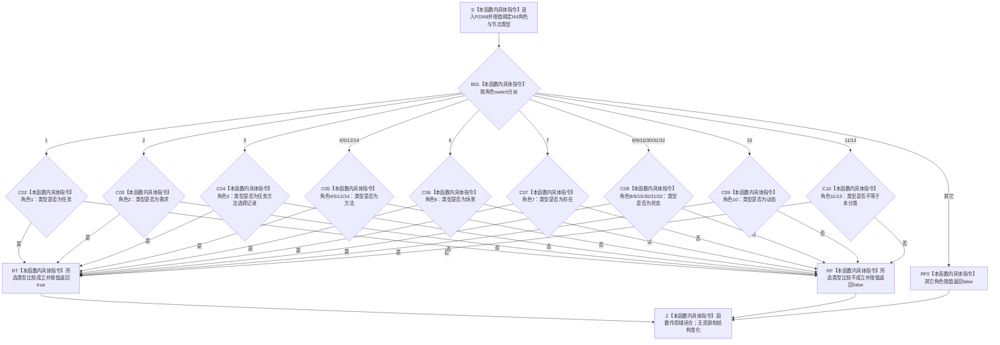

# CF-L6-0027 `用途观察目标类型有效` 现状流程图

图类型：现状流程图
代码版本：`a48a70b2d678dea64dd8228adb4f26f0badd9506`
覆盖文件：`海中鱼巣/核心/关系仓库.cpp:21-43`
唯一根函数：F0348
完整签名：`bool 海中鱼巣::{匿名命名空间@关系仓库.cpp}::用途观察目标类型有效(std::int64_t 角色, 海中鱼巣::节点类型 类型)`
参数：`角色` 与 `类型` 均按值传入；无借用、所有权或资源转移
返回结果：按角色分组比较目标节点类型并返回布尔值；角色 11 / 13 仅要求 `类型 != 未分类`
非法值 / 拒绝：未知角色返回 `false`；固定等值分组中的错误或未知节点类型返回 `false`；角色 11 / 13 会错误接受除 `未分类` 外的已知错误类型和未知枚举值
已登记调用方：F0167 的 E0677
直接项目函数：无
外部边界：无
未解析项目调用：无
调用图：`流程图/代码流程图/00_调用知识图谱.md`
逐行映射表：`流程图/代码流程图/L6/CF-L6-0027_用途观察目标类型有效_逐行代码映射表.md`
输入契约 / 调用语境表：本文“调用语境与非成功分账”
非成功返回二分审查表：本文“调用语境与非成功分账”
偏差清单：`流程图/代码流程图/00_规范偏差审计.md` 的 F0348 切片
依据提交 / 结构化消息：冻结源码提交 `a48a70b2d678dea64dd8228adb4f26f0badd9506`；当前 HEAD 的目标源码 blob 相同；Clang C++ 候选与逐行源码复核
入口前置：F0167 已确认 F0347 返回 `true`、源记录存在且类型为用途观察记录、目标记录存在；因此当前唯一调用只传角色 `1—15、30—32`
结构读取与写入：只比较两个按值参数，不读取或写入节点、关系、动态、状态或用途观察事实
逻辑内返回：角色与固定目标类型不匹配时写前返回 `false`
内部错误：角色 11 / 13 接受错误已知类型或未知枚举；完整当前目标与动态两端语义无法由本函数两个值参数验证
生命周期与资源释放：无借用、分配、锁、释放或生命周期延长
异常：未声明 `noexcept`；当前仅有 `switch`、内建枚举比较和按值返回，不分配、不抛出
并发 / 幂等：纯值、确定、可重入；相同输入重复调用结果一致
验证入口：源码 blob `f7a9ea9a09d3065468208c16f9ea34f806b6e183`、21—43 行、E0677
验证输出：Clang C++ 候选 `关系仓库.cpp: 79 functions / 1332 calls / 26 file-level unresolved / 0 diagnostics`；F0348 项目调用 `0`、外部边界 `0`、未解析 `0`；本批不运行构建或程序
依据：`规范/0050_项目通用机器逻辑与禁止性规则总纲_20260721.md`、`规范/0600_代码函数流程图应用与维护规范.md`、`规范/4010_子规范_统一仓库稳定句柄与通用关系索引边界.md`、`规范/4050_子规范_入口拒绝逻辑内结果与内部逻辑错误.md`、`规范/4210_子规范_动态信息分层获取与聚合_20260720.md`、`规范/4330_子规范_因果用途观察证据账与阶段推进.md`
不得作为施工许可：是
不得宣称：返回 `true` 已证明目标当前、动态角色、动作入口方法身份、用途观察结构或关系合法

## 流程图

## 已登记调用方

| 调用方 | 调用边 | 位置 / 前置 | 调用方图 |
| --- | --- | --- | --- |
| F0167 | E0677 | `关系仓库.cpp:225`；F0347 成立、源为用途观察记录且目标记录存在 | [F0167](../L5/CF-L5-0047_创建关系_现状流程图.md) |

## 角色与当前目标类型

| 角色 | 当前实现允许 | 正式合同边界 |
| --- | --- | --- |
| 1 / 2 / 3 | 任务 / 需求 / 任务方法选择记录 | 粗类型一致 |
| 4 / 5 / 12 / 14 | 方法 | 5 / 12 / 14 还要求动作入口方法身份，本函数不验证 |
| 6 / 7 | 场景 / 存在 | 粗类型一致 |
| 8 / 9 / 15 / 30 / 31 / 32 | 状态 | 阶段与同目标一致性由后继结构合同承担 |
| 10 | 动态 | 粗类型一致 |
| 11 / 13 | 任何非未分类节点类型 | 4210 / 4330 要求动态合同允许的完整当前被改变目标，当前实现过宽 |

## 调用语境与非成功分账

| 调用语境 | 输入范围 | `false` 精确含义 | 二分口径 | 后继 |
| --- | --- | --- | --- | --- |
| F0167 固定等值角色 | F0347 已接受的角色和当前目标记录类型 | 类型与粗映射不匹配 | 写前逻辑内拒绝 | 返回空关系句柄 |
| F0167 角色 11 / 13 | 完整节点类型值域 | 仅当类型为未分类时拒绝 | 原因折叠 / 实现偏差 | 错误已知类型或未知枚举仍可能继续 |
| 未知角色 | 当前调用语境不可达 | `switch default` 返回 `false` | 防御性逻辑内拒绝 | 零结构变化 |

## 当前偏差与边界

- 角色 11 / 13 的 `类型 != 未分类` 会接受任务、需求、场景等错误已知类型，也会接受未知节点类型枚举值。
- 4210 将动态被改变目标收紧为特征或特征值；4330 还要求原因 / 结果动态合同允许的完整当前目标，本函数无法凭两个值参数验证。
- F0167 的后继一致性检查覆盖角色 `9↔30/31` 与 `15↔32`，但不补齐角色 11 / 13 的完整动态目标合同。
- 本图只登记现状偏差，不形成代码计划或代码修改许可。
