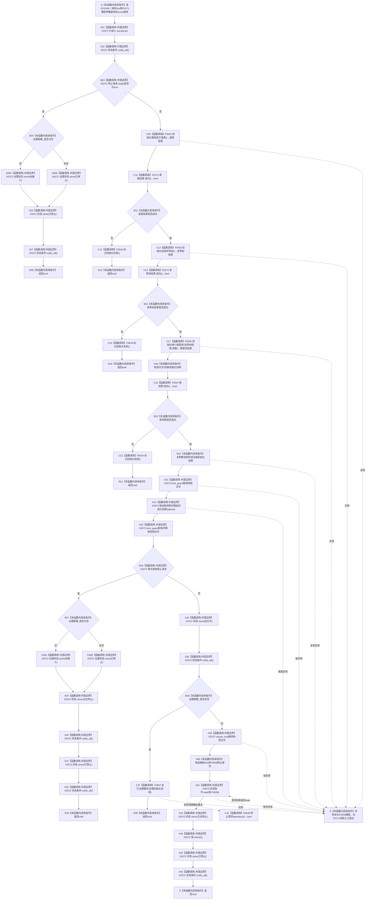

# CF-L6-0028 `自我线程::执行初始化` 现状流程图

图类型：现状流程图
代码版本：`a48a70b2d678dea64dd8228adb4f26f0badd9506`
覆盖文件：`海中鱼巣/线程/自我线程.ixx:291-350`
唯一根函数：F0349
完整签名：`void 海中鱼巣::自我线程::执行初始化(const 海中鱼巣::自我根需求初始化参数& 参数)`
参数：隐式 `this` 是工作线程入口对当前自我线程对象的非拥有借用；宿主生命周期必须覆盖工作线程并在对象析构前完成 `join`；`参数` 是对 F0171 closure 自有参数副本的 const 非拥有借用，调用期有效
返回结果：返回 `void`；结果经线程状态、治理状态、初始化快照、条件通知及被调初始化服务的机器事实间接表达
非法值 / 拒绝：参数已由 F0044 / F0061 前置验证；函数自身不重复验证。初始化前或快照发布后收到停止请求时按线程生命周期返回
已登记调用方：F0171 的 E0678
直接项目函数：F0633、F0173、F0634、F0635、F0174、F0636、F0047、F0637、F0638，共 9 个唯一函数、11 条调用边
外部边界：X0372，聚合 23 个原子、条件变量、锁、移动和 optional 生命周期调用
未解析项目调用：无
调用图：`流程图/代码流程图/00_调用知识图谱.md`
逐行映射表：`流程图/代码流程图/L6/CF-L6-0028_自我线程执行初始化_逐行代码映射表.md`
输入契约 / 调用语境表：本文“调用语境与非成功分账”
非成功返回二分审查表：本文“调用语境与非成功分账”
偏差清单：`流程图/代码流程图/00_规范偏差审计.md` 的 F0349 切片
依据提交 / 结构化消息：冻结源码提交 `a48a70b2d678dea64dd8228adb4f26f0badd9506`；当前目标源码 blob 相同；MSVC 模块依赖与 Clang AST 候选、逐行源码复核
入口前置：F0171 由成功创建的唯一工作线程调用；F0061 已验证参数、线程状态和治理依赖配对
结构读取与写入：F0349 自身写线程 / 治理原子状态和非权威初始化快照；机器事实写入由三个初始化服务承担
逻辑内返回：初始化前停止、完整快照发布后停止，以及治理循环正常返回后的 `void` 收口
内部错误：初始化服务或快照完整性在正式启动前置成立后失败；任何异常逸出；无邮箱等待丢通知；跨阶段半完成无法补偿
生命周期与资源释放：初始化快照锁内移动发布；治理循环使用值式快照副本；所有服务、邮箱、处理器和同步成员必须覆盖工作线程生命周期
异常：未声明 `noexcept` 且不捕获；项目服务、快照复制 / 赋值、锁、等待或治理循环异常会越过 F0171 的线程顶层并触发 `std::terminate`
并发 / 幂等：仅由一次成功启动创建的工作线程调用；状态原子默认 `seq_cst`，但多个原子不是一致快照；快照由 `快照互斥` 保护
验证入口：源码 blob `33a355deebc02a2d9eb370a5003312415125210c`、291—350 行、E0678、E1833—E1843、X0372
验证输出：MSVC `157 modules / 0 failures / 0 cycles / 0 missing providers`；Clang `6-module closure / 24 functions / 165 calls / 0 unresolved / 0 diagnostics`，F0349 范围内 61 个候选节点；本批不运行构建或程序
依据：`规范/0050_项目通用机器逻辑与禁止性规则总纲_20260721.md`、`规范/0600_代码函数流程图应用与维护规范.md`、`规范/4050_子规范_入口拒绝逻辑内结果与内部逻辑错误.md`、`规范/8100_子规范_自我线程与任务管理线程权责边界_20260720.md`、`规范/8110_子规范_线程生命周期状态上报与控制面板线程信息_20260720.md`、`规范/8120_子规范_程序入口启动模式与运行宿主边界_20260726.md`
不得作为施工许可：是
不得宣称：三个初始化阶段原子发布、异常安全、治理循环完整、安全 / 服务维护闭环、自我苏醒或线程生命周期事实已经符合现行规范

## 流程图

## 直接被调函数

| 被调函数 | 调用边 | 条件 | 被调图 |
| --- | --- | --- | --- |
| F0633 | E1833 | 首次停止请求为假 | 待生成 |
| F0173 | E1834 | F0633 返回后 | [F0173](../L5/CF-L5-0053_语素初始化结果成功_现状流程图.md) |
| F0634 | E1835 / E1838 / E1841 | 语素 / 世界树 / 完整快照失败 | 待生成 |
| F0635 | E1836 | 语素结果成功 | 待生成 |
| F0174 | E1837 | F0635 返回后 | [F0174](../L5/CF-L5-0054_世界树初始化结果成功_现状流程图.md) |
| F0636 | E1839 | 世界树结果成功 | 待生成 |
| F0047 | E1840 | 根需求结果返回并构造新快照后 | [F0047](../L4/CF-L4-0011_自我线程初始化快照_成功_现状流程图.md) |
| F0637 | E1842 | 快照已发布、无停止请求且治理邮箱非空 | 待生成 |
| F0638 | E1843 | 无治理邮箱路径中 `condition_variable::wait` 初检或唤醒后 | 待生成 |

## 已登记调用方

| 调用方 | 调用边 | 位置 / 前置 | 调用方图 |
| --- | --- | --- | --- |
| F0171 | E0678 | `自我线程.ixx:205`；工作线程入口执行 | [F0171](../L5/CF-L5-0051_自我线程启动lambda_现状流程图.md) |

## 调用语境与非成功分账

| 调用语境 | 当前结果 | 二分口径 | 结构 / 生命周期后果 |
| --- | --- | --- | --- |
| 进入前已经收到停止 | 写未接入 / 已停止治理状态和已停止线程状态后返回 | 合法线程生命周期返回 | 不调用三个初始化服务 |
| 语素、世界树或完整快照失败 | 调 F0634 后返回 | 正式启动前置成立后的初始化失败 / 内部错误 | 前序服务已经发布的机器事实不统一补偿 |
| 完整快照发布后收到停止 | 依次写正在停止、已停止并返回 | 合法线程生命周期返回 | 初始化快照仍保留 |
| 有治理邮箱 | 写运行中后调用 F0637；其返回后 F0349 返回 | 由 F0637 状态合同裁决 | F0349 不自行宣称治理完成 |
| 无治理邮箱 | 等待 F0638 观察停止请求，再写正在停止 / 已停止 | 合法驻留 / 停止路径 | 存在丢通知导致永久等待风险 |
| 任一异常 | 向 F0171 线程顶层逸出 | 内部错误 | `std::terminate`，没有结构化失败材料 |

## 当前偏差与边界

- 343—345 行在持有 `快照互斥` 的等待方中使用谓词等待，但停止写方不持同一互斥；通知可落在谓词检查与真正阻塞之间并永久丢失。
- F0349 与 F0171 均不捕获异常；初始化服务、快照复制 / 赋值、锁、等待或治理循环异常会触发线程顶层终止。
- 语素成功后世界树或根需求失败只写统一初始化失败状态，不对前序已发布机器事实建立跨阶段事务或补偿。
- 三个初始化结果失败和快照不完整全部折叠为同一状态；治理状态与线程状态分别写入，不构成一致快照。
- 当前只维护内部原子状态和条件通知，没有形成 8110 要求的线程逻辑身份、事件版本、发生时间、前后状态和异常原因材料。
- 当前代码实际按语素 → 世界树 → 两个根需求顺序调用三个初始化服务；8120 只要求后继等待并取得包含三类结果的完整快照。F0349 只编排领域服务且不裸写核心仓库。
