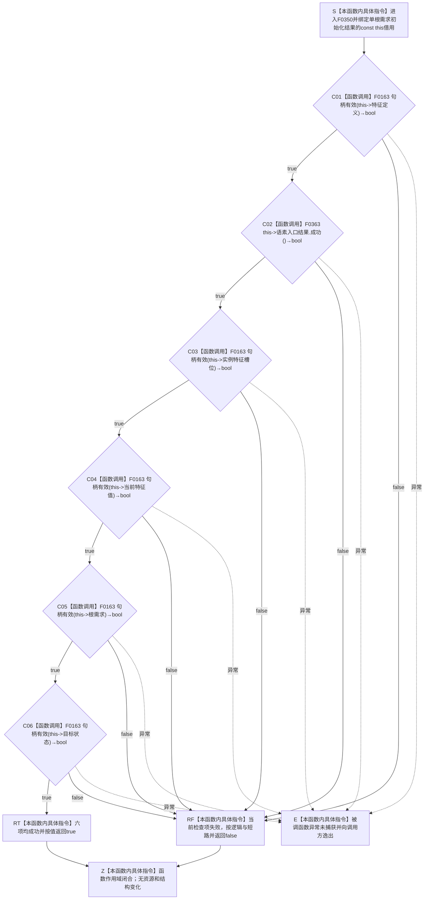

# CF-L6-0029 `单根需求初始化结果::成功` 现状流程图

图类型：现状流程图
代码版本：`a48a70b2d678dea64dd8228adb4f26f0badd9506`
覆盖文件：`海中鱼巣/领域/初始化.需求.ixx:47-54`
唯一根函数：F0350
完整签名：`bool 海中鱼巣::单根需求初始化结果::成功() const`
参数：无显式参数；隐式 `this` 是对调用方持有的 `单根需求初始化结果` 的只读、非拥有借用，调用期有效
返回结果：按源码顺序检查特征定义句柄、语素入口创建结果、实例特征槽位句柄、当前特征值句柄、根需求句柄和目标状态句柄；六项均成功时按值返回 `true`，首项失败时短路返回 `false`
非法值 / 拒绝：任一节点句柄为零仓库编号、零节点编号或零版本，或语素入口结果自身不成功时返回 `false`；本函数不形成具名拒绝原因
已登记调用方：F0175 的 E0703 / E0704；F0551 的 E1248
直接项目函数：F0163 `句柄有效(const 节点句柄&)` 五个调用点；F0363 `语素概念入口创建结果::成功() const` 一个调用点
外部边界：无
未解析项目调用：无
调用图：`流程图/代码流程图/00_调用知识图谱.md`
逐行映射表：`流程图/代码流程图/L6/CF-L6-0029_单根需求初始化结果成功_逐行代码映射表.md`
输入契约 / 调用语境表：本文“调用语境与非成功分账”
非成功返回二分审查表：本文“调用语境与非成功分账”
偏差清单：本文“当前边界与规范核对”
依据提交 / 结构化消息：冻结源码提交 `a48a70b2d678dea64dd8228adb4f26f0badd9506`；当前 HEAD 的目标源码 blob 相同；源码 blob `8b2bd4e4d44b747d661d82401db6aea5901c67da`；MSVC 模块候选 AST 与逐行源码复核
入口前置：调用方已经持有一个值式 `单根需求初始化结果`；本函数不要求仓库、许可、锁或事务语境
结构读取与写入：只读取 `this` 内六个结果字段并调用纯读取谓词；不写节点、关系、索引、特征、状态、需求或其它机器事实
逻辑内返回：任一局部结果字段不完整时返回 `false`，零结构变化
内部错误：本函数无法凭局部布尔值区分候选未形成、上游写后读回不一致或已经发布的结构损坏；具体调用语境须由调用方按上游合同分类
生命周期与资源释放：无分配、锁、局部所有资源或生命周期延长
异常：未声明 `noexcept` 且不捕获；六个被调函数若异常则直接向调用方逸出。当前 F0163 实现只有值比较，但签名未冻结不抛出保证
并发 / 幂等：只读、确定、可重入；调用方若并发改写同一结果对象则超出本函数合同，相同稳定值重复调用结果一致
验证入口：`初始化.需求.ixx:47-54`、E0703 / E0704 / E1248、E1844—E1849、F0163 / F0363
验证输出：临时候选 `海中鱼巣-F0350-F0355-模块候选.json` 基线与源码一致；F0350 含一个返回表达式、五级 `&&` 短路、六个项目调用候选；本批不运行构建或程序
依据：`规范/0050_项目通用机器逻辑与禁止性规则总纲_20260721.md`、`规范/0600_代码函数流程图应用与维护规范.md`、`规范/3100_根规范_需求_20260720.md`、`规范/4010_子规范_统一仓库稳定句柄与通用关系索引边界.md`、`规范/4050_子规范_入口拒绝逻辑内结果与内部逻辑错误.md`、`规范/4110_子规范_特征节点实现与字段边界_20260720.md`、`规范/4210_子规范_动态信息分层获取与聚合_20260720.md`
不得作为施工许可：是
不得宣称：返回 `true` 已证明节点类型、当前版本、关系 19 / 22、需求完整目标、语素入口完整读回或任一权威结构已经发布

## 流程图

## 直接被调函数

| 被调函数 | 当前调用点 | 参数 / 结果 | 被调图 |
| --- | --- | --- | --- |
| F0163 | `初始化.需求.ixx:48` | `this->特征定义` → bool | [F0163](../L5/CF-L5-0044_节点句柄有效_现状流程图.md) |
| F0363 | `初始化.需求.ixx:49` | `this=&语素入口结果` → bool | 待生成 |
| F0163 | `初始化.需求.ixx:50` | `this->实例特征槽位` → bool | [F0163](../L5/CF-L5-0044_节点句柄有效_现状流程图.md) |
| F0163 | `初始化.需求.ixx:51` | `this->当前特征值` → bool | [F0163](../L5/CF-L5-0044_节点句柄有效_现状流程图.md) |
| F0163 | `初始化.需求.ixx:52` | `this->根需求` → bool | [F0163](../L5/CF-L5-0044_节点句柄有效_现状流程图.md) |
| F0163 | `初始化.需求.ixx:53` | `this->目标状态` → bool | [F0163](../L5/CF-L5-0044_节点句柄有效_现状流程图.md) |

## 已登记调用方

| 调用方 | 调用边 | 位置 / 前置 | 调用方图 |
| --- | --- | --- | --- |
| F0175 | E0703 | `初始化.需求.ixx:63`；函数进入，检查安全根需求 | [F0175](../L5/CF-L5-0055_自我根需求初始化结果成功_现状流程图.md) |
| F0175 | E0704 | `初始化.需求.ixx:63`；安全根需求成功后检查服务根需求 | [F0175](../L5/CF-L5-0055_自我根需求初始化结果成功_现状流程图.md) |
| F0551 | E1248 | `自检.入口初始化.ixx:406`；单根读回自检局部函数取得材料 | 待生成 |

## 调用语境与非成功分账

| 调用语境 | `false` 精确含义 | 二分口径 | 结构后果 |
| --- | --- | --- | --- |
| F0175 汇总安全 / 服务根需求结果 | 当前单根结果至少一项局部完整性谓词失败 | 局部结果返回；上游初始化前置成立且已经写入时由调用方继续判定内部错误 | 本函数零写入 |
| F0551 自检读回 | 当前自检取得的单根材料至少一项局部完整性谓词失败 | 自检失败证据，不自动成为业务拒绝 | 本函数零写入 |
| 稳定完整值重复检查 | 不应发生 | 若上游承诺完整则追查上游结果或结构读回 | 本函数零写入 |

## 当前边界与规范核对

- 本函数严格按源码字段顺序执行短路，失败后的后继项目函数不调用。
- F0163 只证明句柄三个组成部分非零；F0363 也只是下一级结果谓词。返回 `true` 不复核节点类型、版本当前性、宿主—槽位—模板—当前值关系、需求单目标结构或状态完整事实。
- 3100、4110、4210 和 4010 要求权威完成由节点、关系、领域记录及当前版本读回共同成立；本布尔值只能作为调用期 DTO 完整性投影，不能替代权威读回。
- 裸 `false` 折叠六种失败位置；当前函数作为封闭局部谓词保留该实现事实，不能被公开边界用于宣称具名失败已经表达。
