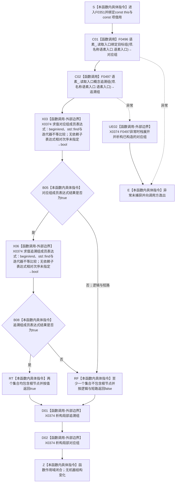

# CF-L6-0030 `概念图初始化服务::名称关系可读` 现状流程图

图类型：现状流程图
代码版本：`a48a70b2d678dea64dd8228adb4f26f0badd9506`
覆盖文件：`海中鱼巣/领域/初始化.概念图.ixx:212-217`
唯一根函数：F0351
完整签名：`bool 海中鱼巣::概念图初始化服务::名称关系可读(const 海中鱼巣::概念根初始化项& 项) const`
参数：显式 `项` 是调用方持有的 `概念根初始化项` 的只读、非拥有借用；隐式 `this` 是对当前初始化服务的只读、非拥有借用；两者均须覆盖调用期
返回结果：先无条件读取入口绑定目标完整组和入口概念追溯完整组；仅当 `项.根节点` 同时存在于两组中时按值返回 `true`，否则返回 `false`
非法值 / 拒绝：本函数不单独校验语素入口或根节点句柄；无效、未命中或读取为空最终都折叠为 `false`
已登记调用方：F0176 的 E0707；F0183 的 E0759 / E0762
直接项目函数：F0496 `语素服务::读取入口绑定目标组`；F0497 `语素服务::读取入口概念追溯组`
外部边界：X0374，聚合两次 `std::find`、配套 vector `begin/end`、迭代器比较及两个局部 vector 的正常 / 异常生命周期
未解析项目调用：无
调用图：`流程图/代码流程图/00_调用知识图谱.md`
逐行映射表：`流程图/代码流程图/L6/CF-L6-0030_概念图初始化服务名称关系可读_逐行代码映射表.md`
输入契约 / 调用语境表：本文“调用语境与非成功分账”
非成功返回二分审查表：本文“调用语境与非成功分账”
偏差清单：本文“当前边界与规范核对”
依据提交 / 结构化消息：冻结源码提交 `a48a70b2d678dea64dd8228adb4f26f0badd9506`；当前 HEAD 的目标源码 blob 相同；源码 blob `ca49bf639f94b85ec9dfcdb5f0d2c1f52a13583f`；MSVC 模块候选 AST 与逐行源码复核
入口前置：当前生产调用来自 F0176 / F0183；相邻调用方分别先确认根项成功或名称材料成功，本函数自身仍接受任意值式项
结构读取与写入：经语素服务读取关系 7 / 8 的值式目标集合，只进行成员判断；不写节点、关系、索引、语素入口、概念或活动投影
逻辑内返回：任一组不包含根节点时返回 `false`，零结构变化
内部错误：调用方已承诺名称关系完整时的缺项、读取异常或集合与权威关系不一致须由调用方追根因；本函数裸布尔值不能区分未命中与内部不一致
生命周期与资源释放：拥有两个局部 `std::vector<节点句柄>` 值；返回前按逆序析构追溯组和对应组。`项`、`this` 及其成员均不取得所有权
异常：未声明 `noexcept` 且不捕获；F0496 / F0497 或值式 vector 构造若异常则进行已构造局部量的栈展开后向调用方逸出。当前 `std::find` 与有效 vector 迭代器操作不产生项目异常合同
并发 / 幂等：函数自身只读；两次服务读取不是同一原子快照，若并发关系版本变化，两个组可能来自不同观察时点。相同稳定关系集合重复调用结果一致
验证入口：`初始化.概念图.ixx:212-217`、E0707 / E0759 / E0762、E1850 / E1851、F0496 / F0497、X0374
验证输出：临时候选 `海中鱼巣-F0350-F0355-模块候选.json` 基线与源码一致；F0351 含两次项目成员调用、两次标准库查找和一个 `&&` 短路返回；本批不运行构建或程序
依据：`规范/0050_项目通用机器逻辑与禁止性规则总纲_20260721.md`、`规范/0600_代码函数流程图应用与维护规范.md`、`规范/2210_根规范_语素入口_20260720.md`、`规范/4010_子规范_统一仓库稳定句柄与通用关系索引边界.md`、`规范/4050_子规范_入口拒绝逻辑内结果与内部逻辑错误.md`、`规范/7140_子规范_概念身份生命周期退役删除与活动投影分账.md`、`规范/7200_子规范_基础信息语素信息关系整合_20260720.md`
不得作为施工许可：是
不得宣称：返回 `true` 已证明入口所属词、入口角色、上下文、版本、索引、概念根稳定身份、生命周期或完整概念结构成立

## 流程图

## 直接被调函数

| 被调函数 | 当前调用点 | 参数 / 结果 | 被调图 |
| --- | --- | --- | --- |
| F0496 | `初始化.概念图.ixx:213` | `this=&语素_`、`项.名称语素入口.语素入口` → 值式对应组 | 待生成 |
| F0497 | `初始化.概念图.ixx:214` | `this=&语素_`、`项.名称语素入口.语素入口` → 值式追溯组 | 待生成 |

## 已登记调用方

| 调用方 | 调用边 | 位置 / 前置 | 调用方图 |
| --- | --- | --- | --- |
| F0176 | E0707 | `初始化.概念图.ixx:224`；当前根项成功 | [F0176](../L5/CF-L5-0056_概念图初始化服务根结构仍可读_现状流程图.md) |
| F0183 | E0759 | `初始化.概念图.ixx:178`；已有名称材料成功 | [F0183](../L5/CF-L5-0063_概念图初始化服务确保根名称_现状流程图.md) |
| F0183 | E0762 | `初始化.概念图.ixx:182`；新名称材料成功 | [F0183](../L5/CF-L5-0063_概念图初始化服务确保根名称_现状流程图.md) |

## 调用语境与非成功分账

| 调用语境 | `false` 精确含义 | 二分口径 | 结构后果 |
| --- | --- | --- | --- |
| F0183 复用既有名称材料 | 对应组或概念追溯组不包含当前根节点 | 前置已称材料成功时由 F0183 的追根因检查收口 | 本函数零写入 |
| F0183 新建名称关系后读回 | 对应组或概念追溯组不包含当前根节点 | 写后读回不一致，属于调用方内部错误路径 | 本函数零写入 |
| F0176 完整根结构复核 | 当前根的任一名称关系集合缺少根节点 | 根项已成功后的结构缺项，由调用方返回失败并继续上层分类 | 本函数零写入 |
| 任意未承诺项 | 无效入口、无效根、合法未命中和结构缺项被折叠 | 当前局部布尔结果，不能单独裁决原因 | 本函数零写入 |

## 当前边界与规范核对

- 两个关系读取在任何成员判断前无条件完成；对应组未命中时只短路第二次 `std::find`，不会撤销已经完成的追溯组读取。
- 4010 明确关系 7 / 8 是集合 / 图读取语义；当前函数使用完整值式组和成员查找，没有静默选择首项。
- 2210 / 7200 要求正式语素入口完整读回还包括所属词、入口角色、入口类型、上下文、版本及全部关系。本函数名称和行为只核对根节点同时属于对应与概念追溯集合，返回 `true` 不能扩大为完整入口成立。
- 7140 要求概念根由固定稳定主键、完整句柄和本类结构共同成立；名称及这两条语素关系都不能单独证明概念根身份。
- 两次服务读取不是同一事务快照。当前图只登记并发观察边界，不推断已经发生版本漂移。
