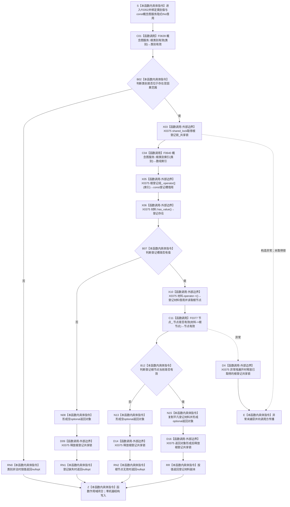

# CF-L6-0031 `概念图服务::读取概念根` 现状流程图

图类型：现状流程图
代码版本：`a48a70b2d678dea64dd8228adb4f26f0badd9506`
覆盖文件：`海中鱼巣/领域/概念图服务.h:892-902`
唯一根函数：F0352
完整签名：`std::optional<海中鱼巣::概念根登记材料> 海中鱼巣::概念图服务::读取概念根(海中鱼巣::概念根类别 类别) const`
参数：`类别` 按值复制；隐式 `this` 是调用方持有、调用期有效的 const 概念图服务借用，服务内部借用节点仓库、根登记锁和根登记数组
返回结果：按值返回 `optional<概念根登记材料>`；有值只表示类别位于当前枚举范围、对应登记槽有值且登记材料中的根节点当前被节点仓判断有效
非法值 / 拒绝：类别不在“存在—因果”范围时在加锁前返回 `nullopt`；登记槽为空或根节点当前无效时在共享锁内返回 `nullopt`
已登记调用方：F0176 的 E0708、F0177 的 E0714、F0178 的 E0720、F0179 的 E0726、F0180 的 E0732、F0191 的 E0777、F0256 的 E1023
直接项目函数：F0639 `概念图服务::根类别有效`；F0640 `概念图服务::根类别索引`；F0377 `节点仓库::节点是否有效`
外部边界：X0375，聚合 `std::shared_lock<std::shared_mutex>` 构造 / 析构、`std::array::operator[]` 和 `std::optional::has_value/operator->`
未解析项目调用：无
调用图：`流程图/代码流程图/00_调用知识图谱.md`
逐行映射表：`流程图/代码流程图/L6/CF-L6-0031_概念图服务读取概念根_逐行代码映射表.md`
输入契约 / 调用语境表：本文“调用语境与非成功分账”
非成功返回二分审查表：本文“调用语境与非成功分账”
偏差清单：本文“当前边界与规范核对”
依据提交 / 结构化消息：冻结源码提交 `a48a70b2d678dea64dd8228adb4f26f0badd9506`；当前 HEAD 的目标源码 blob 相同；源码 blob `dc4bd08f99622b3380c91dd15258fc8ab2e1b9c6`；Clang 候选与逐行源码复核
入口前置：普通读取允许任意 `概念根类别` 值；初始化与自检调用方分别具有更强的“根登记已经形成”前置，但本函数自身不区分调用语境
结构读取与写入：共享锁内读取一个根登记槽并经节点仓复核根节点当前有效性；只形成值式返回副本，零机器结构写入
逻辑内返回：普通候选读取中，类别非法、登记缺失或节点当前无效均折叠为 `nullopt`
内部错误：初始化成功、固定根登记发布或四根完整前置成立后仍返回 `nullopt`，属于登记投影、节点身份或上游发布结构不一致；本函数裸空值不具名区分
生命周期与资源释放：返回副本形成前一直持有根登记共享锁；任何锁后返回或异常均以 RAII 释放锁；不暴露登记数组内部引用
异常：未声明 `noexcept`；共享锁构造或 F0377 的内部读取异常向调用方传播，已取得的共享锁在栈展开时释放；平凡登记材料复制及其 optional 值式返回不抛出
并发 / 幂等：共享锁排斥根登记数组的并发写；F0377 可能在持根登记共享锁期间取得节点仓读取许可 / 锁。登记数组与节点仓不是同一事务快照；相同稳定结构下重复调用结果确定
验证入口：`概念图服务.h:892-902`、七条已登记入边、E1852—E1854、三个项目调用目标和 X0375
验证输出：冻结源码逐行确认 11 行完整覆盖；本批不运行构建或程序
依据：`规范/0050_项目通用机器逻辑与禁止性规则总纲_20260721.md`、`规范/0600_代码函数流程图应用与维护规范.md`、`规范/4010_子规范_统一仓库稳定句柄与通用关系索引边界.md`、`规范/4050_子规范_入口拒绝逻辑内结果与内部逻辑错误.md`、`规范/7140_子规范_概念身份生命周期退役删除与活动投影分账.md`
不得作为施工许可：是
不得宣称：返回有值已经证明固定系统角色稳定主键、完整句柄、本类对象结构、唯一类别根可达关系、生命周期或四根权威结构成立

## 流程图

## 直接被调函数

| 被调函数 | 当前调用点 | 参数 / 结果 | 被调图 |
| --- | --- | --- | --- |
| F0639 `static bool 概念图服务::根类别有效(概念根类别)` | `概念图服务.h:893` | `类别` → `bool` | 待生成 |
| F0640 `static std::size_t 概念图服务::根类别索引(概念根类别)` | `概念图服务.h:897` | `类别` → `size_t`；只在 C01 返回 `true` 后调用 | 待生成 |
| F0377 `bool 节点仓库::节点是否有效(节点句柄) const` | `概念图服务.h:898` | `this=&节点_`、`材料->根节点` → `bool` | 待生成 |

## 已登记调用方

| 调用方 | 调用边 | 位置 / 前置 | 调用方图 |
| --- | --- | --- | --- |
| F0176 | E0708 | `初始化.概念图.ixx:227`；根项与名称关系均有效 | [F0176](../L5/CF-L5-0056_概念图初始化服务根结构仍可读_现状流程图.md) |
| F0177 | E0714 | `初始化.概念图.ixx:150`；确保存在根入口 | [F0177](../L5/CF-L5-0057_概念图初始化服务确保存在根_现状流程图.md) |
| F0178 | E0720 | `初始化.概念图.ixx:150`；确保动态根入口 | [F0178](../L5/CF-L5-0058_概念图初始化服务确保动态根_现状流程图.md) |
| F0179 | E0726 | `初始化.概念图.ixx:150`；确保关系根入口 | [F0179](../L5/CF-L5-0059_概念图初始化服务确保关系根_现状流程图.md) |
| F0180 | E0732 | `初始化.概念图.ixx:150`；确保因果根入口 | [F0180](../L5/CF-L5-0060_概念图初始化服务确保因果根_现状流程图.md) |
| F0191 | E0777 | `概念图服务.h:4407`；F0369 调用后普通根材料查询 | [F0191](../L5/CF-L5-0071_概念图服务确保实例支持对应根_现状流程图.md) |
| F0256 | E1023 | `自检.入口初始化.ixx:149`；固定存在根读回自检 | [F0256](../L5/CF-L5-0132_运行概念图非名称身份自检_现状流程图.md) |

## 调用语境与非成功分账

| 调用语境 | `nullopt` 精确含义 | 二分口径 | 结构后果 |
| --- | --- | --- | --- |
| 任意普通候选读取 | 类别非法、登记槽为空或登记节点当前无效之一；函数不区分 | 允许的局部逻辑内空结果 | 零写入，不暴露内部引用 |
| F0177—F0180 根确保入口的首次探测 | 对应登记投影当前不可读 | 上游可以进入具名创建 / 恢复路径 | 本函数零写入 |
| F0176 完整根结构复核 | 已成功形成根项和名称关系后登记仍不可读 | 内部结构错误或投影漂移 | 调用方不得把空值当普通未初始化 |
| F0256 固定根自检读回 | 自检环境声称成功后存在根登记不可读 | 自检失败证据 | 不把自检失败升级为正式根不存在 |

## 当前边界与规范核对

- 7140 明确四根登记只是固定根身份的定位投影；F0352 只读登记槽并检查节点当前有效，没有复核固定系统角色稳定主键、根节点类型、本类对象结构、关系 10 唯一类别根可达或生命周期。
- 返回的 `稳定非名称键` 是当前登记材料字段；单独读到该数值不能替代 4010 的完整稳定主键命名域与键值。
- 登记数组允许确定重建。清空登记后权威根身份仍应成立，因此 F0352 的空结果不能单独裁决概念根不存在。
- 类别非法、投影缺失和节点失效被同一 `nullopt` 折叠；普通查询可消费空结果，正式初始化成功后的缺失则必须按 4050 追查根因。
- 根登记共享锁覆盖节点仓读取，形成跨组件嵌套读取；两者没有共同事务快照。当前图只记录观察边界，不推断已经发生并发漂移。
