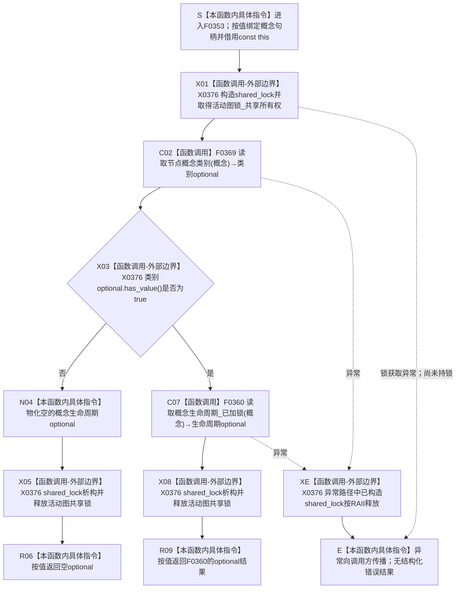

# CF-L6-0032 `概念图服务::读取概念生命周期` 现状流程图

图类型：现状流程图
代码版本：`a48a70b2d678dea64dd8228adb4f26f0badd9506`
覆盖文件：`海中鱼巣/领域/概念图服务.h:1861-1867`
唯一根函数：F0353
完整签名：`std::optional<海中鱼巣::概念生命周期材料> 海中鱼巣::概念图服务::读取概念生命周期(海中鱼巣::节点句柄 概念) const`
参数：隐式 `this` 是对当前 `概念图服务` 的非拥有 const 借用，服务及其仓库依赖必须覆盖调用；`概念` 按值复制完整节点句柄，不转移节点所有权
返回结果：按值返回 `std::optional<概念生命周期材料>`；有值时材料由调用方拥有，内部句柄仍是非拥有稳定引用；无值时不改变任何节点、关系、登记或活动投影
非法值 / 拒绝：节点句柄无效、节点不可读或节点类型不能映射为概念类别时返回空；类别可读后缺少或无法完整读回生命周期时也返回同一个空值
已登记调用方：F0176 的 E0709
直接项目函数：F0369、F0360，共 2 个唯一函数、2 个调用点
外部边界：X0376，聚合 `std::shared_lock<std::shared_mutex>` 构造 / 析构、`std::optional<概念根类别>::has_value()` 和 optional 值式返回
未解析项目调用：无
调用图：`流程图/代码流程图/00_调用知识图谱.md`
逐行映射表：`流程图/代码流程图/L6/CF-L6-0032_概念图服务读取概念生命周期_逐行代码映射表.md`
输入契约 / 调用语境表：本文“调用语境与非成功分账”
非成功返回二分审查表：本文“调用语境与非成功分账”
偏差清单：本文“当前偏差候选”；共享偏差审计由父智能体统一收口
依据提交 / 结构化消息：冻结源码提交 `a48a70b2d678dea64dd8228adb4f26f0badd9506`；当前 HEAD 的目标源码 blob 相同；MSVC 模块候选 JSON 与逐行源码复核
入口前置：当前已登记调用方 F0176 在概念根初始化读回中传入已经成功形成且登记材料匹配的根节点；本函数自身仍只用节点粗类别作入口门禁
结构读取与写入：先持有 `活动图锁_` 共享锁；F0369 读取节点记录并映射粗类别；F0360 在同一活动共享锁作用域内读取关系 12、生命周期状态登记及服务关系登记；本函数不写结构
逻辑内返回：外部或候选句柄不能映射为概念类别时返回空；当前空值没有具名原因
内部错误：已确认当前概念后关系 12 缺失、多当前目标、目标状态未登记、服务登记与权威关系不一致或材料不完整时，F0360 也返回空；本函数不保留其内部错误类别
生命周期与资源释放：共享锁在两个返回分支的返回值物化后由 RAII 释放；不返回容器引用、锁、迭代器或内部材料引用
异常：未声明 `noexcept` 且不捕获；锁获取、F0369 或 F0360 的异常向调用方传播，已构造共享锁在栈展开时释放；当前 optional 与句柄的值式返回不另引入抛出点
并发 / 幂等：允许多个读取者共享 `活动图锁_`；同一冻结结构和输入产生相同值式结果；锁内调用顺序固定为 F0369 后 F0360
验证入口：源码 blob `dc4bd08f99622b3380c91dd15258fc8ab2e1b9c6`、1861—1867 行、E0709、E1855 / E1856、X0376
验证输出：候选工具观测提交与冻结提交一致，2 个目标模块 / 3 模块依赖闭包、2 个翻译单元均成功，合计 1028 个候选函数、8259 个候选调用、0 未解析、0 诊断；Clang 将头文件位置显示为包含方 `.ixx`，本图以实际头文件 1861—1867 行裁决；本批不运行构建或项目程序
依据：`规范/0050_项目通用机器逻辑与禁止性规则总纲_20260721.md`、`规范/0600_代码函数流程图应用与维护规范.md`、`规范/4010_子规范_统一仓库稳定句柄与通用关系索引边界.md`、`规范/4050_子规范_入口拒绝逻辑内结果与内部逻辑错误.md`、`规范/7140_子规范_概念身份生命周期退役删除与活动投影分账.md`
不得作为施工许可：是
不得宣称：空值能够区分入口拒绝与内部错误、活动登记是生命周期权威、概念类别和关系 12 已按 7140 完整复核、概念生命周期恢复或迁移已经闭合

## 流程图

## 直接被调函数

| 被调函数 | 当前调用位置 | 参数 / 结果 | 条件 | 被调图 |
| --- | --- | --- | --- | --- |
| F0369 `读取节点概念类别` | `概念图服务.h:1863` | `概念` → `std::optional<概念根类别>` | 取得活动图共享锁后无条件调用 | 待生成 |
| F0360 `读取概念生命周期_已加锁` | `概念图服务.h:1866` | `概念` → `std::optional<概念生命周期材料>` | F0369 返回有值 | 待生成 |

## 已登记调用方

| 调用方 | 调用边 | 位置 / 前置 | 调用方图 |
| --- | --- | --- | --- |
| F0176 | E0709 | `初始化.概念图.ixx:233`；根登记、名称和根材料读回已通过 | [F0176](../L5/CF-L5-0056_概念图初始化服务根结构仍可读_现状流程图.md) |

## 调用语境与非成功分账

| 调用语境 | 输入来源与前置 | 当前空值来源 | 二分口径 | 结构后果 |
| --- | --- | --- | --- | --- |
| F0176 概念根初始化读回 | 已成功形成并登记的四类根节点 | F0369 无类别，或 F0360 无完整生命周期 | 前置成立后的内部错误；调用方折叠为 `false` | 零新增写入；已有结构保留 |
| 其它公开只读调用 | 外部或候选节点句柄 | 节点无效、不可读或粗类型不能映射类别 | 写前入口拒绝，但当前只返回空 optional | 零结构变化 |
| 已确认当前概念 | 7140 要求恰一条当前关系 12 | 缺关系、多关系、状态或服务登记不一致、材料不完整 | 内部逻辑错误；由 F0360 检查后仍折叠为空 | 停止依赖路径并追根因 |

## 当前偏差候选

- F0369 只从节点类型映射粗类别；7140 还要求节点类型、唯一类别根可达路径和所属对象正式结构共同成立，本函数的入口门禁不足以独立证明“当前概念”。
- 同一个空 `optional` 同时表达外部句柄拒绝和 F0360 的内部结构异常，不符合 4050 对公开领域边界强类型分账的目标合同。
- 本函数持有活动投影锁，但最终材料还依赖关系 12 与生命周期 / 服务登记；7140 规定活动快照和登记只是可重建投影，当前读取不能据此宣称权威恢复或一致性已经闭合。
