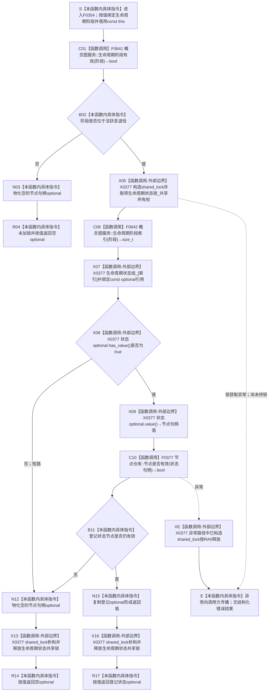

# CF-L6-0033 `概念图服务::读取生命周期状态` 现状流程图

图类型：现状流程图
代码版本：`a48a70b2d678dea64dd8228adb4f26f0badd9506`
覆盖文件：`海中鱼巣/领域/概念图服务.h:969-979`
唯一根函数：F0354
完整签名：`std::optional<海中鱼巣::节点句柄> 海中鱼巣::概念图服务::读取生命周期状态(海中鱼巣::概念生命周期阶段 阶段) const`
参数：隐式 `this` 是对当前 `概念图服务` 的非拥有 const 借用；`阶段` 按值传入，底层类型为 `std::uint32_t`
返回结果：阶段为活跃 / 冷却 / 退役且服务内对应登记项有值、节点仓库当前仍认定该句柄有效时，按值复制并返回 `std::optional<节点句柄>`；调用方不取得数组引用或节点所有权；其它路径返回空
非法值 / 拒绝：`未定义(0)`、大于 `退役(3)` 及其它枚举外值在加锁和下标计算前返回空；有效阶段对应登记为空或登记节点已失效也返回相同空值
已登记调用方：F0176 的 E0710、F0181 的 E0738
直接项目函数：F0641 `概念图服务::生命周期阶段有效`、F0642 `概念图服务::生命周期阶段索引`、F0377，共 3 个唯一函数、3 个调用点
外部边界：X0377，聚合 `std::shared_lock<std::shared_mutex>` 构造 / 析构、`std::array::operator[]`、`std::optional<节点句柄>::has_value()` / `value()` / 按值复制与空值物化
未解析项目调用：无
调用图：`流程图/代码流程图/00_调用知识图谱.md`
逐行映射表：`流程图/代码流程图/L6/CF-L6-0033_概念图服务读取生命周期状态_逐行代码映射表.md`
输入契约 / 调用语境表：本文“调用语境与非成功分账”
非成功返回二分审查表：本文“调用语境与非成功分账”
偏差清单：本文“当前偏差候选”；共享偏差审计由父智能体统一收口
依据提交 / 结构化消息：冻结源码提交 `a48a70b2d678dea64dd8228adb4f26f0badd9506`；当前 HEAD 的目标源码 blob 相同；MSVC 模块候选 JSON 与逐行源码复核
入口前置：F0181 可在系统初始化中以三个合法阶段查找已有登记，空值允许进入创建 / 登记路径；F0176 在根结构读回时要求三个阶段均已登记且与初始化结果一致
结构读取与写入：先写前纯值验证阶段；有效时持有 `生命周期状态锁_` 共享锁，从三项 `生命周期状态组_` 投影取 const 引用，并在锁内调用 F0377 复核节点仓库当前有效性；本函数不写结构
逻辑内返回：有效阶段尚无服务登记时返回空，F0181 将其作为初始化创建 / 登记前置；当前空值没有具名原因
内部错误：F0176 已确认初始化成功后的登记缺失，或数组有句柄但节点仓库判定失效，属于投影缺失 / 漂移；本函数仍与无登记、非法阶段共用空值
生命周期与资源释放：无效阶段在取得锁前返回；有效阶段所有数组引用只在共享锁作用域内使用，返回前复制 optional，随后 RAII 解锁；不泄漏引用、锁或迭代器
异常：未声明 `noexcept` 且不捕获；共享锁获取或 F0377 的异常向调用方传播，已构造共享锁在栈展开时释放；两个静态辅助、数组 / optional 访问和当前句柄值式返回不另引入抛出点
并发 / 幂等：允许多个读取者共享生命周期状态锁；写方独占该锁；同一登记投影、节点仓库版本和阶段产生相同结果；有效性验证期间锁顺序为生命周期状态共享锁后节点仓库内部锁
验证入口：源码 blob `dc4bd08f99622b3380c91dd15258fc8ab2e1b9c6`、969—979 行、E0710、E0738、E1857—E1859、X0377
验证输出：候选工具观测提交与冻结提交一致，2 个目标模块 / 3 模块依赖闭包、2 个翻译单元均成功，合计 1028 个候选函数、8259 个候选调用、0 未解析、0 诊断；Clang 将头文件位置显示为包含方 `.ixx`，本图以实际头文件 969—979 行裁决；本批不运行构建或项目程序
依据：`规范/0050_项目通用机器逻辑与禁止性规则总纲_20260721.md`、`规范/0600_代码函数流程图应用与维护规范.md`、`规范/4010_子规范_统一仓库稳定句柄与通用关系索引边界.md`、`规范/4050_子规范_入口拒绝逻辑内结果与内部逻辑错误.md`、`规范/7140_子规范_概念身份生命周期退役删除与活动投影分账.md`
不得作为施工许可：是
不得宣称：生命周期状态登记是权威事实、空值能够区分非法阶段 / 未登记 / 投影漂移、固定状态身份已经从权威结构重建、概念生命周期关系完整

## 流程图

## 直接被调函数

| 被调函数 | 当前调用位置 | 参数 / 结果 | 条件 | 被调图 |
| --- | --- | --- | --- | --- |
| F0641 `bool 海中鱼巣::概念图服务::生命周期阶段有效(海中鱼巣::概念生命周期阶段 阶段)` | `概念图服务.h:970` | `阶段` → `bool` | 函数进入后无条件调用 | 待生成 |
| F0642 `std::size_t 海中鱼巣::概念图服务::生命周期阶段索引(海中鱼巣::概念生命周期阶段 阶段)` | `概念图服务.h:974` | 已验证 `阶段` → `std::size_t` | 阶段有效且取得共享锁 | 待生成 |
| F0377 `节点仓库::节点是否有效` | `概念图服务.h:975` | `this=&节点_`、`状态.value()` → `bool` | 登记 optional 有值 | 待生成 |

## 已登记调用方

| 调用方 | 调用边 | 位置 / 前置 | 调用方图 |
| --- | --- | --- | --- |
| F0176 | E0710 | `初始化.概念图.ixx:246`；根与生命周期材料读回后遍历三个固定阶段 | [F0176](../L5/CF-L5-0056_概念图初始化服务根结构仍可读_现状流程图.md) |
| F0181 | E0738 | `初始化.概念图.ixx:187`；确保单个合法生命周期阶段状态 | [F0181](../L5/CF-L5-0061_概念图初始化服务确保生命周期状态_现状流程图.md) |

## 调用语境与非成功分账

| 调用语境 | 输入来源与前置 | 当前空值来源 | 二分口径 | 调用方后继 |
| --- | --- | --- | --- | --- |
| F0181 初始化确保状态 | 固定活跃 / 冷却 / 退役阶段 | 合法阶段尚未登记 | 初始化协议允许的无登记结果 | 创建或复用抽象状态并调用登记入口 |
| F0176 初始化后读回 | 三阶段已经确保和登记，初始化结果持有对应句柄 | 登记缺失或节点失效 | 前置成立后的内部错误；调用方折叠为 `false` | 停止本次根结构成功读回 |
| 其它公开调用 | 外部或候选阶段枚举 | 0、4 以上或枚举外值 | 写前入口拒绝，但当前只返回空 optional | 零结构变化 |
| 登记投影存在但节点失效 | 服务内数组有值 | F0377 返回 `false` | 投影与节点仓库漂移；内部错误候选 | 当前静默返回空，不具名隔离或重建 |

## 当前偏差候选

- 7140 明确 `生命周期状态组_` 是可清空、可重建的定位投影，不是生命周期权威；本函数只读取该数组和节点有效性，不读取固定状态权威身份，也不执行确定重建。
- 同一个空 `optional` 同时表达非法阶段、合法未登记和登记节点失效，不能满足 4050 对公开领域边界的强类型结果分账。
- 投影条目有值但节点已失效时只返回空，未具名区分“投影可重建缺失”和“投影与权威结构矛盾需隔离追根因”。
