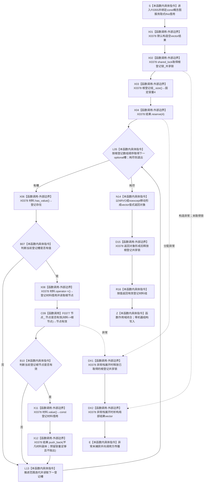

# CF-L6-0034 `概念图服务::读取全部概念根` 现状流程图

图类型：现状流程图
代码版本：`a48a70b2d678dea64dd8228adb4f26f0badd9506`
覆盖文件：`海中鱼巣/领域/概念图服务.h:904-914`
唯一根函数：F0355
完整签名：`std::vector<海中鱼巣::概念根登记材料> 海中鱼巣::概念图服务::读取全部概念根() const`
参数：无显式参数；隐式 `this` 是调用方持有、调用期有效的 const 概念图服务借用，服务内部借用节点仓库、根登记锁和四槽根登记数组
返回结果：按值返回 `vector<概念根登记材料>`；按 `根登记组_` 固定数组顺序，仅复制“登记槽有值且根节点当前有效”的材料
非法值 / 拒绝：无显式输入拒绝；空槽和节点当前无效的登记被静默过滤，可能返回空组或少于四项的部分组
已登记调用方：F0176 的 E0713、F0182 的 E0749、F0255 的 E1004
直接项目函数：F0377 `节点仓库::节点是否有效`，每个有值登记槽至多调用一次
外部边界：X0378，聚合 vector 构造 / 析构 / `reserve` / `push_back`、shared_lock 构造 / 析构、array `size/begin/end` 与范围迭代、optional `has_value/operator->/value`
未解析项目调用：无
调用图：`流程图/代码流程图/00_调用知识图谱.md`
逐行映射表：`流程图/代码流程图/L6/CF-L6-0034_概念图服务读取全部概念根_逐行代码映射表.md`
输入契约 / 调用语境表：本文“调用语境与非成功分账”
非成功返回二分审查表：本文“调用语境与非成功分账”
偏差清单：本文“当前边界与规范核对”
依据提交 / 结构化消息：冻结源码提交 `a48a70b2d678dea64dd8228adb4f26f0badd9506`；当前 HEAD 的目标源码 blob 相同；源码 blob `dc4bd08f99622b3380c91dd15258fc8ab2e1b9c6`；Clang 候选与逐行源码复核
入口前置：普通只读允许登记投影尚未完整；F0176 / F0182 / F0255 分别处于初始化后复核、生命周期登记复核和自检语境，具有更强的完整性预期
结构读取与写入：共享锁内遍历全部四个登记槽，对有值项经节点仓复核并复制到局部 vector；零机器结构写入
逻辑内返回：普通显示或候选读取可以消费空组 / 部分组，但结果只说明当前登记投影可读子集
内部错误：正式初始化已经宣称四根完整后仍返回少于四项、重复类别或失效节点，属于权威根、投影重建或节点结构不一致；本函数只静默过滤，不具名区分
生命周期与资源释放：结果 vector 由本函数拥有；共享锁覆盖 `reserve`、遍历、节点复核、复制追加及返回对象形成；返回后调用方拥有独立 vector
异常：未声明 `noexcept`；锁获取、`reserve` 分配或 F0377 异常向调用方传播；`reserve` 已按固定登记数组大小一次性建立足量容量，后续 `push_back` 不扩容且平凡登记材料复制不抛出；默认分配器下 vector 返回移动为 `noexcept` 且可由 NRVO 消除；已取得的共享锁和局部 vector 均按 RAII 释放
并发 / 幂等：根登记数组在同一共享锁观察窗口内稳定；每项节点复核可能嵌套取得节点仓许可 / 锁。登记与节点仓不形成共同事务快照；相同稳定结构下输出顺序和内容确定
验证入口：`概念图服务.h:904-914`、三条已登记入边、E1860、F0377 循环调用与 X0378
验证输出：冻结源码逐行确认 11 行完整覆盖；本批不运行构建或程序
依据：`规范/0050_项目通用机器逻辑与禁止性规则总纲_20260721.md`、`规范/0600_代码函数流程图应用与维护规范.md`、`规范/4010_子规范_统一仓库稳定句柄与通用关系索引边界.md`、`规范/4050_子规范_入口拒绝逻辑内结果与内部逻辑错误.md`、`规范/7140_子规范_概念身份生命周期退役删除与活动投影分账.md`
不得作为施工许可：是
不得宣称：返回四项或少于四项已经证明 / 否定四个固定概念根的稳定身份、本类对象结构、关系 10 唯一根可达、生命周期或权威恢复结果

## 流程图

## 直接被调函数

| 被调函数 | 当前调用点 | 参数 / 结果 | 被调图 |
| --- | --- | --- | --- |
| F0377 `bool 节点仓库::节点是否有效(节点句柄) const` | `概念图服务.h:909`；每个有值槽一次 | `this=&节点_`、`材料->根节点` → `bool` | 待生成 |

## 已登记调用方

| 调用方 | 调用边 | 位置 / 前置 | 调用方图 |
| --- | --- | --- | --- |
| F0176 | E0713 | `初始化.概念图.ixx:256`；四根与三状态循环完成 | [F0176](../L5/CF-L5-0056_概念图初始化服务根结构仍可读_现状流程图.md) |
| F0182 | E0749 | `概念图服务.h:985`；生命周期状态登记完整 | [F0182](../L5/CF-L5-0062_概念图服务初始化活动概念生命周期_现状流程图.md) |
| F0255 | E1004 | `自检.入口初始化.ixx:118`；环境读取完整性返回 `true` | [F0255](../L5/CF-L5-0131_运行概念图四根唯一自检_现状流程图.md) |

## 调用语境与非成功分账

| 调用语境 | 空组 / 部分组精确含义 | 二分口径 | 结构后果 |
| --- | --- | --- | --- |
| 普通显示或候选读取 | 当前登记投影中仅有返回项通过节点有效性过滤 | 允许的局部读取投影 | 零写入；调用方不得推断缺项根不存在 |
| F0176 初始化完整复核 | 四根与三生命周期状态循环完成后登记仍不足四项 | 内部结构错误或投影重建缺项 | F0176 的数量检查只能发现结果，不证明权威根身份 |
| F0182 生命周期结构初始化 | 生命周期状态登记完整后根组不完整 | 上游前置成立后的内部结构错误 | 不得静默继续构造部分生命周期结构 |
| F0255 自检 | 环境自检前置成立后根登记不足 | 自检失败证据 | 不把自检失败改写为正式权威根缺失 |

## 当前边界与规范核对

- 7140 明确四根登记和登记数量只是可重建定位投影，不是四根权威身份。F0355 即使返回四项，也没有复核固定稳定主键、节点类型、本类对象结构、关系 10 唯一类别根可达或生命周期。
- 空槽与节点无效被静默过滤，返回 vector 不携带缺项类别或原因；普通只读可以消费部分投影，正式完整性语境必须由调用方追根因。
- `根登记组_` 的数组顺序决定返回顺序；这只是当前投影物理顺序，不得成为概念类别、优先级或生命周期顺序事实。
- 共享锁覆盖全部节点仓复核和材料复制；登记数组在本函数内稳定，但节点仓读取与登记不是同一事务快照。
- 清空登记缓存后，7140 要求权威读取、生命周期与删除裁决等价。当前函数只返回缓存内容，不能作为该权威读取合同的替代。
