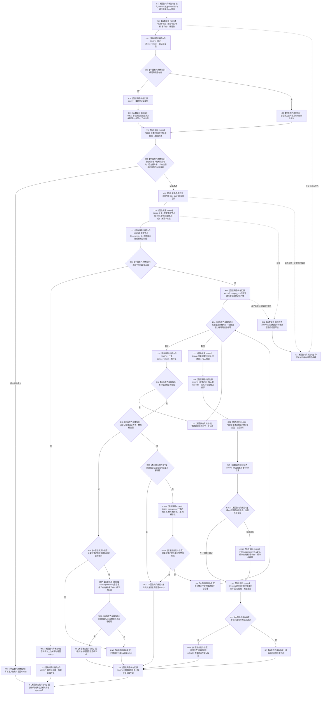

# CF-L6-0035 `概念图服务::登记概念根` 现状流程图

图类型：现状流程图
代码版本：`a48a70b2d678dea64dd8228adb4f26f0badd9506`
覆盖文件：`海中鱼巣/领域/概念图服务.h:849-890`
唯一根函数：F0356
完整签名：`std::optional<海中鱼巣::节点句柄> 海中鱼巣::概念图服务::登记概念根(const 海中鱼巣::概念根登记材料& 材料)`
参数：显式 `材料` 是调用方持有、调用期有效的只读非拥有借用；隐式 `this` 是调用方持有的概念图服务借用，服务内部继续借用节点仓库、关系仓库、图写锁、根登记锁和四槽根登记数组
返回结果：按值返回 `optional<节点句柄>`；新登记成功或同类别、同稳定非名称键、同完整根节点的幂等登记返回根节点，其余当前拒绝及发布后读回检查失败均折叠为 `nullopt`
非法值 / 拒绝：根类别越界、稳定非名称键为零、根节点不可读、节点类型不能映射到同一根类别、根节点已有概念上位来源、同类别异义登记、跨类别稳定键复用或根节点复用均返回 `nullopt`
已登记调用方：F0177 的 E0717、F0178 的 E0723、F0179 的 E0729、F0180 的 E0735
直接项目函数：F0190、R0521、F0639、R0088、F0640 两个调用点、F0184，以及 F0051 三个按短路条件调用的完整节点句柄比较点；对应 E1861—E1867、E1903
外部边界：X0379，聚合 `optional` 观察 / 取值 / 成员借用、`lock_guard<mutex>`、`unique_lock<shared_mutex>`、关系来源组临时 vector、array / optional 遍历与下标写入、平凡材料复制、比较、返回对象和 RAII 生命周期
未解析项目调用：无
调用图：`流程图/代码流程图/00_调用知识图谱.md`
逐行映射表：`流程图/代码流程图/L6/CF-L6-0035_概念图服务登记概念根_逐行代码映射表.md`
输入契约 / 调用语境表：本文“调用语境与非成功分账”
非成功返回二分审查表：本文“调用语境与非成功分账”
偏差清单：本文“当前边界与规范核对”
依据提交 / 结构化消息：冻结源码提交 `a48a70b2d678dea64dd8228adb4f26f0badd9506`；本轮审计 HEAD `f46c551547d44a70ce8ef9595a055b8d9a9ec3c8` 的目标源码 blob 相同；源码 blob `dc4bd08f99622b3380c91dd15258fc8ab2e1b9c6`；Clang 候选、句柄重载解析与逐行源码复核
入口前置：普通公开入口自身接受任意材料；四个已登记初始化调用方在调用前已经创建对应类别根节点，并以固定类别和固定非零键构造材料。对普通材料，写前准入失败是入口拒绝；对 F0177—F0180 已创建固定根的初始化语境，类型、上位关系或唯一性异常会被调用方 F0184 收口为内部结构错误
结构读取与写入：先无锁读取根节点；取得图写互斥锁后读取关系 10 的当前来源节点组；随后在图写锁仍持有时取得根登记独占锁，遍历并可能写入一个四槽根登记投影。函数不创建节点、关系、索引、签名或生命周期事实
逻辑内返回：任意写前准入不满足、根节点已有上位、同义登记幂等读回或登记唯一性冲突均在本次入口没有新增机器结构时返回；公开 `optional` 不区分具名原因
内部错误：写入根登记槽后读回不一致时调用 F0184；检查失败返回 `nullopt`，但当前代码不撤销已写入的根登记投影
生命周期与资源释放：局部节点记录和节点类别按值持有；图写锁从关系来源读取前覆盖到函数退出，根登记独占锁从遍历前覆盖到函数退出。任一锁内返回均先形成返回对象，再逆序释放根登记锁和图写锁
异常：未声明 `noexcept` 且不捕获；F0190、R0088、锁构造或关系来源组临时值构造异常向调用方传播，已经取得的锁按 RAII 释放。当前平凡登记材料的槽赋值、读回、F0184 当前编译变体和 optional 返回不抛出；所有可能异常均发生在本次根登记写入前
并发 / 幂等：节点读取发生在取得图写锁之前，关系来源读取与根登记写入也不在同一仓库事务快照；图写锁与根登记独占锁只保护概念图服务内相应切片。同类别、同键、同完整句柄幂等返回；任一身份维度冲突均拒绝
验证入口：`概念图服务.h:849-890`、E0717 / E0723 / E0729 / E0735、E1861—E1867、X0379
验证输出：冻结源码逐行确认 42 行完整覆盖；Clang 头文件候选只作辅助且其包含文件归属未采用；本批不运行构建或程序
依据：`规范/0050_项目通用机器逻辑与禁止性规则总纲_20260721.md`、`规范/0600_代码函数流程图应用与维护规范.md`、`规范/4010_子规范_统一仓库稳定句柄与通用关系索引边界.md`、`规范/4030_子规范_基础信息服务分层与领域写授权.md`、`规范/4050_子规范_入口拒绝逻辑内结果与内部逻辑错误.md`、`规范/7140_子规范_概念身份生命周期退役删除与活动投影分账.md`
不得作为施工许可：是
不得宣称：返回根节点或根登记数组出现对应项已经证明固定系统角色稳定主键、本类对象结构、关系 10 唯一类别根可达、永久活跃生命周期、四根权威结构或恢复闭环成立

## 流程图

## 项目源码调用合同

| 调用边 | 节点 | 被调函数 | 实参 | 结果 / 条件 | 被调图 |
| --- | --- | --- | --- | --- | --- |
| E1861 | C01 | F0190 `节点仓库::读取节点(节点句柄) const` | `this=&节点_`、`材料.根节点` | `根记录`；总是调用 | [F0190](../L5/CF-L5-0070_节点仓库读取节点_现状流程图.md) |
| E1862 | C05 | R0521 `概念图服务::节点类型对应根类别(节点类型)` | `根记录->类型` | `节点类别`；仅根记录有值时调用 | 待生成 |
| E1863 | C07 | F0639 `概念图服务::根类别有效(概念根类别)` | `材料.根类别` | `bool`；在节点类别条件表达式完成后总调用 | 待生成 |
| E1864 | C10 | R0088 `关系仓库::获取来源节点组(节点句柄,关系类型) const` | `this=&关系_`、`材料.根节点`、`概念上下位` | 值式来源节点组；持有图写锁 | 待生成 |
| E1865 | C22 | F0640 `概念图服务::根类别索引(概念根类别)` | `材料.根类别` | 写入数组索引；仅循环无冲突后调用 | 待生成 |
| E1866 | C24 | F0640 `概念图服务::根类别索引(概念根类别)` | `材料.根类别` | 读回数组索引；写入完成后调用 | 待生成 |
| E1867 | C26 | F0184 `追根因检查(bool,const wchar_t*)` | 四字段读回条件、固定说明 | `检查通过`；写入后总调用 | [F0184](../L5/CF-L5-0064_追根因检查_现状流程图.md) |
| E1903 | C19A / C20A / C25B | F0051 `operator==(const 节点句柄&,const 节点句柄&)` | `已登记.根节点,材料.根节点` 或 `已发布->根节点,材料.根节点` | 870：同类别且稳定键相同；875：跨类别且稳定键不相同；885：前三项读回条件成立 | [F0051](../L4/CF-L4-0015_节点句柄_operator_equal_现状流程图.md) |

## 已登记调用方

| 调用方 | 调用边 | 位置 / 前置 | 调用方图 |
| --- | --- | --- | --- |
| F0177 | E0717 | `初始化.概念图.ixx:165`；存在根节点已创建并构造固定存在根材料 | [F0177](../L5/CF-L5-0057_概念图初始化服务确保存在根_现状流程图.md) |
| F0178 | E0723 | 同一模板位置；动态根节点已创建并构造固定动态根材料 | [F0178](../L5/CF-L5-0058_概念图初始化服务确保动态根_现状流程图.md) |
| F0179 | E0729 | 同一模板位置；关系根节点已创建并构造固定关系根材料 | [F0179](../L5/CF-L5-0059_概念图初始化服务确保关系根_现状流程图.md) |
| F0180 | E0735 | 同一模板位置；因果根节点已创建并构造固定因果根材料 | [F0180](../L5/CF-L5-0060_概念图初始化服务确保因果根_现状流程图.md) |

## 调用语境与非成功分账

| 调用语境 | 当前结果 | 二分口径 | 结构后果 |
| --- | --- | --- | --- |
| 任意公开材料，写前身份 / 类型 / 上位关系准入不满足 | `nullopt` | 入口拒绝；当前裸空值不具名区分 | 根登记投影未写入 |
| F0177—F0180 已创建固定根后出现类型、上位关系或唯一性不一致 | `nullopt`，随后调用方 F0184 失败 | 已成立初始化前置后的内部结构错误 | 本函数未写根登记投影；调用方停止初始化成功路径 |
| 同类别、同稳定键、同完整根节点重复登记 | 已登记根节点 | 幂等读回 | 零新增结构 |
| 同类别异义，或跨类别复用稳定键 / 根节点 | `nullopt` | 写前唯一性拒绝 | 根登记投影未写入 |
| F0177—F0180 已成功创建固定根后的首次登记 | 新根节点 | 当前实现成功结果 | 只写根登记定位投影，不证明权威根身份和生命周期 |
| 写入后四字段读回不一致 | `nullopt` | 前置通过后的内部逻辑错误 | 已写登记投影保留；当前函数不撤销、不隔离 |

## 当前边界与规范核对

- 7140 把四根登记明确列为可清空、可确定重建的定位投影；F0356 只写 `根登记组_`，不建立固定系统角色稳定主键、本类对象结构、唯一类别根可达或永久活跃生命周期。
- 当前稳定非名称键只检查非零和数组内唯一，不读取节点稳定主键或核对四类固定系统角色身份；返回有值不能扩大为正式根身份成立。
- R0088 只拒绝已有关系 10 来源，能够确认“当前没有直接上位来源”，但不证明该节点是唯一类别根，也不证明其它概念均可达该根。
- F0190 在任何概念图锁之前读取；随后关系仓读取、根登记数组读取 / 写入分别处于不同同步域，不构成同一结构事务或同代次权威快照。
- 写后 F0184 失败不撤销刚写入的登记投影；该分支属于内部错误边界，不能解释为普通登记失败后零变化。
- 返回类型用同一个 `nullopt` 混合入口拒绝、唯一性冲突和写后内部错误，不满足 4050 的公开强类型结果分账。
- `海中鱼巣/线程/自检.概念命名需求.ixx:92` 还存在一个调用方源码候选待展开；当前聚合图没有为其调用方冻结 F 身份，本文不分配 E、不计入聚合边。
