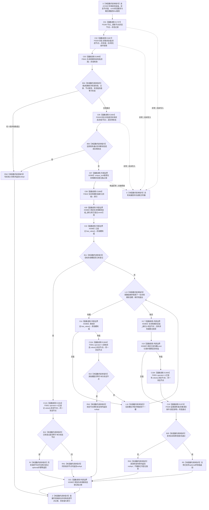

# CF-L6-0036 `概念图服务::登记生命周期状态` 现状流程图

图类型：现状流程图
代码版本：`a48a70b2d678dea64dd8228adb4f26f0badd9506`
覆盖文件：`海中鱼巣/领域/概念图服务.h:934-967`
唯一根函数：F0357
完整签名：`std::optional<海中鱼巣::节点句柄> 海中鱼巣::概念图服务::登记生命周期状态(海中鱼巣::概念生命周期阶段 阶段, 海中鱼巣::节点句柄 状态节点, const 海中鱼巣::状态服务& 状态)`
参数：`阶段` 和 `状态节点` 按值复制；`状态` 是调用方持有、调用期有效的 const 状态服务非拥有借用；隐式 `this` 是调用方持有的概念图服务借用，服务内部继续借用节点仓库、生命周期状态锁和三槽生命周期状态登记数组
返回结果：按值返回 `optional<节点句柄>`；首次登记成功或同阶段、同完整状态节点的幂等登记返回对应 optional，阶段 / 节点 / 类型 / 值 / 抽象性准入失败、同阶段异节点、跨阶段节点复用及写后读回失败均折叠为 `nullopt`
非法值 / 拒绝：阶段不在活跃—退役、状态节点不可读或类型不是状态、状态值不可读或不等于阶段底层 I64、状态被旧 `运行期临时` 关系分类为实例状态时，均在生命周期登记数组写入前返回 `nullopt`
已登记调用方：F0181 的 E0742
直接项目函数：F0190、F0329、F0641、F0328、F0642、F0184，以及 F0051 三个按短路条件调用的完整节点句柄比较点；对应 E1707—E1870、E1904
外部边界：X0380，聚合 `optional` 观察 / 取值 / 比较、枚举到 I64 转换、`unique_lock<shared_mutex>`、array / optional 遍历与下标、句柄复制、三元表达式返回、返回对象和 RAII 生命周期
未解析项目调用：无
调用图：`流程图/代码流程图/00_调用知识图谱.md`
逐行映射表：`流程图/代码流程图/L6/CF-L6-0036_概念图服务登记生命周期状态_逐行代码映射表.md`
输入契约 / 调用语境表：本文“调用语境与非成功分账”
非成功返回二分审查表：本文“调用语境与非成功分账”
偏差清单：本文“当前边界与规范核对”
依据提交 / 结构化消息：冻结源码提交 `a48a70b2d678dea64dd8228adb4f26f0badd9506`；本轮审计 HEAD `f46c551547d44a70ce8ef9595a055b8d9a9ec3c8` 的目标源码 blob 相同；源码 blob `dc4bd08f99622b3380c91dd15258fc8ab2e1b9c6`；Clang 候选、顶层冻结的无条件状态值读取顺序、句柄重载解析和逐行源码复核
入口前置：普通公开入口自身接受任意阶段和句柄；F0181 在调用前已创建或复用预期抽象状态并完成一次值式读回。F0357 自身仍无条件重复读取节点记录和状态值
结构读取与写入：进入后先经 F0190 读取节点记录，再无条件经 F0329 读取状态值；只有全部准入通过才取得生命周期状态独占锁并可能写入一个三槽生命周期状态登记投影。函数不创建状态节点、关系 12、状态领域记录或生命周期事实
逻辑内返回：任意写前准入不满足、同阶段同节点幂等读回、同阶段异节点或跨阶段节点复用均不会新增本次登记投影；公开 `optional` 不区分具名原因
内部错误：写入生命周期状态登记槽后读回不一致时调用 F0184；检查失败返回 `nullopt`，但当前代码不撤销已写入的生命周期状态登记投影
生命周期与资源释放：局部节点记录、状态值和索引按值持有；生命周期状态独占锁覆盖登记槽读取、全数组唯一性扫描、写入和读回。锁内返回先形成返回对象，再释放独占锁
异常：未声明 `noexcept` 且不捕获；F0190、F0329、F0328 或独占锁构造异常向调用方传播。当前平凡句柄槽赋值、读回、F0641 / F0642、F0184 当前编译变体和 optional 返回不抛出；所有可能异常均发生在本次生命周期状态登记写入前
并发 / 幂等：节点记录与状态值在任何生命周期状态锁之前分两次读取，F0328 又在全部前置通过后独立读取关系；三次观察与登记投影不构成同一事务或同代次快照。同阶段同完整句柄幂等返回；同阶段异句柄和跨阶段句柄复用拒绝
验证入口：`概念图服务.h:934-967`、E0742、E1707—E1870、X0380；E1667 对 F0329 的调用在任何 `if` 短路前无条件发生
验证输出：冻结源码逐行确认 34 行完整覆盖；Clang 头文件候选只作辅助且其包含文件归属未采用；本批不运行构建或程序
依据：`规范/0050_项目通用机器逻辑与禁止性规则总纲_20260721.md`、`规范/0600_代码函数流程图应用与维护规范.md`、`规范/1160_根规范_状态节点_20260720.md`、`规范/4010_子规范_统一仓库稳定句柄与通用关系索引边界.md`、`规范/4020_子规范_领域类型化数据记录与组合读取投影边界.md`、`规范/4030_子规范_基础信息服务分层与领域写授权.md`、`规范/4050_子规范_入口拒绝逻辑内结果与内部逻辑错误.md`、`规范/4210_子规范_动态信息分层获取与聚合_20260720.md`、`规范/7140_子规范_概念身份生命周期退役删除与活动投影分账.md`
不得作为施工许可：是
不得宣称：返回状态节点或生命周期状态登记数组出现对应项已经证明三个固定生命周期状态的稳定身份、状态领域完整事实、关系 12 当前唯一、概念生命周期成立或恢复闭环完成

## 流程图

## 项目源码调用合同

| 调用边 | 节点 | 被调函数 | 实参 | 结果 / 条件 | 被调图 |
| --- | --- | --- | --- | --- | --- |
| E1707 | C01 | F0190 `节点仓库::读取节点(节点句柄) const` | `this=&节点_`、`状态节点` | `状态记录`；总是调用 | [F0190](../L5/CF-L5-0070_节点仓库读取节点_现状流程图.md) |
| E1667 | C02 | F0329 `状态服务::读取状态值(节点句柄) const` | `this=&状态`、`状态节点` | `状态值`；E1707 完成后、任何 if 判断前无条件调用 | [F0329](CF-L6-0009_状态服务读取状态值_现状流程图.md) |
| E1868 | C03 | F0641 `概念图服务::生命周期阶段有效(概念生命周期阶段)` | `阶段` | `bool`；两项读取完成后调用 | 待生成 |
| E1664 | C05 | F0328 `状态服务::状态是否实例状态(节点句柄) const` | `this=&状态`、`状态节点` | `bool`；仅阶段、记录、类型、值全部通过后调用 | [F0328](CF-L6-0008_状态服务状态是否实例状态_现状流程图.md) |
| E1869 | C08 | F0642 `概念图服务::生命周期阶段索引(概念生命周期阶段)` | `阶段` | 数组索引；取得独占锁后调用 | 待生成 |
| E1870 | C19 | F0184 `追根因检查(bool,const wchar_t*)` | 已发布槽有值且等于状态节点、固定说明 | `检查通过`；写入后总调用 | [F0184](../L5/CF-L5-0064_追根因检查_现状流程图.md) |
| E1904 | C12A / C15A / C18A | F0051 `operator==(const 节点句柄&,const 节点句柄&)` | 已登记、当前遍历槽或已发布槽的节点句柄与 `状态节点` | 953：目标槽有值；956：当前遍历槽有值；962：已发布槽有值 | [F0051](../L4/CF-L4-0015_节点句柄_operator_equal_现状流程图.md) |

## 已登记调用方

| 调用方 | 调用边 | 位置 / 前置 | 调用方图 |
| --- | --- | --- | --- |
| F0181 | E0742 | `初始化.概念图.ixx:198`；状态节点可能来自 F0165 新建读回成功，也可能是调用方预置的有效句柄；显式 `状态_.读取状态值` 位于调用之后的 204 行 | [F0181](../L5/CF-L5-0061_概念图初始化服务确保生命周期状态_现状流程图.md) |

## 调用语境与非成功分账

| 调用语境 | 当前结果 | 二分口径 | 结构后果 |
| --- | --- | --- | --- |
| 任意公开阶段 / 状态材料，写前阶段、节点、类型、值或抽象性准入不满足 | `nullopt` | 入口拒绝；当前裸空值不具名区分 | 生命周期状态登记投影未写入 |
| F0181 使用调用方预置有效句柄 | 准入不满足时 `nullopt` | 调用前只保证句柄有效；未保证状态值、抽象性或阶段匹配，仍可形成入口拒绝 | 生命周期状态登记投影未写入 |
| F0181 使用 F0165 新建且内部读回成功的抽象状态 | 准入或唯一性不满足时 `nullopt`，随后 F0181 追根因失败 | 已成立创建前置后的内部结构错误 | 本函数未写或只保留实际已写的登记投影；调用方停止初始化成功路径 |
| 同阶段、同完整状态节点重复登记 | 已登记 optional | 幂等读回 | 零新增结构 |
| 同阶段异节点，或同节点跨阶段复用 | `nullopt` | 写前唯一性拒绝 | 生命周期状态登记投影未写入 |
| F0181 首次登记通过 | 新状态节点 optional | 当前实现成功结果 | 只写生命周期状态定位投影，不证明固定状态身份或关系 12 |
| 写入后槽位读回不一致 | `nullopt` | 前置通过后的内部逻辑错误 | 已写生命周期状态登记投影保留；当前函数不撤销、不隔离 |

## 当前边界与规范核对

- E1667 对 F0329 的状态值读取严格发生在 E1868 的阶段判断以及全部 `if` 短路前；即使阶段非法或节点记录为空，状态值读取仍已发生。F0328 仅在全部前置通过后调用，两者不可交换或合并。
- 7140 把三阶段生命周期状态登记列为可清空、可确定重建的定位投影；F0357 只写 `生命周期状态组_`，不创建三个固定状态身份，也不创建概念到状态的关系 12。
- 当前准入依赖 F0329 的旧通用 I64 槽和 F0328 的旧关系 5 实例状态分类；它没有读取状态领域类型化记录、关系 19 五角色、固定状态稳定主键或完整抽象状态结构。
- 节点记录、旧状态值和旧实例状态分类在取得生命周期状态锁前分三次独立读取；登记锁只稳定三槽数组，不能把这些读取组成同一事务或同代次状态快照。
- 写后 F0184 失败不撤销刚写入的登记投影；该分支属于内部错误边界，不能解释为普通登记失败后零变化。
- 返回类型用同一个 `nullopt` 混合入口拒绝、唯一性冲突和写后内部错误，不满足 4050 的公开强类型结果分账。
- `海中鱼巣/线程/自检.概念命名需求.ixx:102-104` 还存在三个按 `&&` 短路顺序执行的调用方源码候选待展开；当前聚合图没有为其调用方冻结 F 身份，本文不分配 E、不计入聚合边。
