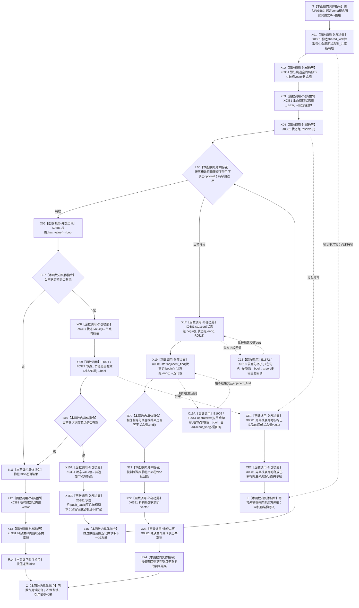

# CF-L6-0037 `概念图服务::生命周期状态登记完整` 现状流程图

图类型：现状流程图
代码版本：`a48a70b2d678dea64dd8228adb4f26f0badd9506`
覆盖文件：`海中鱼巣/领域/概念图服务.h:3000-3012`
唯一根函数：F0358
完整签名：`bool 海中鱼巣::概念图服务::生命周期状态登记完整() const`
参数：无显式参数；隐式 `this` 是调用方持有、调用期有效的 const `概念图服务` 非拥有借用，服务内部借用生命周期状态登记投影、生命周期状态锁和节点仓库
返回结果：共享锁内顺序读取固定三个生命周期状态登记槽；仅当三个槽均有值、三个节点句柄均被 F0377 判定当前有效，并且按 R0518 的仓库编号—节点编号—版本号顺序排序后不存在相邻相等完整句柄时，按值返回 `true`；任一槽为空、节点无效或完整句柄重复时返回 `false`
非法值 / 拒绝：无显式输入；本函数不形成具名拒绝原因，同一个 `false` 折叠登记槽为空、节点仓读回无效和三个槽使用重复完整句柄
已登记调用方：F0182 的 E0748、F0362 的 E1911；源码 `概念图服务.h:1505` 属于当前 main 不可达的 `初始化活动图基础版本`
直接项目函数：F0377 `节点仓库::节点是否有效`、R0518 `概念图服务::节点句柄小于`、F0051 `节点句柄 operator==`，共 3 个唯一函数；E1871 对每个有值槽至多调用一次 F0377，E1872 由 `std::sort` 按算法需要回调 R0518，E1905 由 `std::adjacent_find` 按算法需要回调 F0051
外部边界：X0381，聚合 `std::shared_lock<std::shared_mutex>`、`std::vector<节点句柄>`、`std::array` 范围迭代 / `size()`、`std::optional`、`reserve` / `push_back`、`std::sort`、`std::adjacent_find` 和迭代器生命周期；`std::adjacent_find` 使用的项目句柄相等运算独立记为 E1905 / F0051，不并入外部边界
未解析项目调用：无；X0381 只承载标准库算法、容器和迭代器边界，`adjacent_find` 的默认相等谓词已唯一解析为 F0051
调用图：`流程图/代码流程图/00_调用知识图谱.md`
逐行映射表：`流程图/代码流程图/L6/CF-L6-0037_概念图服务生命周期状态登记完整_逐行代码映射表.md`
输入契约 / 调用语境表：本文“调用语境与非成功分账”
非成功返回二分审查表：本文“调用语境与非成功分账”
偏差清单：本文“当前边界与规范核对”；共享偏差审计由顶层智能体统一收口
依据提交 / 结构化消息：冻结源码提交 `a48a70b2d678dea64dd8228adb4f26f0badd9506`；本轮审计 HEAD `f46c551547d44a70ce8ef9595a055b8d9a9ec3c8` 的目标源码 blob 相同；源码 blob `dc4bd08f99622b3380c91dd15258fc8ab2e1b9c6`；Clang 候选 JSON、标准库默认谓词重载解析与逐行源码复核
入口前置：普通局部完整性读取允许登记投影尚未形成；F0182 在建立四个概念根的活跃生命周期关系前要求三个固定阶段登记完整；本函数自身只取得生命周期状态共享锁，不要求调用方持有活动图锁或图写锁
结构读取与写入：持 `生命周期状态锁_` 共享锁读取三槽 `生命周期状态组_` 非权威定位投影，并在锁内经 F0377 逐项回读节点仓库当前有效性；只写局部 vector 的容量、元素顺序和内容，不写节点、关系、索引、生命周期、活动快照或其它机器结构
逻辑内返回：普通局部谓词语境中，投影尚未形成可用 `false` 闭合表达且零机器结构写入；当前裸布尔值不携带具体原因
内部错误：F0182 或其它已承诺三阶段状态完成登记的正式内部语境中，空槽、节点失效或重复句柄属于登记投影缺失 / 漂移，必须追查生命周期状态身份与投影重建根因；本函数仍统一返回 `false`
生命周期与资源释放：共享锁先构造、局部 vector 后构造；所有正常、提前返回和异常路径均先析构局部 vector，再释放生命周期状态共享锁；返回值不保留数组引用、迭代器或锁
异常：未声明 `noexcept` 且不捕获；共享锁获取、`reserve` 分配或 F0377 的异常向调用方传播；`reserve` 已按固定三槽数组容量一次性预留，后续 `push_back` 不扩容且平凡节点句柄复制不抛出，R0518、F0051 和当前三元素标准库排序 / 相邻查找路径也不抛出；异常只可能留下尚未返回的局部 vector 部分填充，随后由 RAII 销毁
并发 / 幂等：允许多个读取者共享生命周期状态锁，登记写方独占该锁；节点仓读回发生在生命周期状态共享锁内，两个结构不形成共同事务快照；相同登记投影与节点仓当前版本下结果确定，排序只改变局部副本
验证入口：`概念图服务.h:3000-3012`、E0748、E1871、E1872、X0381、源码调用点 `:1505` / `:4208`
验证输出：候选工具识别共享锁、固定数组遍历、F0377、vector 容量与追加、排序和相邻重复检查；Clang 把头文件位置显示为包含方 `.ixx`，本图以实际头文件行号和 blob 裁决；本批不运行构建、项目程序或业务自检
依据：`规范/0050_项目通用机器逻辑与禁止性规则总纲_20260721.md`、`规范/0600_代码函数流程图应用与维护规范.md`、`规范/4010_子规范_统一仓库稳定句柄与通用关系索引边界.md`、`规范/4050_子规范_入口拒绝逻辑内结果与内部逻辑错误.md`、`规范/4060_子规范_非权威缓存统计失效与确定重建.md`、`规范/7140_子规范_概念身份生命周期退役删除与活动投影分账.md`
不得作为施工许可：是
不得宣称：返回 `true` 已证明三个固定生命周期状态的权威稳定身份、状态领域完整结构、关系 12 当前唯一性、生命周期关系完整、活动图可发布或非权威登记投影能够替代确定重建

## 流程图

## 直接被调函数

| 调用边 | 被调函数 | 当前调用点 | 参数 / 结果 | 条件 | 被调图 |
| --- | --- | --- | --- | --- | --- |
| E1871 | F0377 `bool 海中鱼巣::节点仓库::节点是否有效(海中鱼巣::节点句柄) const` | `概念图服务.h:3005`；每个有值槽至多一次 | `this=&节点_`、`状态.value()` → `bool` | 当前 optional 有值；最多 3 次 | 待生成 |
| E1872 | R0518 `bool 海中鱼巣::概念图服务::节点句柄小于(const 海中鱼巣::节点句柄& 左, const 海中鱼巣::节点句柄& 右)` | `概念图服务.h:3010`；作为 `std::sort` 比较函数 | 对局部 vector 中两个 const 节点句柄借用 → `bool` | 三槽全部有值且有效；调用次数和顺序由标准库算法决定 | 待生成 |
| E1905 | F0051 `bool 海中鱼巣::operator==(const 海中鱼巣::节点句柄& 左, const 海中鱼巣::节点句柄& 右)` | `概念图服务.h:3011`；作为 `std::adjacent_find` 默认相等谓词 | 对排序后相邻的两个 const 节点句柄借用 → `bool` | 三槽全部有值且有效；算法找到首个相等对后停止 | [F0051](../L4/CF-L4-0015_节点句柄_operator_equal_现状流程图.md) |

## 已登记调用方与未冻结调用点

| 调用方身份 | 调用边 | 位置 / 前置 | 调用方图 / 裁决状态 |
| --- | --- | --- | --- |
| F0182 | E0748 | `概念图服务.h:982`；初始化活动概念生命周期入口首先检查三状态登记 | [F0182](../L5/CF-L5-0062_概念图服务初始化活动概念生命周期_现状流程图.md) |
| 当前 main 不可达 | 排除 | `概念图服务.h:1505`；`初始化活动图基础版本` 持有活动图独占锁和图写锁后、遍历四根生命周期前 | fresh `main` 可达身份表中无该函数；不计入当前可达聚合 |
| F0362 | E1911 | `概念图服务.h:4208`；活动快照根组初检后、逐概念生命周期复核前 | F0362 待处理；调用边已反向冻结 |

## 调用语境与非成功分账

| 调用语境 | 输入来源与前置 | `false` 精确来源 | 二分口径 | 结构后果 |
| --- | --- | --- | --- | --- |
| 普通局部完整性读取 | 生命周期状态登记投影可能尚未形成 | 空槽、节点无效或重复句柄 | 封闭局部谓词的逻辑内返回；原因未具名 | 本函数零机器写入 |
| F0182 初始化活动概念生命周期 | 三个固定阶段状态应已由初始化服务确保并登记 | 任一固定状态定位投影缺失、失效或复用同一句柄 | 上游前置成立后的内部结构错误，必须追根因 | F0182 在取得活动图 / 图写锁和创建关系前返回 `false` |
| `概念图服务.h:1505` 内部基础版本初始化 | 四根读取完成，调用方已取得活动图独占锁和图写锁 | 三状态投影不完整 | 内部结构错误候选；调用方身份待顶层冻结 | 当前调用方返回空版本结果 |
| F0362 活动快照验证 | 快照已通过版本、四根数量和节点 / 签名数量初检 | 三状态投影不完整 | 验证前置后的内部不一致证据 | F0362 返回 `false`；本函数不修改快照 |

## 当前边界与规范核对

- 7140 明确 `生命周期状态组_` 是三个固定状态身份的非权威定位投影，可清空并应从权威结构确定重建。F0358 只检查投影槽、节点当前有效性和完整句柄互异，不能证明固定状态稳定主键、状态结构或关系 12 当前唯一性。
- F0358 的 `true` 只能表示当前锁窗口内三个投影槽均有一个有效且互不相同的完整节点句柄；它不检查槽位与活跃 / 冷却 / 退役权威身份的对应关系。
- 同一个裸 `false` 折叠空槽、节点仓失效和重复句柄。普通封闭谓词可以消费该局部结果；F0182 等正式内部完整性语境必须按 4050 追查上游登记或投影重建根因。
- 生命周期状态数组在共享锁窗口内稳定，但 F0377 的节点仓库读回与该投影不属于同一事务快照；函数返回后节点版本仍可继续变化。
- `reserve(生命周期状态组_.size())` 对固定三槽建立足量容量；循环最多追加三项，因此后续 `push_back` 不扩容，平凡节点句柄复制不抛出。该资源事实不改变投影权威边界。
