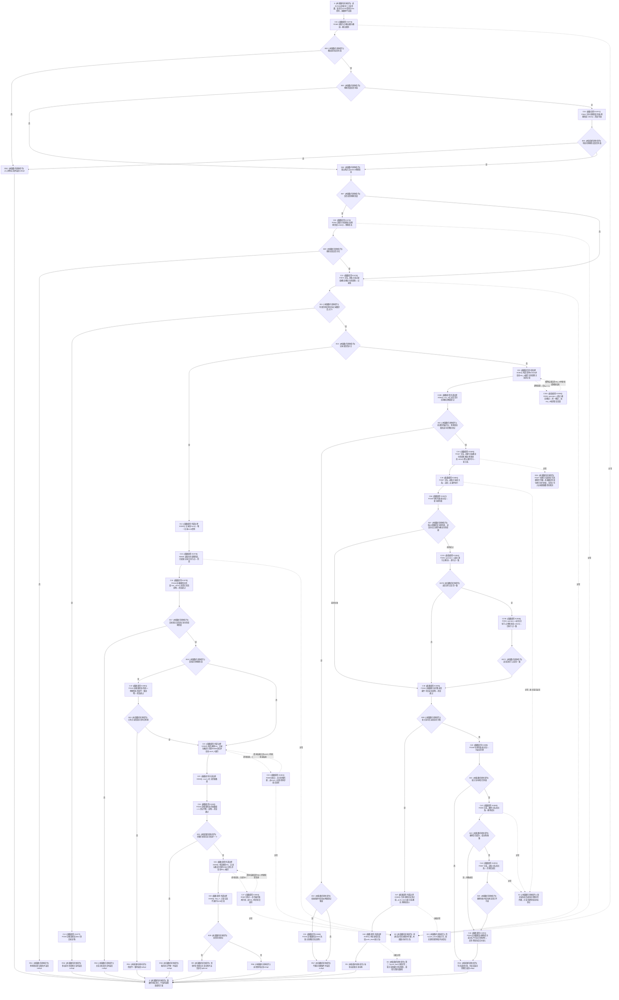

# CF-L6-0038 `概念图服务::确保概念生命周期_已加锁` 现状流程图

图类型：现状流程图
代码版本：`a48a70b2d678dea64dd8228adb4f26f0badd9506`
覆盖文件：`海中鱼巣/领域/概念图服务.h:3042-3137`
唯一根函数：F0359
完整签名：`std::optional<海中鱼巣::关系句柄> 海中鱼巣::概念图服务::确保概念生命周期_已加锁(海中鱼巣::节点句柄 概念, std::optional<海中鱼巣::概念生命周期阶段> 预期阶段, bool 允许创建, std::vector<海中鱼巣::关系句柄>& 本轮新增关系组)`
参数：`概念`、`预期阶段` 和 `允许创建` 按值复制；`本轮新增关系组` 是调用方拥有、可变、非拥有借用，成功创建后追加新关系句柄；隐式 `this` 借用节点 / 关系读取能力、生命周期状态投影和生命周期关系登记组
返回结果：已有唯一、阶段符合且服务登记唯一的生命周期关系时返回登记中的关系句柄；无当前关系且允许创建、预期状态存在、无残留登记、创建与读回完整时创建关系并登记后返回新句柄；其余分支返回 `nullopt`
锁前置：函数名包含 `_已加锁`，但函数体不取得、验证或释放活动图锁 / 图写锁；当前已登记 F0182 调用方在调用前持有活动图独占锁和图写锁。本文不把命名或其它未展开调用方伪写成已验证持锁事实
已登记调用方：F0182 的 E0751
直接项目函数：F0369、F0641、F0354、F0575、F0184 七个调用点、R0605、R0606、R0607、F0167、F0587 两个根函数调用点、F0168 两个调用点、F0590，以及 F0051 三个完整节点句柄比较点；对应 E1873—E1892、E1906
外部边界：X0382，聚合 `optional`、vector、迭代器、`count_if` / `find_if` / `any_of`、lambda 闭包构造与调用驱动、比较、短路、两个 `push_back`、局部值和返回生命周期
未解析项目调用：无；R0606 / R0607 lambda 内部的 F0587 调用留待各自展开，不在 F0359 重复加边
调用图：`流程图/代码流程图/00_调用知识图谱.md`
逐行映射表：`流程图/代码流程图/L6/CF-L6-0038_概念图服务确保概念生命周期_已加锁_逐行代码映射表.md`
输入契约 / 调用语境表：本文“调用语境与非成功分账”
非成功返回二分审查表：本文“调用语境与非成功分账”
偏差清单：本文“当前边界与规范核对”
依据提交 / 结构化消息：冻结源码提交 `a48a70b2d678dea64dd8228adb4f26f0badd9506`；起点 HEAD `f46c551547d44a70ce8ef9595a055b8d9a9ec3c8` 的目标源码 blob 相同；源码 blob `dc4bd08f99622b3380c91dd15258fc8ab2e1b9c6`；Clang 候选与逐行源码复核
结构读取与写入：读取概念类别、阶段状态、当前关系 12 和服务登记；创建路径经 F0167 写一条关系 12，再向服务登记 vector 和调用方清理 vector 各追加一项。失败清理经 F0590 删除新关系
逻辑内返回：概念或预期阶段无效、预期状态缺失、创建不允许或创建路径缺少预期状态时在本函数写入前返回；已有完整同义关系时返回当前句柄
内部错误：多条当前关系、关系目标未登记、阶段与预期不一致、关系存在但服务登记不唯一、关系已失效但登记残留、创建后读回不一致及失败清理不完整均进入 F0184 或关联追根因路径
异常：未声明 `noexcept` 且不捕获。创建前的项目读取、算法 / lambda 或容器操作异常直接传播且本函数尚未写关系。F0167 返回有效关系后，E1886 读回异常会留下新关系且尚无服务登记；E1890 删除或 E1891 清理读回异常可能留下清理状态未确认。3134 行第一个 `push_back` 分配异常会留下新关系但没有服务登记和调用方清理项；3135 行第二个 `push_back` 分配异常会留下新关系及服务登记，但调用方清理项缺失
并发 / 幂等：函数体没有锁；关系仓多次读取和两个登记扫描不构成同一仓库快照。已有关系路径在稳定结构下幂等返回；创建路径依赖调用方串行化，函数自身不能阻止并发重复创建或 vector 迭代失效
验证入口：`概念图服务.h:3042-3137`、E0751、E1873—E1892、X0382
验证输出：冻结源码逐行确认 96 行完整覆盖；本批不运行构建或程序
依据：`规范/0050_项目通用机器逻辑与禁止性规则总纲_20260721.md`、`规范/0600_代码函数流程图应用与维护规范.md`、`规范/4010_子规范_统一仓库稳定句柄与通用关系索引边界.md`、`规范/4030_子规范_基础信息服务分层与领域写授权.md`、`规范/4040_子规范_不透明结构事务候选确认撤销与最后发布.md`、`规范/4050_子规范_入口拒绝逻辑内结果与内部逻辑错误.md`、`规范/7140_子规范_概念身份生命周期退役删除与活动投影分账.md`
不得作为施工许可：是
不得宣称：返回关系句柄已经证明关系 12 顺序号、连续生命周期版本、状态领域固定身份、概念完整身份、事务发布或异常安全闭环符合正式规范

## 流程图

## 项目源码调用合同

| 调用边 | 被调函数 | 当前位置 / 条件 |
| --- | --- | --- |
| E1873 | F0369 `读取节点概念类别(节点句柄) const` | 3047；总调用 |
| E1874 | F0641 `生命周期阶段有效(阶段)` | 3048；仅预期阶段有值 |
| E1875 | F0354 `读取生命周期状态(阶段) const` | 3054；仅预期阶段有值；[被调图](CF-L6-0033_概念图服务读取生命周期状态_现状流程图.md) |
| E1876 | F0575 `关系仓库::获取关系记录组(节点句柄,关系类型) const` | 3060；准入完成后 |
| E1877 / E1879 / E1880 / E1882 / E1884 / E1888 / E1892 | F0184 `追根因检查` | 3062、3068、3072、3090、3114、3121、3128；[被调图](../L5/CF-L5-0064_追根因检查_现状流程图.md) |
| E1878 | R0605 `读取生命周期阶段_已加锁(节点句柄) const` | 3067；存在一条当前关系 |
| E1881 / E1883 | R0606 / R0607 两个非平凡捕获 lambda | 3078 / 3095；由标准库算法按登记项同步调用 |
| E1885 | F0167 `关系仓库::创建关系(类型,源,目标,顺序号=0)` | 3119；创建条件全部通过；[被调图](../L5/CF-L5-0047_创建关系_现状流程图.md) |
| E1886 / E1891 | F0587 `关系仓库::读取关系(关系句柄) const` | 3120 无条件写后读回；3129 仅删除返回假后清理读回 |
| E1887 / E1889 | F0168 `句柄有效(关系句柄)` | 3121 写后检查；3127 决定是否清理 |
| E1890 | F0590 `关系仓库::删除关系(关系句柄)` | 3129；读回失败且新句柄有效 |
| E1906 | F0051 `operator==(const 节点句柄&,const 节点句柄&)` | 3111 由 `any_of` 按需比较登记概念；3124 / 3125 在写后读回短路链中比较源节点和目标节点；[被调图](../L4/CF-L4-0015_节点句柄_operator_equal_现状流程图.md) |

R0606 / R0607 的完整参数均为 `const 海中鱼巣::概念图清理准备包::生命周期关系登记材料& 登记`，闭包捕获均为 `[this, &记录, &概念]`；其内部 F0587 调用等待 lambda 自身展开。

## 调用语境与非成功分账

| 语境 | 返回 / 异常 | 二分口径 | 结构后果 |
| --- | --- | --- | --- |
| 无效概念、非法预期阶段、预期状态缺失 | `nullopt` | 写前入口拒绝 | 零本函数写入 |
| 已有唯一、阶段和登记均一致的关系 | 当前关系句柄 | 幂等读回 | 零新增写入 |
| 多关系、未登记状态、阶段不符、登记不唯一或残留登记 | `nullopt` | 内部结构错误 / 追根因解决 | 当前权威关系与登记保持原状 |
| 不允许创建或未提供可读预期状态，且无残留登记 | `nullopt` | 协议允许的不创建结果 | 零本函数写入 |
| 新关系写后读回失败 | `nullopt` | 内部逻辑错误 | 有效句柄时尝试删除；清理失败可留下关系 |
| 首个 / 第二个 `push_back` 分配异常 | 异常传播 | 异常安全缺口 | 分别留下未登记关系，或留下关系及服务登记但调用方清理项缺失 |

## 当前边界与规范核对

- `_已加锁` 只是函数身份的一部分；当前函数体无锁对象。只有逐个调用方复核后才能声明其实际持锁，本图不把命名当成锁事实。
- F0167 三实参调用使用默认顺序号 `0`；7140 要求关系 12 顺序号从 `1` 连续递增并表达生命周期版本，当前创建路径不符合该正式合同。
- 创建、读回、服务登记和调用方清理登记不是一个异常安全事务。两个 `push_back` 均可在关系已创建后分配失败，且当前函数没有捕获或撤销。
- 3128—3130 行进入 E1892 前，先求值 E1890；仅当删除返回假才求值 E1891。不得把 F0184 画在删除 / 读回之前。
- `count_if` 与 `find_if` 间、创建与读回间均没有本函数锁或统一仓库令牌；结果依赖调用方串行和外部结构稳定。
- 除 E0751 外，`概念图服务.h:4067` 属当前 `main` 不可达的未发布候选构造路径，不计入当前可达聚合边。
