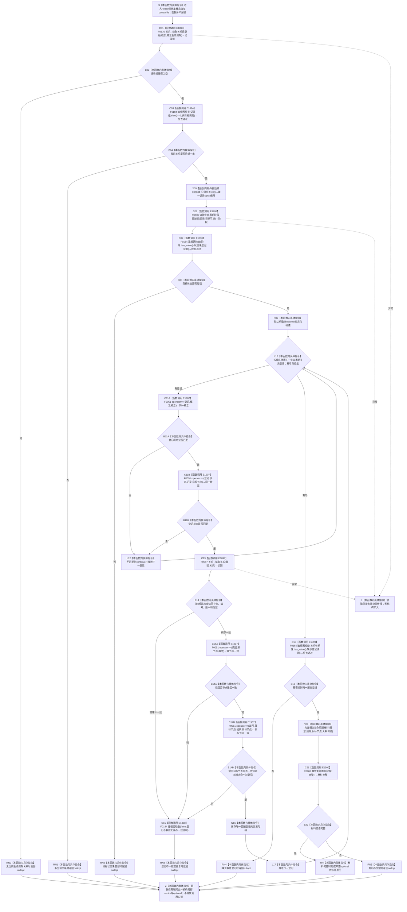

# CF-L6-0039 `概念图服务::读取概念生命周期_已加锁` 现状流程图

图类型：现状流程图
代码版本：`a48a70b2d678dea64dd8228adb4f26f0badd9506`
覆盖文件：`海中鱼巣/领域/概念图服务.h:3139-3175`
唯一根函数：F0360
完整签名：`std::optional<海中鱼巣::概念生命周期材料> 海中鱼巣::概念图服务::读取概念生命周期_已加锁(海中鱼巣::节点句柄 概念) const`
参数：`概念` 按值复制；隐式 const `this` 非拥有借用关系仓库、生命周期状态登记和生命周期关系服务登记
返回结果：恰有一条当前关系 12、目标状态已登记、服务登记恰一且完整读回、最终材料 `完整()` 时按值返回材料；无关系返回 `nullopt`，其它结构不一致也折叠为 `nullopt`
锁前置：函数名包含 `_已加锁`，但函数体不取得、验证或释放活动图锁 / 图写锁；已登记调用方的具体锁语境分别由各调用方图裁决
已登记调用方：F0182 的 E0752、F0353 的 E1856、F0362 的 E1910
直接项目函数：F0575、F0184 四个调用点、R0605、F0587 循环调用、R0608，以及 F0051 在三个源码行上的四次完整节点句柄比较；对应 E1893—E1900、E1907
外部边界：X0383，聚合 vector / optional / 迭代、引用绑定、短路比较、句柄复制、材料构造和三元返回生命周期
未解析项目调用：无
调用图：`流程图/代码流程图/00_调用知识图谱.md`
逐行映射表：`流程图/代码流程图/L6/CF-L6-0039_概念图服务读取概念生命周期_已加锁_逐行代码映射表.md`
输入契约 / 调用语境表：本文“调用语境与非成功分账”
非成功返回二分审查表：本文“调用语境与非成功分账”
偏差清单：本文“当前边界与规范核对”
依据提交 / 结构化消息：冻结源码提交 `a48a70b2d678dea64dd8228adb4f26f0badd9506`；起点 HEAD `f46c551547d44a70ce8ef9595a055b8d9a9ec3c8` 的目标源码 blob 相同；源码 blob `dc4bd08f99622b3380c91dd15258fc8ab2e1b9c6`；Clang 候选与逐行源码复核
结构读取与写入：读取关系 12 当前记录、生命周期状态登记、服务关系登记及登记关系读回；只构造值式材料，零机器结构写入
逻辑内返回：普通候选语境中无当前关系返回空；正式当前概念前置成立时同一空值属于生命周期缺失内部错误
内部错误：多当前目标、状态未登记、服务登记与关系不一致 / 重复 / 缺失，或最终材料不完整
异常：未声明 `noexcept` 且不捕获；F0575、R0605、循环 F0587 或其它读取异常直接传播；函数零写入，局部 vector / optional 按 RAII 析构
并发 / 幂等：函数体无锁；关系组读取、逐登记关系读回和状态投影读取不形成同一快照。稳定结构下重复读取结果相同；并发变化可能形成混合时点或迭代失效
验证入口：`概念图服务.h:3139-3175`、E0752 / E1856 / E1910、E1893—E1900 / E1907、X0383
验证输出：冻结源码逐行确认 37 行完整覆盖；本批不运行构建或程序
依据：`规范/0050_项目通用机器逻辑与禁止性规则总纲_20260721.md`、`规范/0600_代码函数流程图应用与维护规范.md`、`规范/4010_子规范_统一仓库稳定句柄与通用关系索引边界.md`、`规范/4050_子规范_入口拒绝逻辑内结果与内部逻辑错误.md`、`规范/7140_子规范_概念身份生命周期退役删除与活动投影分账.md`
不得作为施工许可：是
不得宣称：返回材料已证明状态固定稳定身份、关系 12 连续版本、概念完整身份、统一事务快照或生命周期恢复闭环成立

## 流程图

## 项目源码调用合同

| 调用边 | 被调函数 | 当前位置 / 条件 |
| --- | --- | --- |
| E1893 | F0575 `关系仓库::获取关系记录组(节点句柄,关系类型) const` | 3140；总调用 |
| E1894 / E1896 / E1898 / E1899 | F0184 `追根因检查` | 3144、3149、3165、3170；[被调图](../L5/CF-L5-0064_追根因检查_现状流程图.md) |
| E1895 | R0605 `读取生命周期阶段_已加锁(节点句柄) const` | 3148；关系恰一 |
| E1897 | F0587 `关系仓库::读取关系(关系句柄) const` | 3157；仅概念和状态匹配的每个登记调用 |
| E1900 | R0608 `概念生命周期材料::完整() const` | 3174；唯一登记已形成后 |
| E1907 | F0051 `operator==(const 节点句柄&,const 节点句柄&)` | 3154 在同一短路条件中先后比较登记概念和登记状态，共两次；3162 / 3163 在读回短路链中分别比较源节点和目标节点，共四次调用、三个源码行；[被调图](../L4/CF-L4-0015_节点句柄_operator_equal_现状流程图.md) |

## 已登记调用方

| 调用方 | 调用边 | 位置 / 前置 | 调用方图 |
| --- | --- | --- | --- |
| F0182 | E0752 | `概念图服务.h:1007`；四根生命周期确保全部成功，调用方持活动图独占锁和图写锁 | [F0182](../L5/CF-L5-0062_概念图服务初始化活动概念生命周期_现状流程图.md) |
| F0353 | E1856 | `概念图服务.h:1866`；外层持活动图共享锁并已读到概念类别 | [F0353](CF-L6-0032_概念图服务读取概念生命周期_现状流程图.md) |
| F0362 | E1910 | `概念图服务.h:4212`；活动快照基本形状、根登记和生命周期状态登记完整性均已通过，逐概念验证生命周期 | F0362 待处理；调用边已按发布关系表冻结 |

## 调用语境与非成功分账

| 语境 | 当前空值来源 | 二分口径 | 结构后果 |
| --- | --- | --- | --- |
| 普通候选概念尚无生命周期关系 | 记录组为空 | 可允许的空候选，取决于调用方合同 | 零写入 |
| F0182 初始化成功后的四根读回 | 关系缺失、多目标、状态未登记、登记不一致 / 缺失 | 前置成立后的内部错误 | 零写入，停止初始化成功路径 |
| F0353 已确认概念类别后的读取 | 任一结构缺失 | 当前概念生命周期内部结构不完整候选 | 零写入 |
| F0362 验证活动快照逐概念读取 | 任一结构缺失 | 活动快照结构验证失败；调用方返回 `false` | 零写入 |
| 最终材料 `完整()` 返回假 | `nullopt` | 前述检查通过后的内部错误，但当前未再调用 F0184 | 零写入 |

## 当前边界与规范核对

- `_已加锁` 不等于函数体已经持锁；F0182 与 F0353 的锁语境不同，其它源码调用方必须逐个展开，不能由函数名统一推断。
- 服务登记属于 7140 的可重建投影；当前读取要求登记存在且唯一，登记缺失会使权威关系不可读，未达到“清空投影后权威读取等价”的正式合同。
- 关系记录组、状态登记和每个登记句柄读回分多次取得，函数体没有统一事务令牌或锁；并发变化可形成混合时点。
- F0360 是内部读取辅助函数，同一 `nullopt` 混合无关系候选和多种内部结构错误；4050 的公开强类型结果责任归属公开调用方 F0353，本文只记录 F0353 不得把该折叠结果直接暴露为不可区分的公开结果，不把 private helper 本身误判为公开入口违规。
- 除 E0752 / E1856 / E1910 外，源码一参数调用点还包括 1294、1350、1509、1559、1880、1932、1968、2015、2058、2193、2245、2887、3693、3700；这些调用方尚未进入当前 `main` 可达函数表或尚未展开，不计入本批聚合边。
