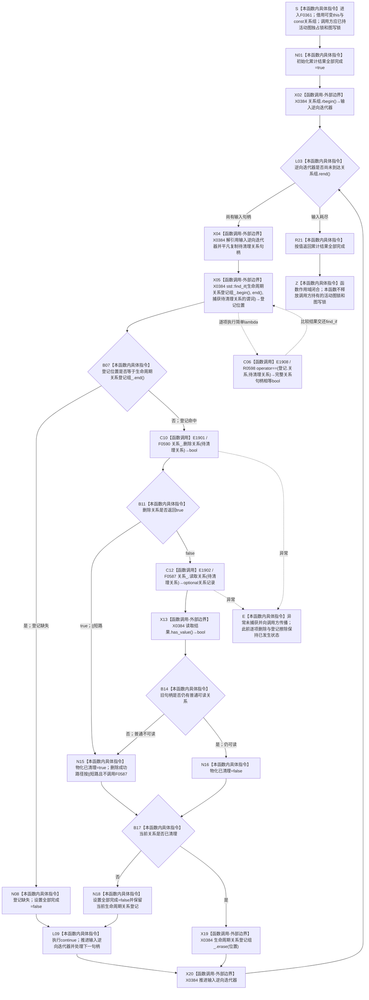

# CF-L6-0040 `概念图服务::清理生命周期关系_已加锁` 现状流程图

图类型：现状流程图
代码版本：`a48a70b2d678dea64dd8228adb4f26f0badd9506`
覆盖文件：`海中鱼巣/领域/概念图服务.h:3220-3240`
唯一根函数：F0361
完整签名：`bool 海中鱼巣::概念图服务::清理生命周期关系_已加锁(const std::vector<海中鱼巣::关系句柄>& 关系组)`
参数：隐式 `this` 是调用方持有、调用期有效的可变 `概念图服务` 非拥有借用；`关系组` 是调用方拥有、调用期保持有效且不被本函数修改的 const vector 非拥有借用；函数按逆序把每个输入关系句柄复制为局部值
返回结果：以 `true` 初始化累计结果，按输入 vector 逆序尽力处理全部关系；仅当每个输入句柄都能在 `生命周期关系登记组_` 找到对应登记，并且 F0590 删除成功，或 F0590 返回 `false` 后 F0587 普通读取该旧句柄无当前可读关系时，才擦除对应登记；任一输入缺少登记或删除失败后该旧句柄仍可读时保留相应登记、把累计结果置为 `false` 并继续；最终按值返回累计结果，空输入返回 `true`
非法值 / 拒绝：无显式入口校验或具名拒绝；无效、重复、错域、旧版本或不属于本轮新增集的句柄只通过“登记是否命中、删除结果、普通读取是否有值”间接收口，同一个 `false` 不携带失败句柄或原因
已登记调用方：F0182 的 E0753；源码另有 `概念图服务.h:4163` 一个尚未冻结调用方身份的调用点，只作待顶层裁决证据
直接项目函数：R0598 `关系句柄 operator==`、F0590 `关系仓库::删除关系(关系句柄)`、F0587 `关系仓库::读取关系(关系句柄) const`，共 3 个唯一函数、3 条冻结调用边；E1908 由 `std::find_if` 对每个登记项按需回调，E1901 总在登记命中后调用，E1902 仅在 E1901 返回 `false` 时按 `||` 短路规则调用
外部边界：X0384，聚合 `std::vector` 的 `rbegin` / `rend` / 逆向迭代 / `begin` / `end` / `erase`、`std::find_if`、简单捕获 lambda、关系句柄平凡复制、登记迭代器和 `std::optional<关系记录>::has_value`；lambda 内的项目关系句柄相等运算独立记为 E1908 / R0598
未解析项目调用：无；X0384 只承载标准库、容器、迭代器和简单 lambda 调度边界，lambda 的唯一项目调用已经解析为 R0598
调用图：`流程图/代码流程图/00_调用知识图谱.md`
逐行映射表：`流程图/代码流程图/L6/CF-L6-0040_概念图服务清理生命周期关系_已加锁_逐行代码映射表.md`
输入契约 / 调用语境表：本文“调用语境与非成功分账”
非成功返回二分审查表：本文“调用语境与非成功分账”
偏差清单：本文“当前边界与规范核对”；共享偏差审计由顶层智能体统一收口
依据提交 / 结构化消息：冻结源码提交 `a48a70b2d678dea64dd8228adb4f26f0badd9506`；当前 HEAD `f46c551547d44a70ce8ef9595a055b8d9a9ec3c8` 的目标源码 blob 相同；源码 blob `dc4bd08f99622b3380c91dd15258fc8ab2e1b9c6`；Clang 候选 JSON 与逐行源码复核
入口前置：`_已加锁` 约定调用方在整个调用期持有 `活动图锁_` 独占所有权和 `图写锁_`；F0182 在 `概念图服务.h:990-991` 按该顺序取得两把锁后调用。本函数自身不取得、验证或释放这两把锁，也不取得生命周期状态锁；关系仓库锁只由 F0590 / F0587 各自内部短期取得
结构读取与写入：逆序消费精确输入句柄；通过 F0590 逐条把关系仓库当前有效记录改为已删除并推进版本，或在删除返回 `false` 后通过 F0587 检查旧句柄是否仍有普通可读当前记录；确认删除成功或旧句柄普通不可读后，逐条擦除非权威 `生命周期关系登记组_` 投影。每条关系即时改变并可见，不存在覆盖整组的统一关系仓库事务或最后发布点
逻辑内返回：空关系组返回 `true`；登记存在且关系已普通不可读时，清除残留登记并继续，可视为本次清理的幂等收敛路径；F0587 空值只说明旧完整句柄无法普通读取，不证明关系编号的审计记录物理不存在
内部错误：输入句柄在服务登记中缺失，或 F0590 返回 `false` 且 F0587 仍能普通读到该关系时，当前代码把累计结果置为 `false`、继续处理其余句柄并最终交调用方追根因；调用方已把这些句柄登记为本轮新增关系，故该失败属于补偿前置成立后的内部结构 / 清理异常
生命周期与资源释放：输入 vector 及其元素由调用方拥有；本函数只持局部 bool、句柄副本和迭代器。擦除登记后不再使用被擦除位置，下一轮重新查找；输入 vector 未被修改，逆向迭代器保持有效。本函数不拥有调用方两把锁，也不负责释放
异常：未声明 `noexcept` 且不捕获；F0590 或 F0587 的异常直接向调用方传播。此前迭代已经完成的关系删除和登记擦除不会由本函数回滚，当前迭代及后续迭代不再继续；关系句柄和三句柄登记材料均为平凡值，当前逆向迭代、`find_if` 句柄比较和 vector 擦除搬移不抛出
并发 / 幂等：调用方的活动图独占锁和图写锁串行化概念图服务内相关登记与活动投影写入，但不把整组 F0590 / F0587 操作合并为一个关系仓库事务；每次删除和后继读取分别取得关系仓库内部锁。相同无重复输入在关系已删除而旧登记仍存在时可通过读取空值收敛；输入含重复句柄时，第一次成功擦除登记后，后续重复项因登记缺失把累计结果置为 `false`
验证入口：`概念图服务.h:3220-3240`、E0753、E1901、E1902、E1908、X0384、源码调用点 `:4163`
验证输出：候选工具识别逆向 vector 迭代、登记 `find_if`、缺失继续、E1901 / E1902 的 `||` 短路、失败继续、登记擦除和累计返回；Clang 把头文件位置显示为包含方 `.ixx`，本图以实际头文件行号和 blob 裁决；本批不运行构建、项目程序或业务自检
依据：`规范/0050_项目通用机器逻辑与禁止性规则总纲_20260721.md`、`规范/0600_代码函数流程图应用与维护规范.md`、`规范/4010_子规范_统一仓库稳定句柄与通用关系索引边界.md`、`规范/4040_子规范_不透明结构事务候选确认撤销与最后发布.md`、`规范/4050_子规范_入口拒绝逻辑内结果与内部逻辑错误.md`、`规范/4060_子规范_非权威缓存统计失效与确定重建.md`、`规范/7140_子规范_概念身份生命周期退役删除与活动投影分账.md`
不得作为施工许可：是
不得宣称：返回 `true` 已证明关系 12 的权威历史完整、关系编号物理不存在、整组清理具有原子撤销 / 统一发布语义、活动快照已经恢复前态、全部异常均已补偿，或返回 `false` 已精确指出失败关系与原因

## 流程图

## 直接被调函数

| 调用边 | 被调函数 | 当前调用点 | 参数 / 结果 | 条件 | 被调图 |
| --- | --- | --- | --- | --- | --- |
| E1908 | R0598 `bool 海中鱼巣::operator==(const 海中鱼巣::关系句柄& 左, const 海中鱼巣::关系句柄& 右)` | `概念图服务.h:3226`；`std::find_if` 的简单 lambda | `登记.关系`、`待清理关系` 两个 const 句柄借用 → `bool` | 对登记投影中的每个候选项按需调用，首个相等项后停止 | 待生成 |
| E1901 | F0590 `bool 海中鱼巣::关系仓库::删除关系(海中鱼巣::关系句柄 关系)` | `概念图服务.h:3231` | `this=&关系_`、`待清理关系` → `bool` | 当前输入句柄在生命周期关系登记组中命中；每个命中项一次 | 待生成 |
| E1902 | F0587 `std::optional<海中鱼巣::关系记录> 海中鱼巣::关系仓库::读取关系(海中鱼巣::关系句柄 关系) const` | `概念图服务.h:3232` | `this=&关系_`、`待清理关系` → `optional<关系记录>` | 仅 E1901 返回 `false` 时调用；删除成功时按 `||` 短路 | 待生成 |

## 已登记调用方与未冻结调用点

| 调用方身份 | 调用边 | 位置 / 前置 | 调用方图 / 裁决状态 |
| --- | --- | --- | --- |
| F0182 | E0753 | `概念图服务.h:1016`；F0359 确保或 F0360 读回失败，且调用方仍持活动图独占锁与图写锁 | [F0182](../L5/CF-L5-0062_概念图服务初始化活动概念生命周期_现状流程图.md) |
| 待顶层裁决 | 未分配 | `概念图服务.h:4163`；清理未发布候选中的专用关系处理完成后，传入本轮新增生命周期关系组 | 所属项目函数 `清理未发布候选_已加锁` 尚无 F 身份，不自行编号或计入聚合调用边 |

## 调用语境与非成功分账

| 调用语境 | 输入来源与前置 | 当前结果 | 二分口径 | 结构后果 |
| --- | --- | --- | --- | --- |
| F0182 初始化失败补偿 | `本轮新增关系组` 只收集当前调用期 F0359 新建并登记的生命周期关系；调用方持活动图独占锁和图写锁 | 全部句柄逐项删除或已普通不可读且登记已擦除时返回 `true` | 补偿成功的内部收口；不证明权威历史或统一事务恢复 | 关系逐条进入已删除 / 旧句柄不可读，登记投影逐条擦除 |
| F0182 补偿异常 | 本轮新增句柄应同时存在于服务登记和关系仓当前结构 | 登记缺失，或删除失败后旧句柄仍可读，最终返回 `false` | 前置成立后的内部逻辑错误，必须追根因 | 失败项登记保留；其它项继续尝试清理，可能形成部分清理 |
| 关系已经普通不可读但登记残留 | 登记命中；F0590 返回 `false`，F0587 返回空 | 清除登记并继续，当前项视为已清理 | 允许的幂等收敛路径；空值原因仍被折叠 | 只擦除非权威登记投影；不证明审计记录不存在 |
| 空输入 | 调用方本轮尚未形成任何生命周期关系 | 不进入循环并返回 `true` | 零写入逻辑内结果 | 无结构变化 |
| 重复输入句柄 | 输入 vector 同一句柄出现两次 | 第一次成功后擦除登记，后续重复项登记缺失并返回累计 `false` | 输入合同或调用方收集异常，追根因 | 第一次可能已删除关系并擦除登记；后续不重复写关系仓 |
| `概念图服务.h:4163` 未发布候选清理 | 调用方已先逆序处理专用关系，再传入新增生命周期关系组 | 同上；调用方身份和完整前置待展开 | 暂不新增调用边或提升为已闭合语境 | 当前函数仍执行逐项即时删除与登记擦除 |

## 当前边界与规范核对

- 7140 明确 `生命周期关系登记组_` 只是关系 12 的反向索引或调试投影。F0361 擦除登记不能证明关系 12 权威历史完整；F0587 对旧句柄返回空也不能证明关系编号的审计记录物理不存在。
- F0361 真实执行精确输入集的逆序、失败继续清理，但 F0590 对每条关系立即发布删除，整组没有 4040 的统一候选、确认、撤销或最后发布点。异常会越过剩余项，并保留此前已经发生的逐项删除和登记擦除。
- `删除关系(...) || !读取关系(...).has_value()` 严格短路：删除成功时不执行 F0587 读回；删除失败时，F0587 空值同时可能来自关系编号不存在、旧版本、非有效状态、错域或端点无效，当前代码把这些原因统一解释为旧句柄已清理。
- 调用方持有活动图独占锁和图写锁，只保护概念图服务内活动投影与登记写入；F0361 自身不取得这两把锁，也没有覆盖整组关系仓操作的长期仓库锁。F0590 与 F0587 分别取得关系仓库内部锁，两个调用之间不是统一读写快照。
- 返回 `false` 不会停止后续关系的清理，因而能够继续尝试缩小残留；但裸 bool 不返回失败句柄、已删除组、保留登记组或异常分类，调用方必须另行读回才能定位根因。
