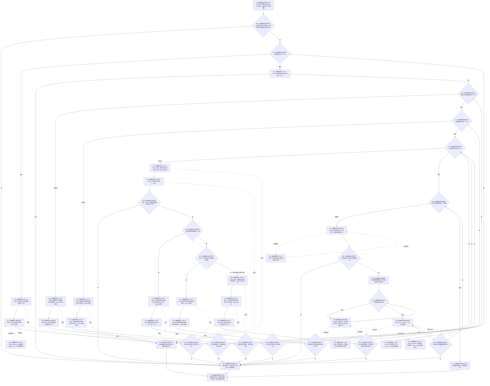

# CF-L6-0041 `概念图服务::验证活动快照_已加锁` 现状流程图

图类型：现状流程图
代码版本：`1ca6b6c9c5e14d4fb5f39fcc20e1ac93992b7b0c`
覆盖文件：`海中鱼巣/领域/概念图服务.h:4195-4302`
唯一根函数：F0362
完整签名：`bool 海中鱼巣::概念图服务::验证活动快照_已加锁(const 海中鱼巣::概念活动快照& 快照) const`
参数：隐式 `this` 是调用方拥有、调用期有效的 const 服务借用；`快照` 是调用方拥有、调用期有效且不被修改的 const 借用
返回结果：本函数实际检查全部通过返回 `true`；首个形状、登记、生命周期、签名、关系或根可达检查失败返回 `false`
入口前置：全部源码调用点至少持有 `活动图锁_` 的共享或独占所有权；本函数不取得、验证或释放该锁，不能统一声称调用方都持有 `图写锁_`
已登记调用方：F0182 / E0756
直接项目函数：R0531、F0051、F0358、F0360、F0369、R0532、F0587、R0604、R0523、R0533、F0190、R0522、R0518，共 13 个
外部边界：X0385，承载 vector / optional 观察、`find` / `any_of` / `sort` / `unique`、简单 lambda 与局部图遍历容器生命周期
未解析项目调用：无
调用图：`流程图/代码流程图/00_调用知识图谱.md`
逐行映射表：`流程图/代码流程图/L6/CF-L6-0041_概念图服务验证活动快照_已加锁_逐行代码映射表.md`
输入契约 / 调用语境表：本文“非成功分账”
非成功返回二分审查表：本文“非成功分账”
偏差清单：本文“当前边界与规范核对”
依据提交 / 结构化消息：冻结源码提交 `1ca6b6c9c5e14d4fb5f39fcc20e1ac93992b7b0c`；源码 blob `dc4bd08f99622b3380c91dd15258fc8ab2e1b9c6`；Clang/MSVC 候选成功抽取 254 个语句节点并由源码逐行复核
结构读取与写入：只读根登记、生命周期登记、节点仓、关系仓和传入快照；零机器事实写入
逻辑内返回：无普通业务拒绝；当前全部源码调用语境把 `false` 作为投影或权威读回不一致并追根因
异常：未声明 `noexcept` 且不捕获；容器分配、算法或被调函数异常直接传播，本函数零机器事实写入
依据：`规范/0050_项目通用机器逻辑与禁止性规则总纲_20260721.md`、`规范/0600_代码函数流程图应用与维护规范.md`、`规范/4010_子规范_统一仓库稳定句柄与通用关系索引边界.md`、`规范/4020_子规范_领域类型化数据记录与组合读取投影边界.md`、`规范/7140_子规范_概念身份生命周期退役删除与活动投影分账.md`
不得作为施工许可：是
不得宣称：`true` 已证明活动快照是权威事实、与权威全集等价、四根固定身份完整、概念与签名一一对应或退役概念已退出投影

## 流程图

## 非成功分账

| 调用语境 | 前置 | `false` 后继 | 二分口径 |
| --- | --- | --- | --- |
| F0182 初始化活动概念生命周期 | 全部根生命周期就绪且活动快照存在；持活动图独占锁和图写锁 | 追根因检查后返回 `false` | 前置成立后的投影 / 权威读回不一致 |
| 其它源码调用点 | 至少持活动图共享或独占锁，并已形成待验证快照 | 返回内部不一致、空候选或执行清理 | 均不是普通业务拒绝；调用方负责隔离或丢弃后继 |

## 当前边界与规范核对

- 四根只核数量、登记命中和概念组包含；未核固定稳定主键、四类别各一、四根互异及本类权威结构。
- 概念组与签名组只比较数量；未证明概念唯一、签名概念唯一、集合一一对应，且未证明原签名等于规范化结果。
- 普通概念只要求生命周期存在；退役非根仍可能留在活动投影。
- 只验证快照已经列出的节点、签名和关系，没有从权威节点、签名记录、关系 9—11 与生命周期全集反向证明无缺项。
- 根和生命周期状态成立仍依赖非权威登记投影；7140 明确登记不得独立证明固定身份。
- 裸 bool 不携带失败节点、关系或原因，也不自行丢弃 / 隔离矛盾投影；必须逐调用方审计后继。
