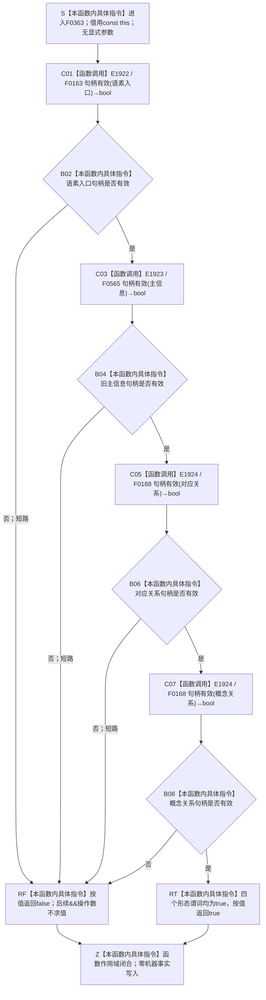

# CF-L6-0042 `语素概念入口创建结果::成功` 现状流程图

图类型：现状流程图
代码版本：`1ca6b6c9c5e14d4fb5f39fcc20e1ac93992b7b0c`
覆盖文件：`海中鱼巣/领域/语素服务.h:34-39`
唯一根函数：F0363
完整签名：`bool 海中鱼巣::语素概念入口创建结果::成功() const`
参数：无显式参数；隐式 `this` 是调用方拥有、调用期有效且不被修改的 const 结果材料借用
返回结果：严格按源码从左到右检查 `语素入口`、`主信息`、`对应关系`、`概念关系` 四个句柄；四项形态均有效才返回 `true`，任一项无效立即短路并返回 `false`
非法值 / 拒绝：没有具名拒绝结果；无效句柄只折叠为裸 `false`
已登记调用方：F0183、F0189、F0220、F0256、F0350
直接项目函数：F0163、F0565、F0168，共 3 个唯一身份、4 个调用点
外部边界：无
未解析项目调用：无
调用图：`流程图/代码流程图/00_调用知识图谱.md`
逐行映射表：`流程图/代码流程图/L6/CF-L6-0042_语素概念入口创建结果成功_逐行代码映射表.md`
输入契约 / 调用语境表：本文“调用语境与非成功分账”
非成功返回二分审查表：本文“调用语境与非成功分账”
偏差清单：本文“当前边界与规范核对”
依据提交 / 结构化消息：冻结源码提交 `1ca6b6c9c5e14d4fb5f39fcc20e1ac93992b7b0c`；Clang/MSVC 候选抽取成功并由源码逐行复核
结构读取与写入：只读取结果材料四个字段并执行值式句柄形态检查；零机器事实写入
逻辑内返回：调用方用 `false` 判断创建结果不可继续消费；本函数自身不区分入口拒绝、创建异常、部分写入或读回异常
内部错误：若调用方已经把该材料当作完整发布回执，任一字段无效应回到创建链追根因；本函数无法给出失败字段或结构状态
异常：四个句柄有效性函数均为值式形态检查；本函数没有容器分配或显式抛出点
依据：`规范/0050_项目通用机器逻辑与禁止性规则总纲_20260721.md`、`规范/0600_代码函数流程图应用与维护规范.md`、`规范/2210_根规范_语素入口_20260720.md`、`规范/4010_子规范_统一仓库稳定句柄与通用关系索引边界.md`、`规范/7200_子规范_基础信息语素信息关系整合_20260720.md`
不得作为施工许可：是
不得宣称：`true` 已证明入口角色、所属词、词性、入口类型、上下文、来源、版本、完整对应集合、完整概念追溯集合或事务发布成立

## 流程图

## 直接被调函数

| 调用边 | 被调函数 | 当前调用点 | 参数 / 结果 | 条件 | 被调图 |
| --- | --- | --- | --- | --- | --- |
| E1922 | F0163 `bool 海中鱼巣::句柄有效(const 海中鱼巣::节点句柄&)` | `语素服务.h:35` | `语素入口` const 借用 → `bool` | 函数进入后总是调用 | 已有 F0163 图 |
| E1923 | F0565 `bool 海中鱼巣::句柄有效(const 海中鱼巣::主信息句柄&)` | `语素服务.h:36` | `主信息` const 借用 → `bool` | E1922 返回 `true` | 待生成 |
| E1924 | F0168 `bool 海中鱼巣::句柄有效(const 海中鱼巣::关系句柄&)` | `语素服务.h:37,38` | 先 `对应关系`、后 `概念关系` const 借用 → 各自 `bool` | 前序全部为 `true`；第一个关系无效时第二个不调用 | 已有 F0168 图 |

## 调用语境与非成功分账

| 调用语境 | 当前前置 | `false` 后继 | 二分口径 | 结构后果 |
| --- | --- | --- | --- | --- |
| 初始化或自检消费创建结果 | 调用方取得一个值式 `语素概念入口创建结果` | 调用方停止把结果作为成功材料继续使用 | 结果材料形态不完整；真实原因必须回到创建链裁决 | 本函数零写入，不撤销任何既有结构 |
| 重复读取已保存结果 | 调用方再次调用 const 谓词 | 相同四字段产生确定相同 bool | 只属于局部形态读回 | 不证明字段对应的当前版本仍可由仓库读取 |

## 当前边界与规范核对

- 当前函数正确保持 `&&` 左到右短路；后序句柄检查只在前序成立时执行。
- 4010 要求完整句柄按仓库编号、本地编号和版本共同成立；F0163、F0565、F0168 只检查各分量非零，不能证明当前可读、类型、端点或版本一致。
- `主信息句柄` 属于已经退出的旧结构；其仍参与成功谓词，不能作为节点直接身份路线的正式完整回执。
- 2210 / 7200 要求入口角色、所属词、词性、入口类型、全部对应关系、全部概念追溯、上下文、版本和索引互证；本函数只检查四个句柄形态，未覆盖这些语义。
- 裸 `bool` 把入口拒绝、内部结构错误和可能的部分写入折叠为同一 `false`；它只能作为当前旧实现的局部谓词。
