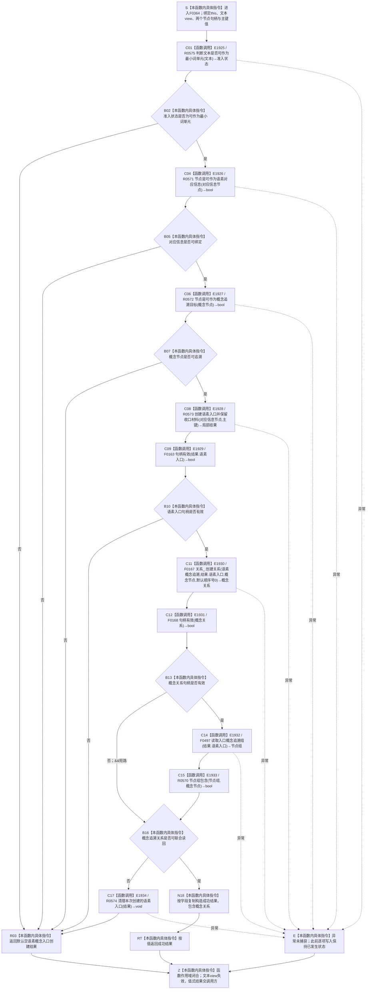

# CF-L6-0043 `语素服务::创建概念入口并保留收口材料` 现状流程图

图类型：现状流程图
代码版本：`1ca6b6c9c5e14d4fb5f39fcc20e1ac93992b7b0c`
覆盖文件：`海中鱼巣/领域/语素服务.h:91-130`
唯一根函数：F0364
完整签名：`海中鱼巣::语素概念入口创建结果 海中鱼巣::语素服务::创建概念入口并保留收口材料(std::wstring_view 文本, 海中鱼巣::节点句柄 对应信息节点, 海中鱼巣::节点句柄 概念节点, std::uint64_t 主键 = 0)`
参数：`文本` 为调用方拥有且调用期有效的只读 view；两个节点句柄和 `主键` 按值传入；`主键=0` 表示由旧实现自行形成或绑定
返回结果：三项写前准入通过后创建旧语素入口材料、创建关系 8 并读回；成功返回六字段结果，任一准入或后验失败返回默认空结果
已登记调用方：F0183、F0256
直接项目函数：R0575、R0571、R0572、R0573、F0163、F0167、F0168、F0497、R0570、R0574，共 10 条唯一边
外部边界：无；当前 `Debug|x64` 未定义 `HY_EGO_ENABLE_FAULT_TOLERANCE_CHECK`，四个容错宏展开为空语句
调用图：`流程图/代码流程图/00_调用知识图谱.md`
逐行映射表：`流程图/代码流程图/L6/CF-L6-0043_语素服务创建概念入口并保留收口材料_逐行代码映射表.md`
依据提交 / 结构化消息：冻结源码提交 `1ca6b6c9c5e14d4fb5f39fcc20e1ac93992b7b0c`；Clang/MSVC 候选抽取成功并由源码逐行复核
结构读取与写入：R0573 可能逐项创建旧主信息、语素节点、索引和关系 7；F0167 随后立即创建关系 8；R0574 只尝试清理 R0573 返回的旧入口材料
逻辑内返回：文本、对应信息或概念追溯目标写前不准入时返回空结果
内部错误：R0573 已产生结构后入口句柄无效，或关系 8 创建 / 联合读回失败；当前返回仍是默认空结果
依据：`规范/0050_项目通用机器逻辑与禁止性规则总纲_20260721.md`、`规范/0600_代码函数流程图应用与维护规范.md`、`规范/2210_根规范_语素入口_20260720.md`、`规范/4010_子规范_统一仓库稳定句柄与通用关系索引边界.md`、`规范/4040_子规范_不透明结构事务候选确认撤销与最后发布.md`、`规范/7200_子规范_基础信息语素信息关系整合_20260720.md`
不得作为施工许可：是
不得宣称：空结果已撤销全部写入，成功结果已完整发布 2210 / 7200 入口，或容错宏承担机器裁决

## 流程图

## 直接被调函数

| 调用边 | 被调函数 | 调用点 | 参数 / 结果 | 条件 |
| --- | --- | --- | --- | --- |
| E1925 | R0575 `判断文本是否可作为最小词单元` | 96 | `文本` → `语素准入状态` | 总是 |
| E1926 | R0571 `节点是可作为语素对应信息` | 101 | `对应信息节点` → `bool` | 文本准入 |
| E1927 | R0572 `节点是可作为概念追溯目标` | 106 | `概念节点` → `bool` | 对应信息准入 |
| E1928 | R0573 `创建语素入口并保留收口材料` | 111 | `对应信息节点,主键` → 旧入口结果 | 三项准入通过 |
| E1929 | F0163 `句柄有效(节点句柄)` | 112 | `结果.语素入口` → `bool` | R0573 返回后 |
| E1930 | F0167 `关系仓库::创建关系` | 115 | `关系8,入口,概念,默认顺序号0` → `关系句柄` | 入口句柄有效 |
| E1931 | F0168 `句柄有效(关系句柄)` | 116 | `概念关系` → `bool` | F0167 返回后 |
| E1932 | F0497 `读取入口概念追溯组` | 116 | `结果.语素入口` → `节点组` | E1931 为 true |
| E1933 | R0570 `节点组包含` | 116 | `节点组,概念节点` → `bool` | F0497 返回后 |
| E1934 | R0574 `清理本次创建的语素入口` | 119 | `结果` const 借用 → `void` | 联合读回失败 |

## 当前边界与规范核对

- 三项准入均发生在本函数第一笔写入前，属于当前窄实现的写前拒绝。
- R0573 与 F0167 是两个即时写入步骤，没有 4040 的统一候选、确认、逆序撤销和最后发布。
- 联合读回失败时 R0574 不接收刚创建的 `概念关系`，无法证明关系 8 已撤销；异常路径也不执行 R0574。
- 当前结果仍携带旧 `主信息句柄` 与裸 `主键`；没有冻结 2210 / 7200 要求的所属词、词性、入口类型、上下文、来源、版本和完整关系集合。
- 容错宏在当前配置展开为空语句，不产生项目调用、外部边界、机器事实或失败裁决。
