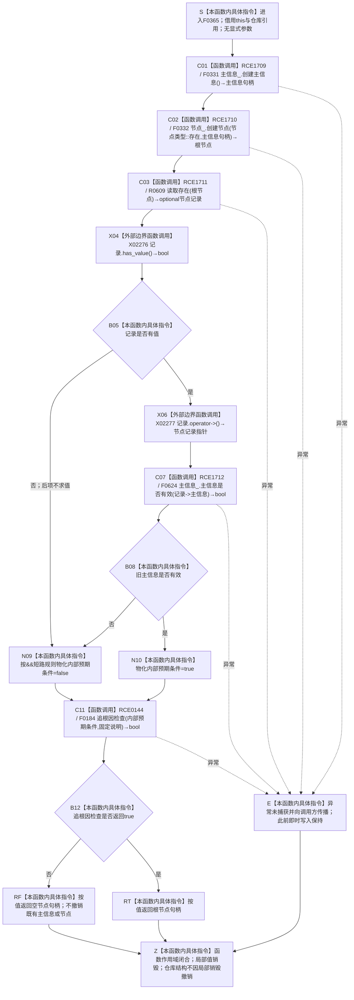

# CF-L6-0044 `存在服务::创建存在概念根` 现状流程图

图类型：现状流程图
代码版本：`a9fd8ba33963f8d177fae753e5b01cea0073d407`
覆盖文件：`海中鱼巣/领域/存在服务.h:103-112`
唯一根函数：F0365
完整签名：`海中鱼巣::节点句柄 海中鱼巣::存在服务::创建存在概念根()`
参数：无显式参数；隐式 `this` 为调用方拥有且调用期有效的 `存在服务` 借用，成员 `主信息_`、`节点_`、`关系_` 均为构造期绑定、由外部拥有且生命周期覆盖本次调用的仓库引用；本函数不使用 `关系_`
返回结果：旧结构主信息和 `节点类型::存在` 节点即时创建并读回成功时，按值返回根节点句柄；任一创建、读回或旧主信息有效性条件不成立时返回空节点句柄
非法值 / 拒绝：没有外部输入和写前拒绝；空主信息句柄、空根节点句柄、读回无记录或旧主信息无效都在写入已经开始后折叠为空节点句柄，属于内部结构失败
已登记调用方：F0185 `概念图初始化服务::初始化四个根()::<lambda@初始化.概念图.ixx:105>::operator()() const`
调用方流程图：`流程图/代码流程图/L5/CF-L5-0065_创建存在概念根lambda_现状流程图.md`
可达排除：`概念图服务.h:3995` 的同名调用位于当前未接入 `main` 可达闭包的旧候选创建函数，不作为本轮主程序可达入边
直接项目函数：F0331、F0332、R0609、F0624、F0184，共 5 条项目调用边
外部边界：X02276、X02277，共 2 个身份、2 个调用点
未解析项目调用：无
调用图：`流程图/代码流程图/00_调用知识图谱.md`
逐行映射表：`流程图/代码流程图/L6/CF-L6-0044_存在服务创建存在概念根_逐行代码映射表.md`
输入契约 / 调用语境表：本文“调用语境与非成功分账”
非成功返回二分审查表：本文“调用语境与非成功分账”
偏差清单：本文“当前边界与规范核对”
依据提交 / 结构化消息：冻结源码提交 `a9fd8ba33963f8d177fae753e5b01cea0073d407`；主程序可达关系表已经逐调用点修正无令牌重载并由源码再次复核
验证输出：四文件逐行尾随空白检查 PASS，`git diff --no-index --check` 零空白诊断；`python .\tools\check_specs.py --strict` PASS（101 份目录项）；本文恰有一个 Mermaid fenced block、零 HTML 引用和零抽象执行节点
结构读取与写入：F0331 即时创建旧主信息；F0332 随后即时创建普通存在节点；R0609 与 F0624 只读回当前旧结构；没有统一未发布候选、撤销或最后发布
逻辑内返回：无；函数没有写前材料拒绝、候选为空或协议允许的等待结果
内部错误：第一笔创建后任一后继结果不成立，F0184 只返回同一条件并可作非权威诊断，随后函数返回空句柄；已经创建的主信息或节点不撤销
异常：函数不捕获异常；仓库许可、锁、容器分配、被调函数或启用后的诊断路径抛出时，异常向调用方传播，此前即时写入保持已发生状态
幂等 / 并发：没有同义查找、稳定键复用或幂等键；每次调用都尝试创建新主信息和新节点；两个仓库调用各自同步，但本函数没有覆盖两次写入和读回的统一事务边界，并发调用可形成多个普通存在节点
依据：`规范/0050_项目通用机器逻辑与禁止性规则总纲_20260721.md`、`规范/0600_代码函数流程图应用与维护规范.md`、`规范/1140_根规范_存在节点_20260720.md`、`规范/4010_子规范_统一仓库稳定句柄与通用关系索引边界.md`、`规范/4040_子规范_不透明结构事务候选确认撤销与最后发布.md`、`规范/7110_子规范_存在根概念元特征_20260720.md`、`规范/7140_子规范_概念身份生命周期退役删除与活动投影分账.md`
不得作为施工许可：是
不得宣称：成功返回已建立稳定存在根身份、存在命名域固定主键、概念签名关系 9、生命周期、幂等唯一根、完整事务发布或节点直接身份结构

## 流程图

## 直接被调函数与外部边界

| 调用边 | 被调函数 / 外部边界 | 当前调用点 | 参数 / 结果 | 条件 | 被调图 |
| --- | --- | --- | --- | --- | --- |
| RCE1709 | F0331 `主信息仓库::创建主信息()` | `存在服务.h:104` | `this=&主信息_`，无显式参数 → `主信息句柄` | 函数进入后总是调用 | `L6/CF-L6-0011_主信息仓库创建主信息_现状流程图.md` |
| RCE1710 | F0332 `节点仓库::创建节点(节点类型, 主信息句柄)` | `存在服务.h:105` | `this=&节点_`，`节点类型::存在, 主信息句柄` → `根节点` | F0331 正常返回后总是调用，不预先拒绝空主信息句柄 | `L6/CF-L6-0012_节点仓库创建节点_现状流程图.md` |
| RCE1711 | R0609 `存在服务::读取存在(节点句柄) const` | `存在服务.h:106` | `this, 根节点` → `optional<节点记录>` | F0332 正常返回后总是调用，不预先拒绝空根节点 | 待生成 R0609 图 |
| X02276 | `optional<节点记录>::has_value() const noexcept` | `存在服务.h:107` | `记录` → `bool` | R0609 返回后总是调用 | 外部边界，不生成项目函数图 |
| X02277 | `optional<节点记录>::operator->() const noexcept` | `存在服务.h:107` | `记录` → `const 节点记录*` | X02276 返回 `true` | 外部边界，不生成项目函数图 |
| RCE1712 | F0624 `主信息仓库::主信息是否有效(主信息句柄) const` | `存在服务.h:107` | `this=&主信息_`，`记录->主信息` → `bool` | 记录有值；无令牌一参数重载 | 待生成 F0624 图 |
| RCE0144 | F0184 `追根因检查(bool, const wchar_t*)` | `存在服务.h:107`（调用表达式延续至 108） | 合取条件、固定说明 → 原样 `bool` | 条件求值完成后总是调用；真假均调用 | `L5/CF-L5-0064_追根因检查_现状流程图.md` |

## 调用语境与非成功分账

| 调用语境 | 当前前置 | 非成功结果 | 二分口径 | 结构后果 |
| --- | --- | --- | --- | --- |
| F0185 初始化存在根 lambda | F0177 未读到已登记存在根，才调用 F0185；lambda 再直接调用本函数 | 本函数返回空节点句柄，F0185 原样返回，F0177 以无效句柄停止登记 | 追根因解决；不是外部输入拒绝 | 主信息可能已经创建；节点也可能已经创建但读回失败；本函数零撤销 |
| 重复或并发直接调用 | 当前公开函数自身没有已登记根或稳定键准入 | 可能成功返回另一个普通存在节点 | 当前代码没有非成功保护；属于幂等与唯一身份缺口 | 可以累积多个旧主信息和普通存在节点，根角色仍由后继登记另行赋予 |

## 当前边界与规范核对

- 1140 / 4010 要求节点直接承载稳定身份；当前函数仍先创建旧 `主信息句柄`，再把它写入节点记录，属于待治理旧结构。
- 7110 要求存在根具备固定系统角色和稳定身份；当前函数没有存在身份命名域、固定稳定主键、同义查找或既有根复用。
- 7140 的存在概念签名与关系 9、生命周期和活动投影不在本函数形成；后继非权威登记不能把本函数成功返回追认为完整概念身份发布。
- F0331 与 F0332 是跨仓库即时发布；创建后读回失败时只返回空句柄，主信息、节点和可能的半结构不清理，未满足 4040 的统一候选、逆序撤销和最后发布。
- F0184 只返回传入条件；诊断启用时也只产生人读诊断，不能修复、撤销或成为机器事实。
- 返回的裸空句柄同时承载主信息创建失败、节点创建失败、节点读回失败和主信息失效，无法给出失败阶段、已写入项或补偿结果。
