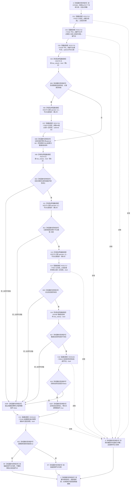

# CF-L6-0045 `动态服务::创建动态概念根` 现状流程图

图类型：现状流程图
代码版本：`a9fd8ba33963f8d177fae753e5b01cea0073d407`
覆盖文件：`海中鱼巣/领域/动态服务.h:285-299`
唯一根函数：F0366
完整签名：`海中鱼巣::节点句柄 海中鱼巣::动态服务::创建动态概念根()`
参数：无显式参数；隐式 `this` 为调用方拥有且调用期有效的 `动态服务` 借用，成员 `主信息_`、`节点_`、`关系_` 均为构造期绑定、由外部拥有且生命周期覆盖本次调用的仓库引用
返回结果：旧主信息和 `节点类型::动态` 节点即时创建后，只有节点可读、类型为动态、旧主信息有效、零号 I64 普通动态材料不存在且节点不是实例动态时，才按值返回根节点句柄；否则返回空节点句柄
非法值 / 拒绝：没有外部输入和写前拒绝；空主信息句柄、空根节点、读回无记录、类型错误、旧主信息无效、普通动态材料存在或实例动态判定成立，都在写入开始后折叠为空节点句柄
已登记调用方：F0186 `概念图初始化服务::初始化四个根()::<lambda@初始化.概念图.ixx:107>::operator()() const`
调用方流程图：`流程图/代码流程图/L5/CF-L5-0066_创建动态概念根lambda_现状流程图.md`
可达排除：`概念图服务.h:3998` 的同名调用位于当前未接入 `main` 可达闭包的旧候选创建函数，不作为本轮主程序可达入边
直接项目函数：F0331、F0332、F0190、F0619、F0624、R0610、F0184，共 7 条项目调用边
外部边界：X02278、X02279、X02280，共 3 个身份、6 个调用点
未解析项目调用：无
调用图：`流程图/代码流程图/00_调用知识图谱.md`
逐行映射表：`流程图/代码流程图/L6/CF-L6-0045_动态服务创建动态概念根_逐行代码映射表.md`
输入契约 / 调用语境表：本文“调用语境与非成功分账”
非成功返回二分审查表：本文“调用语境与非成功分账”
偏差清单：本文“当前边界与规范核对”
依据提交 / 结构化消息：冻结源码提交 `a9fd8ba33963f8d177fae753e5b01cea0073d407`；主程序可达关系表已把一参数 `动态是否实例动态` 唯一绑定 R0610，并由源码再次复核
验证输出：四文件逐行尾随空白检查 PASS，`git diff --no-index --check` 零空白诊断；`python .\tools\check_specs.py --strict` PASS（101 份目录项）；本文恰有一个 Mermaid fenced block、零 HTML 引用和零抽象执行节点
结构读取与写入：F0331 即时创建旧主信息；F0332 随后即时创建普通动态节点；F0190、F0619、F0624 和 R0610 只读回节点、旧主信息值与关系；没有统一未发布候选、撤销或最后发布
逻辑内返回：无；函数没有写前材料拒绝、候选为空或协议允许的等待结果
内部错误：第一笔创建后任一后验不成立，F0184 返回同一条件并可作非权威诊断，随后函数返回空句柄；已经创建的主信息或节点不撤销
异常：函数不捕获异常；仓库许可、锁、容器分配、被调函数或启用后的诊断路径抛出时，异常向调用方传播，此前即时写入保持已发生状态
幂等 / 并发：没有同义查找、稳定键复用或幂等键；每次调用都尝试创建新主信息和新节点；两个仓库调用各自同步，但本函数没有覆盖创建、值读取、关系读取和最终读回的统一事务边界，并发调用可形成多个普通动态节点
依据：`规范/0050_项目通用机器逻辑与禁止性规则总纲_20260721.md`、`规范/0600_代码函数流程图应用与维护规范.md`、`规范/1170_根规范_动态节点_20260720.md`、`规范/4010_子规范_统一仓库稳定句柄与通用关系索引边界.md`、`规范/4040_子规范_不透明结构事务候选确认撤销与最后发布.md`、`规范/7140_子规范_概念身份生命周期退役删除与活动投影分账.md`
不得作为施工许可：是
不得宣称：成功返回已建立稳定动态根身份、固定命名域主键、概念签名关系 10、生命周期、幂等唯一根、完整事务发布、节点直接身份结构或动态事实结构

## 流程图

## 直接被调函数与外部边界

| 调用边 | 被调函数 / 外部边界 | 当前调用点 | 参数 / 结果 | 条件 | 被调图 |
| --- | --- | --- | --- | --- | --- |
| RCE1713 | F0331 `主信息仓库::创建主信息()` | `动态服务.h:286` | `this=&主信息_`，无显式参数 → `主信息句柄` | 函数进入后总是调用 | `L6/CF-L6-0011_主信息仓库创建主信息_现状流程图.md` |
| RCE1714 | F0332 `节点仓库::创建节点(节点类型, 主信息句柄)` | `动态服务.h:287` | `this=&节点_`，`节点类型::动态, 主信息句柄` → `根节点` | F0331 正常返回后总是调用，不预先拒绝空主信息句柄 | `L6/CF-L6-0012_节点仓库创建节点_现状流程图.md` |
| RCE1715 | F0190 `节点仓库::读取节点(节点句柄) const` | `动态服务.h:288` | `this=&节点_`，`根节点` → `optional<节点记录>` | F0332 正常返回后总是调用 | `L5/CF-L5-0070_节点仓库读取节点_现状流程图.md` |
| X02278 | `optional<节点记录>::has_value() const noexcept` | `动态服务.h:289,290` | `记录` → 两次独立 `bool` | 第一次用于材料条件运算，第二次始终重新用于后验合取 | 外部边界，不生成项目函数图 |
| X02279 | `optional<节点记录>::operator->() const noexcept` | `动态服务.h:289,291,292` | `记录` → `const 节点记录*` | 分别受对应 `has_value` 与 `&&` 前项门控 | 外部边界，不生成项目函数图 |
| RCE1716 | F0619 `主信息仓库::读取I64值(主信息句柄) const` | `动态服务.h:289` | `this=&主信息_`，`记录->主信息` → `optional<int64_t>` | 第一次记录有值检查为 `true` | 待生成 F0619 图 |
| RCE1717 | F0624 `主信息仓库::主信息是否有效(主信息句柄) const` | `动态服务.h:292` | `this=&主信息_`，`记录->主信息` → `bool` | 第二次记录有值且类型为动态；无令牌一参数重载 | 待生成 F0624 图 |
| X02280 | `optional<int64_t>::has_value() const noexcept` | `动态服务.h:293` | `普通动态材料` → `bool` | 记录、类型和旧主信息前项均成立 | 外部边界，不生成项目函数图 |
| RCE0146 | R0610 `动态服务::动态是否实例动态(节点句柄) const` | `动态服务.h:294` | `this, 根节点` → `bool`，再取反 | 前项均成立且普通动态材料不存在；一参数重载，不是旧 R0250 令牌重载 | 待生成 R0610 图 |
| RCE0145 | F0184 `追根因检查(bool, const wchar_t*)` | `动态服务.h:290`（调用表达式延续至 295） | 完整合取条件、固定说明 → 原样 `bool` | 条件按短路求值完成后总是调用；真假均调用 | `L5/CF-L5-0064_追根因检查_现状流程图.md` |

## 调用语境与非成功分账

| 调用语境 | 当前前置 | 非成功结果 | 二分口径 | 结构后果 |
| --- | --- | --- | --- | --- |
| F0186 初始化动态根 lambda | F0178 未读到已登记动态根，才调用 F0186；lambda 再直接调用本函数 | 本函数返回空节点句柄，F0186 原样返回，F0178 以无效句柄停止登记 | 追根因解决；不是外部输入拒绝 | 主信息可能已经创建；节点也可能已经创建但后验失败；本函数零撤销 |
| 普通动态材料存在 | 节点已经创建并成功读回到普通动态材料检查 | 后验合取为 false，F0184 返回 false，函数返回空句柄 | 追根因解决；概念根不应携带普通动态 I64 材料 | 新主信息和动态节点保留 |
| 实例动态判定成立 | 记录、类型、主信息和无普通材料前项均成立 | R0610 返回 true，经取反导致整体失败并返回空句柄 | 追根因解决；概念根不应具备运行期临时目标关系 | 新主信息、动态节点及被读到的关系均不撤销 |
| 重复或并发直接调用 | 当前公开函数自身没有已登记根或稳定键准入 | 可能成功返回另一个普通动态节点 | 当前代码没有非成功保护；属于幂等与唯一身份缺口 | 可以累积多个旧主信息和普通动态节点，根角色仍由后继登记另行赋予 |

## 当前边界与规范核对

- 1170 / 4010 要求动态节点和动态事实使用节点直接稳定身份及正式结构；当前函数仍先创建旧 `主信息句柄`，再把它写入普通动态节点。
- 当前“没有零号 I64 值”和“没有运行期临时目标关系”只是排除两种旧形态，不能正面证明固定动态根身份、概念签名、生命周期或动态事实完整性。
- 7140 的动态概念签名与关系 10、生命周期和活动投影不在本函数形成；后继登记不能把当前普通节点自动升级为完整概念身份发布。
- F0331 与 F0332 是跨仓库即时发布；后验失败时只返回空句柄，未满足 4040 的统一候选、逆序撤销和最后发布。
- F0184 只返回传入条件；诊断启用时也只产生人读诊断，不能修复、撤销或成为机器事实。
- 返回的裸空句柄把创建失败、节点读回失败、类型错误、旧主信息失效、普通材料存在和实例动态冲突折叠为同一结果，无法给出失败阶段、已写入项或补偿结果。
