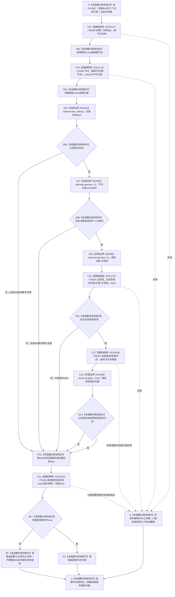

# CF-L6-0046 `二次特征服务::创建关系概念根` 现状流程图

图类型：现状流程图
代码版本：`a9fd8ba33963f8d177fae753e5b01cea0073d407`
覆盖文件：`海中鱼巣/领域/二次特征服务.h:49-60`
唯一根函数：F0367
完整签名：`海中鱼巣::节点句柄 海中鱼巣::二次特征服务::创建关系概念根()`
参数：无显式参数；隐式 `this` 为调用期有效的 `二次特征服务` 借用，服务内 `主信息仓库&`、`节点仓库&`、`关系仓库&` 均为非拥有引用
返回结果：后验合取成立时按值返回本次创建的二次特征节点句柄；任一后验不成立时返回默认无效节点句柄
非法值 / 拒绝：本函数没有外部输入和具名入口拒绝；默认无效句柄同时折叠创建失败、读回失败、类型不符、旧主信息无效和组成项投影非空
已登记调用方：F0187 `概念图初始化服务::初始化四个根()::<lambda@初始化.概念图.ixx:109>::operator()() const`，经 E0767 调用
直接项目函数：R0206、F0190、F0624、R0204、F0184，共 5 个项目调用点
外部边界：X02281 `std::optional<节点记录>::has_value`；X02282 `std::optional<节点记录>::operator->`；X02283 `std::vector<节点句柄>::empty`；临时向量析构随完整表达式结束
未解析项目调用：无
调用图：`流程图/代码流程图/00_调用知识图谱.md`
主程序可达调用关系：`流程图/主程序可达调用关系/01_main可达项目调用边表.md`
逐行映射表：`流程图/代码流程图/L6/CF-L6-0046_二次特征服务创建关系概念根_逐行代码映射表.md`
输入契约 / 调用语境表：本文“调用语境与非成功分账”
非成功返回二分审查表：本文“调用语境与非成功分账”
偏差清单：本文“当前边界与规范核对”
依据提交 / 结构化消息：冻结源码提交 `a9fd8ba33963f8d177fae753e5b01cea0073d407`；主程序可达调用关系的 RCE0147、RCE1718、RCE1719、RCE0149、RCE0148、X02281—X02283 已逐调用点复核
验证输出：49—60 行全部映射；5 条项目调用边、3 个外部边界、0 个未解析项目调用；本文恰有一个 Mermaid fenced block、零 HTML 引用
结构读取与写入：R0206 可能创建旧主信息和二次特征节点；随后只读回节点、旧主信息有效性和过滤后的组成项投影；本函数没有统一事务、撤销或最后发布
逻辑内返回：无已冻结的具名逻辑内非成功结果
内部错误：创建调用已经发生后，节点不可读、类型不符、旧主信息无效或组成项投影非空均由 F0184 诊断并折叠为空句柄；当前函数不撤销已创建结构
幂等与并发：非幂等；每次调用都可能形成新节点。函数本身没有并发隔离键或跨仓事务，仓库内部同步不能证明本次跨结构原子发布
生命周期：局部节点句柄、optional 记录和组成项临时向量随函数退出销毁；仓库中已经形成的主信息、节点或关系不因局部对象销毁而自动撤销
异常：没有捕获边界；项目调用或临时向量形成若抛出，异常向上传播，先前结构变化保持已发生状态
依据：`规范/0050_项目通用机器逻辑与禁止性规则总纲_20260721.md`、`规范/0600_代码函数流程图应用与维护规范.md`、`规范/1180_根规范_二次特征_20260720.md`、`规范/4010_子规范_统一仓库稳定句柄与通用关系索引边界.md`、`规范/4040_子规范_不透明结构事务候选确认撤销与最后发布.md`、`规范/4050_子规范_入口拒绝逻辑内结果与内部逻辑错误.md`、`规范/4150_子规范_二次特征边界与承载规则_20260720.md`
不得作为施工许可：是
不得宣称：返回句柄已形成 1180 / 4150 的完整关系概念、默认空句柄已撤销本次创建、空组成项投影已证明仓库中不存在无效或悬空引用关系

## 流程图

## 直接被调函数

| 调用关系身份 | 被调函数 | 当前调用点 | 参数 / 结果 | 可达条件 | 被调图 |
| --- | --- | --- | --- | --- | --- |
| RCE0147 | R0206 `海中鱼巣::节点句柄 海中鱼巣::二次特征服务::创建二次特征()` | `二次特征服务.h:50` | 隐式 `this`，无显式参数 → 根节点句柄 | 函数进入后总是调用 | 待生成 |
| RCE1718 | F0190 `std::optional<海中鱼巣::节点记录> 海中鱼巣::节点仓库::读取节点(海中鱼巣::节点句柄) const` | `二次特征服务.h:51` | `this=&节点_`，`根节点` 按值 → optional 记录 | R0206 返回后总是调用，包括无效句柄 | 已有 F0190 图 |
| RCE1719 | F0624 `bool 海中鱼巣::主信息仓库::主信息是否有效(海中鱼巣::主信息句柄) const` | `二次特征服务.h:54` | `this=&主信息_`，`记录->主信息` 按值 → bool | 记录存在且类型为二次特征 | 待生成 |
| RCE0149 | R0204 `std::vector<海中鱼巣::节点句柄> 海中鱼巣::二次特征服务::读取组成项(海中鱼巣::节点句柄) const` | `二次特征服务.h:55` | 隐式 `this`，`根节点` 按值 → 临时节点句柄组 | 前三项后验均为 true | 待生成 |
| RCE0148 | F0184 `bool 海中鱼巣::追根因检查(bool, const wchar_t*)` | `二次特征服务.h:52-56` | 完整短路合取 bool、固定说明字符串 → 检查 bool | 合取求值完成后总是调用 | 已有 F0184 图 |

## 调用语境与非成功分账

| 调用语境 | 当前前置 | 非成功结果 | 二分口径 | 结构后果 |
| --- | --- | --- | --- | --- |
| F0187 初始化关系概念根 lambda | 前序存在根和动态根已经确保，F0179 尚未读到关系根登记 | 返回默认无效节点句柄 | 无外部非法输入；R0206 调用后的后验不成立属于创建链内部错误，应追根因 | R0206 可能已经创建旧主信息和节点；F0367 不撤销 |
| 重复直接调用 F0367 | 当前代码没有唯一根或幂等键参数 | 每次可能返回另一个有效节点，或返回无效句柄 | 非幂等新增调用，不是“目标已满足”逻辑内结果 | 可能累积多个未登记或孤立二次特征节点 |

## 当前边界与规范核对

- 当前函数正确保持 `&&` 左到右短路：只有记录存在才读取记录成员，只有类型匹配才检查旧主信息，只有旧主信息有效才读取组成项；F0184 在完整条件求值后调用。
- R0206 仍通过旧 `主信息` 创建二次特征节点；当前返回没有稳定主键、二次特征域类型化记录、定义、规则版本、来源、适用范围或失效条件。
- R0204 过滤不可用组成项后返回值式投影；`.empty()` 只能证明该投影为空，不能证明仓库中不存在无效、悬空、错类型或错误角色的引用关系。
- 创建、节点读回、主信息读回和组成项读回不在 4040 的同一候选事务内。后验失败、异常或诊断非局部退出均没有精确逆序撤销和最后发布。
- 无显式输入的创建入口仍可能返回裸无效句柄；该值无法机械区分创建失败、后验内部错误和诊断终止，未满足 4050 的强类型结果合同。
- 当前成功路径只证明一个旧二次特征节点可读、类型枚举匹配、旧主信息形态有效且过滤投影为空；不得升级为关系概念根的完整机器事实。
