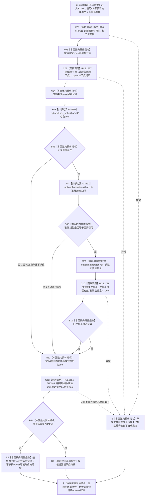

# CF-L6-0047 `因果服务::创建因果概念根` 现状流程图

图类型：现状流程图
代码版本：`52e7496b0dab5a31ba0d4be9b727903541ee9373`
覆盖文件：`海中鱼巣/领域/因果服务.h:56-66`
唯一根函数：F0368
完整签名：`海中鱼巣::节点句柄 海中鱼巣::因果服务::创建因果概念根()`
参数：无显式参数；隐式 `this` 为调用期有效的 `因果服务` 借用，服务内 `主信息仓库&` 与 `节点仓库&` 均为非拥有引用
返回结果：后验合取成立时按值返回 R0611 本次创建的因果引用节点句柄；任一后验不成立时返回默认无效节点句柄
非法值 / 拒绝：本函数没有外部输入和具名入口拒绝；默认无效句柄同时折叠 R0611 创建失败、节点读回失败、类型不符和旧主信息无效
已登记调用方：F0188 `概念图初始化服务::初始化四个根()::<lambda@初始化.概念图.ixx:111>::operator()() const`，经 E0768 调用
调用方图：`流程图/代码流程图/L5/CF-L5-0068_创建因果概念根lambda_现状流程图.md`
直接项目函数：R0611、F0190、F0624、F0184，共 4 个项目调用点
外部边界：X02290 `std::optional<节点记录>::has_value`；X02291 `std::optional<节点记录>::operator->`
未解析项目调用：无
调用图：`流程图/代码流程图/00_调用知识图谱.md`
主程序可达调用关系：`流程图/主程序可达调用关系/01_main可达项目调用边表.md`
逐行映射表：`流程图/代码流程图/L6/CF-L6-0047_因果服务创建因果概念根_逐行代码映射表.md`
输入契约 / 调用语境表：本文“调用语境与非成功分账”
非成功返回二分审查表：本文“调用语境与非成功分账”
偏差清单：本文“当前边界与规范核对”
依据提交 / 结构化消息：冻结源码提交 `52e7496b0dab5a31ba0d4be9b727903541ee9373`；RCE1726—RCE1728、RCE0151、X02290、X02291 已按无参数 R0611 重载逐调用点复核
验证输出：56—66 行全部映射；4 条项目调用边、2 个外部边界、0 个未解析项目调用；本文恰有一个 Mermaid fenced block、零 HTML 引用
结构读取与写入：R0611 可能创建旧主信息和因果引用节点；随后只读回节点及旧主信息有效性；F0368 自身没有统一事务、撤销或最后发布
逻辑内返回：无已冻结的具名逻辑内非成功结果
内部错误：R0611 调用已经发生后，节点不可读、类型不符或旧主信息无效均由 F0184 诊断并折叠为空句柄；当前函数不撤销已创建结构
幂等与并发：非幂等；每次调用都可能形成新因果引用节点。函数没有并发隔离键或跨仓事务，仓库内部同步不能证明本次跨结构原子发布
生命周期：局部节点句柄和 optional 记录随函数退出销毁；仓库中已经形成的旧主信息和因果引用节点不因局部对象销毁而自动撤销
异常：没有捕获边界；项目调用若抛出，异常向上传播，先前结构变化保持已发生状态
依据：`规范/0050_项目通用机器逻辑与禁止性规则总纲_20260721.md`、`规范/0600_代码函数流程图应用与维护规范.md`、`规范/1190_根规范_因果_20260720.md`、`规范/4010_子规范_统一仓库稳定句柄与通用关系索引边界.md`、`规范/4040_子规范_不透明结构事务候选确认撤销与最后发布.md`、`规范/4050_子规范_入口拒绝逻辑内结果与内部逻辑错误.md`
不得作为施工许可：是
不得宣称：返回句柄已形成完整因果事实、原因结果关系或动态证据链；默认空句柄已撤销 R0611 的写入；“因果概念根”名称已取得 1190 的完整机器语义

## 流程图

## 直接被调函数

| 调用关系身份 | 被调函数 | 当前调用点 | 参数 / 结果 | 可达条件 | 被调图 |
| --- | --- | --- | --- | --- | --- |
| RCE1726 | R0611 `海中鱼巣::节点句柄 海中鱼巣::因果服务::记录因果引用()` | `因果服务.h:57` | 隐式 `this`，无显式参数 → 因果引用节点句柄 | 函数进入后总是调用；精确绑定无参数重载 | 待生成 |
| RCE1727 | F0190 `std::optional<海中鱼巣::节点记录> 海中鱼巣::节点仓库::读取节点(海中鱼巣::节点句柄) const` | `因果服务.h:58` | `this=&节点_`，`根节点` 按值 → optional 记录 | R0611 返回后总是调用，包括无效句柄 | 已有 F0190 图 |
| RCE1728 | F0624 `bool 海中鱼巣::主信息仓库::主信息是否有效(海中鱼巣::主信息句柄) const` | `因果服务.h:61` | `this=&主信息_`，`记录->主信息` 按值 → bool | 记录存在且类型为因果引用 | 待生成 |
| RCE0151 | F0184 `bool 海中鱼巣::追根因检查(bool, const wchar_t*)` | `因果服务.h:59-62` | 完整短路合取 bool、固定说明字符串 → 检查 bool | 合取求值完成后总是调用 | 已有 F0184 图 |

## 调用语境与非成功分账

| 调用语境 | 当前前置 | 非成功结果 | 二分口径 | 结构后果 |
| --- | --- | --- | --- | --- |
| F0188 初始化因果概念根 lambda | 前序存在、动态和关系根已经确保，F0180 尚未读到因果根登记 | 返回默认无效节点句柄 | 无外部非法输入；R0611 调用后的后验不成立属于创建链内部错误，应追根因 | R0611 可能已经创建旧主信息和因果引用节点；F0368 不撤销 |
| 重复直接调用 F0368 | 当前代码没有唯一根或幂等键参数 | 每次可能返回另一个有效节点，或返回无效句柄 | 非幂等新增调用，不是“目标已满足”逻辑内结果 | 可能累积多个未登记或孤立因果引用节点 |

## 当前边界与规范核对

- 当前函数正确保持 `&&` 左到右短路：只有记录存在才读取类型，只有类型为因果引用才读取并检查旧主信息；F0184 在完整条件求值后调用。
- 第 57 行精确调用无参数 R0611，不是双参数因果准入重载；F0368 本身不读取来源动态，也不形成原因、结果、证据动态、适用范围、规则版本或基础计数。
- R0611 仍通过旧 `主信息` 创建轻量因果引用节点。1190 明确该轻量身份不等于完整或稳定因果结论。
- 创建、节点读回和旧主信息读回不在 4040 的同一候选事务内。后验失败、异常或诊断非局部退出均没有精确逆序撤销和最后发布。
- 无显式输入的创建入口仍可能返回裸无效句柄；该值无法机械区分创建失败与后验内部错误，未满足 4050 的强类型结果合同。
- 当前成功路径只证明一个旧因果引用节点可读、类型枚举匹配且旧主信息形态有效；不得升级为因果概念根或完整因果机器事实。
