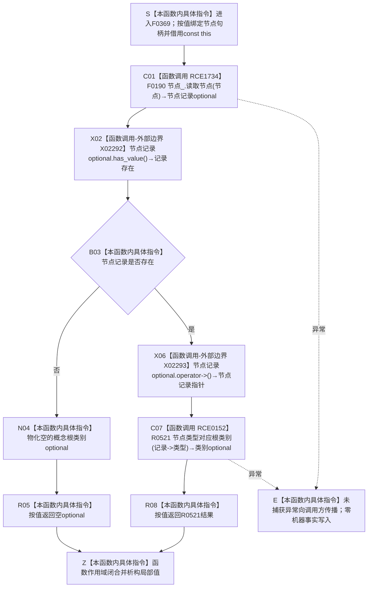

# CF-L6-0048 `概念图服务::读取节点概念类别` 现状流程图

图类型：现状流程图
代码版本：源码冻结提交 `a9fd8ba33963f8d177fae753e5b01cea0073d407`；调用关系发布提交 `52e7496b0dab5a31ba0d4be9b727903541ee9373`
覆盖文件：`海中鱼巣/领域/概念图服务.h:926-932`
唯一根函数：F0369
完整签名：`std::optional<海中鱼巣::概念根类别> 海中鱼巣::概念图服务::读取节点概念类别(海中鱼巣::节点句柄 节点) const`
参数：隐式 `this` 是对当前 `概念图服务` 的非拥有 const 借用，服务内部借用 `节点_`；`节点` 按值复制完整节点句柄，不转移节点所有权
返回结果：按值返回 `std::optional<概念根类别>`；节点记录可读且节点类型属于四种当前粗类别时返回对应类别，否则返回空；调用方拥有返回值
非法值 / 拒绝：节点句柄无效、代次或槽位不匹配、节点不存在或节点仓拒绝读取时返回空；节点记录存在但类型不属于当前映射范围时，R0521 也返回空
已登记调用方：F0191 的 E0776、F0353 的 E1855、F0359 的 RCE0119、F0362 的 RCE0130（2 个调用点）、F0370 的 RCE0153（2 个调用点）
直接项目函数：F0190、R0521，共 2 个唯一函数、2 个调用点；分别登记为 RCE1734、RCE0152
外部边界：X02292 `std::optional<节点记录>::has_value()`；X02293 `std::optional<节点记录>::operator->()`
未解析项目调用：无
调用图：`流程图/代码流程图/00_调用知识图谱.md`
逐行映射表：`流程图/代码流程图/L6/CF-L6-0048_概念图服务读取节点概念类别_逐行代码映射表.md`
输入契约 / 调用语境表：本文“调用语境与非成功分账”
非成功返回二分审查表：本文“调用语境与非成功分账”
偏差清单：本文“当前边界与规范核对”
依据提交 / 结构化消息：源码冻结提交 `a9fd8ba33963f8d177fae753e5b01cea0073d407`；调用关系发布提交 `52e7496b0dab5a31ba0d4be9b727903541ee9373`；源码、main 可达身份表、项目调用边表和逐行人工复核
入口前置：本函数公开形态不要求调用方预先证明节点有效或属于概念结构；已登记调用方分别在实例根绑定、生命周期、活动快照等语境调用，本函数仍只提供节点记录到粗类别的只读映射
结构读取与写入：先经 F0190 读取值式节点记录，再在本函数内观察 optional；只读节点仓，不写节点、关系、索引、概念登记或生命周期事实
逻辑内返回：节点记录不可读或 R0521 不能映射当前节点类型时返回空 optional；当前空值不具名区分原因
内部错误：调用方已经依法确认节点应为当前概念身份后仍返回空，属于调用方前置成立后的结构异常；本函数本身不保存这一调用语境，也不返回内部错误类别
生命周期与资源释放：局部节点记录 optional 和返回类别均按值持有；不返回锁、容器引用、迭代器或内部对象引用
异常：未声明 `noexcept` 且不捕获；F0190 抛出的异常向调用方传播；本函数在异常前后均不产生机器事实写入
并发 / 幂等：本函数不取得概念图锁；并发一致性由 F0190 自身读取合同及调用方更外层锁语境决定；同一冻结节点仓快照和同一完整句柄产生相同值式结果
验证入口：`概念图服务.h:926-932`、E0776、E1855、RCE0119、RCE0130、RCE0152、RCE0153、RCE1734、X02292、X02293
验证输出：7 行源码完整覆盖；2 个项目调用点、2 类外部边界、0 未解析项目调用；本批不运行构建或程序
依据：`规范/0050_项目通用机器逻辑与禁止性规则总纲_20260721.md`、`规范/0600_代码函数流程图应用与维护规范.md`、`规范/4010_子规范_统一仓库稳定句柄与通用关系索引边界.md`、`规范/4050_子规范_入口拒绝逻辑内结果与内部逻辑错误.md`、`规范/7140_子规范_概念身份生命周期退役删除与活动投影分账.md`
不得作为施工许可：是
不得宣称：节点类型映射结果已经证明唯一概念根可达、本域概念对象结构、生命周期、签名或当前概念身份完整成立

## 流程图

## 项目源码调用合同

| 调用边 | 节点 | 被调函数 | 实参 | 结果 / 条件 | 被调图 |
| --- | --- | --- | --- | --- | --- |
| RCE1734 | C01 | F0190 `节点仓库::读取节点(节点句柄) const` | `this=&节点_`、`节点` | `std::optional<节点记录>`；进入函数后无条件调用 | [F0190](../L5/CF-L5-0070_节点仓库读取节点_现状流程图.md) |
| RCE0152 | C07 | R0521 `概念图服务::节点类型对应根类别(节点类型)` | `记录->类型` | `std::optional<概念根类别>`；节点记录存在时调用 | 待生成 |

## 已登记调用方

| 调用方 | 调用边 | 位置 / 前置 | 调用方图 |
| --- | --- | --- | --- |
| F0191 | E0776 | `概念图服务.h:4406`；进入实例对应根确保过程后读取实例类别 | 待生成 |
| F0353 | E1855 | `概念图服务.h:1863`；已取得活动图共享锁 | [F0353](CF-L6-0032_概念图服务读取概念生命周期_现状流程图.md) |
| F0359 | RCE0119 | `概念图服务.h:3047`；确保生命周期过程读取概念类别 | 待生成 |
| F0362 | RCE0130 | `概念图服务.h:4223,4249`；分别读取签名概念和实例来源概念类别 | 待生成 |
| F0370 | RCE0153 | `概念图服务.h:1032,1033`；已取得图写锁后依次读取实例、概念类别 | [F0370](CF-L6-0049_概念图服务绑定实例支持概念_现状流程图.md) |

## 输入契约与调用语境表

| 输入字段 | 输入来源 | 上游是否保证有效 | 允许逻辑内返回 | 结构变化 | 追根因触发条件 | 验证方式 |
| --- | --- | --- | --- | --- | --- | --- |
| `节点` | F0191 的实例、F0353 / F0359 的概念、F0362 的签名概念或实例来源概念、F0370 的实例或概念 | 普通公开语境不保证；各调用方只保证各自更外层材料，F0369 自身仍须读取 | 节点无效、不存在或当前粗类型不可映射时允许返回空 | 全路径零机器事实写入 | 调用方已依法确认节点应为当前概念或固定根，而 F0190 / R0521 仍返回空 | 对照 926—932 行、全部已登记入边和 F0190 / R0521 被调合同 |

## 非成功返回二分审查表

| 代码位置 | 返回条件 | 输入语境 | 是否上游保证有效 | 结构是否变化 | 二分口径 | 设计是否允许 | 追根因解决 |
| --- | --- | --- | --- | --- | --- | --- | --- |
| `概念图服务.h:928-929` | F0190 返回的节点记录为空 | 任意公开节点句柄 | 否 | 无 | 普通材料为逻辑内入口拒绝；已确认概念语境为内部错误 | 允许作为写前入口拒绝，但当前原因不具名 | 上游已确认当前概念时，停止依赖路径并追查节点身份或读取代次 |
| `概念图服务.h:931` | R0521 返回空类别 | 节点记录存在但类型不属于四种粗类别 | 否 | 无 | 普通材料为逻辑内类型拒绝；已确认概念语境为内部错误 | 允许作为写前类型拒绝，但当前原因不具名 | 上游已确认当前概念时，追查节点类型和概念结构不一致 |

## 现状施工偏差清单

| 编号 | 现状代码事实 | 规范 / 详细设计依据 | 偏差类型 | 纠偏方向 | 是否需要代码计划 |
| --- | --- | --- | --- | --- | --- |
| D-F0369-01 | 只按节点类型映射粗类别 | 7140 要求根可达路径、本域对象结构、生命周期与身份材料共同成立；详细设计不得把粗类别扩大为当前概念 | 语义证明不足 | 后续目标设计明确完整概念身份读取合同 | 本现状图不自动制定，交由后续具名治理裁决 |
| D-F0369-02 | 空 optional 折叠节点拒绝、类型拒绝和调用前置成立后的内部错误 | 4050 的逻辑内返回 / 内部错误分账；详细设计应冻结强类型结果 | 结果分账不足 | 后续设计冻结具名拒绝与内部错误结果 | 本现状图不自动制定，交由后续具名治理裁决 |

## 当前边界与规范核对

- 当前实现只把节点类型粗分为存在、动态、二次特征和因果四类；7140 还要求唯一类别根可达路径、本域对象正式结构、生命周期和身份材料共同成立，F0369 的有值结果不能单独证明“当前概念”。
- 同一个空 optional 折叠节点拒绝、节点不存在和节点类型不能映射等原因；在已确认概念的调用语境还会折叠内部结构错误，不满足 4050 的具名结果分账目标。
