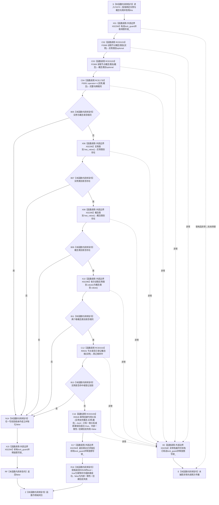

# CF-L6-0049 `概念图服务::绑定实例支持概念` 现状流程图

图类型：现状流程图
代码版本：源码冻结提交 `a9fd8ba33963f8d177fae753e5b01cea0073d407`；调用关系发布提交 `52e7496b0dab5a31ba0d4be9b727903541ee9373`
覆盖文件：`海中鱼巣/领域/概念图服务.h:1030-1042`
唯一根函数：F0370
完整签名：`bool 海中鱼巣::概念图服务::绑定实例支持概念(海中鱼巣::节点句柄 实例, 海中鱼巣::节点句柄 概念)`
参数：隐式 `this` 是对当前 `概念图服务` 的非拥有借用；`实例`、`概念` 均按值复制完整节点句柄，不转移节点所有权
返回结果：按值返回 `bool`；写前条件全部通过后调用 R0526，既有关系与运行期登记及读回一致，或新建关系及读回后验成立时返回 `true`；写前拒绝，或 R0526 发现既有关系缺登记、登记读回不一致、新建 / 读回后验失败时返回 `false`；异常直接传播，不编码为 `bool`
非法值 / 拒绝：实例与概念完整句柄相同、任一节点类别不可读、两者粗类别不同或实例已命中当前四槽根登记投影时，持锁返回 `false`
已登记调用方：F0191 的 E0779
直接项目函数：F0369 两个调用点、F0051、R0531、R0526，共 4 个唯一函数、5 个调用点；分别登记为 RCE0153、RCE1735、RCE0154、RCE0155
外部边界：X02294 `std::lock_guard<std::mutex>` 构造 / 析构；X02295 `std::optional<概念根类别>::has_value()`；X02296 `std::optional<概念根类别>::value()`
未解析项目调用：无
调用图：`流程图/代码流程图/00_调用知识图谱.md`
逐行映射表：`流程图/代码流程图/L6/CF-L6-0049_概念图服务绑定实例支持概念_逐行代码映射表.md`
输入契约 / 调用语境表：本文“调用语境与非成功分账”
非成功返回二分审查表：本文“调用语境与非成功分账”
偏差清单：本文“当前边界与规范核对”
依据提交 / 结构化消息：源码冻结提交 `a9fd8ba33963f8d177fae753e5b01cea0073d407`；调用关系发布提交 `52e7496b0dab5a31ba0d4be9b727903541ee9373`；源码、main 可达身份表、项目调用边表和逐行人工复核
入口前置：当前已登记调用方 F0191 已读取实例粗类别和对应根材料，并确认实例不是根节点后调用；本函数仍自行重读实例、概念粗类别并检查根登记投影
结构读取与写入：先取得 `图写锁_`；锁内依次调用 F0369 读取实例和概念节点记录与粗类别，随后读取根登记投影；全部条件通过后在同一图写锁作用域内调用 R0526 尝试幂等形成关系 9
逻辑内返回：任一写前拒绝条件成立时返回 `false` 且本函数未调用 R0526；既有一致关系是幂等成功，R0526 返回 `true`，不属于非成功结果
内部错误：调用方前置已证明两个当前概念身份后仍缺类别，或 R0526 在结构前置成立后因既有关系缺运行期登记、登记读回不一致、新建失败或新建后读回不一致而返回 `false`，均属于内部结构异常；本函数把这些内部错误折叠为裸 `false`
生命周期与资源释放：`图写锁_` 从 1031 行成功构造后覆盖全部读取、判断、拒绝返回和 R0526 调用；返回表达式先求值，随后 lock_guard 析构解锁，再把 bool 返回调用方
异常：未声明 `noexcept` 且不捕获；锁获取异常发生在未取得锁时；其余异常在栈展开时析构已构造 lock_guard 并释放图写锁，再向调用方传播；本图不能替被调 R0526 宣称事务撤销
并发 / 幂等：同一服务实例的相关路径由 `图写锁_` 串行；R0526 对既有且登记 / 读回一致的关系返回 `true`，否则尝试新建并只在读回后验成立时返回 `true`；关系仓并发、事务和发布后读回应由 R0526 及其被调函数图裁决
验证入口：`概念图服务.h:1030-1042`、E0779、RCE0153—RCE0155、RCE1735、X02294—X02296
验证输出：13 行源码完整覆盖；5 个项目调用点、3 类外部边界、0 未解析项目调用；本批不运行构建或程序
依据：`规范/0050_项目通用机器逻辑与禁止性规则总纲_20260721.md`、`规范/0600_代码函数流程图应用与维护规范.md`、`规范/4010_子规范_统一仓库稳定句柄与通用关系索引边界.md`、`规范/4050_子规范_入口拒绝逻辑内结果与内部逻辑错误.md`、`规范/7140_子规范_概念身份生命周期退役删除与活动投影分账.md`
不得作为施工许可：是
不得宣称：粗节点类型相等或根登记投影未命中已经证明目标为当前概念、唯一根可达、本域对象结构和生命周期成立，或关系 9 已具备完整事务恢复闭环

## 流程图

## 项目源码调用合同

| 调用边 | 节点 | 被调函数 | 实参 | 结果 / 条件 | 被调图 |
| --- | --- | --- | --- | --- | --- |
| RCE0153 | C02 | F0369 `读取节点概念类别(节点句柄) const` | `实例` | `实例类别optional`；取得图写锁后无条件第一调用 | [F0369](CF-L6-0048_概念图服务读取节点概念类别_现状流程图.md) |
| RCE0153 | C03 | F0369 `读取节点概念类别(节点句柄) const` | `概念` | `概念类别optional`；C02 后无条件第二调用 | [F0369](CF-L6-0048_概念图服务读取节点概念类别_现状流程图.md) |
| RCE1735 | C04 | F0051 `operator==(const 节点句柄&,const 节点句柄&)` | `实例`、`概念` | 完整句柄相同位；两个类别读取完成后进入 `||` 第一项 | [F0051](../L4/CF-L4-0015_节点句柄_operator_equal_现状流程图.md) |
| RCE0154 | C12 | R0531 `节点是否已登记概念根(节点句柄) const` | `实例` | 根登记投影命中位；前四项均为 false 后调用 | 待生成 |
| RCE0155 | C16 | R0526 `幂等创建专用关系(关系类型,节点句柄,节点句柄)` | `实例支持概念`、`实例`、`概念` | `bool`；全部写前条件通过后调用；既有关系登记 / 读回一致或新建读回成功为 `true`，既有关系缺登记、读回不一致或新建后验失败为 `false` | 待生成 |

## 已登记调用方

| 调用方 | 调用边 | 位置 / 前置 | 调用方图 |
| --- | --- | --- | --- |
| F0191 | E0779 | `概念图服务.h:4414`；实例类别匹配对应根材料且实例本身不是根 | 待生成 |

## 输入契约与调用语境表

| 输入字段 | 输入来源 | 上游是否保证有效 | 允许逻辑内返回 | 结构变化 | 追根因触发条件 | 验证方式 |
| --- | --- | --- | --- | --- | --- | --- |
| `实例` | F0191 `确保实例支持对应根` 的实例句柄 | F0191 已读到实例粗类别并确认实例不等于对应根，但不完整保证 7140 当前概念身份 | 自指、类别缺失 / 不同或命中根登记投影时允许写前 `false`；R0526 的 `false` 不属于合法幂等拒绝 | 写前拒绝零写入；R0526 路径由被调合同裁决 | F0191 前置成立而本函数重读类别失败，或创建前置成立后 R0526 发生内部一致性 / 创建后验错误 | 对照 1030—1042 行、E0779、F0369 / R0531 / R0526 被调合同 |
| `概念` | F0191 读取的对应根材料之根节点 | F0191 保证根材料 optional 有值和实例不等于根；不证明根登记投影与权威结构同代 | 类别缺失 / 不同时允许写前 `false`；R0526 对既有一致关系返回 `true` | 写前拒绝零写入；R0526 路径可能写关系 | 根材料已确认而本函数不能重读类别，或权威关系登记 / 写入 / 读回异常 | 对照 F0191 调用点 `概念图服务.h:4406-4414` 与本函数顺序 |

## 非成功返回二分审查表

| 代码位置 | 返回条件 | 输入语境 | 是否上游保证有效 | 结构是否变化 | 二分口径 | 设计是否允许 | 追根因解决 |
| --- | --- | --- | --- | --- | --- | --- | --- |
| `概念图服务.h:1034-1039` | 自指、任一类别空、类别不同或实例命中根登记投影 | 任意公开材料 | 否；F0191 只部分保证 | 未调用 R0526，零本轮关系写入 | 普通材料为逻辑内写前拒绝；F0191 已确认材料重读不一致时为内部错误 | 写前拒绝允许，但当前裸 `false` 不具名 | F0191 前置成立后重读不一致时，追查节点身份、粗类别和根登记投影漂移 |
| `概念图服务.h:1041` | R0526 返回 `false` | 全部本函数写前条件通过 | 是，仅保证本函数的粗门禁 | 既有关系缺同一服务登记、登记读回不一致，或新建 / 新建读回后验失败 | 前置成立后的内部结构错误；既有一致关系由 R0526 返回 `true` | 不允许把内部错误伪装成逻辑内拒绝 | 按 R0526 单函数图追查登记、关系创建、事务、发布和读回 |
| `概念图服务.h:1031-1042` | 任一被调或外部边界抛异常 | 已取得或正在取得图写锁 | 不适用 | 本函数不能证明被调异常前零变化 | 内部异常，不是逻辑内返回 | 不属于逻辑内返回 | 保留异常与被调结构证据；按被调函数边界追根因 |

## 现状施工偏差清单

| 编号 | 现状代码事实 | 规范 / 详细设计依据 | 偏差类型 | 纠偏方向 | 是否需要代码计划 |
| --- | --- | --- | --- | --- | --- |
| D-F0370-01 | 只比较 F0369 粗类别并读取非权威根登记投影 | 7140 要求当前概念的根可达路径、本域对象结构、生命周期和身份材料；详细设计不得扩大粗门禁 | 语义证明不足 | 后续目标设计冻结完整实例 / 当前概念准入合同 | 本现状图不自动制定，交由后续具名治理裁决 |
| D-F0370-02 | 裸 `bool` 折叠五种写前拒绝与 R0526 的内部一致性 / 创建后验失败 | 4050 要求逻辑内返回和内部错误分账；详细设计应冻结强类型结果 | 结果分账不足 | 后续设计冻结具名写前拒绝、幂等成功、新建成功和内部错误结果 | 本现状图不自动制定，交由后续具名治理裁决 |

## 当前边界与规范核对

- 7140 规定关系 9 为实例到当前概念的多对多关系；当前函数只比较 F0369 返回的粗节点类别，未证明目标有唯一类别根可达路径、本域对象结构、有效生命周期或当前概念身份。
- R0531 读取的是四槽概念根登记投影；7140 把该登记定义为可清空、可重建的非权威定位投影，单独未命中不能证明实例不是权威根。
- 裸 `bool` 折叠五种写前拒绝与 R0526 的内部一致性 / 创建后验失败；既有一致关系实际返回 `true`。当前结果仍不能满足 4050 对逻辑内拒绝和前置成立后内部错误的强类型分账目标。
- 本函数持有概念图服务写锁调用 R0526，但能否原子创建、撤销和发布必须由 R0526 及更深被调函数的单函数图裁决；本图不替代被调事务合同。
