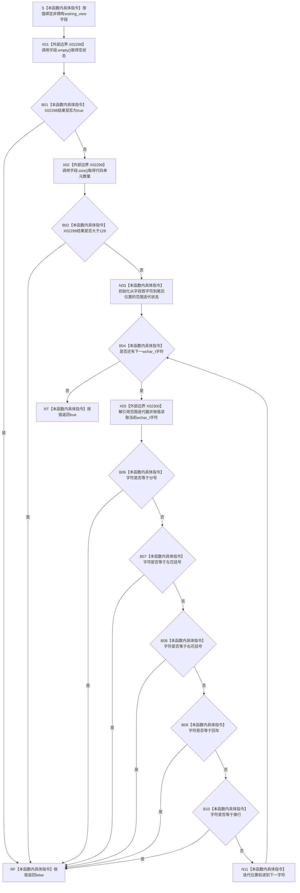

# CF-L6-0202 `配置字段可用` 现状流程图

图类型：现状流程图
代码版本：`3686cc2882ba42216609174c8e45e59b684e2958`
覆盖文件：`海中鱼巣/适配/SQL数据库适配.cpp:66-76`
唯一根函数：F0378
完整签名：`bool 海中鱼巣::{匿名命名空间@SQL数据库适配.cpp}::配置字段可用(std::wstring_view 字段)`
参数：`字段` 按值复制 `std::wstring_view` 视图，只非拥有借用调用方宽字符连续区间；调用期间底层字符存储必须保持存活且不得并发修改
返回结果：按值返回 `bool`；字段非空、长度不超过 128 个 `wchar_t` 代码单元，且从前到后每个字符均不等于分号、左 / 右花括号、回车或换行时返回 `true`，否则返回 `false`
非法值 / 拒绝：空字段先拒绝；仅非空时读取长度并拒绝长度大于 128；仅通过长度门后逐字符扫描，命中第一个 `L';'`、`L'{'`、`L'}'`、`L'\r'` 或 `L'\n'` 即返回 `false`
已登记调用方：正式 main 可达调用关系表唯一入边 E0808（F0203，`SQL数据库适配.cpp:330`）；该调用方表达式先校验服务器字段，只有其返回 `true` 时才按同一函数身份继续校验数据库字段
直接项目函数：无
外部边界：X02298 调用 `wstring_view::empty()`；X02299 调用 `wstring_view::size()`；X02300 解引用范围迭代器取得当前 `wchar_t`；范围循环控制和字符值比较保留为本函数具体指令
未解析项目调用：无
调用图：`流程图/主程序可达调用关系/01_main可达项目调用边表.md`
逐行映射表：`流程图/代码流程图/L6/CF-L6-0202_SQL配置字段可用_逐行代码映射表.md`
输入契约 / 调用语境表：本文“配置准入与非成功语境”
非成功返回二分审查表：本文“配置准入与非成功语境”
偏差清单：无新增；本图只冻结当前匿名命名空间局部准入函数事实
依据提交 / 结构化消息：冻结源码提交 `3686cc2882ba42216609174c8e45e59b684e2958`；正式 main 可达调用关系表 E0808、X02298—X02300、当前 HEAD Clang AST 候选与定义源码逐行复核
入口前置：F0203 借用自身 `配置_` 中服务器 / 数据库字符串形成视图；本函数不延长底层字符串生命周期，也不保存视图
结构读取与写入：只读 `wstring_view` 的空状态、长度和每个宽字符；不写配置、不写 SQL Server、不调用 ODBC、不改变运行期仓库或数据库审计投影
逻辑内返回：格式不满足局部准入时返回裸 `false`；F0203 把该结果收口为写入前的数据库配置准入失败
内部错误：本函数没有结构化内部错误结果；悬空、无效地址范围或调用期间底层存储失效属于调用前置违反和未定义行为；调用方把 `true` 扩大为数据库名或服务器名已经完成 SQL 语义转义 / 连接验证属于调用语境误用
生命周期与资源释放：`字段` 视图和范围迭代状态只在栈内存续；函数结束不释放、转移或保存底层宽字符串
异常：函数未声明 `noexcept`，但当前已定义路径只有 `wstring_view` 观察、迭代和 `wchar_t` 比较，没有显式分配或可抛项目调用；非法借用生命周期属于未定义行为而不是结构化异常结果
并发 / 幂等：对同一存活且不变的字符区间重复调用结果确定；函数无共享写入且可并发读取不同稳定区间，不为同一区间的并发修改提供同步
验证入口：源码 blob `de392dd23f45fc43186fe3d2b545969e2ea3625a`、66—76 行、E0808、常量 `最大配置字段长度 = 128`
验证输出：11 行源码完整覆盖；0 个项目出边、3 个外部边界、0 个未解析项目调用
依据：`规范/0050_项目通用机器逻辑与禁止性规则总纲_20260721.md`、`规范/0600_代码函数流程图应用与维护规范.md`、`规范/4050_子规范_入口拒绝逻辑内结果与内部逻辑错误.md`、`规范/详细设计/SQLServer结构审计投影与控制面板查看详细设计.md`
不得作为施工许可：是
不得宣称：`true` 证明 SQL 标识符 / 连接字符串完整安全、数据库存在、连接成功、配置已持久化、审计写入完成或 SQL Server 成为权威事实源

## 流程图

## 节点合同

| 节点组 | 类型 | 输入 | 输出 / 结构变化 | 非成功口径 | 验证 |
| --- | --- | --- | --- | --- | --- |
| S | 本函数内具体指令 | 存活且稳定的宽字符区间 | 非拥有 `wstring_view` 局部副本；零写入 | 生命周期前置不成立属调用前置违反 / 未定义行为 | 66 行 |
| X01 / X02 | 外部边界调用 | 非拥有 `wstring_view` | 分别返回空状态和代码单元数量；零写入 | 标准库调用前置违反属于调用方错误 | 67 行 |
| B01—B02 | 本函数内具体指令 | X02298 / X02299 结果、固定上限 128 | 空或超长时 `false`；零写入 | 写前配置准入拒绝 | 67—68 行 |
| N03—B04 / X05 | 本函数内具体指令 / 外部边界调用 | 已通过长度门的完整字符区间 | 从首字符开始逐个经 X02300 读取 `wchar_t` | 无字符时直接进入 `true` | 69—70 行 |
| B06—B10 | 本函数内具体指令 | 当前字符 | 按分号、左花括号、右花括号、回车、换行顺序短路；任一命中 `false` | 写前配置准入拒绝 | 71—73 行 |
| N11 | 本函数内具体指令 | 当前迭代位置 | 前进一字符后回到循环判断；零写入 | 不适用 | 69—74 行 |
| RF / RT | 本函数内具体指令 | 已成立的拒绝条件或完整扫描完成 | 按值返回 `false` / `true` | 裸 bool 只在封闭局部配置准入使用 | 68、72、75—76 行 |

## 配置准入与非成功语境

| 语境 / 输入 | 调用顺序 | 当前结果 | 二分口径 | 后继 |
| --- | --- | --- | --- | --- |
| E0808 的服务器字段 | F0203 第一个 `||` 操作数，总是求值 | `true` 或 `false` | 写前局部准入 | `false` 时短路，不再检查数据库字段 |
| E0808 同一调用方表达式中的数据库字段 | 仅服务器字段返回 `true` 后求值 | `true` 或 `false` | 写前局部准入 | 任一 `false` 由 F0203 返回数据库配置准入失败 |
| 空字段 | 先检查 empty，不读取长度门之后的字符 | `false` | 入口拒绝材料 | 零数据库 / 内存结构写入 |
| 长度 1—128 且无禁字符 | 完整遍历全部代码单元 | `true` | 局部准入通过 | F0203 继续检查连接超时，再尝试数据库动作 |
| 长度大于 128 | 非空后检查 size | `false` | 入口拒绝材料 | 不进入字符循环 |
| 含禁字符 | 按字符顺序扫描；每字符内按 `; { } \r \n` 顺序短路 | `false` | 入口拒绝材料 | 命中后不再读取后续字符 |
| 含其它字符（包括单引号、方括号或空宽字符） | 当前函数没有对应拒绝条件 | 可能为 `true` | 证据边界 | 不得扩大为完整 SQL 转义或标识符安全证明 |
| 悬空 / 并发修改视图 | 借用前置失效 | 无结构化结果 | 调用前置违反 / 未定义行为 | 调用方须保证字符串生命周期和读稳定性 |

## 调用与边界汇总

- 正式 main 可达调用关系表只登记 E0808：F0203 → F0378，调用点为 `SQL数据库适配.cpp:330`。
- 同一 `||` 表达式在源码上先以服务器字段调用 F0378；仅第一结果为 `true` 时，再以数据库字段调用同一函数身份。本文不新增第二稳定入边身份。
- F0378 没有项目函数出边或未解析调用；正式外部边界为 X02298、X02299、X02300；范围循环控制和字符比较按本函数具体指令展开。
- `true` 只证明当前五类禁字符和长度门通过，不证明 SQL 连接字符串、数据库标识符或数据库状态完整有效。
