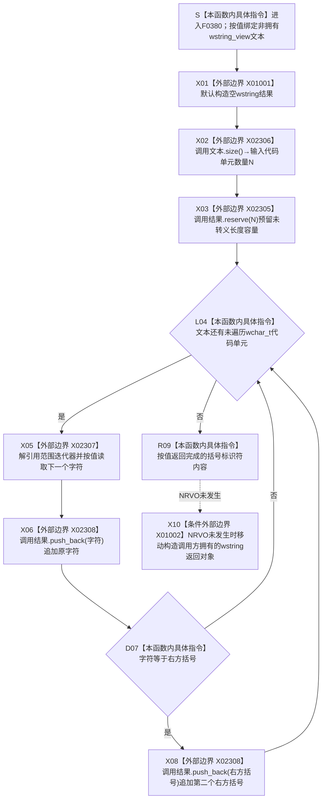

# CF-L6-0204 `转义SQL标识符` 现状流程图

图类型：现状流程图
代码版本：`3686cc2882ba42216609174c8e45e59b684e2958`
覆盖文件：`海中鱼巣/适配/SQL数据库适配.cpp:101-111`
唯一根函数：F0380
完整签名：`std::wstring 海中鱼巣::{匿名命名空间@SQL数据库适配.cpp}::转义SQL标识符(std::wstring_view 文本)`
参数：`文本` 按值复制 `std::wstring_view` 视图，仅在调用期间非拥有地借用原字符序列；不要求以空字符结尾，调用方必须保证底层字符存储覆盖完整调用
返回结果：按输入顺序复制全部 `wchar_t` 代码单元，每遇到一个右方括号 `L']'` 就在其后再追加一个右方括号；返回 `std::wstring` 独立拥有结果字符存储
长度合同：若输入长度为 `N`、右方括号数量为 `B`，成功结果长度为 `N + B`；初始 `reserve(N)` 不含新增括号，`B > 0` 时后续 `push_back` 仍可能扩容
非法值 / 拒绝：函数没有入口拒绝；空视图合法并返回空字符串，单引号、左方括号、嵌入空字符、控制字符和其它代码单元均原样复制；悬空、无效地址范围或调用期间底层存储失效属于调用前置违反和未定义行为，不是本函数可拒绝的非法值
已登记调用方：F0203 经 E0817；`SQL数据库适配.cpp:342` 传入 `配置_.数据库`
直接项目函数：无
外部边界：X01001 默认构造 `std::wstring`；X02306 读取输入长度；X02305 预留容量；X02307 解引用范围迭代器；X02308 在两个调用点追加字符；X01002 形成按值返回字符串
未解析项目调用：无
调用图：`流程图/主程序可达调用关系/01_main可达项目调用边表.md`
外部边界表：`流程图/主程序可达调用关系/02_main可达外部边界表.md`
逐行映射表：`流程图/代码流程图/L6/CF-L6-0204_转义SQL标识符_逐行代码映射表.md`
输入契约 / 调用语境表：本文“调用语境与边界”
非成功返回二分审查表：本文“调用语境与边界”
偏差清单：本文“共享 SQL 转义语义审计”
依据提交 / 结构化消息：冻结源码提交 `3686cc2882ba42216609174c8e45e59b684e2958`；源码 blob `de392dd23f45fc43186fe3d2b545969e2ea3625a`；E0817、X01001、X01002、X02305—X02308 由正式 main 可达表、当前 HEAD Clang AST 候选和源码交叉复核
结构读取与写入：只读取借用字符序列并写局部结果字符串；不连接数据库、不执行 SQL、不修改配置、仓库或项目机器事实
逻辑内返回：空输入正常返回空结果；函数没有返回状态或具名拒绝
内部错误：长度不可表示或内存分配失败等函数执行期资源异常不能被本函数结构化表达；输入借用前置违反、重复应用和上游双层 SQL 组合问题分别属于调用前置或调用语境，不冒充函数内部错误
生命周期与资源释放：结果字符串拥有自己的字符副本；输入视图不延长源字符串生命周期。返回值由调用方拥有，局部结果允许 NRVO，未消除时可经 X01002 移动构造
异常：未声明 `noexcept` 且不捕获；`reserve` 或 `push_back` 的 `std::length_error`、`std::bad_alloc` 等异常向调用方传播，局部结果按 RAII 析构
并发：函数无共享状态；只要调用期间输入字符存储不被并发修改，同一输入得到相同结果
幂等：不是幂等函数；重复应用会继续加倍，且函数不识别输入是否已经转义。当前 F0203 只调用一次；未来多层 SQL 组合规则由正式合同裁决，本文不冻结
验证入口：`SQL数据库适配.cpp:66-75,101-111,329-345`、E0817、X01001、X01002
验证输出：101—111 行完整覆盖；项目出边 0、正式外部边界 6 个、未解析项目调用 0；本批不运行构建、数据库或程序
依据：`规范/0050_项目通用机器逻辑与禁止性规则总纲_20260721.md`、`规范/0600_代码函数流程图应用与维护规范.md`、`规范/8120_子规范_程序入口启动模式与运行宿主边界_20260726.md`、`规范/详细设计/SQLServer结构审计投影与控制面板查看详细设计.md`
不得作为施工许可：是
不得宣称：结果已经包含外层方括号、可以安全用作 SQL 字符串字面量内容、已经拒绝全部非法数据库名、可以安全重复转义、SQL 已执行，或数据库材料取得机器事实权威

## 流程图

## 已登记调用方

| 调用边 | 调用方 / 位置 | 输入 | 当前结果用途 | 调用方图 |
| --- | --- | --- | --- | --- |
| E0817 | F0203 `SQL数据库适配::初始化数据库` / `SQL数据库适配.cpp:342` | `配置_.数据库` 的 `wstring_view` 借用 | 形成 `数据库标识符`，随后嵌入动态 SQL 文本 `EXEC(N'CREATE DATABASE [<内容>]')` | [F0203](../L5/CF-L5-0083_SQL初始化数据库_现状流程图.md) |

## 外部边界

| 身份 | 位置 | 当前行为 | 所有权 / 失败 |
| --- | --- | --- | --- |
| X01001 | 102 | 默认构造空 `std::wstring 结果` | 局部拥有；构造本身按正式表为条件 noexcept |
| X02306 / X02305 | 103 | `文本.size()` 后 `结果.reserve(...)` | 只预留容量；长度或分配异常向外传播 |
| X02307 / X02308 | 104—108 | 解引用 `wstring_view` 迭代器并执行一次或两次 `push_back` | 追加原字符；右方括号追加第二次；可能扩容 |
| X01002 | 110 | 按值返回 `结果` | 允许 NRVO；未消除时移动构造调用方拥有的字符串 |

## 调用语境与边界

| 输入语境 | 当前事实 | 结果 | 二分口径 | 结构后果 |
| --- | --- | --- | --- | --- |
| E0817 数据库名称 | F0203 已用 F0378 拒绝空值、超长、分号、花括号和 CR/LF，但允许右方括号和单引号 | 右方括号被加倍；随后由调用方加外层 `[...]` | 正常括号标识符转义 | 只形成局部 SQL 文本 |
| 空视图 | F0380 自身允许 | 返回空 `wstring` | 合法结果；是否允许空数据库名由上游准入裁决 | 零项目结构写入 |
| 已转义输入 | 输入已经含成对右方括号 | 每个右方括号再次加倍 | 重复应用结果；当前函数没有已转义状态识别 | 零项目结构写入 |
| 分配或长度异常 | 输出容量或长度无法形成 | 不返回部分结果，异常传播 | 内部资源错误 | 局部字符串 RAII 清理 |

## 共享 SQL 转义语义审计

- F0380 只生成一个 SQL Server 方括号标识符层的内部内容，不添加外层 `[`、`]`，也不处理内容随后是否嵌入 SQL 字符串字面量。
- F0203 把 F0380 结果放入 `CREATE DATABASE [<内容>]`，但整段命令又位于外层动态 `EXEC(N'...')` 字符串字面量中。
- F0378 的配置准入允许单引号；F0380 不加倍单引号。因此数据库名含单引号时，括号标识符层虽然处理了 `]`，外层动态 SQL 字符串层仍未由当前调用组合完成转义。
- 该问题是 F0203 对 F0379/F0380 的双层组合合同未冻结，不意味着 F0380 的单层右方括号加倍源码身份不明确。本切片只记录，不修改代码、规范、详细设计或共享调用图。
- `std::wstring_view` 按代码单元遍历，嵌入空字符会被保留；本函数不保证后续使用 `SQL_NTS` 的 ODBC 边界不会在空字符处截断。
