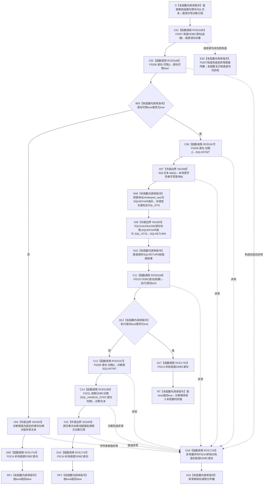

# CF-L6-0205 `执行无结果SQL` 现状流程图

图类型：现状流程图
代码版本：`9b4aa4a151e32d09d30cd9f28c9f85a45fd2692b`
覆盖文件：`海中鱼巣/适配/SQL数据库适配.cpp:250-265`
唯一根函数：F0381
完整签名：`bool 海中鱼巣::{匿名命名空间@SQL数据库适配.cpp}::执行无结果SQL(SQLHDBC 连接, std::wstring SQL文本, std::wstring& 诊断)`
参数：`连接` 按值复制非拥有的 ODBC 连接句柄，本函数不关闭或转移它；`SQL文本` 按值取得本函数拥有的宽字符串，调用方可复制或移动传入；`诊断` 是调用方拥有且调用期间有效的可写 `std::wstring` 左值引用，本函数失败时覆盖它，成功时保持原值
返回结果：语句句柄不可用或 `SQLExecDirectW` 结果不满足 F0210 时返回 `false`；成功时返回 `true`。返回值不携带失败阶段，失败说明经 `诊断` 输出
非法值 / 拒绝：本函数不预检空 / 无效连接句柄、空 SQL、内嵌 NUL 或 SQL 语义；语句句柄分配失败折叠为固定诊断和 `false`；执行失败折叠为 ODBC 诊断和 `false`
已登记调用方：E0819 / F0203 `SQL数据库适配::初始化数据库() const`，在 `SQL数据库适配.cpp:345` 执行建库 SQL、在 375 行执行建表 SQL
直接项目函数：正式关系表登记 F0207、F0208、F0209、F0210、F0211；局部 `ODBC语句` 在所有退出路径经 RCE1742 隐式调用已定义析构 F0214
外部边界：X01003 覆盖固定诊断字符串赋值；X01004 调用 `SQLExecDirectW`；X01005 把 F0211 返回诊断移动赋值到输出引用；X02309 调用 `SQL文本.data()` 为 X01004 形成第二实参
未解析项目调用：无
调用图：`流程图/主程序可达调用关系/01_main可达项目调用边表.md`
逐行映射表：`流程图/代码流程图/L6/CF-L6-0205_执行无结果SQL_逐行代码映射表.md`
输入契约 / 调用语境表：本文“调用语境与非成功分账”
非成功返回二分审查表：本文“调用语境与非成功分账”
偏差清单：本文原记录的 F0214 隐式析构项目边和 `std::wstring::data()` 外部边界缺口已经分别由 RCE1742、X02309 闭合；未据此形成代码修改或施工许可
依据提交 / 结构化消息：冻结源码提交 `9b4aa4a151e32d09d30cd9f28c9f85a45fd2692b`；正式关系表 E0819、RCE0165—RCE0169、X01003—X01005；源码逐行与 F0214 已发布单函数图交叉复核
结构读取与写入：读取传入连接句柄和本地 SQL 文本；可能通过 ODBC 在外部 SQL Server 执行 SQL；失败时写调用方诊断字符串。它不写海中鱼巣节点、关系、索引或内存机器事实
逻辑内返回：在本适配函数边界，语句不可用和 ODBC 执行失败均以 `false + 诊断` 返回，不抛出结构化领域结果
内部错误：E0819 两个正式调用点都在配置、连接和 SQL 文本已形成后进入实际数据库动作；这些语境中的 `false` 被 F0203 收口为“追根因失败”，不能当作普通空结果或成功。若 F0214 释放语句句柄失败，当前析构丢弃 ODBC 返回码，本函数仍无法报告
生命周期与资源释放：F0207 构造的局部 `ODBC语句` 独占其 STMT 句柄；构造完成后，无论返回 `false`、返回 `true` 或后续异常展开，均隐式调用 F0214 释放语句句柄。`连接` 不由本函数释放；`SQL文本` 在函数退出时析构；`诊断` 继续归调用方所有
异常：未声明 `noexcept` 且不捕获。F0207 构造完成前异常直接传播；构造完成后的字符串赋值、诊断形成或其它 C++ 异常先析构局部语句再传播。ODBC C API 以 `SQLRETURN` 报告结果，当前代码不把其失败转换为 C++ 异常
并发 / 幂等：本函数不提供连接级同步；调用方须保证同一连接句柄的合法并发。重复执行 SQL 可能改变数据库或命中 SQL 自身幂等门，不能仅凭函数名宣称幂等
验证入口：250—265 行、E0819、RCE0165—RCE0169、X01003—X01005、F0214
验证输出：16 行源码完整覆盖；6 条正式项目出边、4 个正式外部边界、0 未解析项目调用
依据：`规范/0050_项目通用机器逻辑与禁止性规则总纲_20260721.md`、`规范/0600_代码函数流程图应用与维护规范.md`、`规范/4050_子规范_入口拒绝逻辑内结果与内部逻辑错误.md`、`规范/详细设计/SQLServer结构审计投影与控制面板查看详细设计.md`
不得作为施工许可：是
不得宣称：返回 `true` 已读回数据库结构或形成海中鱼巣机器事实，返回 `false` 是普通空结果，诊断字符串取得机器事实身份，或 F0214 已确认释放成功

## 流程图

## 项目源码调用合同

| 调用边 | 节点 | 被调函数 | 实参 | 调用前置 / 结果用途 | 被调图 |
| --- | --- | --- | --- | --- | --- |
| RCE0165 | C01 | F0207 `海中鱼巣::{匿名命名空间@SQL数据库适配.cpp}::ODBC语句::ODBC语句(SQLHDBC 连接)` | `连接` | 函数进入后构造局部语句；对象完成构造后取得 STMT 句柄所有权或保持空句柄 | `流程图/代码流程图/L5/CF-L5-0087_ODBC语句构造_现状流程图.md` |
| RCE0166 | C02 | F0208 `bool 海中鱼巣::{匿名命名空间@SQL数据库适配.cpp}::ODBC语句::可用() const` | `this=&语句` | 构造完成后调用；false 进入固定诊断和失败返回 | `流程图/代码流程图/L5/CF-L5-0088_ODBC语句可用_现状流程图.md` |
| RCE0167 | C06 / C13 | F0209 `SQLHSTMT 海中鱼巣::{匿名命名空间@SQL数据库适配.cpp}::ODBC语句::句柄() const` | `this=&语句` | 第一次为 SQLExecDirectW 提供句柄；第二次仅在执行失败时为诊断读取提供句柄 | `流程图/代码流程图/L5/CF-L5-0089_ODBC语句句柄_现状流程图.md` |
| RCE0168 | C11 | F0210 `bool 海中鱼巣::{匿名命名空间@SQL数据库适配.cpp}::ODBC成功(SQLRETURN 结果)` | X01004 返回的 `结果` | SQL 执行完成后分类 `SQL_SUCCESS` / `SQL_SUCCESS_WITH_INFO` | `流程图/代码流程图/L5/CF-L5-0090_ODBC成功_现状流程图.md` |
| RCE0169 | C14 | F0211 `std::wstring 海中鱼巣::{匿名命名空间@SQL数据库适配.cpp}::读取ODBC诊断(SQLSMALLINT 句柄类型, SQLHANDLE 句柄)` | `SQL_HANDLE_STMT`、C13 返回句柄 | 仅执行失败时形成诊断字符串，随后写入调用方引用 | `流程图/代码流程图/L5/CF-L5-0091_读取ODBC诊断_现状流程图.md` |
| RCE1742 | D05 / D16 / D17 / D18 | F0214 `海中鱼巣::{匿名命名空间@SQL数据库适配.cpp}::ODBC语句::~ODBC语句()` | `this=&语句` | 局部对象完成构造后的每个正常退出或异常展开；析构内部释放非空 STMT 句柄并丢弃释放结果 | `流程图/代码流程图/L5/CF-L5-0094_ODBC语句析构_现状流程图.md` |

## 已登记调用方与非成功分账

| 调用语境 | 调用点 / 输入 | 当前结果 | 二分口径 | 后继 |
| --- | --- | --- | --- | --- |
| E0819 建库 SQL | `SQL数据库适配.cpp:345`；主连接已打开，建库 SQL 已形成并移动传入 | 成功 `true`；语句不可用或执行失败为 `false + 诊断` | 合法材料进入数据库执行后失败，按正式详细设计属于追根因解决 | F0203 失败时返回 `追根因失败(L"初始化数据库", 诊断)` |
| E0819 建表 SQL | `SQL数据库适配.cpp:375`；数据连接已打开，建表 SQL 已形成并移动传入 | 成功 `true`；语句不可用或执行失败为 `false + 诊断` | 合法材料进入数据库执行后失败，按正式详细设计属于追根因解决 | F0203 失败时返回 `追根因失败(L"初始化审计表", 诊断)` |
| 语句句柄不可用 | F0207 构造完成但 F0208=false | 固定诊断并返回 false | 适配层允许的失败返回；正式调用语境按追根因处理 | 不调用 SQLExecDirectW |
| SQL 执行失败 | X01004 已返回非成功 SQLRETURN | 读取 ODBC 诊断、覆盖输出并返回 false | 适配层允许的失败返回；正式调用语境按追根因处理 | F0214 释放语句句柄 |
| SQL 执行成功 | F0210=true | 返回 true，输出诊断不清空 | 当前执行调用成功；不是读回证据 | F0214 释放语句句柄后返回 |

## 当前边界与规范核对

- `连接` 只借用，局部 `ODBC语句` 才拥有本次 STMT 句柄；F0381 不关闭调用方连接。
- `SQL文本` 按值取得并在 X01004 调用期间提供连续存储；`SQL_NTS` 使 ODBC 以首个 NUL 为终点，当前函数不拒绝内嵌 NUL。
- `诊断` 只在两个失败分支被覆盖；成功路径不会主动清空旧诊断，因此调用方不得在 `true` 时把原诊断当成本次结果。
- F0214 隐式析构是源码真实项目调用，覆盖两个 false、一个 true 和构造完成后的异常路径，正式关系表以 RCE1742 登记该出边。
- `true` 只证明 X01004 返回了 F0210 接受的 ODBC 状态，不证明 SQL 产生了目标结构、影响行数符合预期或发布后读回一致。
- 本函数的裸 `false` 是适配层结果；E0819 的两个当前生产语境在数据库动作已经开始后把它升级为追根因失败，不能作为普通逻辑空结果。
