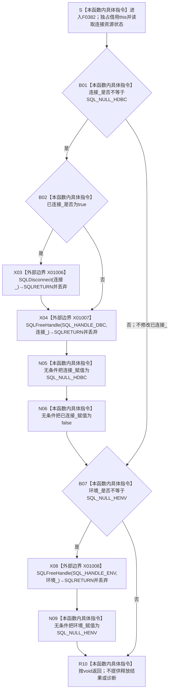

# CF-L6-0206 `ODBC连接::关闭` 现状流程图

图类型：现状流程图
代码版本：`9b4aa4a151e32d09d30cd9f28c9f85a45fd2692b`
覆盖文件：`海中鱼巣/适配/SQL数据库适配.cpp:201-214`
唯一根函数：F0382
完整签名：`void 海中鱼巣::{匿名命名空间@SQL数据库适配.cpp}::ODBC连接::关闭()`
参数：无显式参数；隐式 `this` 是对当前 `ODBC连接` 对象的独占可写借用。对象拥有 `环境_` 和 `连接_` 中的非空 ODBC 句柄，并以 `已连接_` 记录当前连接标志
返回结果：`void`；按当前成员状态选择断连和释放调用，随后结束，不返回 ODBC 成功 / 失败、诊断或释放计数
非法值 / 拒绝：无结构化入口拒绝。空连接句柄跳过断连、DBC 释放及 `已连接_=false`；空环境句柄跳过 ENV 释放。非空句柄的 ODBC 返回码全部被丢弃
已登记调用方：E0827 / F0205 `ODBC连接::打开(...)` 在每次打开前调用；E0837 / F0215 `ODBC连接::~ODBC连接()` 在析构时调用
直接项目函数：无
外部边界：X01006 `SQLDisconnect(连接_)`；X01007 `SQLFreeHandle(SQL_HANDLE_DBC, 连接_)`；X01008 `SQLFreeHandle(SQL_HANDLE_ENV, 环境_)`
未解析项目调用：无
调用图：`流程图/主程序可达调用关系/01_main可达项目调用边表.md`
逐行映射表：`流程图/代码流程图/L6/CF-L6-0206_ODBC连接关闭_逐行代码映射表.md`
输入契约 / 调用语境表：本文“关闭语境与非成功分账”
非成功返回二分审查表：本文“关闭语境与非成功分账”
偏差清单：当前 void 接口丢弃全部 ODBC 返回码；当 `连接_ == SQL_NULL_HDBC && 已连接_ == true` 时不会归一化 `已连接_`
依据提交 / 结构化消息：冻结源码提交 `9b4aa4a151e32d09d30cd9f28c9f85a45fd2692b`；正式关系表 E0827、E0837、X01006—X01008 与源码逐行复核
结构读取与写入：读取并修改当前适配对象的 `连接_`、`环境_` 和 `已连接_`；调用 ODBC 断连和句柄释放。它不写海中鱼巣节点、关系、索引或领域机器事实
逻辑内返回：连接 / 环境句柄为空时跳过相应外部调用并正常 `void` 返回；重复关闭已完全清空且 `已连接_ == false` 的对象不调用 ODBC
内部错误：X01006—X01008 的失败返回全部被丢弃，函数仍把对应本地句柄置空，不能证明外部资源已释放；若连接句柄为空但 `已连接_` 为 true，当前函数保留该矛盾标志
生命周期与资源释放：若 DBC 非空且 `已连接_` 为 true，先尝试断连；随后无条件尝试释放 DBC，再把本地 DBC 置空并把 `已连接_` 置 false。最后独立处理 ENV：尝试释放后置空
异常：未声明 `noexcept`，但当前路径仅调用以 `SQLRETURN` 报告结果的 ODBC C API，并执行标量赋值，没有显式可抛 C++ 操作；F0215 析构语境不能接收失败结果
并发 / 幂等：无锁且修改对象资源状态；调用方必须独占对象。对象处于 `连接_=NULL、环境_=NULL、已连接_=false` 时重复调用状态幂等；部分矛盾状态不保证归一化
验证入口：201—214 行、E0827、E0837、X01006—X01008
验证输出：14 行源码完整覆盖；0 项目出边、3 外部边界、0 未解析调用
依据：`规范/0050_项目通用机器逻辑与禁止性规则总纲_20260721.md`、`规范/0600_代码函数流程图应用与维护规范.md`、`规范/4050_子规范_入口拒绝逻辑内结果与内部逻辑错误.md`、`规范/详细设计/SQLServer结构审计投影与控制面板查看详细设计.md`
不得作为施工许可：是
不得宣称：本地句柄置空证明 ODBC 已成功释放、`void` 返回证明无错误、析构完成证明数据库连接已关闭，或该函数改变了项目机器事实

## 流程图

## 外部调用与结果合同

| 边界 | 节点 | 实参 | 调用前置 | 返回处理 / 后继 |
| --- | --- | --- | --- | --- |
| X01006 | X03 | `连接_` | `连接_ != SQL_NULL_HDBC && 已连接_ == true` | `SQLRETURN` 被丢弃；无论断连是否成功都继续 X01007 |
| X01007 | X04 | `SQL_HANDLE_DBC`、`连接_` | `连接_ != SQL_NULL_HDBC` | `SQLRETURN` 被丢弃；随后无条件置空连接句柄并清除连接标志 |
| X01008 | X08 | `SQL_HANDLE_ENV`、`环境_` | `环境_ != SQL_NULL_HENV` | `SQLRETURN` 被丢弃；随后无条件置空环境句柄 |

## 已登记调用方

| 调用方 | 调用边 | 位置 / 前置 | void 结果用途 | 调用方图 |
| --- | --- | --- | --- | --- |
| F0205 `ODBC连接::打开(const SQL数据库配置&, std::wstring_view, std::wstring&)` | E0827 | `SQL数据库适配.cpp:133`；每次打开的第一条正文调用 | 不检查关闭结果，随后直接尝试分配新 ENV | `流程图/代码流程图/L5/CF-L5-0085_ODBC连接打开_现状流程图.md` |
| F0215 `ODBC连接::~ODBC连接()` | E0837 | `SQL数据库适配.cpp:126`；对象析构 | 无结果可消费；析构随后结束 | `流程图/代码流程图/L5/CF-L5-0095_ODBC连接析构_现状流程图.md` |

## 关闭语境与非成功分账

| 当前成员状态 | 调用顺序 | 本地后置 | 二分口径 / 风险 |
| --- | --- | --- | --- |
| DBC 非空、`已连接_ == true`、ENV 非空 | X01006 → X01007 → 清 DBC / 标志 → X01008 → 清 ENV | 三个本地成员均归零 / false | 外部返回全部丢弃；本地清空不证明断连或释放成功 |
| DBC 非空、`已连接_ == false` | 跳过 X01006；X01007 → 清 DBC / 标志；再独立处理 ENV | DBC 为空、连接标志 false | 允许释放未建立连接的 DBC 句柄 |
| DBC 为空、`已连接_ == false` | 跳过连接分支；独立处理 ENV | 连接状态不变；ENV 可能清空 | 已完全清空时重复关闭为无外部调用的正常 void 返回 |
| DBC 为空、`已连接_ == true` | 跳过连接分支且不改 `已连接_`；独立处理 ENV | 矛盾连接标志仍为 true | 若上游保证成员一致，这是内部状态错误；当前接口不报告 |
| 任一 ODBC 释放调用失败 | 仍执行后续本地置空 | 本地失去失败句柄值 | 资源泄漏 / 活动连接风险不能从 void 结果审计 |

## 当前边界与规范核对

- 关闭顺序固定为“可选断连 DBC → 释放 DBC → 清本地 DBC 与连接标志 → 释放 ENV → 清本地 ENV”，不会先释放 ENV。
- `已连接_` 只在 DBC 非空分支被置 false；DBC 已空但标志为 true 的矛盾状态不会自愈。
- 三个 ODBC 外部调用的 `SQLRETURN` 都被丢弃，代码没有诊断输出、重试、保留句柄或内部错误结果。
- F0205 在重新打开前调用本函数但不检查释放结果；因此旧资源释放失败时仍可能继续建立新资源。
- F0215 通过本函数承担析构释放；void / 丢返回码符合析构不抛路径，但不提供可审计的释放成功证据。
- 本函数改变的是适配对象局部资源状态和外部 ODBC 资源，不创建或更新海中鱼巣持久机器事实。
