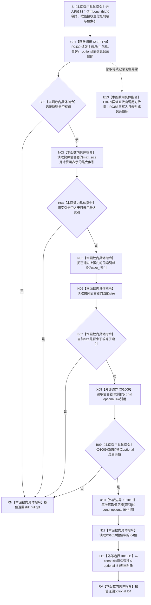

# CF-L6-0207 `主信息仓库::读取I64值(主信息句柄,值索引,令牌)` 现状流程图

图类型：现状流程图
代码版本：`9b4aa4a151e32d09d30cd9f28c9f85a45fd2692b`
源码 blob：`11f8fa53ff961a8cbaac34cf75b69a22533ca907`
覆盖文件：`海中鱼巣/核心/主信息仓库.cpp:446-452`
唯一根函数：F0383
完整签名：`std::optional<std::int64_t> 海中鱼巣::主信息仓库::读取I64值(海中鱼巣::主信息句柄 主信息, std::uint64_t 值索引, const 海中鱼巣::结构事务令牌& 令牌) const`
参数：隐式 `this` 是调用期有效的 const `主信息仓库` 非拥有借用；`主信息` 和 `值索引` 按值传入；`令牌` 是调用期有效的 const `结构事务令牌` 非拥有借用。函数不保存参数，不延长仓库或令牌生命周期
返回结果：F0439 返回当前有效主信息记录的值式快照，且索引可表示为容器索引、快照中存在该槽位并且槽位有值时，按值返回独立拥有的 `std::optional<std::int64_t>`；其它当前允许的不命中形态返回 `std::nullopt`
非法值 / 拒绝：无效、错仓、错版本、已删除主信息或无效 / 错域令牌由 F0439 折叠为空记录；`值索引` 大于 `值容器.max_size()-1`、大于等于当前 `值容器.size()` 或命中空槽位时返回 `std::nullopt`
已登记调用方：F0217 经 E0842（`主信息仓库.cpp:433`）；F0619 经 RCE0273（`主信息仓库.cpp:425`）
直接项目函数：F0439 `主信息仓库::读取主信息(主信息句柄,const 结构事务令牌&) const`，正式项目边 RCE0170
外部边界：X01009 在 450 行读取槽位 optional 引用；X01010 在 451 行再次读取该槽位；X01011 从槽位中的 I64 值构造返回 optional。`optional::has_value`、`vector::max_size/size` 和 `optional::value` 当前未在正式外部边界表中取得独立稳定身份，只按源码具体判断 / 读取记录
未解析项目调用：无
调用图：`流程图/主程序可达调用关系/01_main可达项目调用边表.md`
外部边界表：`流程图/主程序可达调用关系/02_main可达外部边界表.md`
逐行映射表：`流程图/代码流程图/L6/CF-L6-0207_主信息仓库读取I64值令牌重载_逐行代码映射表.md`
输入契约 / 调用语境表：本文“读取语境与非成功分账”
非成功返回二分审查表：本文“读取语境与非成功分账”
偏差清单：本文“当前边界与规范核对”
依据提交 / 结构化消息：冻结提交 `9b4aa4a151e32d09d30cd9f28c9f85a45fd2692b`；F0383、F0439、E0842、RCE0273、RCE0170、X01009—X01011 由正式 main 可达关系表和当前源码交叉复核
结构读取与写入：F0439 在令牌准入和仓库共享锁窗口内复制一份当前有效主信息记录；F0383 只读取该值式快照的 `值容器`，不写仓库、主信息记录、令牌、索引或其它机器事实
逻辑内返回：记录不命中、索引不可表示、槽位越界或槽位为空均返回 `std::nullopt`，零机器事实写入
内部错误：正式上游已经保证令牌、句柄和已发布槽位有效却仍返回空时，需要沿 F0439 的令牌 / 句柄复核或快照值容器追查；本函数的空 optional 不保留具体原因
生命周期与资源释放：F0439 返回的 optional 记录是 F0383 栈内拥有的值式快照；F0439 的共享锁在其返回前释放。F0383 后续只读快照，X01011 形成独立 I64 optional 返回，不暴露仓库内部容器、记录引用或令牌引用
异常：未声明 `noexcept` 且不捕获；F0439 取得共享锁或复制 `主信息记录::值容器` 时可抛，异常直接传播且不形成 `记录`；F0383 自身的整数比较、强制转换、已登记 `operator[]` 和 I64 optional 构造当前定义路径不分配
并发 / 幂等：同一令牌读取窗口由 F0439 负责；F0383 消费已复制快照，不在锁释放后回读仓库。相同快照和索引得到相同结果；返回后仓库变化不反向改变已返回 I64 值
验证入口：`主信息仓库.cpp:446-452`、RCE0170、E0842、RCE0273、X01009—X01011
验证输出：7 行源码完整映射；1 个项目出边、3 个正式外部边界、0 个未解析项目调用；本批不运行构建或程序
依据：`规范/0050_项目通用机器逻辑与禁止性规则总纲_20260721.md`、`规范/0600_代码函数流程图应用与维护规范.md`、`规范/4010_子规范_统一仓库稳定句柄与通用关系索引边界.md`、`规范/4040_子规范_不透明结构事务候选确认撤销与最后发布.md`、`规范/4050_子规范_入口拒绝逻辑内结果与内部逻辑错误.md`
不得作为施工许可：是
不得宣称：返回值已经成为长期机器事实、空 optional 唯一证明主信息不存在、令牌或句柄具体拒绝原因已保留、读取锁在 F0383 返回后仍持有，或本函数修改了任何主信息结构

## 流程图

## 项目源码调用合同

| 调用边 | 节点 | 被调函数 | 实参 | 调用前置 / 结果用途 | 被调图 |
| --- | --- | --- | --- | --- | --- |
| RCE0170 | C01 | F0439 `std::optional<主信息记录> 主信息仓库::读取主信息(主信息句柄,const 结构事务令牌&) const` | 同一 `this`、按值 `主信息`、借用 `令牌` | 函数进入后首先调用；其值式快照决定后续槽位读取或空返回 | 待生成 |

## 已登记调用方

| 调用边 | 调用方 / 位置 | 当前前置 | 结果用途 | 调用方图 |
| --- | --- | --- | --- | --- |
| E0842 | F0217 `读取I64值(主信息句柄,std::uint64_t) const` / `主信息仓库.cpp:433` | 接域、共享许可有效并已取得令牌 | 直接返回 F0383 的 optional | 待生成 |
| RCE0273 | F0619 `读取I64值(主信息句柄) const` / `主信息仓库.cpp:425` | 接域、共享许可有效；固定索引为 0 | 直接返回 F0383 的 optional | 待生成 |

## 读取语境与非成功分账

| 语境 | 当前前置 | 空 optional 原因 | 二分口径 | 结构后果 |
| --- | --- | --- | --- | --- |
| F0439 返回空记录 | 令牌或句柄交给令牌重载读取 | 令牌无效 / 错域，或句柄零值、错仓、错版本、记录不存在 / 非有效 | 普通只读入口允许的不命中结果；强前置调用中可成为根因证据 | 零写入 |
| 索引超过容器可表示上限 | 已取得记录快照 | `值索引 > max_size()-1` | 写前 / 读前边界拒绝 | 不做窄化转换，不访问容器 |
| 索引超过当前槽位数量 | 索引可表示 | `size() <= 索引` | 当前记录没有该槽位 | 不调用 X01009 / X01010 |
| 槽位为空 | 索引位于当前容器范围内 | X01009 指向的 optional 无值 | 当前槽位未承载 I64 | 不读取槽位值 |
| 槽位有值 | 记录、索引和槽位均通过 | 无 | 正常值式读取 | X01011 复制 I64 后独立返回 |

## 当前边界与规范核对

- F0383 不直接持有仓库锁；令牌验证、共享锁和主信息句柄复核全部由 F0439 完成。F0439 返回后，F0383 消费的是值式快照。
- 上限判断发生在 `std::uint64_t` 到 `std::size_t` 转换之前；只有通过 `max_size()-1` 门禁才形成本地 `size_t 索引`。
- 当前源码在 450 行经 X01009 判断槽位有值，451 行经 X01010 再次定位同一快照槽位并由 X01011 形成返回 optional；两次访问之间没有共享写入或仓库回读。
- 返回空值合并令牌、句柄、记录、索引和槽位多种原因。该裸 optional 只表达本次只读不命中，不得替代正式错误分类或长期事实。
- 本函数不暴露 `主信息记录`、`值容器`、槽位 optional 或事务令牌的引用，符合普通读取返回值式材料的边界。
