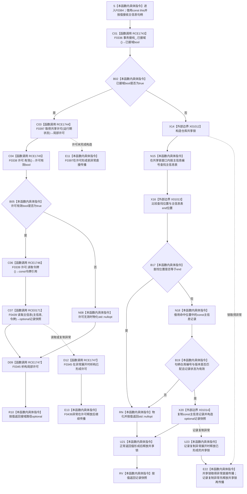

# CF-L6-0208 `主信息仓库::读取主信息(主信息句柄)` 现状流程图

图类型：现状流程图
代码版本：`9b4aa4a151e32d09d30cd9f28c9f85a45fd2692b`
源码 blob：`11f8fa53ff961a8cbaac34cf75b69a22533ca907`
覆盖文件：`海中鱼巣/核心/主信息仓库.cpp:198-210`
唯一根函数：F0384
完整签名：`std::optional<海中鱼巣::主信息记录> 海中鱼巣::主信息仓库::读取主信息(海中鱼巣::主信息句柄 主信息) const`
参数：隐式 `this` 是调用期有效的 const `主信息仓库` 非拥有借用；`主信息` 按值传入。本函数不保存句柄、不延长仓库生命周期，也不把锁、令牌或仓库记录引用返回给调用方
返回结果：接域时形成共享许可；许可有效则把同一句柄和许可令牌交给 F0439 并返回其 optional 值式快照，许可无效则返回 `std::nullopt`。未接域时持仓库共享锁查表，只有编号命中、仓库编号和版本匹配且记录状态为 `有效` 才经 X01014 复制记录并返回；其它形态返回 `std::nullopt`
非法值 / 拒绝：零值、错仓、错版本、未找到或非有效句柄均折叠为空 optional；接域但共享许可无效也折叠为空。接线不完整时 F0336 返回 false，当前代码仍进入本地共享锁读取而没有具名拒绝
已登记调用方：F0217 经 E0844（`主信息仓库.cpp:435`）；F0624 经 RCE0279（`主信息仓库.cpp:368`）
直接项目函数：RCE1743 调用 F0336、RCE1744 唯一解析到 F0397、RCE1745 调用 F0338、RCE1746 调用 F0339、RCE0171 调用 F0439、RCE1747 隐式析构 F0345
外部边界：X01012 构造未接域路径共享锁；X01013 比较查找位置与 `end()`；X01014 从 const `主信息记录` 复制构造返回 optional。`unordered_map::find/end` 和共享锁析构仍按当前聚合口径合并在 X01012—X01014 与本函数具体指令中；接域路径许可析构已由项目边 RCE1747 登记
未解析项目调用：无；F0397 是当前正式生产接线中 `取得共享许可` 函数指针的唯一目标
调用图：`流程图/主程序可达调用关系/01_main可达项目调用边表.md`
外部边界表：`流程图/主程序可达调用关系/02_main可达外部边界表.md`
逐行映射表：`流程图/代码流程图/L6/CF-L6-0208_主信息仓库读取主信息无令牌重载_逐行代码映射表.md`
输入契约 / 调用语境表：本文“读取语境与非成功分账”
非成功返回二分审查表：本文“读取语境与非成功分账”
偏差清单：本文“当前边界与规范核对”
依据提交 / 结构化消息：冻结提交 `9b4aa4a151e32d09d30cd9f28c9f85a45fd2692b`；F0384、F0439、E0844、RCE0279、RCE0171、X01012—X01014 由正式 main 可达关系表和当前源码交叉复核；F0336 / F0397 / F0338 / F0339 / F0345 由现行稳定函数身份与源码静态接收者复核
结构读取与写入：接域路径由 F0439 读取；未接域路径在 X01012 共享锁内读取 `主信息表_` 并复制记录。不创建、修改、删除、失效或发布主信息，也不推进仓库版本
逻辑内返回：许可无效、句柄不命中、错仓、错版本或记录非有效时返回 `std::nullopt`，零机器事实写入
内部错误：构造器已经保证接线形态完整后 F0336=false 可解释为完全未接域；若已发布接线后来成为部分接线，本函数会静默进入本地锁路径。裸 optional 不能区分许可拒绝、句柄拒绝和记录不命中
生命周期与资源释放：接域路径局部许可覆盖 F0338、F0339、F0439 及返回表达式求值，之后经 F0345 析构；未接域路径的 X01012 共享锁覆盖查找、复核和 X01014 记录复制，返回值形成或异常展开后释放。成功返回是调用方独立拥有的记录快照
异常：未声明 `noexcept` 且不捕获；F0397 可在许可形成前抛出；许可形成后 F0439 异常先析构许可再传播。未接域路径 X01012 取得共享锁可抛；X01014 复制记录的 `值容器` 可抛，异常展开先释放共享锁。F0336、F0338、F0339 和 X01013 当前定义路径无可抛操作
并发 / 幂等：接域路径使用事务域共享许可，未接域路径使用仓库共享锁；两条路径都只在受保护窗口内复核并复制记录。返回后锁 / 许可已释放，后续仓库变化不改变已返回快照
验证入口：`主信息仓库.cpp:198-210`、E0844、RCE0279、RCE0171、X01012—X01014，以及同一行的 F0336 / F0397 / F0338 / F0339 / F0345 源码调用
验证输出：13 行源码完整映射；6 个项目出边、3 个外部边界、0 个未解析项目调用；本批不运行构建或程序
依据：`规范/0050_项目通用机器逻辑与禁止性规则总纲_20260721.md`、`规范/0600_代码函数流程图应用与维护规范.md`、`规范/4010_子规范_统一仓库稳定句柄与通用关系索引边界.md`、`规范/4040_子规范_不透明结构事务候选确认撤销与最后发布.md`、`规范/4050_子规范_入口拒绝逻辑内结果与内部逻辑错误.md`
不得作为施工许可：是
不得宣称：返回快照在许可 / 锁释放后仍代表后续仓库状态、空 optional 唯一证明主信息不存在、部分接线已被显式拒绝、调用方取得仓库记录引用，或本函数修改了任何主信息结构

## 流程图

## 项目源码调用合同

| 调用边 | 节点 | 被调函数 | 实参 | 调用前置 / 结果用途 | 被调图 |
| --- | --- | --- | --- | --- | --- |
| RCE1743 | C01 | F0336 `bool 结构事务接线::已接域() const` | `this=&事务接线_` | 函数进入后首先读取接线形态 | `流程图/代码流程图/L6/CF-L6-0016_结构事务接线已接域_现状流程图.md` |
| RCE1744 | C03 | F0397 `结构事务许可 结构事务协调器::生成接线()::<lambda>::operator()(const std::shared_ptr<void>&) const` | `事务接线_.运行期状态` | 仅已接域时形成局部共享许可 | 待生成 |
| RCE1745 | C04 | F0338 `bool 结构事务许可::有效() const` | `this=&许可` | 决定调用令牌重载或返回空 | `流程图/代码流程图/L6/CF-L6-0018_结构事务许可有效_现状流程图.md` |
| RCE1746 | C06 | F0339 `const 结构事务令牌& 结构事务许可::读取令牌() const` | `this=&许可` | 仅许可有效时读取，引用立即传给 F0439 | `流程图/代码流程图/L6/CF-L6-0019_结构事务许可读取令牌_现状流程图.md` |
| RCE0171 | C07 | F0439 `std::optional<主信息记录> 主信息仓库::读取主信息(主信息句柄,const 结构事务令牌&) const` | 同一 `this`、按值 `主信息`、C06 的令牌引用 | 返回 optional 成为接域路径结果 | 待生成 |
| RCE1747 | D09 / D12 | F0345 `结构事务许可::~结构事务许可() noexcept` | `this=&许可` | 许可已形成后的正常返回或异常展开时释放 | `流程图/代码流程图/L6/CF-L6-0024_结构事务许可析构_现状流程图.md` |

## 已登记调用方

| 调用边 | 调用方 / 位置 | 当前前置 | 结果用途 | 调用方图 |
| --- | --- | --- | --- | --- |
| E0844 | F0217 `读取I64值(主信息句柄,std::uint64_t) const` / `主信息仓库.cpp:435` | F0217 未接域路径 | 取得记录快照后读取具名 I64 槽位 | 待生成 |
| RCE0279 | F0624 `主信息是否有效(主信息句柄) const` / `主信息仓库.cpp:368` | F0624 未接域路径 | 对返回 optional 调用 `has_value()` | 待生成 |

## 读取语境与非成功分账

| 语境 | 当前前置 | 空 optional 原因 | 二分口径 | 结构后果 |
| --- | --- | --- | --- | --- |
| 接域且许可有效 | F0336=true、F0397 已形成许可、F0338=true | F0439 拒绝令牌 / 句柄或记录不命中 | 普通只读空结果；强前置成立时沿 F0439 追根因 | 许可析构后零写入返回 |
| 接域但许可无效 | F0336=true、F0397 返回无效许可 | 三元表达式选择 `std::nullopt`，不调用 F0339/F0439 | 许可拒绝折叠为空 optional | 局部许可仍析构；零写入 |
| 完全未接域 | F0336=false 且接线构造不变量成立 | 查表不命中、错仓、错版本或记录非有效 | 当前普通读取允许的不命中 | 共享锁释放后零写入 |
| 接线不完整 | F0336=false，但接线并非完全未接域 | 当前代码仍进入本地共享锁路径 | 若正式上游保证接线完整则属于内部不一致 | 可能用普通读取掩盖接线漂移 |
| 未接域且记录有效 | 编号命中、仓库 / 版本一致、状态有效 | 无 | 正常值式读取 | X01014 复制完整记录后释放锁并返回 |

## 当前边界与规范核对

- F0384 的接域分支是 199 行单一语句，但实际严格包含 F0336、F0397、F0338、F0339、F0439 和 F0345 的条件调用与 RAII 生命周期；单函数图不能因源码压成一行而省略这些调用。
- 正式项目边表以 RCE0171、RCE1743—RCE1747 闭合 F0384 的六个具名项目调用；这些边只记录当前源码事实，不构成代码修改或施工许可。
- 未接域路径的共享锁覆盖 `find`、end 比较、句柄 / 状态复核和 X01014 记录复制。任何正常返回或复制异常都先释放锁，不把锁或仓库内部记录引用交给调用方。
- 成功结果是完整 `主信息记录` 值式快照，其中 `值容器` 由 X01014 复制；返回后仓库修改不改变已返回快照。
- `std::nullopt` 合并许可拒绝、句柄不匹配、记录不存在和记录非有效等原因，只能作为本次普通只读结果，不能独立成为长期事实。
