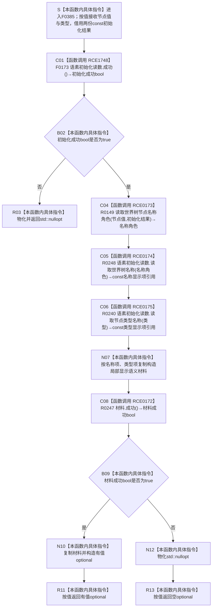

# CF-L6-0209 `读取世界树节点显示语义` 现状流程图

图类型：现状流程图
代码版本：`2c38ec4017e38b2e541b93c8c9ae038856f849c7`
源码 blob：`fa157b5822e3d67b336ffbee06f763b1f22e59a6`
覆盖文件：`海中鱼巣/界面/投影.控制面板启动.ixx:40-53`
唯一根函数：F0385
完整签名：`std::optional<海中鱼巣::语素节点显示语义材料> 海中鱼巣::读取世界树节点显示语义(海中鱼巣::节点句柄 节点值, 海中鱼巣::节点类型 类型, const 海中鱼巣::世界树初始化结果& 初始化结果, const 海中鱼巣::语素初始化结果& 语素初始化读数)`
参数：`节点值` 和 `类型` 按值传入；`初始化结果` 与 `语素初始化读数` 是调用期间有效的 const 非拥有借用。本函数不保存参数引用，也不延长初始化结果的生命周期
返回结果：语素初始化读数不成功时返回 `std::nullopt`；成功时按世界树角色和节点类型分别借用两份初始化显示项，复制形成局部 `语素节点显示语义材料`，仅当该材料的名称项和类型项都成功时复制构造有值 optional，否则返回 `std::nullopt`
非法值 / 拒绝：本函数不单独复核节点句柄和节点类型；语素初始化结果不完整，或组合后的名称 / 类型显示项不完整，均折叠为无值 optional，且零业务结构写入
已登记调用方：F0218 经 E0848（`投影.控制面板启动.ixx:86-87`）；调用前已经读到当前节点记录，调用后以 optional 是否有值决定继续形成树节点显示材料或返回空
直接项目函数：RCE1748 在第 45 行调用 F0173；RCE0173 调用 R0149、RCE0174 调用 R0248、RCE0175 调用 R0240；RCE0172 只在第 52 行调用 R0247
外部边界：当前正式外部边界表没有 F0385 记录。第 46、48—52 行的 `std::nullopt` / `std::optional` 物化、两份显示项复制和局部材料生命周期只按本函数内具体指令表达，不补造 X 身份
未解析项目调用：无
调用图：`流程图/主程序可达调用关系/01_main可达项目调用边表.md`
外部边界表：`流程图/主程序可达调用关系/02_main可达外部边界表.md`
逐行映射表：`流程图/代码流程图/L6/CF-L6-0209_读取世界树节点显示语义_逐行代码映射表.md`
输入契约 / 调用语境表：本文“读取语境与非成功分账”
非成功返回二分审查表：本文“读取语境与非成功分账”
偏差清单：本文“当前边界与聚合缺口”
依据提交 / 结构化消息：冻结提交 `2c38ec4017e38b2e541b93c8c9ae038856f849c7`；F0385、F0173、R0149、R0240、R0247、R0248、E0848、RCE0172—RCE0175、RCE1748 由正式 main 可达关系表和当前源码交叉复核；发布前在 `48a8a0a730f6fc9aef307b95abeee4f38a75826e` 复核目标源码 blob 未变化
结构读取与写入：只读初始化结果中已经形成的语素显示项，复制形成非权威控制面板显示材料；不创建、修改、删除或发布节点、主信息、关系、索引、语素、需求、任务、方法或其它机器事实
逻辑内返回：语素初始化读数不成功或组合材料不成功时返回 `std::nullopt`；该空值是本次只读投影不可形成的结构化结果，不独立裁决底层机器事实
内部错误：若正式上游已经保证完整语素初始化结果，而 F0173 或 R0247 仍返回 false，应沿具体失败显示项追查初始化读回或显示项结构；当前裸 optional 不区分失败项
生命周期与资源释放：R0248 / R0240 返回的 const 引用只在局部材料成员复制期间使用；成功结果复制进 optional 后由调用方按值拥有。局部材料和失败路径临时值在函数退出时销毁，不向调用方暴露初始化结果内部引用
异常：函数未声明 `noexcept` 且不捕获；R0149 声明 `noexcept`，R0248 / R0240 当前返回引用，显示项复制、局部材料复制或 optional 构造若抛出则异常向调用方传播，不转换为空 optional
并发 / 幂等：本函数只读 const 初始化快照并构造局部值；同一输入下无机器结构副作用。初始化结果的并发稳定性由调用方持有期负责，本函数不加锁
验证入口：`投影.控制面板启动.ixx:40-53`、E0848、RCE0172—RCE0175、RCE1748、F0173 / R0149 / R0240 / R0247 / R0248 定义与静态接收者
验证输出：14 行源码完整映射；1 个已登记入边、5 个已登记项目出边、0 个已登记外部边界、0 个动态未解析调用；本子任务不运行构建或程序
依据：`规范/0050_项目通用机器逻辑与禁止性规则总纲_20260721.md`、`规范/0600_代码函数流程图应用与维护规范.md`、`规范/8120_子规范_程序入口启动模式与运行宿主边界_20260726.md`、`流程图/20260726_ENTRY-ONLY_F20_读取世界树节点显示语义_施工流程图_v0.1.md`、`规范/详细设计/20260726_ENTRY-ONLY_入口职责单一化详细设计_v0.3.md`
不得作为施工许可：是
不得宣称：显示材料是机器事实、空 optional 唯一证明节点或语素不存在、正式项目边与外部边界已经完整闭合、代码已修改、构建或运行已经验证，或控制面板投影已完成全部业务能力

## 流程图

## 项目源码调用合同

| 调用边 | 节点 | 被调函数 | 实参 / 隐式接收者 | 调用前置 / 结果用途 | 被调图 |
| --- | --- | --- | --- | --- | --- |
| RCE1748 | C01 | F0173 `bool 语素初始化结果::成功() const` | `this=&语素初始化读数` | 函数进入后先判断完整语素初始化快照是否成功；false 直接空返回 | 待生成；当前队列中 F0173 已有独立身份 |
| RCE0173 | C04 | R0149 `世界树名称语素角色 读取世界树节点名称角色(节点句柄,const 世界树初始化结果&) noexcept` | `节点值`、`初始化结果` | 仅初始化成功时把节点映射成名称角色 | 待生成 |
| RCE0174 | C05 | R0248 `const 语素初始化显示项& 语素初始化结果::读取世界树名称(世界树名称语素角色) const` | `this=&语素初始化读数`、C04 的 `名称角色` | 借用相应世界树名称显示项，供 N07 复制 | 待生成 |
| RCE0175 | C06 | R0240 `const 语素初始化显示项& 语素初始化结果::读取节点类型名称(节点类型) const` | `this=&语素初始化读数`、`类型` | 借用节点类型显示项，供 N07 复制 | 待生成 |
| RCE0172 | C08 | R0247 `bool 语素节点显示语义材料::成功() const` | `this=&材料` | 两显示项复制完成后复核组合材料；结果选择有值或空 optional | 待生成 |

## 已登记调用方

| 调用边 | 调用方 / 位置 | 当前前置 | 结果用途 | 调用方图 |
| --- | --- | --- | --- | --- |
| E0848 | F0218 `生成控制面板世界树节点材料(...)` / `投影.控制面板启动.ixx:86-87` | 当前节点句柄已通过循环 / 深度拒绝，节点仓库已经返回记录 | 以返回 optional 是否有值决定继续复制显示字段或返回空 | `流程图/代码流程图/L5/CF-L5-0098_生成控制面板世界树节点材料_现状流程图.md` |

## 读取语境与非成功分账

| 节点 / 语境 | 当前前置或输入来源 | 当前返回 | 二分口径 | 结构后果 |
| --- | --- | --- | --- | --- |
| C01 / B02 / R03 | F0218 提供已读回节点句柄与类型，但语素初始化快照可能不完整 | F0173=false 时返回 `std::nullopt` | 普通只读投影无法形成；若上游明确保证初始化完整，则沿失败显示项追根因 | 零业务写入，未读取具体名称 / 类型显示项 |
| C04—N07 | 语素初始化快照整体成功 | 按节点角色和类型借用两显示项并复制为局部材料 | 正常只读组合投影 | 只形成临时非权威材料 |
| C08 / B09 / N12 / R13 | 局部材料已构造 | R0247=false 时返回 `std::nullopt` | 普通只读投影无法形成；强前置成立时沿名称或类型显示项追根因 | 销毁局部材料，零业务写入 |
| N10 / R11 | R0247=true | 复制构造有值 optional 并返回 | 正常值式投影 | 调用方独立拥有显示材料副本 |

## 当前边界与聚合缺口

- 当前源码第 45 行的静态接收者是 `const 语素初始化结果&`，唯一目标为 F0173，已由 RCE1748 独立登记；第 52 行的静态接收者是局部 `语素节点显示语义材料`，唯一目标为 R0247，RCE0172 的调用点只保留第 52 行。
- 正式外部边界表没有 F0385 的记录。源码仍包含 `std::nullopt` / `std::optional` 物化、两份显示项复制、局部材料及返回值生命周期；本图把它们记为本函数内具体指令，等待顶层维护者按全表统一口径决定是否登记 X 身份。
- 正式身份表和制图队列已按冻结源码把前两个参数校正为 `节点值` / `类型`；参数名不参与 C++ 重载身份，但图、映射和聚合展示保持一致。
- F0385 只形成非权威控制面板显示材料。任何空 optional 都不能独立裁决节点、语素、主信息或关系不存在，也不改变初始化结果。
