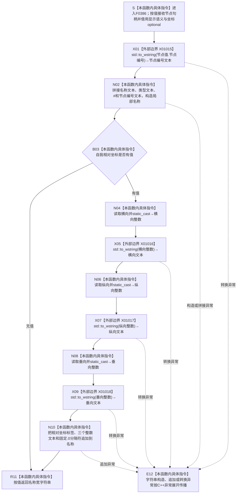

# CF-L6-0210 `生成世界树节点显示名称` 现状流程图

图类型：现状流程图
代码版本：`2c38ec4017e38b2e541b93c8c9ae038856f849c7`
源码 blob：`fa157b5822e3d67b336ffbee06f763b1f22e59a6`
覆盖文件：`海中鱼巣/界面/投影.控制面板启动.ixx:55-68`
唯一根函数：F0386
完整签名：`std::wstring 海中鱼巣::生成世界树节点显示名称(海中鱼巣::节点句柄 节点值, const 海中鱼巣::语素节点显示语义材料& 显示语义, const std::optional<海中鱼巣::世界树相对坐标>& 自我相对坐标)`
参数：`节点值` 按值传入，只读取 `节点编号`；`显示语义` 是调用期有效的 const 非拥有借用，只读取名称文本和类型文本；`自我相对坐标` 是调用期有效的 const optional 非拥有借用，存在时只读取横向、纵向和垂向。本函数不保存任何参数引用，也不延长参数生命周期
返回结果：返回调用方独立拥有的 `std::wstring` 人读显示名称。固定正文为“名称文本 | 类型文本 #节点编号”；坐标 optional 有值时追加“ | 相对坐标=(横向整数.0,纵向整数.0,垂向整数.0)”
非法值 / 拒绝：本函数没有拒绝分支，也不验证节点句柄、显示文本或坐标。唯一当前调用方 F0218 在 E0850 调用前已经完成节点句柄、节点记录和显示语义 optional 前置；仅当前节点等于初始化结果中的自我存在节点时传入坐标 optional。坐标存在时，本函数未验证数值有限且处于 `int` 可表示范围
已登记调用方：F0218 经 E0850（`投影.控制面板启动.ixx:103-108`），结果写入局部 `控制面板树节点材料::显示名称`
直接项目函数：无；F0386 的正式项目出边集合为空
外部边界：X01015 在 60 行把节点编号转为宽字符串；X01016、X01017、X01018 分别在 63、64、65 行把截断为 `int` 的横向、纵向、垂向转为宽字符串
未解析项目调用：无
调用图：`流程图/主程序可达调用关系/01_main可达项目调用边表.md`
外部边界表：`流程图/主程序可达调用关系/02_main可达外部边界表.md`
逐行映射表：`流程图/代码流程图/L6/CF-L6-0210_生成世界树节点显示名称_逐行代码映射表.md`
输入契约 / 调用语境表：本文“调用语境与结果分账”
非成功返回二分审查表：本文“调用语境与结果分账”；当前代码没有逻辑内非成功返回
偏差清单：本文“当前边界与规范核对”
依据提交 / 结构化消息：冻结提交 `2c38ec4017e38b2e541b93c8c9ae038856f849c7`；F0386、E0850、X01015—X01018 由正式 main 可达关系表、制图队列和当前源码交叉复核
结构读取与写入：只读取值式句柄字段、显示语义文本和可选坐标，构造局部宽字符串；不读取或写入节点仓库、关系仓库、主信息仓库、索引或其它机器结构
逻辑内返回：无；两个正常控制路径都返回一个宽字符串
内部错误：字符串构造、追加或 `std::to_wstring` 抛出的异常不被捕获，按 C++ 异常展开传播。坐标非有限或超出 `int` 可表示范围时，当前 `static_cast<int>` 没有前置保护，不能由本函数形成结构化结果
生命周期与资源释放：局部 `名称` 在正常返回时移交为返回值；异常展开时已经完成构造的局部字符串和临时字符串按 C++ 生命周期释放。所有输入借用均在函数返回或异常传播前结束
异常：未声明 `noexcept` 且不捕获。X01015—X01018 和宽字符串构造 / 追加可抛；optional 有值判断与可表示范围内的数值截断不形成具名异常结果
并发 / 幂等：函数不访问共享可变状态；同一组值式输入产生同一显示文本。该人读文本不是机器事实、路由键或业务裁决
验证入口：`投影.控制面板启动.ixx:55-68`、E0850、X01015—X01018，以及调用点 `投影.控制面板启动.ixx:70-108`
验证输出：14 行源码完整映射；13 个流程节点、0 个项目出边、4 个外部边界、0 个未解析项目调用；本批不运行构建或程序
依据：`规范/0050_项目通用机器逻辑与禁止性规则总纲_20260721.md`、`规范/0600_代码函数流程图应用与维护规范.md`、`规范/8110_子规范_线程生命周期状态上报与控制面板线程信息_20260720.md`
不得作为施工许可：是
不得宣称：显示名称是节点长期身份、显示坐标保留原始小数精度、文本可参与路由或业务裁决、任意 double 坐标都能安全转换，或本函数修改了任何机器结构

## 流程图

## 外部边界调用合同

| 边界 | 节点 | 调用 | 实参 | 结果用途 | 当前前置 |
| --- | --- | --- | --- | --- | --- |
| X01015 | X01 | `std::to_wstring(...)` | `节点值.节点编号` | 形成名称末尾的节点编号文本 | F0386 已被 E0850 调用 |
| X01016 | X05 | `std::to_wstring(...)` | `static_cast<int>(自我相对坐标->横向)` | 形成横向整数文本 | B03 有值；源码未验证 double 到 int 的可表示性 |
| X01017 | X07 | `std::to_wstring(...)` | `static_cast<int>(自我相对坐标->纵向)` | 形成纵向整数文本 | B03 有值；源码未验证 double 到 int 的可表示性 |
| X01018 | X09 | `std::to_wstring(...)` | `static_cast<int>(自我相对坐标->垂向)` | 形成垂向整数文本 | B03 有值；源码未验证 double 到 int 的可表示性 |

## 已登记调用方

| 调用边 | 调用方 / 位置 | 当前前置与实参绑定 | 结果用途 | 调用方图 |
| --- | --- | --- | --- | --- |
| E0850 | F0218 `生成控制面板世界树节点材料(...)` / `投影.控制面板启动.ixx:103-108` | `当前节点 -> 节点值`；`显示语义.value() -> 显示语义`；当前节点是自我存在节点时传 `自我相对坐标`，否则传空 optional | 返回宽字符串写入局部 `材料.显示名称` | 待生成 |

## 调用语境与结果分账

| 语境 | 当前上游保证 | 本函数路径与结果 | 非成功口径 | 结构后果 |
| --- | --- | --- | --- | --- |
| 非自我世界树节点 | F0218 已确认节点句柄、节点记录和成功显示语义；E0850 传空坐标 optional | B03 无值，返回名称 / 类型 / 节点编号文本 | 无非成功返回 | 只形成局部人读字符串 |
| 自我存在节点且坐标可表示 | 同上；E0850 传有值坐标 optional，各分量有限且可转换为 `int` | B03 有值，三个分量向零截断为整数后追加固定 `.0` 文本并返回 | 无非成功返回 | 只形成人读字符串；不保存坐标 |
| 自我存在节点但坐标不能表示为 `int` | F0218 只负责传入 optional，F0386 本身没有范围 / 有限性检查 | `static_cast<int>` 不具备当前结构化拒绝或异常结果 | 待核输入契约；不能归类为逻辑内返回 | 不应把未定义转换结果写成可靠显示事实 |
| 字符串构造、转换或追加抛出 | 输入前置可能仍成立 | 已构造局部对象展开释放后异常传播 | 不是逻辑内返回；当前无结构化失败返回 | 零机器事实写入 |

## 当前边界与规范核对

- F0386 只产生控制面板人读字符串；节点长期身份仍由 `节点句柄` 承载，名称 / 类型 / 坐标文本不取得机器事实或路由权。
- E0850 是唯一项目入边；F0386 没有项目源码出边。X01015—X01018 已覆盖四次显式 `std::to_wstring`，未发现需要补登记的项目边。
- 正式外部边界聚合没有为 `std::optional::has_value`、optional 解引用和宽字符串运算符分别分配稳定 ID；本图按当前聚合口径把它们保留为 B03、N02、N10 的具体指令，不补造边界身份。
- 坐标文本不保留原始 `double` 精度：三个分量先向零截断到 `int`，再追加固定 `.0`。当前代码未校验非有限值或超出 `int` 可表示范围，这一输入契约缺口只作为当前事实风险报告。
